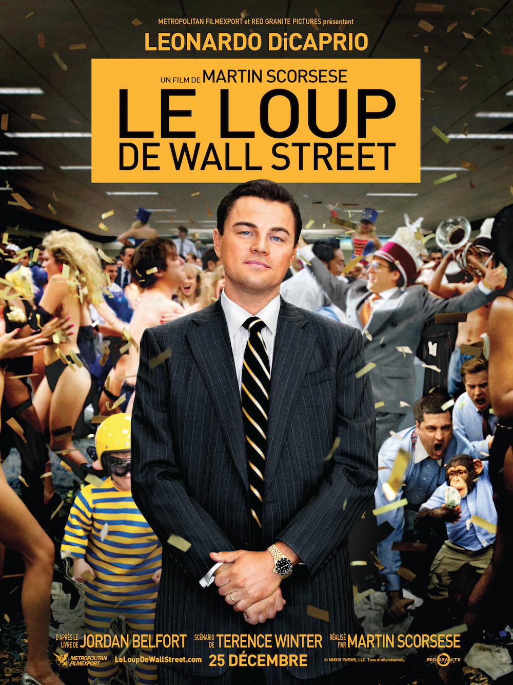
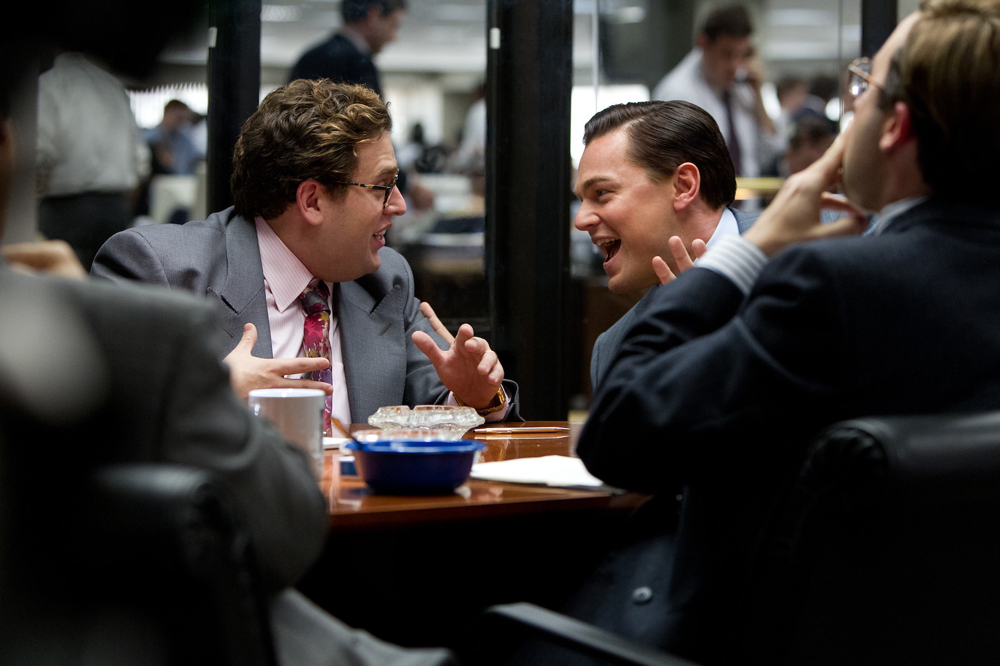

+++
type = "post"
titre = "<em>Le Loup de Wall Street</em>, Martin Scorsese"
title = "Le Loup de Wall Street, Martin Scorsese"
url = "/loup-wall-street-scorsese"
date = "2013-12-28T22:50:44"
Lastmod = "2013-12-28T22:53:54"
cover = "le-loup-de-wall-street-leonardo-dicaprio.jpg"
categorie = [ "À voir" ]
tag = [ "Argent", "Biopic", "Drame", "Enquête", "Histoire vraie", "Humour", "Société" ]
createur = [ "Martin Scorsese" ]
acteur = [ "Jean Dujardin", "Jonah Hill", "Kyle Chandler", "Leonardo Di Caprio", "Margot Robbie", "Matthew McConaughey" ]
annee = [ "2013" ]
weight = 2013
pays = [ "États-Unis" ]
original = "The Wolf of Wall Street"

+++

Martin Scorsese, plus de 70 ans et une trentaine de films à son actif, parmi lesquels plusieurs classiques du cinéma américain, n’a pas dit son dernier mot. <em>Le Loup de Wall Street</em> n’a rien d’un film paresseux d’un grand réalisateur à la retraite. Bien au contraire, ce nouveau long-métrage est d’une vivacité et d’une modernité surprenantes. En racontant l’histoire vraie de Jordan Belfort, un agent de change devenu millionnaire dans les années 1990 en menant des affaires assez louches, Martin Scorsese ne raconte pas seulement l’histoire de Wall Street. Par ce récit à la fois drôle et pathétique, il raconte aussi l’histoire récente des États-Unis et c’est un récit pour le moins acerbe. Rythmé, amusant et inquiétant en même temps, <em>Le Loup de Wall Street</em> est un excellent divertissement à ne rater sous aucun prétexte. 

<em>Le Loup de Wall Street</em> s’inspire jusqu’à son titre du livre écrit par Jordan Belfort lui-même. Classé dans les biopics, le dernier long-métrage de Martin Scorsese nous raconte assez logiquement l’histoire assez folle de cet agent de change qui commence le jour où un krach boursier fait disparaître l’entreprise de Wall Street qui l’avait embauché. On est alors à la fin des années 1980 et il accepte un boulot minable dans un petit bureau qui se charge uniquement de valeurs ridicules, à quelques centimes l’action. Il y voit un potentiel énorme et parvient à dégager de grosses sommes en vendant ces actions sans intérêt à de gros clients. Sa fortune est en marche, il crée dans les années 1990 sa propre entreprise et devient l’un des hommes les plus riches de Wall Street. Ancien pauvre, sa richesse est exubérante et il se sent au-dessus de tout grâce à son argent, au-dessus des lois et en particulier du FBI qui s’intéresse de plus en plus à ce nouveau riche. Biopic en apparence, on le voit bien, mais <em>Le Loup de Wall Street</em> est bien plus que cela. Au fond, cette histoire personnelle n’est qu’un prétexte pour parler de l’histoire récente des États-Unis et notamment de l’<em>American Dream</em> revisité à la sauce boursière. Dans ces années un peu folles, on peut devenir immensément riche au point de ne plus savoir que faire de son argent, tout ça sans rien créer. Comme le dit le mentor du personnage principal dans les premières minutes, le travail que ces agents mènent ne repose sur rien de tangible. C’est une immense arnaque par principe et il n’est pas étonnant que ces hommes qui brassent des millions finissent par faire des bêtises. Surtout pour le héros de Martin Scorsese qui, il l’avoue lui-même, est totalement sous l’emprise de l’argent, la meilleure drogue pour lui. Il n’en a jamais assez et veut devenir toujours plus riche, sans limites. Inutile, dès lors, d’être un génie pour deviner que les choses finiront par mal tourner : <em>Le Loup de Wall Street</em> a des airs de tragédie par cette sensation présente dès les premières minutes que cela se terminera mal. 

Même si Jordan Belfort est d’abord un prétexte, Martin Scorsese dresse aussi le portrait d’un homme et d’un malfrat fascinant. Son ambition extrême et son goût pour les drogues et les femmes sont les deux moteurs de la vie de cet agent de change qui éprouve une fascination malsaine pour l’argent. <em>Le Loup de Wall Street</em> décrit un contexte surréaliste avec cette entreprise où les putes et la cocaïne circulent aussi bien que les millions. Le réalisateur a bien su rendre cette ambiance de fête permanente et le film a un côté assourdissant bien marqué. Le spectateur est presque soulé devant ce bruit permanent, devant ce patron qui hurle dans le micro pour galvaniser ses troupes et les inciter à devenir riches par tous les moyens possibles, surtout ceux qui ne sont pas tout à fait légaux. Pendant trois heures, on voit défiler les billets verts parfois jetés à la corbeille, la drogue sous toutes ses formes et des corps féminins totalement dénudés. <em>Le Loup de Wall Street</em> est extrêmement rythmé et le cinéaste multiplie les effets pour mieux valoriser la folie de son récit. Le scénario alterne séquences très détaillées et ellipses vertigineuses : si la fin aurait peut-être mérité d’être enrichie, le procédé est efficace le reste du temps et on apprécie la vitalité qui en ressort. Toute cette énergie folle sert d’abord un objectif : montrer que Jordan Belfort est peut-être un excellent vendeur capable de gagner de l’argent avec n’importe quoi, il est aussi stupide. Alors que l’étau se resserre autour de lui, alors qu’on lui offre une porte de sortie, il préfère se croire au-dessus des lois et persiste dans sa folie en organisant des fêtes encore plus grandes et en dilapidant encore plus d’argent. Il est stupide et il est complètement fou de sa fortune qui le force d’ailleurs à se rendre en Suisse pour tenter, en vain d’ailleurs, de le sauver. Leonardo DiCaprio interprète ce dingue du fric avec un talent fou : l’acteur semble se bonifier de film en film et il est ici parfait, tout simplement. Charismatique, drôle parfois — la séquence où il rampe à sa voiture —, son personnage est aussi rongé par son désir d’argent et par les drogues et l’acteur passe d’un état à l’autre avec une facilité et une sincérité déconcertantes. 

Belle réussite que ce nouveau long-métrage qui est très noir sur le fond, mais aussi plutôt drôle sur la forme. Martin Scorsese mêle les plaisirs et se fait plaisir avec une mise en scène virtuose qui frappe par sa jeunesse. <em>Le Loup de Wall Street</em> prouve que le cinéaste a encore beaucoup à dire et ce portrait d’une époque complètement folle est particulièrement bien mené. Porté par un Leonardo DiCaprio en pleine forme et par une série d’acteurs secondaires tous aussi bons — mention spéciale à Matthew McConaughey, en grande forme —, le film parvient à nous tenir en haleine pendant près de trois heures avec un personnage vraiment déplaisant. Une belle réussite, pour un excellent film !

