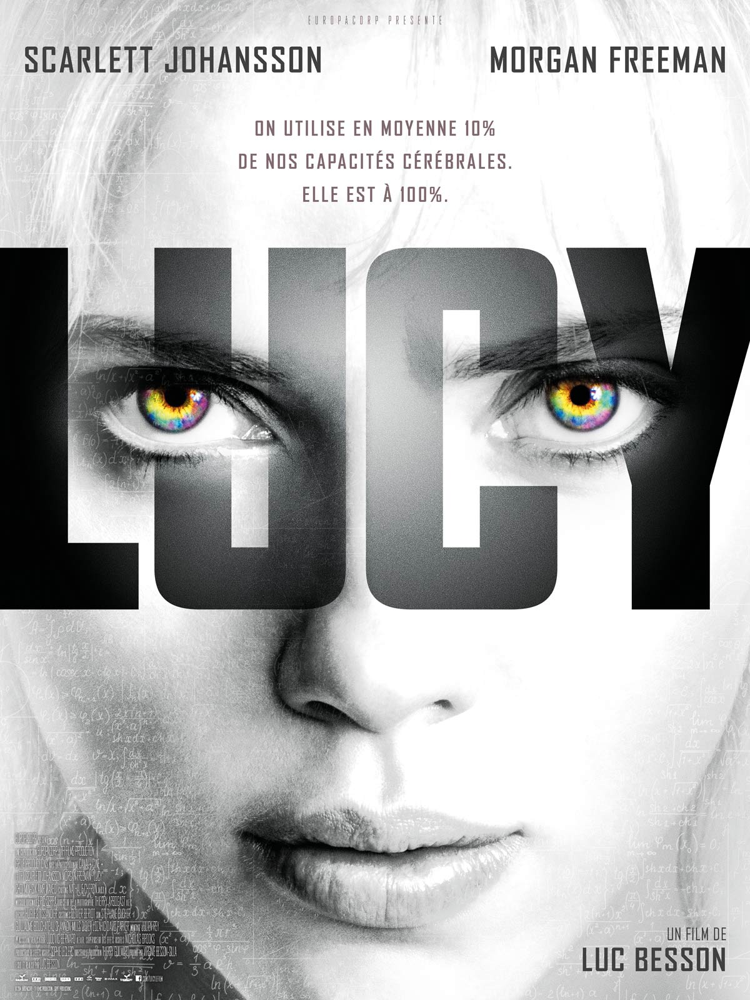

+++
titre = "<em>Lucy</em>, Luc Besson"
title = "Lucy, Luc Besson"
url = "/lucy-besson"
date = "2014-08-06T21:27:48"
Lastmod = "2014-08-07T09:43:03"
cover = "lucy-besson-scarlett-johansson.jpg"
categorie = [ "À voir" ]
tag = [ "Action", "Blockbuster", "Science-Fiction", "Sorties du mois", "Vite oublié" ]
createur = [ "Luc Besson" ]
acteur = [ "Amr Waked", "Min-sik Choi", "Morgan Freeman", "Scarlett Johansson" ]
annee = [ "2014" ]
weight = 2014
pays = [ "France" ]

+++

Même si elle n&rsquo;est <a href="http://fr.wikipedia.org/wiki/Mythe_de_l%27utilisation_incomplète_du_cerveau">qu&rsquo;un mythe</a>, l&rsquo;idée selon laquelle l&rsquo;homme n&rsquo;utilise qu&rsquo;une partie de son cerveau est très séduisante pour imaginer des œuvres de fiction. Quelques années après <a href="http://voiretmanger.fr/limitless-burger/" title="Limitless, Neil Burger"><em>Limitless</em></a> qui l&rsquo;exploitait, c&rsquo;est au tour de Luc Besson d&rsquo;imaginer <em>Lucy</em>, un film construit à partir de même idée. Pour une raison quelconque, une femme augmente progressivement la capacité de son cerveau, jusqu&rsquo;à atteindre 100 % d&rsquo;utilisation. Ses capacités augmentent progressivement, mais que se passera-t-il quand elle atteindra cette limite ? Cette piste n&rsquo;est pas mauvaise et <em>Lucy</em> aurait pu être un divertissement réussi, mais ce blockbuster estival est loin du compte. Lourd, un peu stupide et tape à l&rsquo;œil, le dernier long-métrage de Luc Besson a l&rsquo;intelligence d&rsquo;être suffisamment court pour ne pas être totalement insupportable.

Comme dans <a href="http://voiretmanger.fr/le-cinquieme-element-besson/" title="Le Cinquième Élément, Luc Besson"><em>Le Cinquième Élément</em></a>, ou dans <em>Nikita</em> par exemple, le héros de Luc Besson est en fait une femme. Cette fois, c&rsquo;est Scarlett Johansson qui s&rsquo;y colle en interprétant Lucy, jeune américaine un peu stupide qui fait ses études quelque part en Asie. Le film commence sur une discussion avec son copain du moment, un type qu&rsquo;elle n&rsquo;a rencontré qu&rsquo;une semaine auparavant. Il insiste pour qu&rsquo;elle entre déposer une valise et son mystérieux contenu, elle refuse, mais il finit par la forcer. Bref, elle entre pour découvrir que c&rsquo;est un piège : la valise contient une drogue que la mafia locale veut récupérer. Quelques péripéties plus tard, Luc Besson l&rsquo;imagine transformée en mule pour transporter la drogue dans son ventre. Encore une ou deux péripéties de plus, Lucy se retrouve rouée de coups dans une prison et la drogue est lâchée dans son corps. On s&rsquo;en doute, cette exposition entraîne une augmentation de ses capacités cérébrales : à partir de ce moment là, <em>Lucy</em> entre dans une course-poursuite effrénée pendant laquelle la jeune femme découvre de nouvelles capacités tout en étant poursuivie par la mafia très énervée, on imagine bien. Le schéma général du film a le mérite d&rsquo;être simple et très clair : le cinéaste sait raconter des histoires qui ne manquent pas de rebondissements, mais qui se concentrent sur une trame très simple. Ici encore, les péripéties secondaires importent peu et elles sont d&rsquo;ailleurs systématiquement survolées, tout comme les personnages secondaires qui s&rsquo;y rattachent. La seule chose qui compte vraiment, c&rsquo;est Lucy et sa capacité cérébrale en augmentation, le reste n&rsquo;est que fioritures évoquées à toute vitesse.

La vitesse, c&rsquo;est la première sensation qui se dégage de <em>Lucy</em>. Le film est court, extrêmement court même au regard des standards actuels : alors que l&rsquo;on imagine mal aujourd&rsquo;hui un blockbuster américain qui n&rsquo;approche pas des 2h30, Luc Besson n&rsquo;atteint même pas les 90 minutes. Ce qui ne veut pas dire qu&rsquo;il en montre moins, c&rsquo;est tout simplement qu&rsquo;il ne s&rsquo;attarde jamais. D&rsquo;emblée, le long-métrage surprend par son découpage si rapide qu&rsquo;il en devient presque violent : certaines scènes sont entrecoupées d&rsquo;images subliminales que l&rsquo;on voit à peine et on a plusieurs fois un montage qui entremêle deux scènes différentes, ce qui accentue cette sensation de vitesse. Par moments, on aurait plus l&rsquo;impression de voir une longue bande-annonce qu&rsquo;un vrai film. L&rsquo;effet est volontaire, incontestablement, mais on aimerait que <em>Lucy</em> se pose un peu et prenne le temps de respirer, ne serait-ce que pour offrir à ses personnages une chance d&rsquo;exister. En l&rsquo;état, Luc Besson ne fait guère plus qu&rsquo;esquisser tous ses personnages et même son héroïne n&rsquo;existe jamais vraiment. Ne parlons pas des rôles secondaires, qui, de Morgan Freeman à Min-sik Choi en passant par Amr Waked, ne sont que des ombres dans leurs rôles respectifs du scientifique, du mafieux et du policier français. Le cinéaste n&rsquo;avait pas besoin de prouver qu&rsquo;il sait filmer comme un américain et la plupart des séquences d&rsquo;action sont assez bien ficelées, quoi que souvent déjà vues — la course-poursuite dans les rues parisiennes est une copie parfaite d&rsquo;une scène de <em>Taxi</em> —, mais malheureusement il donne le sentiment de toujours en faire trop.

<em>Lucy</em> aurait peut-être pu être un bon divertissement estival, un blockbuster amusant et explosif parfait pour passer un bon moment. Pour cela, il aurait fallu qu&rsquo;il se prenne un peu moins au sérieux et qu&rsquo;il ne se conclut pas sur une théorie d&rsquo;autant plus fumeuse qu&rsquo;elle est évoquée au premier degré. Mais surtout, il aurait fallu un peu de finesse : Luc Besson ne fait plus du tout confiance à ses spectateurs et le cinéaste préfère souligner tout ce qu&rsquo;il veut dire non pas d&rsquo;un, mais de plusieurs traits. L&rsquo;idée des images subliminales par exemple était plutôt amusante, mais quand on comprend une idée la première fois, la troisième ou quatrième image similaire devient vraiment lassante. <em>Lucy</em> est filmé grossièrement et le film a tendance à nous prendre pour des imbéciles, incapables de comprendre sans tout nous montrer, tout nous dire et renforcer encore le message avec des nappes musicales insupportables. Luc Besson a beau faire court, c&rsquo;est quand même lassant…

