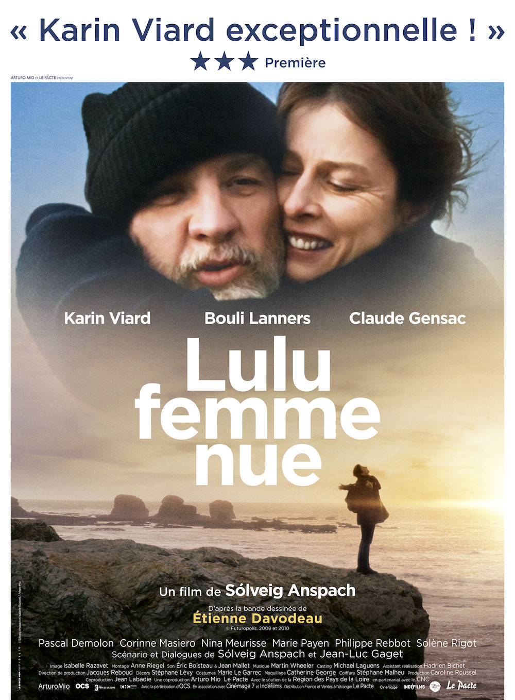
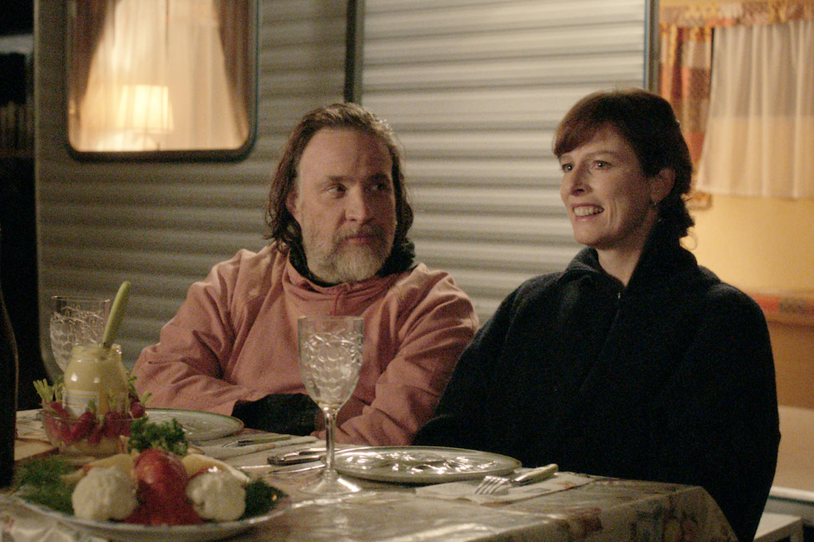

+++
titre = "<em>Lulu, femme nue</em>, Solveig Anspach"
title = "Lulu, femme nue, Solveig Anspach"
url = "/lulu-femme-nue-anspach"
date = "2013-08-02T10:14:19"
Lastmod = "2013-12-04T23:08:43"
cover = "lulu-femme-nue-solveig-anspach-claude-gensac-karin-viard.jpg"
categorie = [ "À voir" ]
tag = [ "Adaptation bande-dessinée", "Amour", "Comédie dramatique", "Famille", "Feel Good Movie", "Road-movie" ]
createur = [ "Solveig Anspach" ]
acteur = [ "Bouli Lanners", "Claude Gensac", "Karin Viard", "Nina Meurisse" ]
annee = [ "2014" ]
weight = 2014
pays = [ "France" ]
festival = [ "Lama 2013" ]

+++

Pour son dernier long-métrage, Solveig Anspach est allé chercher du côté de genres traditionnellement plutôt associés au cinéma américain. <em>Lulu, femme nue</em> tient en partie du <em>road-movie,</em> mais aussi du <em>Feel Good Movie</em> sans vraiment se résumer à ces deux genres. Adaptation d’une bande dessinée, ce film est plus complexe et navigue entre plusieurs genres, mais toujours avec justesse et précision dans les émotions. Par moment gonflé avec ses dialogues sans complexes, <em>Lulu, femme nue</em> souffre peut-être d’un scénario qui choisit parfois la voie de la simplicité, mais cette comédie dramatique vraiment drôle mérite d’être vue, ne serait-ce que pour son actrice principale.

Lucie, ou plutôt Lulu comme tout le monde l’appelle depuis toujours, n’est pas une femme heureuse. La vie l’a emporté et les années sont passées peut-être trop rapidement. Mariée avec un homme qui ne s’occupe plus d’elle, elle a trois enfants et aimerait bien avoir une vie pour elle. <em>Lulu, femme nue</em> commence justement avec un entretien d’embauche qui tourne mal. Elle aimerait bien se faire embaucher pour faire à peu près n’importe quoi, à n’importe quel prix et sur n’importe quels horaires, mais malgré ces conditions, on ne veut pas de cette femme d’une quarantaine d’années, assez mal habillée et très mal à l’aise pendant l’entretien. Elle est éconduite brutalement, mais c’est un appel à son mari qui fait tout basculer. Le garagiste qu’elle a épousé plusieurs années auparavant se moque de sa femme plutôt que de la réconforter et lui signifie de rentrer au plus vite. Solveig Anspach montre bien que quelque chose casse chez son héroïne. Son regard se perd dans le vide, elle semble hagarde et loupe le train qui devait la ramener chez elle. Était-ce involontaire, inconscient peut-être ? Toujours est-il que ce premier écart n’est pas pour lui déplaire, tout compte fait et Lulu s’autorise une nuit à l’hôtel, rien que pour elle. <em>Lulu, femme nue</em> inaugure alors une sorte de <em>road-movie</em>, même si la première étape est à trois pas de la gare, mais comme souvent, le déplacement est symbolique avant d’être géographique. La cinéaste organise la rencontre entre le personnage principal de son film et plusieurs personnages : un repris de justice au grand cœur, une mamie sympa ou encore une serveuse de café déprimée. Des rencontres qui marquent des étapes dans un cheminement personnel, comme dans tous les films de ce genre. À dire vrai, la fin du long-métrage signé Solveig Anspach importe assez peu, il ne faut pas s’attendre à la trouver particulièrement originale et c’est, comme on dit parfois, le cheminement qui compte plus que la destination dans <em>Lulu, femme nue</em>.

Même si le drame s’en mêle parfois, on est ici bien plus proche de la comédie et l’humour est omniprésent, bien que souvent noir ou sarcastique. Solveig Anspach pouvait compter sur le talent de Karin Viard qui interprète sa Lulu pour offrir à son film une interprétation comique tout en finesse. Certes, son personnage est parfois très drôle de naïveté, notamment quand elle redécouvre l’amour. On sent que cette femme n’a pas vécu grand-chose, elle s’est certainement mariée trop tôt, elle est aussi sans doute devenue mère trop tôt et elle s’est rapidement enfoncée dans le rythme quotidien, s’oubliant au passage. En rompant son rythme de vie habituel, le personnage principal de <em>Lulu, femme nue</em> fait sa petite révolution et l’actrice transmet bien ce côté transgressif un peu ridicule bien sûr, puisqu’il ne s’agit que de rater son train et dormir une nuit à l’hôtel, du moins au départ. Ce personnage fait beaucoup pour le comique du film, mais ce n’est pas le seul. Si, cette fois, Bouli Lanners hérite d’un personnage plus sérieux, on peut compter sur la grand-mère incarnée par Claude Gensac pour alimenter certaines scènes particulièrement drôles. Malgré quelques pointes de sérieux ici ou là, Solveig Anspach opte pour un traitement optimiste et positif qui explique cette impression de <em>Feel Good Movie</em>, même si le film ne s’y rattache pas totalement. Alors évidemment, on peut pointer du doigt les bons sentiments de l’ensemble et noter les quelques incohérences de scénario liées à ce choix — la fuite de Lulu depuis le camping paraît un peu facile et surtout rapidement oubliée par tous les autres personnages, par exemple. Même si on peut préférer un cinéma plus mordant, il faut reconnaître que <em>Lulu, femme nue</em> trouve le ton juste et ne tombe jamais dans la niaiserie que l’on pouvait craindre. Les dialogues parfois acerbes y sont pour beaucoup : Solveig Anspach compose une comédie mordante qui se termine effectivement sur de bons sentiments.

Le synopsis de <em>Lulu, femme nue</em> a de quoi effrayer un petit peu, mais le dernier film de Solveig Anspach est une bonne surprise. Très drôle, il ménage quelques éléments de drame et opte pour une fin pleine de bons sentiments, mais pas de quoi annuler le bon souvenir de la comédie vraiment drôle que l’on vient de voir. Le personnage de Lulu n’est pas le plus original qui soit, mais il est très bien écrit par ce film qui, non content d’être vraiment drôle, est aussi charmant. Une réussite, à ne pas rater.

<em>Sortie en salles le 22 janvier 2014</em>

