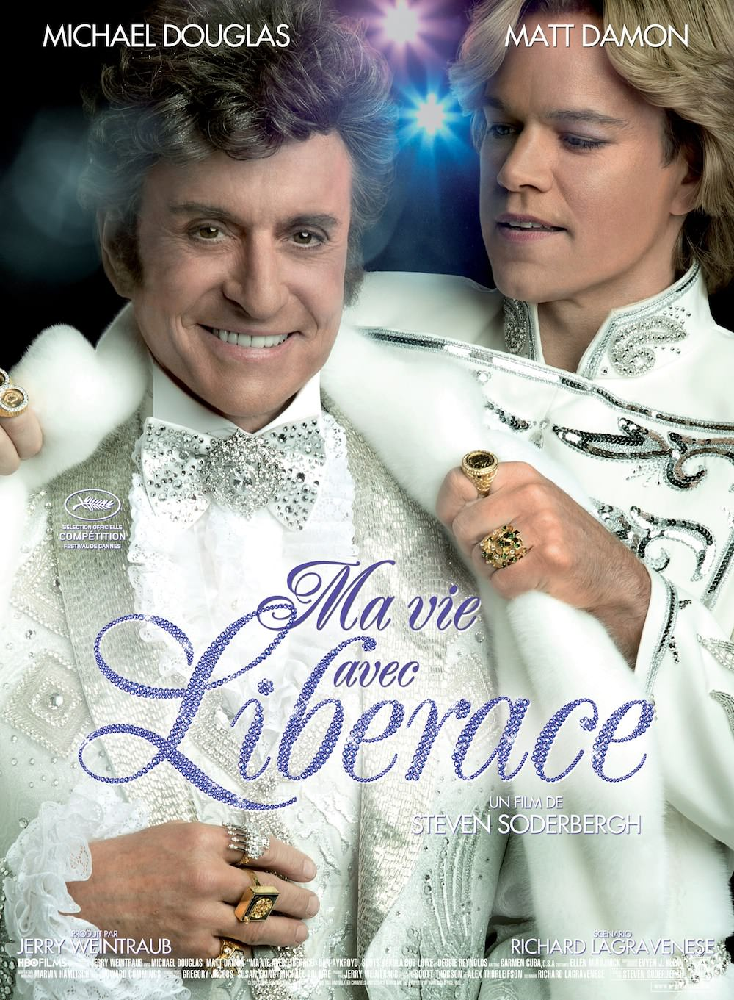
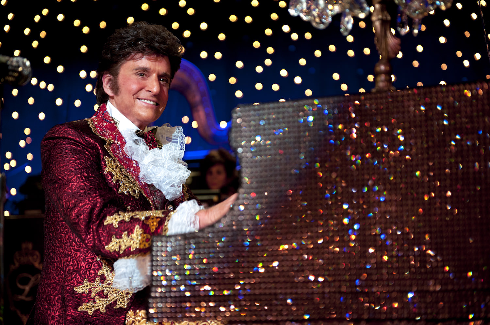
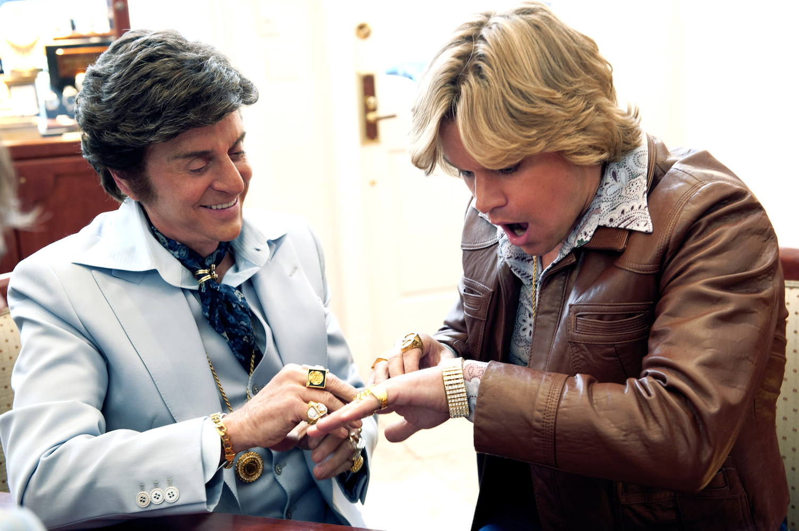

+++
titre = "<em>Ma vie avec Liberace</em>, Steven Soderbergh"
title = "Ma vie avec Liberace, Steven Soderbergh"
url = "/ma-vie-avec-liberace-soderbergh"
date = "2013-09-20T23:53:26"
Lastmod = "2014-12-07T17:52:35"
cover = "ma-vie-avec-liberace-michael-douglas.jpg"
categorie = [ "À voir" ]
tag = [ "Amour", "Argent", "Biopic", "Histoire vraie", "Homosexualité", "Société" ]
createur = [ "Steven Soderbergh" ]
acteur = [ "Dan Aykroyd", "Matt Damon", "Michael Douglas", "Scott Bakula" ]
annee = [ "2013" ]
weight = 2013
pays = [ "États-Unis" ]
original = "Behind the Candelabra"

+++

Deux films par an, rien que ça ! Réalisateur prolifique, Steven Soderbergh prend aussi un malin plaisir à brouiller les cartes en multipliant les films radicalement opposés. Après avoir sorti un thriller avec <a href="http://voiretmanger.fr/piegee-soderbergh/" title="Piégée, Steven Soderbergh"><em>Piégée</em></a>, puis l’histoire d’un strip-tease avec <a href="http://voiretmanger.fr/magic-mike-soderbergh/" title="Magic Mike, Steven Soderbergh"><em>Magic Mike</em></a> peu après en 2012, son deuxième long-métrage est déjà sorti en 2013. Là encore, le cinéaste a joué le mélange des genres, puisqu’au thriller surprenant d’<a href="http://voiretmanger.fr/effets-secondaires-soderbergh/" title="Effets secondaires, Steven Soderbergh"><em>Effets secondaires</em></a> succède un biopic, et quel biopic ! Si le titre original — <em>Behind the Candelabra</em> — conserve sa pointe de mystère, le titre français vend la mèche : <em>Ma vie avec Liberace</em> évoque l’histoire méconnue et surprenante de Liberace, pianiste américain de music-hall qui a connu un énorme succès des années 1950 aux années 1970. Par le prisme de son histoire d’amour avec Scott Thorson, magnifique jeune homme qui tombe sous son charme, Steven Soderbergh raconte autant l’histoire d’une vie qu’il dresse le portrait d’une société et de ses relations compliquées à l’homosexualité. <em>Ma vie avec Liberace</em> est un film passionnant, porté par les prestations époustouflantes de ses deux acteurs : à ne pas rater !

Un biopic repose souvent sur la prestation d’un acteur qui incarne un personnage comme s’il avait vécu sa propre vie. <em>Ma vie avec Liberace</em> impressionne par la prestation non pas de l’un de ses acteurs, mais de ses deux acteurs principaux. Dès sa première apparition sur scène, face à son piano étincelant et dans son habit kitschissime, Michael Douglas rayonne en Liberace. L’acteur n’en est pas à sa première prestation, bien sûr, mais il a été rarement aussi loin et sa transformation est spectaculaire. Sa voix posée, grave et nasillarde à la fois, fait merveille, tandis qu’il semble être né pour pouvoir porter un jour les lourds vêtements de fourrure et de pierres précieuses créés spécialement pour l’artiste. Le dernier long-métrage de Steven Soderbergh se concentre sur sa relation avec Scott Thorson, un jeune assistant pour animaux qui travaille sur des tournages et qui rencontre un proche du pianiste star dans un bar gay de Los Angeles. Il n’a que dix-huit ans quand il assiste au premier concert de Liberace, mais le coup de foudre est immédiat pour ce jeune homosexuel qui est obnubilé par cette star qui joue les grandes folles. Pour l’interpréter, Matt Damon est parfait, tout simplement : est-ce la magie du cinéma, toujours est-il que l’acteur semble rajeuni au début du film et son corps parfait en fera rêver plus d’un(e). <em>Ma vie avec Liberace</em> ne lui offre pas qu’une occasion de briller avec son corps toutefois : par la suite, alors que la chirurgie esthétique, puis les drogues font leurs effets néfastes, c’est la transformation du personnage et de l’acteur qui impressionne. C’est bien simple, son jeu est bluffant et on a du mal à reconnaître Matt Damon, pas seulement à cause des postiches d’ailleurs. Difficile, avec sa carrière, de parler de révélation, mais il y a un peu de cela : on a le sentiment de redécouvrir un acteur parfois un peu trop rapidement associé à ses rôles dans la <a href="http://voiretmanger.fr/saga/jason-bourne/">saga <em>Jason Bourne</em></a>.

Les prestations d’acteurs contribuent incontestablement au succès du film, mais elles ne résument pas pour autant <em>Ma vie avec Liberace</em>. Le long-métrage raconte aussi une très belle histoire d’amour que Steven Soderbergh a parfaitement su rendre. Certes, elle a sa part de bling-bling et les premières scènes dans la maison de Liberace deviennent drôles face à tant de kitsch assumé. Certes, la star de music-hall est présentée comme un homme volage qui vire ses assistants — tous de beaux et jeunes garçons — quand un nouveau beau gosse entre dans sa vie. Certes aussi, l’argent, le champagne et les grosses bagues dorées sont partout…, bref, le film n’évite pas les clichés attendus. Le scénario mis en image par le réalisateur s’avère toutefois moins prévisible qu’escompté et l’amour qui se tisse doucement entre les deux hommes est aussi sincère qu’inattendu. <em>Ma vie avec Liberace</em> ne tombe jamais dans la romance à l’eau de rose, bien au contraire. Steven Soderbergh n’évite pas les sujets qui fâchent et cette histoire se termine mal et avec des avocats. C’est justement ce qui est sans doute le plus beau dans le film : ce personnage fascinant, obsédé par ses fans et son succès, mais aussi par son homosexualité qu’il assume et justifie en privé, mais qu’il refuse de dévoiler en public. Sans jamais en faire une œuvre engagée, le cinéaste profite de son film pour évoquer une époque révolue, mais pas si lointaine, où la population rejetait en majorité l’homosexualité. Il termine aussi <em>Ma vie avec Liberace</em> sur une note sombre, celle du SIDA qui emporte Liberace comme tant d’autres gays. Une vague de morts que rien ne semble pouvoir contrôler et si le sujet a déjà été traité des milliers de fois, cette apparition brutale de la maladie au cœur des années 1980 est parfaitement rendue ici. On le voit, Steven Soderbergh signe un long-métrage bien plus complexe qu’au premier abord et ce qui n’aurait pu être qu’un synopsis assez insignifiant sur un homme oublié devient autant une très belle et sincère histoire d’amour, qu’une plongée passionnante dans l’histoire américaine récente.

Steven Soderbergh avait ce projet d’un biopic sur Liberace en tête depuis longtemps. Malgré le support des deux stars, intégrées dès les débuts du projet, tous les grands studios américains lui ont claqué la porte au nez. Trop gay, <em>Ma vie avec Liberace</em> a été finalement financé par HBO, ce qui en fait un téléfilm de l’autre côté de l’Atlantique. En France, le dernier long-métrage du réalisateur est sorti au cinéma et c’est absolument mérité. Loin du banal film pour la télévision, on a affaire à un vrai film de cinéma, et un très beau film. Cet homme est passionnant et il est le sujet idéal d’un long-métrage porté par une touchante histoire d’amour, mais aussi cruelle. S’il ne fallait qu’une seule raison pour voir <em>Ma vie avec Liberace</em>, ce serait incontestablement les deux acteurs principaux qui sont bluffants, tout simplement. Que ce soit vraiment son dernier, ou non, Steven Soderbergh signe là un excellent long-métrage, sans doute son meilleur de ces dernières années…

<h3>Vous voulez m&rsquo;aider ?</h3>
<ul>
<li><a href="http://www.amazon.fr/gp/product/B00G2KQ05Q/ref=as_li_ss_tl?ie=UTF8&#038;tag=leblogdenic07-21&#038;linkCode=as2&#038;camp=1642&#038;creative=19458&#038;creativeASIN=B00G2KQ05Q">Acheter le film en Blu-Ray sur Amazon</a></li>
<li><a href="http://www.amazon.fr/gp/product/B00G2KQ00Q/ref=as_li_ss_tl?ie=UTF8&#038;tag=leblogdenic07-21&#038;linkCode=as2&#038;camp=1642&#038;creative=19458&#038;creativeASIN=B00G2KQ00Q">Acheter le film en DVD sur Amazon</a></li>
<li><a href="https://itunes.apple.com/fr/movie/ma-vie-avec-liberace-vost/id791581737">Acheter ou louer le film sur l&rsquo;iTunes Store</a></li>
</ul>

