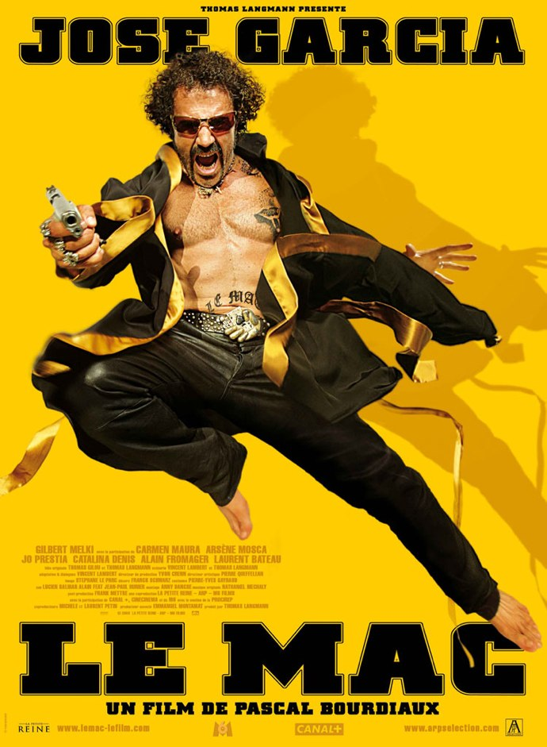
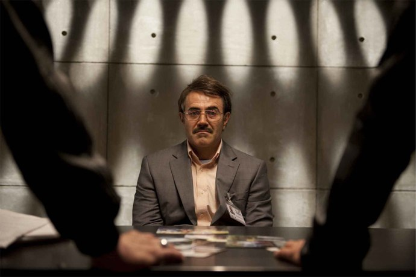
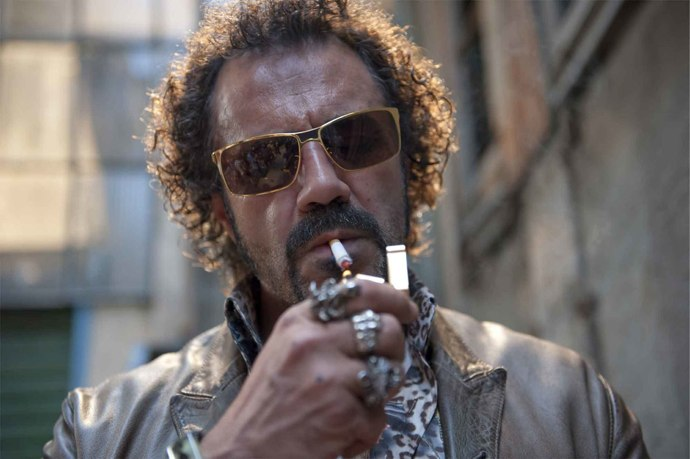

+++
titre = "Le Mac, Pascal Bourdiaux"
title = "Le Mac, Pascal Bourdiaux"
url = "/mac-bourdiaux"
date = "2010-08-18T00:24:55"
Lastmod = "2013-04-21T17:32:29"
cover = "le-mac-garcia.jpg"
categorie = [ "À voir" ]
tag = [ "Comédie", "Famille", "Mafia", "Vite oublié" ]
createur = [ "Pascal Bourdiaux" ]
acteur = [ "Arsène Mosca", "Carmen Maura", "Gilbert Melki", "José Garcia" ]
annee = [ "2010" ]
weight = 2010
pays = [ "France" ]

+++

Dire que je ne suis pas un grand amateur du cinéma français est encore un doux euphémisme. Je préfère en général un blockbuster américain débile à l&rsquo;image de ce que propose <em><a href="http://voiretmanger.fr/2010/08/06/expendables-stallone/">Expendables</a></em> de Stallone qui sort bientôt, plutôt qu&rsquo;une comédie française téléphonée et sans intérêt. Pourtant, on a parfois de bonnes surprises et <em>Le Mac</em> en fait partie. Cette comédie est aussi légère que son affiche le laissait entendre, mais assume de bout en bout son côté humour lourdingue et ne plie jamais devant les sirènes de l&rsquo;intellectualisation. Résultat, on s&rsquo;amuse bien.

Ace est ce que l&rsquo;on appelle dans le milieu un &laquo;&nbsp;mac&nbsp;&raquo;. Rien à voir avec l&rsquo;informatique, le milieu en question est la mafia et le mac est le type qui participe activement aux trafics de filles et poudre blanche et qui s&rsquo;en met plein les poches. Assumant pleinement son côté beauf, il aime faire valoir son autorité même si cette dernière est remise en cause par le Parrain, le big boss qui commence à douter de sa fiabilité en exécutant devant ses yeux une balance. Il n&rsquo;a pas tort de soupçonner Ace, ce dernier est en fait un indic pour la police qui cherche à démanteler tout le réseau. Un soir, alors que les soupçons sont de plus en plus précis contre lui, il décide de mettre en scène sa propre mort et reste au frais quelque temps, comme on dit. La police ne veut pourtant pas perdre cette source d&rsquo;informations précieuse et engage un peu de force le frère jumeau d&rsquo;Ace, monsieur Chapelle. Difficile de trouver plus différent que cet employé de bureau modèle, un peu maniaque, qui travaille jusqu&rsquo;à des heures avancées dans une banque. L&rsquo;alternative est simple : soit il passe 20 ans en taule, soit il prend la place de son frère dont l&rsquo;existence lui est, au passage, révélée. Il accepte le second job, ignorant dans quoi il s&rsquo;engage.

Ace et son frère jumeau, ce sont finalement les mêmes personnes, comme les eux faces d&rsquo;une personne. L&rsquo;idée de les faire se rencontrer est assez jouissive et fonctionne plutôt bien. Il faut dire que <em>Le Mac</em> n&rsquo;y va pas avec le doigt de la cuillère pour les différencier : les clichés s&rsquo;accumulent, tant sur le mac que sur l&rsquo;employé de banque, même si le film se penche surtout sur le premier, au potentiel comique bien plus élevé il faut dire. La confrontation du quotidien banal — tout le monde peut se reconnaître en ce Chapelle — et de l&rsquo;univers riche et extrêmement dangereux de la mafia du côté de Marseille est très efficace et on comprend aisément que l&rsquo;employé soit attiré, malgré lui, par la vie de son jumeau. Le film a l&rsquo;intelligence de ne jamais quitter le premier degré dans cette confrontation, ce qui aurait eu des conséquences catastrophiques sur sa capacité à faire rire. Le rire provient justement de la confrontation des deux univers et des tentatives souvent vaines du faux Ace de faire comme le vrai. Il faut le voir bomber le torse et emprunter une démarche jugée sans doute adéquate pour un mac, mais qui se révèle essentiellement ridicule dans les faits. Quand il se trompe de cible et s&rsquo;en prend à un restaurant chinois au lieu du japonais à côté, quand il s&rsquo;émerveille dans une boite de nuit ou quand il se met à danser à la place des filles… autant de scènes vraiment très drôles où derrière le mac ressort l&rsquo;employé de bureau qui découvre un univers radicalement différent du sien.

Si la comédie fonctionne aussi bien, c&rsquo;est en grande partie grâce à la prestation de José Garcia. L&rsquo;acteur est de tous les plans dans <em>Le Mac</em>, au point que je ne suis pas sûr qu&rsquo;il se passe plus d&rsquo;une minute sans qu&rsquo;on l&rsquo;aperçoive. La performance, jouer deux rôles radicalement différents dans un même film est assurément remarquable et Garcia s&rsquo;en acquitte très bien. Qu&rsquo;il soit Ace ou qu&rsquo;il soit Chapelle, il est convaincant et les efforts consentis, notamment physiques, payent à l&rsquo;écran tant on pourrait croire qu&rsquo;il s&rsquo;agit de deux acteurs différents. Mais José Garcia est vraiment dans son élément quand il interprète le mac : ce rôle, qu&rsquo;il a déjà eu l&rsquo;occasion de défendre dans de précédents films (<em>La Vérité si je Mens</em> entre autres), lui va comme un gant et on en oublierait presque l&rsquo;acteur cabotin qui se fait ici plaisir de manière outrancière. Le plus impressionnant est la fin du film, quand les deux frères sont réunis à l&rsquo;écran et interprètent tous les deux le mac. L&rsquo;acteur parvient, malgré le copier/coller intégral qui fait que même la mère du personnage a du mal à distinguer le fils qu&rsquo;elle a abandonné de celui qu&rsquo;elle a aimé, à conserver une différence entre les deux. Cela ne tient à pas grand-chose, un regard légèrement différent, des postures à peine modifiées… mais cela suffit à nous faire sentir la différence. C&rsquo;est assez bluffant. Face à un tel acteur, les autres personnages survivent tant bien que mal. Il faut dire que le scénario ne fait pas vraiment d&rsquo;effort pour proposer des personnages secondaires intéressants et on est souvent dans la caricature sans grand intérêt. Peu importe, José Garcia en roue libre assure le spectacle, et c&rsquo;est plutôt plaisant.

Mais un acteur ne fait jamais tout et si <em>Le Mac</em> parvient à convaincre, c&rsquo;est aussi par son regard au premier degré si rare dans le cinéma français. Le succès d&rsquo;un bon blockbuster, c&rsquo;est de prendre très au sérieux son côté fun et débile. Pascal Bourdiaux a retenu cette leçon en ne faisant jamais de son mac une leçon morale et en restant en permanence au contraire dans la comédie certes lourde et sans conséquence, mais aussi efficace. L&rsquo;univers du film est étonnamment noir et fermé : le spectateur est plongé dans l&rsquo;univers des boites de nuit, de la drogue, des filles et des meurtres. On se débarrasse de corps gênants en les donnant à des chiens de combat affamés, on n&rsquo;hésite pas à tuer de sang-froid quelqu&rsquo;un sur un simple soupçon et on fume, on boit et baise tout le temps. Il est rare de voir tout cela de manière aussi crue et franche en dehors du cinéma indépendant à petit budget : <em>Le Mac</em>, film grand public porté par une star, est un film qui surprend par son côté très glauque et l&rsquo;atmosphère presque de huit-clos. On ne sort jamais vraiment de Marseille et même si la cité phocéenne est un port, la sensation d&rsquo;enfermement est constante. Même le personnage de la mère, qui aurait pu constituer une bouffée d&rsquo;oxygène dans une comédie traditionnelle, est ici une mafieuse sans foi qui loi, qui n&rsquo;hésiterait pas à tuer à bout portant ses enfants pour du fric. Un tel cynisme est rare et bienvenu.

<em>Le Mac</em> n&rsquo;est certes pas la comédie de l&rsquo;année, on en est loin même, mais le film n&rsquo;a pas de telles ambitions. Il s&rsquo;agit plutôt d&rsquo;une proposition pour une comédie mature, noire et glauque et qui prend très au sérieux son statut de divertissement. Le résultat, porté par un José Garcia en pleine forme, est une réussite peu originale qui s&rsquo;oubliera vite, mais je n&rsquo;en attendais pas tant. Le côté glauque est aussi surprenant dans le cinéma français grand public… on ne s&rsquo;en plaindra pas !

<h3>Vous voulez m&rsquo;aider ?<a href="#footnote_0_3842" id="identifier_0_3842" class="footnote-link footnote-identifier-link" title="&Agrave; propos de la publicit&eacute;&hellip;">1</a></h3>
<ul>
<li><a href="http://www.amazon.fr/gp/product/B003D3N5S0/ref=as_li_ss_tl?ie=UTF8&#038;tag=leblogdenic07-21&#038;linkCode=as2&#038;camp=1642&#038;creative=19458&#038;creativeASIN=B003D3N5S0">Acheter le film en Blu-Ray sur Amazon</a></li>
<li><a href="http://www.amazon.fr/gp/product/B003D3N5RQ/ref=as_li_ss_tl?ie=UTF8&#038;tag=leblogdenic07-21&#038;linkCode=as2&#038;camp=1642&#038;creative=19458&#038;creativeASIN=B003D3N5RQ">Acheter le film en DVD sur Amazon</a></li>
</ul>

<ol class="footnotes"><li id="footnote_0_3842" class="footnote"><a href="http://voiretmanger.fr/soutien/">À propos de la publicité…</a> [<a href="#identifier_0_3842" class="footnote-link footnote-back-link">&#8617;</a>]</li></ol>
