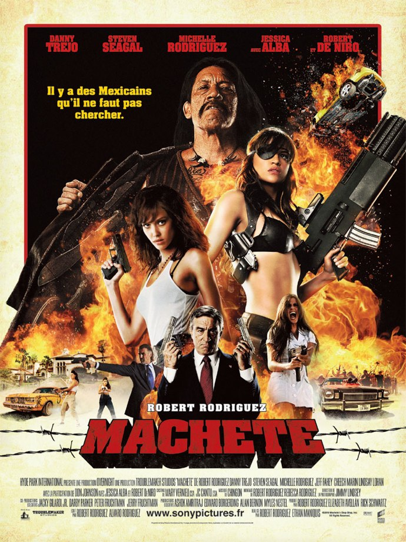
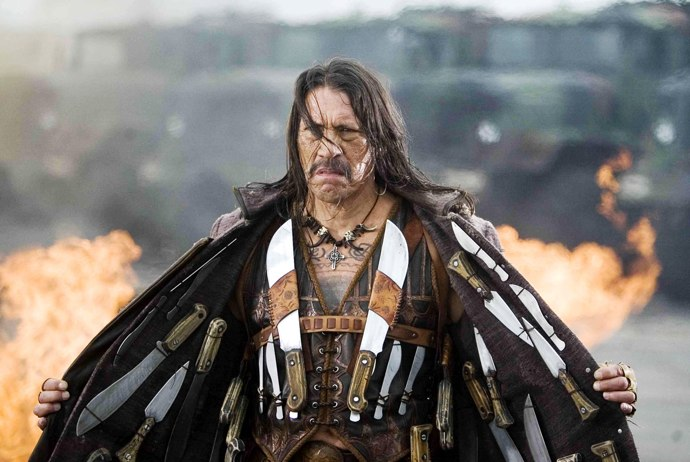
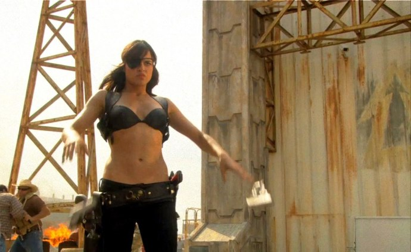

+++
titre = "Machete, Robert Rodriguez et Ethan Maniquis"
title = "Machete, Robert Rodriguez et Ethan Maniquis"
url = "/machete-rodriguez-maniquis"
date = "2010-12-04T16:32:13"
Lastmod = "2012-11-26T13:27:46"
cover = "machete-rodriguez-trejo.jpg"
categorie = [ "À voir" ]
tag = [ "Action", "Humour", "Parodie", "Société", "Vite oublié" ]
createur = [ "Ethan Maniquis", "Robert Rodriguez" ]
acteur = [ "Danny Trejo", "Jessica Alba", "Michelle Rodriguez", "Robert De Niro" ]
annee = [ "2010" ]
weight = 2010
pays = [ "États-Unis" ]

+++

À l&rsquo;origine, ce n&rsquo;était qu&rsquo;une <a href="http://www.dailymotion.com/video/x57x2m_machete-extrait-planet-terror_shortfilms">fausse bande-annonce</a> diffusée avant <em>Planète Terreur</em>, précédent film de Robert Rodriguez. Le cinéaste en passe de devenir un surdoué de la parodie et du film de genre a vu dans cette vraie fausse bande-annonce un film et c&rsquo;est ainsi que <em>Machete</em> est finalement sorti sur nos écrans. À quelques détails près, le film respecte parfaitement la bande-annonce qui évoquait déjà une histoire assez fouillée tout en marquant un fort penchant pour la parodie. Ce penchant est central dans <em>Machete</em> : ses deux réalisateurs, Robert Rodriguez ayant co-réalisé avec Ethan Maniquis, s&rsquo;en donnent à cœur joie pour un résultat extrêmement jouissif.

&laquo;&nbsp;<em>Il y a des Mexicains qu&rsquo;il ne faut pas chercher</em>&laquo;&nbsp;, explique l&rsquo;affiche. Machete entre sans aucun doute dans cette catégorie de Mexicains légèrement susceptibles et dotés d&rsquo;une étonnante résistance face à la mort en même temps que d&rsquo;une surprenante capacité à tuer avec une efficacité redoutable. La séquence d&rsquo;ouverture plonge directement dans l&rsquo;action : Machete, policier ridé et bourru, fonce à toute allure pour sauver une demoiselle en danger alors que sa hiérarchie lui intime d&rsquo;attendre les renforts. Arrivé sur place, il tue tout ce qui bouge et trouve la fille au cours d&rsquo;un carnage où les têtes sautent et les balles pleuvent. Quand il sauve la fille, il s&rsquo;aperçoit, mais un peu tard, être tombé dans un piège : la police corrompue aide le grand méchant qui décide alors de se venger de Machete en décapitant sa femme devant ses yeux impuissants. Le film se poursuit trois ans après, aux États-Unis. Machete est un homme brisé qui fait des petits boulots, en particulier du jardinage, pour de riches Américains. Un jour, on lui propose non pas de tuer les mauvaises herbes, mais de tuer un sénateur partisan de la tolérance zéro face à l&rsquo;immigration clandestine et qui entend bien barricader son pays et fusiller tout ce qui dépasse. Machete doit le tuer contre 150 000 $, mais il s&rsquo;aperçoit vite que c&rsquo;est un piège : l&rsquo;homme qui l&rsquo;a embauché s&rsquo;occupe de la campagne du sénateur et il simule un assassinat pour faciliter sa réélection. L&rsquo;erreur fatale fut de choisir Machete, il ne le prenait que pour un jardinier alors qu&rsquo;il s&rsquo;agissait d&rsquo;un redoutable tueur, une légende même. Quand il apprend que c&rsquo;est celui qui a tué sa femme qui est derrière tout cela, il décide de se venger.

Vous l&rsquo;aurez compris, la finesse n&rsquo;est pas le fort de <em>Machete</em>. Disons-le, ce film est au contraire exubérant, outrancier, grossier même… mais bien loin de constituer un défaut, c&rsquo;est sa force. Robert Rodriguez maniait déjà la parodie avec délice dans <em>Planète Terreur</em>, il va au moins aussi loin dans ce nouveau film. C&rsquo;est une parodie de films d&rsquo;action des années 1970 et 1980, des films où l&rsquo;intrigue n&rsquo;est qu&rsquo;un prétexte à un étalage d&rsquo;action décomplexée. Le scénario de <em>Machete</em> pourrait ainsi se résumer à : &laquo;&nbsp;Machete tue tout sur son passage&nbsp;&raquo;, avec un talent indéniable d&rsquo;ailleurs. Le film n&rsquo;hésite pas à en faire des tonnes dans le registre du tueur né qui peu utiliser n&rsquo;importe quel bout de verre pour en faire une arme mortelle, même si l&rsquo;arme de prédilection du Mexicain est la fameuse machette qui lui a donné son nom de héros. Comme dans tous les films du genre, le héros ne meurt jamais, même quand il se prend une balle en pleine tête (la balle est stoppée par une balle qui s&rsquo;y trouvait déjà, tout simplement), et il lui suffit d&rsquo;une heure ou deux de sommeil pour récupérer et repartir comme si de rien n&rsquo;était. La parodie se trouve bien évidemment dans les combats épiques où un homme seul armé d&rsquo;une machette peut tuer une dizaine d&rsquo;hommes équipés d&rsquo;armes automatiques, où les voitures tirent des roquettes et les motos sont équipées de sulfateuses. Le cliché touche également à la libido de Machete qui couche dans le film avec quatre filles, dont une fois deux en même temps et évidemment à chaque fois des beautés parfaites. <em>Machete</em> est un film du trop : il contient trop de tout, trop pur être pris au sérieux plus d&rsquo;une demi-seconde. Et dans le genre, on a rarement fait mieux : c&rsquo;est un délice, même si vous n&rsquo;avez jamais vu de série B de films d&rsquo;action, l&rsquo;ensemble est vraiment amusant, à condition de ne pas s&rsquo;offusquer de voir un peu de sang, de seins et de n&rsquo;importe quoi. Le film part en effet un peu dans tous les sens, plusieurs rebondissements n&rsquo;étant expliqués par rien d&rsquo;autre que le délire pur du scénariste.

<em>Machete</em> est une parodie, où le second degré est omniprésent. Au-delà même du film de genre, Robert Rodriguez et Ethan Maniquis prennent un malin plaisir à détourner les scènes attendues, jouant des clichés dans tous les registres. Ainsi, quand il faut manipuler un ordinateur pour y trouver des preuves, c&rsquo;est bien évidemment un Mac, mais l&rsquo;interface est à mi-chemin entre les terminaux UNIX sans interface et les ordinateurs Playskool, une interface qui permet à un personnage de tapoter le clavier d&rsquo;un air concentré pour obtenir une avalanche de texte et d&rsquo;images et finalement le résultat attendu. Cette débauche de second degré n&rsquo;empêche pas <em>Machete</em> d&rsquo;évoquer un sujet sérieux, l&rsquo;immigration espagnole aux États-Unis. Derrière les clichés et la surenchère, le sujet est traité de manière étonnamment sérieuse, pour un film qui sonne parfois comme un brulot politique contre la fermeture des frontières et des politiques véreux trempés dans les affaires de drogue. Le film s&rsquo;attache par ailleurs à présenter la vie des migrants, une vie de misère où les hommes attendent le passage de riches américains qui leur offrent un travail de jardinage. Le parallèle avec la prostitution féminine est vraiment frappant, avec ces hommes qui montent dans les voitures de luxe et qui donnent leurs tarifs. Certes, cela participe au second degré d&rsquo;ensemble, mais je pense aussi qu&rsquo;il s&rsquo;agit là d&rsquo;une dénonciation, d&rsquo;ailleurs très efficace, du traitement réservé aux migrants en situation illégale et à l&rsquo;hypocrisie américaine qui consiste à les rejeter dans les discours, mais à les utiliser comme main-d&rsquo;œuvre malléable et bon marché en même temps. Que l&rsquo;on se rassure néanmoins, <em>Machete</em> reste un film bourrin et fun, mais ses réalisateurs prouvent que ce n&rsquo;est pas inconciliable avec une légère dénonciation tout à fait sérieuse.

La parodie concerne aussi bien sûr la forme. <em>Machete</em> est un film réalisé à l&rsquo;ancienne, avec une sorte de patine qui passe d&rsquo;abord par une détérioration volontaire de l&rsquo;image, même si l&rsquo;effet n&rsquo;est pas trop utilisé. La photographie du film fait aussi vieillotte, tandis que les réalisateurs multiplient les effets tape à l&rsquo;œil assez datés et qui conviennent parfaitement ici. La réalisation est donc classique, ce qui est en l&rsquo;occurrence un effet de style et non une paresse. On retrouve aussi quelques effets visuels que l&rsquo;on retrouve dans tout le cinéma de Robert Rodriguez, notamment dans <em>Sin City</em>, à commencer par le générique qui serait presque un pastiche de cette adaptation de comics. La réussite de <em>Machete</em> doit beaucoup à la performance étonnante de son acteur principal, Danny Trejo, étonnant en Mexicain musclé, bourru et extrêmement violent. Il est parfait dans ce rôle et on parie qu&rsquo;il est promis à un bel avenir pour jouer les têtes brûlées. Autour de lui, le reste du casting n&rsquo;est pas en reste à commencer par une série de filles aussi sexy qu&rsquo;armées et dangereuses, sans oublier un Robert De Niro très en forme dans ce rôle de politique assoiffé de pouvoir et qui joue au gros dur Texan. La musique enfin joue un rôle essentiel : composée par <a href="http://en.wikipedia.org/wiki/Chingon_(band)">Chingon</a>, le groupe de Robert Rodriguez, elle emprunte tantôt aux musiques mexicaines sur le mode du cliché, tantôt au métal pour constituer une bande sonore rythmée très réussie.

Robert Rodriguez confirme avec <em>Machete</em> à la fois son penchant pour la parodie et le second degré, et son talent dans ces domaines. À condition d&rsquo;accepter la surenchère permanente, ce film est un vrai plaisir de cinéma. Le film ne restera pas dans les annales de l&rsquo;histoire du cinéma, non, mais ce n&rsquo;est pas du tout son objectif. On sent le plaisir légèrement coupable, mais néanmoins totalement assumé à faire dans la surenchère, à filmer les muscles saillants du héros et les seins des héroïnes, à massacrer à tout va, à montrer à l&rsquo;écran des gerbes de sang… le tout sur du métal à 200 à l&rsquo;heure. C&rsquo;est idiot, certes, mais cela m&rsquo;amuse.

Réactions partagées dans la blogosphère. <a href="http://www.filmosphere.com/2010/12/critique-machete-2010/">Nicolas</a> a ressenti le même plaisir et m&rsquo;apprend au passage que le film de genre imité ici par <em>Machete</em> a en fait un nom, le <a href="http://en.wikipedia.org/wiki/Mexploitation">mexploitation</a>… À l&rsquo;inverse, <a href="http://www.plan-c.fr/article-critique-machete-de-robert-rodriguez-et-ethan-maniquis-62227844.html">Alexandre</a> n&rsquo;a pas aimé et entend bien le faire savoir, taclant au passage ce pauvre Rodriguez qui n&rsquo;avait rien demandé.

<h3>Vous voulez m&rsquo;aider ?<a href="#footnote_0_4306" id="identifier_0_4306" class="footnote-link footnote-identifier-link" title="&Agrave; propos de la publicit&eacute;&hellip;">1</a></h3>
<ul>
<li><a href="http://www.amazon.fr/gp/product/B004HYGSVU/ref=as_li_ss_tl?ie=UTF8&#038;tag=leblogdenic07-21&#038;linkCode=as2&#038;camp=1642&#038;creative=19458&#038;creativeASIN=B004HYGSVU">Acheter le film en Blu-Ray sur Amazon</a></li>
<li><a href="http://www.amazon.fr/gp/product/B004HYGSVK/ref=as_li_ss_tl?ie=UTF8&#038;tag=leblogdenic07-21&#038;linkCode=as2&#038;camp=1642&#038;creative=19458&#038;creativeASIN=B004HYGSVK">Acheter le film en DVD sur Amazon</a></li>
<li><a href="https://itunes.apple.com/fr/movie/machete/id427442541">Acheter le film sur l&rsquo;iTunes Store</a></li>
</ul>

<ol class="footnotes"><li id="footnote_0_4306" class="footnote"><a href="http://voiretmanger.fr/soutien/">À propos de la publicité…</a> [<a href="#identifier_0_4306" class="footnote-link footnote-back-link">&#8617;</a>]</li></ol>
