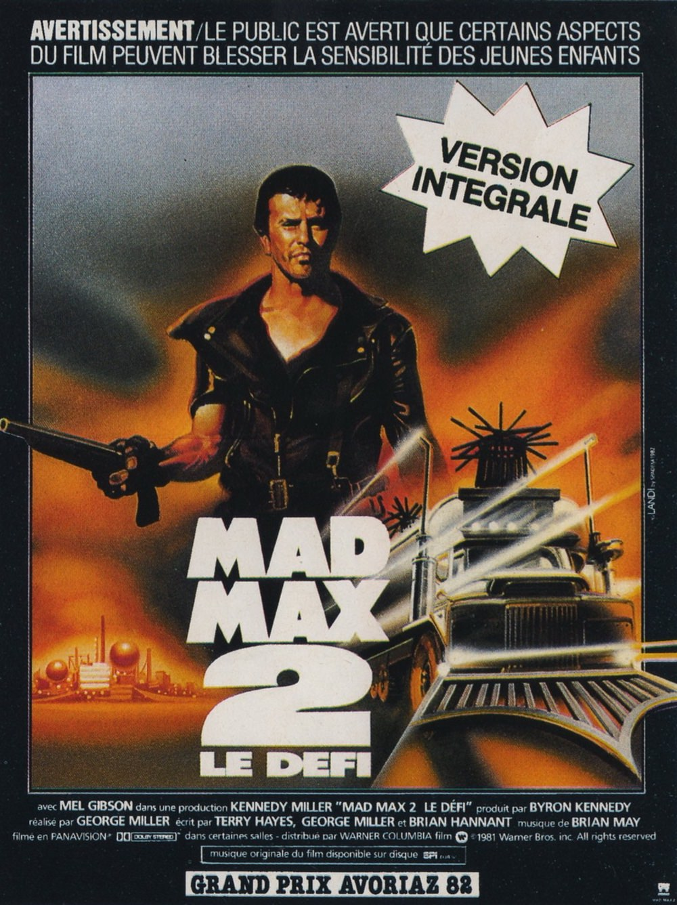
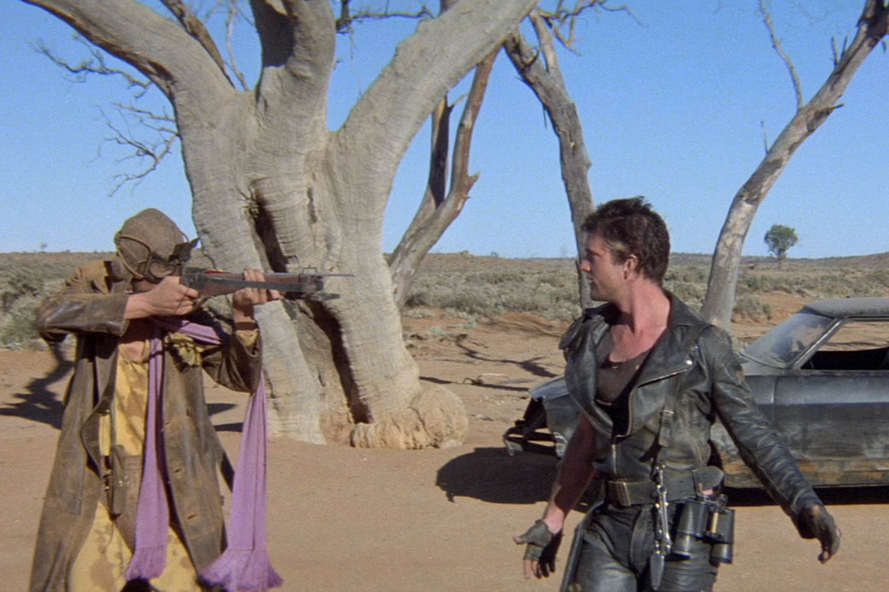
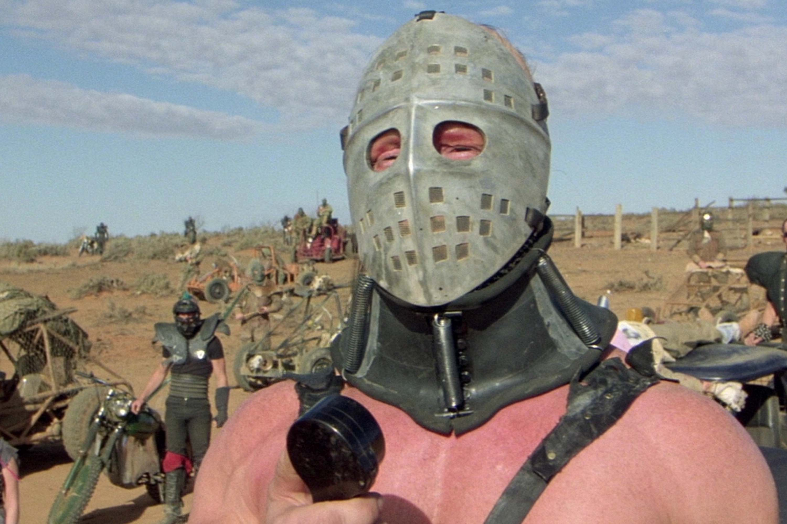

+++
type = "post"
titre = "<em>Mad Max 2 : Le défi</em>, George Miller"
title = "Mad Max 2 : Le défi, George Miller"
url = "/mad-max-2-defi-miller"
date = "2015-05-09T12:01:22"
Lastmod = "2015-05-09T23:27:37"
cover = "mad-max-2-le-defi-mel-gibson.jpg"
position = "top"
categorie = [ "À voir" ]
tag = [ "Action", "Apocalypse", "Culte", "Science-Fiction", "Société", "Violence" ]
createur = [ "George Miller" ]
acteur = [ "Bruce Spence", "Kjell Nilsson", "Mel Gibson", "Michael Preston" ]
annee = [ "1981" ]
weight = 1981
saga = [ "Mad Max" ]
pays = [ "Australie" ]
original = "Mad Max 2: The Road Warrior"

+++

Le premier <a href="/mad-max-miller/" title="Mad Max, George Miller"><em>Mad Max</em></a> avait été réalisé avec quasiment aucun budget, par un médecin qui avait envie de faire du cinéma. Son énorme succès partout, sauf aux États-Unis bizarrement, a placé George Miller sur le devant de la scène et les appels du pied se multiplient, notamment de Hollywood. Plutôt que d&rsquo;y répondre, le réalisateur préfère donner à son premier film une suite qui pouvait être beaucoup plus ambitieuse grâce à un budget beaucoup plus confortable. <em>Mad Max 2 : Le défi</em> est ainsi plus proche de nos blockbusters actuels, avec beaucoup de personnages, de l&rsquo;action en pagaille et des décors plus riches. Pour autant, ce deuxième volet conserve quelques-uns des points forts de l&rsquo;original, en particulier une dose très légère de dialogues. À cet égard, même si son deuxième film est plus riche, il conserve une forme d&rsquo;aridité qui convient bien à son sujet et son cadre désertique. L&rsquo;ensemble est plus riche qu&rsquo;avant, moins original, mais aussi peut-être plus abouti.

<em>Mad Max</em> ne donnait absolument aucune explication sur le contexte et l&rsquo;univers créé par George Miller. On comprenait que l&rsquo;on avait affaire à un univers post-apocalyptique où l&rsquo;État avait perdu son pouvoir pour assurer la sécurité des citoyens et où, logiquement, la loi du plus fort avait repris ses droits. Mais on ne savait rien de la disparition du pétrole, un élément pourtant central dans la saga. C&rsquo;était un choix assez radical, peut-être un peu trop et <em>Mad Max 2 : Le défi</em> adopte une approche plus conventionnelle. Le film ouvre ainsi sur une séquence qui sert autant à poser le contexte général qu&rsquo;à rappeler brièvement les évènements importants du premier volet. On comprend ainsi mieux que la société a disparu quand le pétrole a été entièrement utilisé et qu&rsquo;une période de chaos a suivi. On se remémore aussi que le héros, Max, autrefois policier, a plongé dans la folie en perdant sa femme et son fils. Étrangement, George Miller donne la clé du film que l&rsquo;on n&rsquo;a pas encore vu, en disant que son personnage allait retrouver son humanité. L&rsquo;intrigue se met ensuite en place avec une première course-poursuite, comme dans <em>Mad Max</em>, suivie de la rencontre du personnage principal avec Gyro Captain, l&rsquo;un des survivants qui ne roule pas, mais vole. <em>Mad Max 2 : Le défi</em> se construit autour d&rsquo;une unique idée et une idée qui est en outre très simple : Max et Gyro découvrent une communauté qui dispose d&rsquo;une grande quantité de pétrole et qui assaillie par la bande de malfrats entrainée par Humungus. Le héros veut d&rsquo;abord voler de l&rsquo;essence, mais il va finir par les aider. Et c&rsquo;est tout : cette simplicité tranche avec les productions actuelles, ici on va droit au but et l&rsquo;histoire de ne se détourne jamais de cette ligne directrice.

Au fond, l&rsquo;histoire importe peu dans cette suite. C&rsquo;est tant mieux d&rsquo;ailleurs, car si on apprécie la simplicité de son scénario, certains éléments sont moins convaincants. Même si George Miller s&rsquo;est amélioré par rapport au premier volet, <em>Mad Max 2 : Le défi</em> souffre toujours de ses personnages secondaires grossiers. C&rsquo;est moins caricatural qu&rsquo;auparavant, mais le grand méchant est particulièrement ridicule avec sa tenu très homo-érotique — tous les costumes du clan sont ainsi constitués de cuir largement ouvert et d&rsquo;éléments piochés dans l&rsquo;univers SM… surprenant. Au-delà du costume, on ne croit jamais vraiment à ce personnage, ni à ses motivations, mais cela n&rsquo;a pas tellement d&rsquo;importance. On sent que le film existe d&rsquo;abord pour ses scènes d&rsquo;action et de course-poursuites et à cet égard, force est de reconnaître que le film fait très fort et qu&rsquo;il a bien vieilli. La poursuite finale, entre le camion d&rsquo;essence et les véhicules des méchants, est un modèle du genre, bien filmée, avec des plans parfaitement conçus pour faire monter le suspense. On peut faire bien plus spectaculaire aujourd&rsquo;hui, mais cette séquence prouve bien que les cascades à l&rsquo;ancienne, sans effets numériques, et des choix astucieux de mise en scène font parfaitement l&rsquo;affaire. <em>Mad Max 2 : Le défi</em> mérite d&rsquo;être (re)vu uniquement pour cette scène, mais le reste du film est aussi plaisant par son dosage d&rsquo;actions. Le film évite au maximum les dialogues, avec quelques scènes qui en sont totalement dépourvues. Une rareté bienvenue et la bande-originale, composée par Brian May (qui n&rsquo;est pas le même que le guitariste de Queen), est elle aussi judicieusement plus discrète.

<em>Mad Max 2 : Le défi</em> est plus ambitieux que son prédécesseur, peut-être moins original, mais sans doute aussi plus réussi. Les moyens supplémentaires ont permis à George Miller d&rsquo;offrir des scènes de course-poursuite spectaculaires et celle qui termine le long-métrage est même restée dans les annales comme modèle du genre. Le film n&rsquo;évite pas quelques artefacts des années 1980, notamment dans les costumes, mais il a bien vieilli dans l&rsquo;ensemble et reste très plaisant à regarder plus de trente ans après. Et puis si son histoire ne passionne pas vraiment, ce n&rsquo;est pas très grave, la mise en scène se suffit à elle-même. Un classique !

<h3>Vous voulez <a href="/soutien/">m&rsquo;aider</a> ?</h3>
<ul>
<li><a href="http://www.amazon.fr/gp/product/B00T8BY8V4/ref=as_li_ss_tl?ie=UTF8&amp;tag=leblogdenic07-21&amp;linkCode=as2&amp;camp=1642&amp;creative=19458&amp;creativeASIN=B00T8BY8V4">Acheter le film en Blu-ray sur Amazon</a></li>
<li><a href="http://www.amazon.fr/gp/product/B00004VYL5/ref=as_li_ss_tl?ie=UTF8&amp;tag=leblogdenic07-21&amp;linkCode=as2&amp;camp=1642&amp;creative=19458&amp;creativeASIN=B00004VYL5">Acheter le film en DVD sur Amazon</a></li>
<li><a href="https://itunes.apple.com/fr/movie/mad-max-2/id376707997">Acheter ou louer le film sur l&rsquo;iTunes Store</a></li>
</ul>

