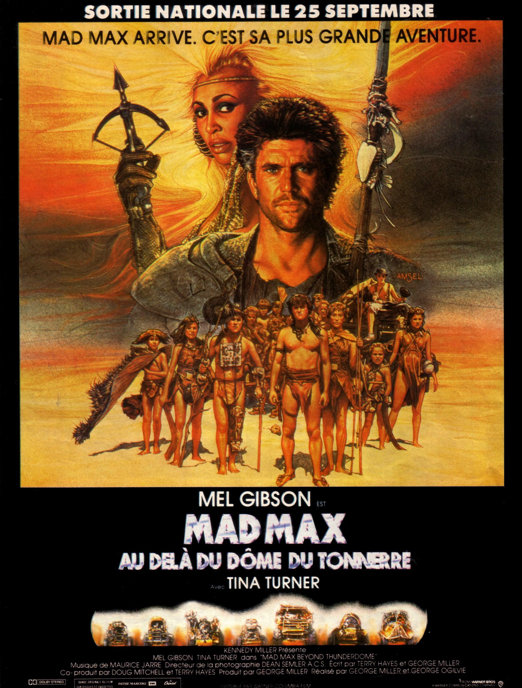
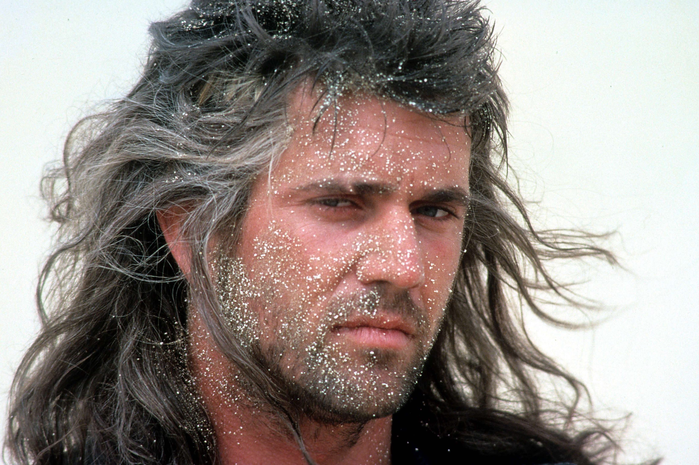
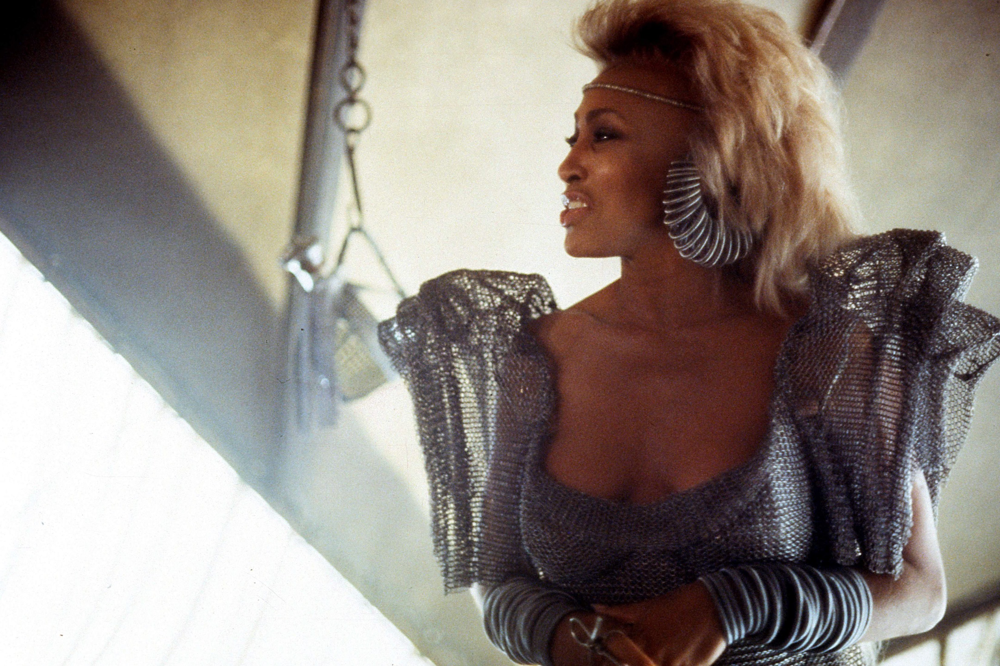

+++
type = "post"
titre = "<em>Mad Max : Au-delà du dôme du tonnerre</em>, George Miller et George Ogilvie"
title = "Mad Max : Au-delà du dôme du tonnerre, George Miller et George Ogilvie"
url = "/mad-max-dome-tonnerre-miller-ogilvie"
date = "2015-05-10T11:17:39"
Lastmod = "2015-05-10T19:33:24"
cover = "mad-max-dome-tonnerre-mel-gibson.jpg"
categorie = [ "À voir" ]
tag = [ "Action", "Apocalypse", "Enfance", "Mythe", "Science-Fiction", "Société" ]
createur = [ "George Miller", "George Ogilvie" ]
acteur = [ "Angry Anderson", "Bruce Spence", "Mel Gibson", "Tina Turner" ]
annee = [ "1985" ]
weight = 1985
saga = [ "Mad Max" ]
pays = [ "Australie", "États-Unis" ]
original = "Mad Max: Beyond Thunderdome"

+++

Son affiche nous promet « <em>sa plus grande aventure</em> » et <em>Mad Max : Au-delà du dôme de tonnerre</em> est incontestablement le film le plus ambitieux à ce stade de la saga. Le premier volet avait été réalisé avec trois fois rien, le deuxième bénéficiait déjà d&rsquo;un budget plus conséquent, mais ce troisième épisode voit les choses en grand. Long-métrage australo-américain, il est aussi co-réalisé non seulement par George Miller, mais aussi par George Ogilvie, un réalisateur surtout connu pour son travail pour la télévision australienne. Le changement est bien visible à l&rsquo;écran, avec cette fois d&rsquo;immenses décors qui ont été créés pour les besoins du film, mais aussi un casting beaucoup plus riche. Mais bizarrement, tout cet arsenal technique a été déployé pour un volet singulier, puisqu&rsquo;il est quasiment entièrement statique. Les grandes courses-poursuites qui faisaient jusque-là la force de la saga ne sont plus qu&rsquo;un vague souvenir, et <em>Mad Max : Au-delà du dôme de tonnerre</em> est un long-métrage surprenant, qui ne semble qu&rsquo;à peine lié à ce qui le précède. À l&rsquo;arrivée, une œuvre lourdement symbolique et surtout handicapée par une deuxième partie assez ratée.

Dans <a href="http://voiretmanger.fr/mad-max-miller/" title="Mad Max, George Miller"><em>Mad Max</em></a>, on assistait avec le policier Max à la fin d&rsquo;un monde et l&rsquo;ouverture d&rsquo;un nouvel univers post-apocalyptique où le pétrole a disparu, ce qui provoque la chute de la société et le retour à l&rsquo;ordre de la nature, où seuls les plus forts survivent. <a href="http://voiretmanger.fr/mad-max-2-defi-miller/" title="Mad Max 2 : Le défi, George Miller"><em>Mad Max 2 : Le défi</em></a> se déroulait peu après, dans un univers digne des westerns où il n&rsquo;y a plus de loi sauf la force ; ce volet permettait à Max, en aidant une communauté perdue, de retrouver son humanité. De manière assez logique, George Miller dresse dans ce troisième épisode le retour des constructions sociales. <em>Mad Max : Au-delà du dôme de tonnerre</em> se déroule quinze ans après le précédent film et dès l&rsquo;ouverture, le film met bien en évidence les changements survenus dans l&rsquo;intervalle. Max ne conduit plus sa célèbre voiture, détruite dans le deuxième long-métrage, mais une cariole tirée par… des dromadaires. L&rsquo;essence est si rare que plus personne ne semble en avoir, mais comme prévu, la civilisation se reforme progressivement. Le personnage arrive à Trocpolis, une sorte de ville assez primitive organisée autour de l&rsquo;échange et de quelques règles de base créées par Entité, qui contrôle aussi l&rsquo;ensemble depuis une plateforme qui surplombe la ville. Venu uniquement pour récupérer son véhicule volé juste avant, il est embarqué dans un conflit entre la ville du haut et celle du bas, une usine de production de méthane qui fournit l&rsquo;électricité indispensable et sur laquelle règne Master. Pour récupérer ses biens, il doit accepter un combat à mort contre une brute dans le fameux dôme de tonnerre annoncé par le titre. George Miller propose à cette occasion l&rsquo;une de ces séquences mémorables dont il a le secret, une scène de combat jamais vue entre cette brute et Max, tous deux harnachés avec des élastiques. C&rsquo;est vraiment une scène exceptionnelle en matière de mise en scène et de tensions, un grand moment de cinéma.

<em>Mad Max : Au-delà du dôme de tonnerre</em> a alors atteint son sujet principal : qui a-t-il au-delà du dôme ? La réponse est surprenante, puisque le film embraye, après quelques péripéties secondaires, dans un tout autre univers. Au milieu du désert, un oasis où des enfants vivent en communauté, sans aucun adulte à proximité. Et pendant toutes ces années sans contact humain, ils se sont formés un ensemble de croyances autour d&rsquo;un capitaine Walker qui doit venir les sauver, et qu&rsquo;ils confondent avec Max. Comme dans la première partie, la symbolique est évidente et George Miller joue à la fois sur l&rsquo;idée de <em>Peter Pan</em> ou d&rsquo;autres récits où des enfants isolés s&rsquo;organisent en société (<em>Sa majesté les mouches</em> est étonnamment proche), mais aussi sur l&rsquo;idée de la traversée du désert pour fonder quelque chose de neuf. Malheureusement, si la première partie du film était assez réussie, malgré quelques traitements vraiment caricaturaux, cette deuxième partie tombe vite à l&rsquo;absurde. <em>Mad Max : Au-delà du dôme de tonnerre</em> semble oublier tout traitement adulte et le film tombe même, pour certaines séquences, dans le film pour enfants. Un contraste étonnant, d&rsquo;autant que le message est quand même très sombre : après tout, Max arrive dans cette communauté d&rsquo;enfants pour détruire ce en quoi ils croyaient. Quant à la ville du début, elle symbolise bien que l&rsquo;injustice habituelle de la société reprend ses droits : la symbolique est un petit peu lourde, elle n&rsquo;en est pas moins efficace. Comment concilier cette noirceur de ton, avec la légèreté de la majorité des séquences qui se déroulent après l&rsquo;épisode du combat sous le dôme de tonnerre ? C&rsquo;est comme si l&rsquo;on avait deux films en un, ce qui est en fait largement le cas, puisque George Ogilvie a réalisé la majorité des séquences qui ne sont pas de l&rsquo;action<a href="#fn-13663-1" rel="footnote">1</a>. Le résultat est troublant, mais ce n&rsquo;est pas positif et ce n&rsquo;est pas la course-poursuite finale — la seule du film — qui vient vraiment sauver l&rsquo;ensemble.

<em>Mad Max</em> est une saga regroupée par un même nom, mais c&rsquo;est à peu près tout. George Miller n&rsquo;a pas du tout cherché à unifier ses trois films et chaque épisode n&rsquo;a rien à voir, ou presque, avec le précédent. <em>Mad Max : Au-delà du dôme de tonnerre</em> est sans doute celui qui se distingue le plus du reste, mais il n&rsquo;est pas seulement très différent de tout ce qui le précède, il est aussi très différent en interne. On a le sentiment d&rsquo;avoir deux films réunis arbitrairement en un seul objet cinématographique qui tient difficilement la route, il faut bien le reconnaître. Il y a des choses intéressantes, quelques séquences vraiment impressionnantes, mais le bilan reste le même. Ce <em>Mad Max : Au-delà du dôme de tonnerre</em> n&rsquo;est pas une réussite et c&rsquo;est bien dommage…

<h3>Vous voulez <a href="http://voiretmanger.fr/soutien/">m&rsquo;aider</a> ?</h3>
<ul>
<li><a href="http://www.amazon.fr/gp/product/B00T8BY972/ref=as_li_ss_tl?ie=UTF8&amp;tag=leblogdenic07-21&amp;linkCode=as2&amp;camp=1642&amp;creative=19458&amp;creativeASIN=B00T8BY972">Acheter le film en Blu-ray sur Amazon</a></li>
<li><a href="http://www.amazon.fr/gp/product/B00004VYLC/ref=as_li_ss_tl?ie=UTF8&amp;tag=leblogdenic07-21&amp;linkCode=as2&amp;camp=1642&amp;creative=19458&amp;creativeASIN=B00004VYLC">Acheter le film en DVD sur Amazon</a></li>
<li><a href="https://itunes.apple.com/fr/movie/mad-max-3-au-dela-du-dome/id571022862">Acheter ou louer le film sur l&rsquo;iTunes Store</a></li>
</ul>

<ol>
<li id="fn-13663-1">
George Miller était à cette époque abattu par la mort accidentelle de son producteur et ami Byron Kennedy et il avait perdu tout intérêt dans le projet. Ce qui explique son investissement <em>a minima</em>.&#160;<a href="#fnref-13663-1" rev="footnote">&#8617;</a>
</li>
</ol>

