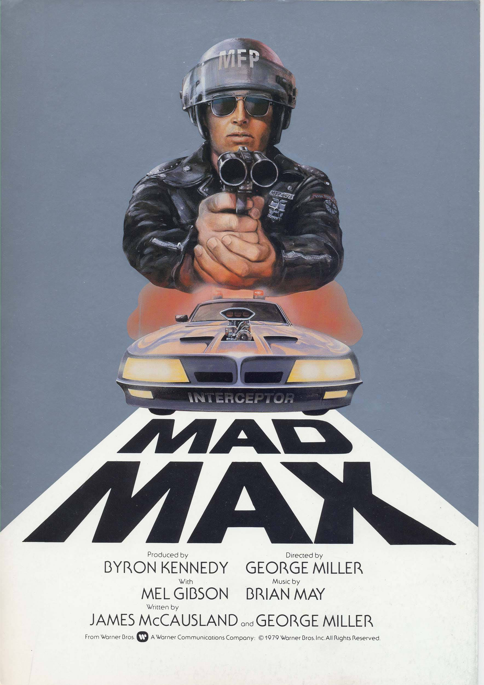
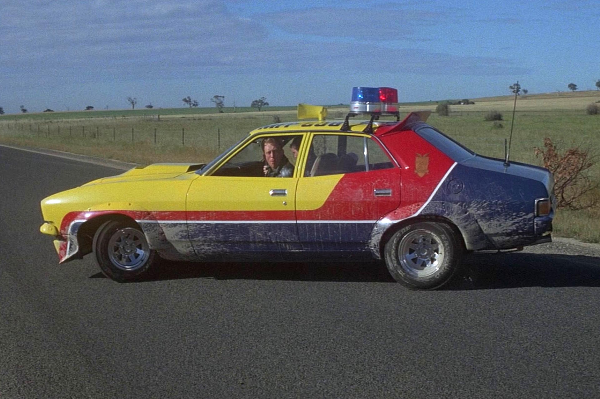
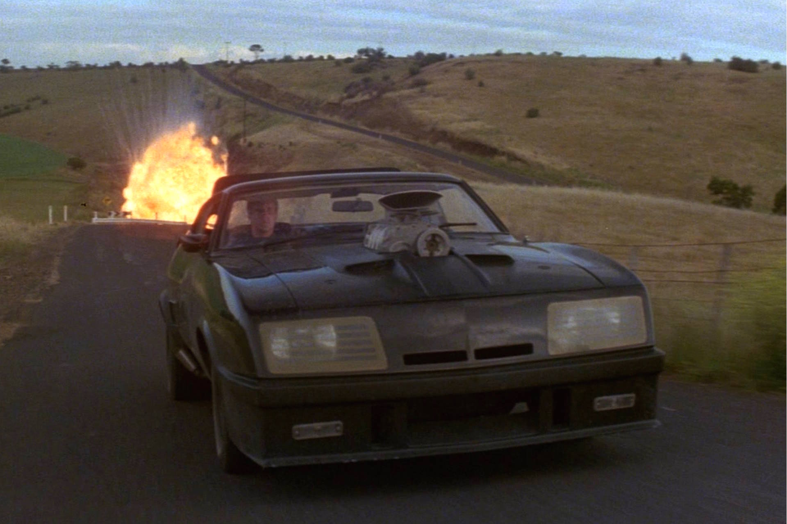

+++
type = "post"
titre = "<em>Mad Max</em>, George Miller"
title = "Mad Max, George Miller"
url = "/mad-max-miller"
date = "2015-03-22T19:18:34"
Lastmod = "2015-03-22T19:23:25"
cover = "mad-max-mel-gibson.jpg"
categorie = [ "À voir" ]
tag = [ "Action", "Amour", "Apocalypse", "Course", "Crise", "Famille", "Folie", "Police", "Science-Fiction", "Société", "Vengeance", "Violence", "Voiture" ]
createur = [ "George Miller" ]
acteur = [ "Hugh Keays-Byrne", "Joanne Samuel", "Mel Gibson", "Steve Bisley" ]
annee = [ "1979" ]
weight = 1979
saga = [ "Mad Max" ]
pays = [ "Australie" ]

+++

Film culte, interdit pendant des années en France, <em>Mad Max</em> a aussi été le film le plus rentable de l&rsquo;histoire du cinéma pendant vingt ans : avec un budget inférieur à 400 000 $ alors qu&rsquo;il a rapporté plus de cent millions de dollars, il a fallu bien des années et un succès aussi énorme que celui du <em>Projet Blair Witch</em> pour le dépasser. <em>Mad Max</em> est aussi le premier épisode d&rsquo;une saga qui n&rsquo;est pas terminée et le premier film d&rsquo;un réalisateur qui n&rsquo;était prédestiné à le devenir ; Avant de tourner son premier film, George Miller était en effet un médecin. Autant d&rsquo;éléments qui ont construit la légende de ce long-métrage bref et intense, qui souffre aujourd&rsquo;hui de quelques choix techniques et d&rsquo;une ambiance très marquée par les années 1980, mais qui reste aussi une œuvre fondatrice et visionnaire. Par certains aspects, <em>Mad Max</em> reste encore totalement d&rsquo;actualité en visant juste et en offrant une vision post-apocalyptique qui en a inspiré plus d&rsquo;un. Un classique !

Alors que George Miller n&rsquo;a jamais tourné avant, l&rsquo;ouverture de <em>Mad Max</em> impressionne encore aujourd&rsquo;hui par sa concision et son efficacité. Là où bon nombre d&rsquo;œuvres de science-fiction commencent par décrire, avec un narrateur par exemple, leur univers, on le découvre ici par quelques images et des sons. Ainsi, le premier plan se fait sur le « <em>Hall of Justice</em> », mais on comprend vite que l&rsquo;ordre ne règne pas sur cet univers qui se place à une époque et en un lieu complètement vagues. Les détritus volent, le bâtiment est plus ou moins saccagé et surtout vide : en un seul plan, le long-métrage témoigne du caractère dévasté de son environnement. On ne nous le dira jamais, mais on comprend assez bien qu&rsquo;il s&rsquo;est passé quelque chose de grave avant le début du film, et que ce qui reste de la société n&rsquo;est pas stable et contrôlée comme dans notre monde à nous. George Miller se contente pour le transmettre de nous faire entendre la radio de la police, où sont passés des messages alarmants. Et sans attendre, <em>Mad Max</em> embraye sur une première course-poursuite qui dure une dizaine de minutes et qui place d&rsquo;emblée la barre très haut en matière de course-poursuite. Là encore, on est surpris de découvrir une telle maîtrise technique quand on sait que le réalisateur derrière la caméra faisait ses premiers pas au cinéma. Cette scène est tendue et d&rsquo;une redoutable efficacité, car en même temps que la poursuite de la voiture du criminel par deux voitures de police, George Miller introduit son personnage principal, Max. On ne le voit pas immédiatement, la caméra présente d&rsquo;abord ses chaussures, puis quelques détails de sa voiture ou encore ses lunettes de soleil. Cette manière d&rsquo;introduire le héros — un terme qui a tout son sens ici — fait que le spectateur en attend beaucoup. Manifestement, ce n&rsquo;est pas qu&rsquo;un simple policier et sa résolution de la course-poursuite, avec une simplicité troublante, puisque l&rsquo;on ne sait même pas exactement comment il fait, va dans ce sens.

Avec une telle entrée en matière, George Miller impressionne, mais la suite est moins réussie. Le cinéaste patine un petit peu dans une première partie qui présente les deux camps, avec les policiers d&rsquo;un côté et les motards venus venger la mort de celui qui était pourchassé au début. Certes, <em>Mad Max</em> parvient assez bien à transmettre l&rsquo;idée que les lignes se troublent entre les deux camps : les motards sont présentés comme des dingues, au premier sens du terme, mais les flics ne sont pas beaucoup mieux et les deux sont tout aussi violents. On sent que dans cet univers apocalyptique, l&rsquo;ordre assumé en théorie uniquement par l&rsquo;État n&rsquo;a plus de valeur et que l&rsquo;on est beaucoup plus dans une organisation de type western, où seul le plus fort peut prétendre faire la loi. C&rsquo;est plutôt bien vu, mais on regrette le jeu outrancier de la majorité des acteurs. Les méchants ont un rire diabolique sorti tout droit d&rsquo;une parodie et ils se comportent de façon vraiment trop folle pour être crédibles. Le jeu d&rsquo;acteurs n&rsquo;est pas le point fort de <em>Mad Max</em> dans l&rsquo;ensemble et à part Mel Gibson, serein dans ce premier rôle qui lui a apporté la gloire, il n&rsquo;y a pas vraiment de personnages à sauver. Même critique pour la musique, bien trop envahissante et qui surligne tout ce qui se passe ; quand George Miller la coupe enfin, son film respire et on aurait aimé une bande originale plus sobre. Malgré tout, le scénario regagne en intérêt quand Max veut se venger et part en croisade contre les motards. Les scènes de course-poursuite sont à nouveau très fortes et on est pris par leur intensité. Malheureusement, le scénario n&rsquo;accorde que très peu de place à cette vengeance et il faut attendre les films suivants pour découvrir vraiment le personnage. En attendant, ce premier volet pose des bases solides, même s&rsquo;il faut noter que, bizarrement, on ne sait pas grand-chose de l&rsquo;univers de <em>Mad Max</em>. Qu&rsquo;on ne sache pas où, ni quand, c&rsquo;est voulu et bientôt bien vu. En revanche, le synopsis officiel en dit finalement plus que le film lui-même, ce qui est étonnant, mais au fond pas si important que cela. <em>Mad Max</em> n&rsquo;évoque pas la pénurie de l&rsquo;essence autrement qu&rsquo;en montrant que les motards sont très motivés pour en récupérer, mais ce n&rsquo;est pas le sujet de ce long-métrage.

<em>Mad Max</em> n&rsquo;est pas devenu un film culte sans raison et même s&rsquo;il n&rsquo;a pas toujours très bien vieilli, il reste toujours aussi puissant par certains aspects toutes ces années plus tard. Les courses-poursuites sont très réussies, l&rsquo;introduction de l&rsquo;univers et du héros est exemplaire, mais ce qui frappe surtout, c&rsquo;est la violence. Non pas une violence visible à l&rsquo;écran, car on voit finalement assez peu de sang ou de chairs, mais une violence écrasante, suggérée en permanence. Il y a cette manière de montrer la mort d&rsquo;un bébé avec juste sa petite chaussure sur la route. Il y a aussi les mises à mort des deux côtés, avec à la fin le héros qui est d&rsquo;une intransigeance qui fait froid dans le dos et avant cela, les motards qui n&rsquo;hésitent pas à tuer de sang froid une femme et un enfant. <em>Mad Max</em> a effrayé la chronique, non pas par ce qu&rsquo;il montrait, mais par ce qu&rsquo;il disait. C&rsquo;est probablement ça, la vraie raison de son succès.

<h3>Vous voulez <a href="http://voiretmanger.fr/soutien/">m&rsquo;aider</a> ?</h3>
<ul>
<li><a href="http://www.amazon.fr/gp/product/B00I9EAROS/ref=as_li_ss_tl?ie=UTF8&amp;tag=leblogdenic07-21&amp;linkCode=as2&amp;camp=1642&amp;creative=19458&amp;creativeASIN=B00I9EAROS">Acheter le film en Blu-ray sur Amazon</a></li>
<li><a href="http://www.amazon.fr/gp/product/B00005LL1A/ref=as_li_ss_tl?ie=UTF8&amp;tag=leblogdenic07-21&amp;linkCode=as2&amp;camp=1642&amp;creative=19458&amp;creativeASIN=B00005LL1A">Acheter le film en DVD sur Amazon</a></li>
<li><a href="https://itunes.apple.com/fr/movie/mad-max/id377909113">Acheter ou louer le film sur l&rsquo;iTunes Store</a></li>
</ul>

