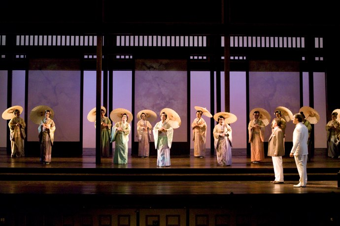

+++
titre = "Madama Butterfly, Giacomo Puccini (San Francisco Opera)"
title = "Madama Butterfly, Giacomo Puccini (San Francisco Opera)"
url = "/madama-butterfly-puccini-san-francisco-opera"
date = "2010-12-03T00:45:16"
Lastmod = "2010-12-03T23:19:45"
cover = "madama-butterfly-san-francisco.jpg"
categorie = [ "À voir… en live" ]
tag = [ "Classique", "Clichés", "Drame", "Opéra", "Opéra au ciné" ]
createur = [ "Giacomo Puccini" ]
acteur = [ "Patricia Racette" ]
annee = [ "1904" ]
weight = 1904
metteur = [ "Kathleen Belcher" ]
lieu = [ "San Francisco Opera" ]
chef = [ "Donald Runnicles" ]

+++

<em>Madama Butterfly</em> est un opéra en trois actes de Giacomo Puccini représenté pour la première fois en 1904. Après un début difficile (échec cuisant à La Scala), l&rsquo;opéra japonisant de Puccini connaît un franc succès dans le monde et aujourd&rsquo;hui encore, c&rsquo;est l&rsquo;opéra le plus joué aux États-Unis. Il faut dire que les opéras contemporains sont rares et que <em>Madama Butterfly</em> peut parler directement au public américain. Mettant en scène l&rsquo;amour fou d&rsquo;une geisha pour un américain insouciant, cet opéra parle au cœur plutôt qu&rsquo;à l&rsquo;esprit et offre un regard bourré de clichés désuets, mais plutôt plaisants, sur le Japon du XIXe siècle.

Pinkerton est un jeune officier de la marine américaine, de passage à Nagasaki. Pour s&rsquo;amuser, il décide d&rsquo;épouser Cio-Cio San, aussi connue sous le nom de madame Butterfly, une jeune Japonaise qui prend l&rsquo;affaire très au sérieux : il faut dire qu&rsquo;elle est follement amoureuse du bel américain. Américain qui profite de la beauté époustouflante de sa très jeune épouse (15 ans), la met enceinte et repart aussi vite qu&rsquo;il est arrivé, avec la ferme intention de rentrer au pays pour épouser une Américaine. Mais cela, madame Butterfly ne le sait évidemment pas et elle attend patiemment le retour de son époux, trois ans durant. Quand Pinkerton revient, c&rsquo;est accompagné de sa femme, la vraie. Cio-Cio San ne supporte pas cette nouvelle et préfère le suicide au déshonneur, abandonnant au passage son fils dans un déchirant final. <em>Madama Butterfly</em> n&rsquo;est donc pas une opérette, ce qui n&rsquo;exclue pas quelques passages plus légers, notamment dans le descriptif des us et coutumes japonais. C&rsquo;est néanmoins un drame teinté même de tragique, cette femme qui se tue et abandonne son enfant à sa concurrente par amour n&rsquo;étant pas sans rappeler quelques héroïnes tragiques. Nulle trace du destin néanmoins, il s&rsquo;agit entièrement de sa volonté propre et d&rsquo;un amour destructeur, mais aussi extrêmement romantique (c&rsquo;est encore la période).

<em>Madama Butterfly</em> est aussi l&rsquo;occasion d&rsquo;un portrait plein de clichés du Japon de la fin du XIXe siècle, et cette version du San Francisco Opera dirigée par Donald Runnicles et mise en scène par Kathleen Belcher met bien en valeur cet aspect. La mise en scène reste cependant relativement sobre : le kitsch des costumes traditionnels japonais n&rsquo;est jamais loin, mais il aurait pu être aussi beaucoup plus accentué. On note l&rsquo;usage astucieux des panneaux coulissants qui évoquent le Japon en même temps qu&rsquo;ils façonnent l&rsquo;espace, tantôt pièce fermée de la maison, tantôt jardin devant la maison. Peu d&rsquo;accessoires sur scène, mais usage abondant des jeux d&rsquo;éclairages pour une mise en scène qui repose finalement beaucoup sur le jeu et les voix des artistes. Les choix de l&rsquo;opéra de San Francisco sont à cet égard plutôt bons, tout particulièrement concernant madame Butterly, interprétée par Patricia Racette qui est une habituée du rôle et qui se débrouille effectivement très bien avec sa partition pas toujours simple.

Un mot pour finir sur la forme. Je n&rsquo;ai jamais mis les pieds au San Francisco Opera et j&rsquo;ai vu <em>Madama Butterfly</em> au cinéma. J&rsquo;avais beaucoup apprécié <a href="http://voiretmanger.fr/2010/10/10/rheingold-wagner-metropolitan-opera/">ma première expérience</a> de cette nouvelle mode, mais là je dois dire que j&rsquo;ai été déçu par l&rsquo;opéra au cinéma proposé par UGC. Alors que Gaumont a fait le choix d&rsquo;un opéra, le Met de New York, et suit la programmation de cet opéra avec des séances en très léger différé dans ses salles, UGC a fait le choix de sélectionner quelques œuvres proposées dans les opéras du monde entier. Un choix qui aurait été intéressant si le principe du direct était maintenu. Or ce n&rsquo;est pas le cas : le <em>Madama Butterfly</em> diffusé dans les salles du réseau n&rsquo;est pas <a href="http://sfopera.com/o/200.asp">celui qui tourne actuellement</a> à l&rsquo;opéra de San Francisco, mais un <a href="http://sfopera.com/opera.asp?o=262">spectacle de 2006</a>. C&rsquo;est vraiment dommage, car on a un peu le sentiment de regarder un DVD sur grand écran. Le comble fut atteint quand nous avons eu droit à des flashbacks. Oui, des flashbacks à l&rsquo;opéra ! Avec le ton sépia de rigueur, c&rsquo;était vraiment ridicule et de trop, rappelant brusquement que l&rsquo;on était au cinéma. C&rsquo;est désagréments sont d&rsquo;autant plus gênants que la qualité ne suit pas : alors que la formule de Gaumont propose une image en haute définition et un son parfait, le spectacle diffusé par UGC était en basse définition et avec une prise de son vraiment très moyenne. Autant le dire, ces conditions sont vraiment trop mauvaises pour justifier le prix de 28 € demandé par UGC ! Ainsi, je recommande sans hésiter la formule de Gaumont, où les places sont aussi à 27 €, mais où la qualité et l&rsquo;intérêt sont au rendez-vous. Seul &laquo;&nbsp;problème&nbsp;&raquo;, le programme est moins régulier.

Ne ratez pas <a href="http://anthonynelzin.com/blog/2010/12/03/madame-butterfly-et-les-flashes-back/">l&rsquo;article d&rsquo;Anthony</a> qui évoque, très bien en plus, la performance du spectacle autant que la vieille femme aigrie assise devant lui.

