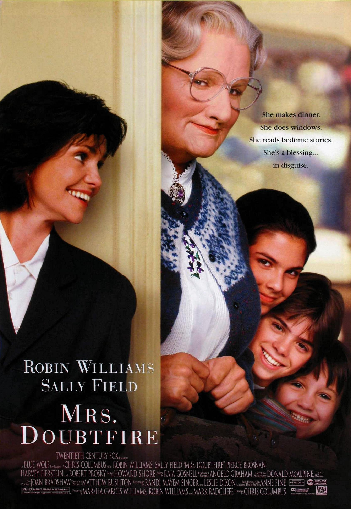
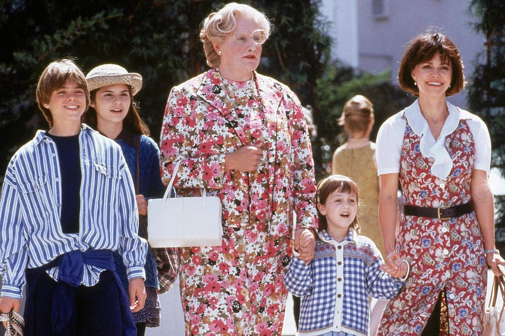
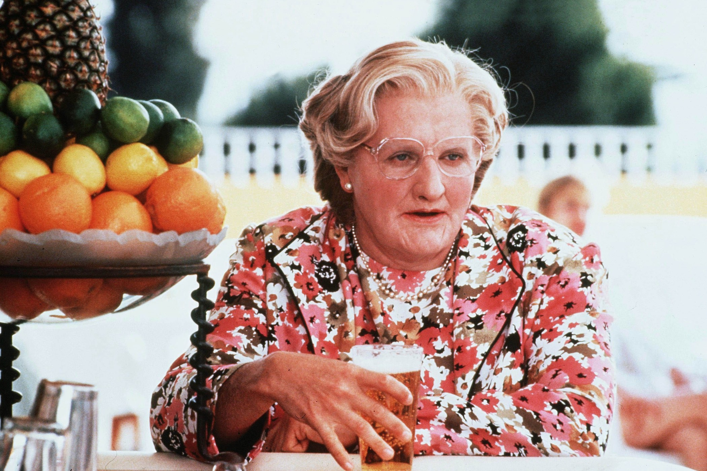

+++
titre = "<em>Madame Doubtfire</em>, Chris Colombus"
title = "Madame Doubtfire, Chris Colombus"
url = "/madame-doubtfire-colombus"
date = "2015-06-14T19:04:10"
Lastmod = "2015-06-14T19:12:33"
cover = "madame-doubtfire-robin-williams-chris-colombus.jpg"
position = "top"
categorie = [ "À voir" ]
tag = [ "Acteurs", "Adaptation littéraire", "Comédie", "Divorce", "Drame", "Enfance", "Famille", "Humour" ]
createur = [ "Chris Colombus" ]
acteur = [ "Lisa Jakub", "Mara Wilson", "Matthew Lawrence", "Pierce Brosnan", "Robin Williams", "Sally Field" ]
annee = [ "1993" ]
weight = 1993
pays = [ "États-Unis" ]
original = "Mrs. Doubtfire"

+++

Comédie familiale par excellence, <em>Madame Doubtfire</em> est aussi le terrain de jeu parfait pour que les talents d&rsquo;acteur de Robin Williams se déploient pleinement. Adapté d&rsquo;un roman, le long-métrage signé Chris Colombus se construit autour d&rsquo;une excellente idée et plus de vingt ans après sa sortie, la transformation de l&rsquo;acteur en nourrice anglaise est toujours aussi impressionnante. Pour autant, peut-être parce que l&rsquo;on connaît maintenant le destin tragique de Robin Williams, <em>Madame Doubtfire</em> n&rsquo;est pas la comédie pure que l&rsquo;on pouvait attendre et le long-métrage est même assez triste au fond. Entre les moments de pure comédie qui sont toujours très drôles, Chris Colombus signe le portrait d&rsquo;une famille éclatée sans vrai <em>happy-end</em> pour rétablir la situation.

Daniel Hillard est un acteur spécialisé dans les voix et on le découvre d&rsquo;ailleurs à son travail, en plein doublage d&rsquo;un dessin animé. Il passe d&rsquo;une voix à l&rsquo;autre avec une facilité déconcertante et on sent que c&rsquo;est vraiment ce pour quoi il est fait, jusqu&rsquo;au moment où il arrive à une scène où l&rsquo;un des personnages, un oiseau, fume une cigarette. Il refuse le message véhiculé par le projet et préfère perdre son travail plutôt que de poursuivre. Chris Colombus le suit ensuite alors qu&rsquo;il va chercher ses enfants à l&rsquo;école et la première chose qu&rsquo;ils lui demandent, c&rsquo;est s&rsquo;il a été viré à nouveau. En une scène, <em>Madame Doubtfire</em> dresse ainsi un portrait étonnamment sombre du personnage principal : un homme généreux et doué, mais qui semble incapable de se fixer et qui alterne les petits boulots assez médiocres. Quand il organise une énorme fête pour l&rsquo;anniversaire de son fils, le cinéaste montre bien qu&rsquo;il n&rsquo;a jamais vraiment grandi et on sent d&rsquo;emblée les tensions avec sa femme. Le divorce suit rapidement et le scénario ne perd pas de temps : en quelques plans seulement, Daniel vit dans un appartement pourri, loin de sa famille et surtout de ses enfants qu&rsquo;il ne peut plus voir qu&rsquo;une fois par semaine. L&rsquo;intrigue principale peut alors se mettre en place, quand son ex-femme cherche une gouvernante pour s&rsquo;occuper des enfants. Daniel met son talent d&rsquo;imitateur pour créer le personnage de Mrs. Doubtfire à l&rsquo;insu de ses trois enfants et surtout de sa femme.

Robin Williams s&rsquo;en donne à cœur joie avec ce rôle de transformiste qui semble avoir été créé pour lui. L&rsquo;acteur est excellent dans le rôle de Mrs. Doubtfire, mais les meilleures scènes du film sont celles où ils alternent entre son rôle de vieille nourrice anglaise et sa vraie personne. <em>Madame Doubtfire</em> répète cette situation à deux reprises : une première fois quand une personne envoyée par le juge vient voir sa situation et une deuxième fois au restaurant, quand il alterne entre son rôle de gouvernante et un repas d&rsquo;affaire avec le patron d&rsquo;une chaîne de télévision. L&rsquo;acteur s&rsquo;adapte parfaitement à chaque situation et même si le maquillage est très convaincant, c&rsquo;est surtout le jeu et l&rsquo;intonation qui font le travail. D&rsquo;ailleurs, quand il finit par s&rsquo;emmêler les pinceaux et jouer son propre rôle tout en étant encore déguisé en Mrs. Doubtfire, l&rsquo;acteur peut prouver tout son talent en nous perturbant autant que le personnage en face de lui. C&rsquo;est très drôle et Chris Colombus exploite au maximum ces situations compliquées où Daniel infiltré au sein de sa propre famille doit gérer la concurrence d&rsquo;un autre homme sans dévoiler son jeu. De fait, <em>Madame Doubtfire</em> peut être très drôle, mais c&rsquo;est pour mieux dévoiler sa profonde tristesse. Tout le film est baigné dans une sorte de mélancolie que l&rsquo;on n&rsquo;attendait pas dans cette comédie familiale. Le long-métrage est finalement plutôt triste, ne serait-ce que parce que le personnage principal lui-même est constamment triste quand il n&rsquo;est pas Mrs. Doubtfire.

À défaut d&rsquo;être hilarant en permanence, <em>Madame Doubtfire</em> est une comédie touchante, en plus d&rsquo;être très drôle par moments. Chris Colombus a signé un film qui n&rsquo;intéressera pas que les plus petits, mais qui parlera aussi aux plus grands et même si le ton très années 1990 a un petit peu vieilli, l&rsquo;ensemble a conservé toute sa force. Et s&rsquo;il ne fallait qu&rsquo;une raison pour le voir, ce serait sûrement pour Robin Williams, épatant dans ce jeu de transformation.

<h3>Vous voulez <a href="http://voiretmanger.fr/soutien/">m&rsquo;aider</a> ?</h3>
<ul>
<li><a href="http://www.amazon.fr/gp/product/B001G53K9Q/ref=as_li_ss_tl?ie=UTF8&amp;tag=leblogdenic07-21&amp;linkCode=as2&amp;camp=1642&amp;creative=19458&amp;creativeASIN=B001G53K9Q">Acheter le film en Blu-ray sur Amazon</a></li>
<li><a href="http://www.amazon.fr/gp/product/B00004VY2W/ref=as_li_ss_tl?ie=UTF8&amp;tag=leblogdenic07-21&amp;linkCode=as2&amp;camp=1642&amp;creative=19458&amp;creativeASIN=B00004VY2W">Acheter le film en DVD sur Amazon</a></li>
<li><a href="https://itunes.apple.com/fr/movie/madame-doubtfire/id418863020">Acheter ou louer le film sur l&rsquo;iTunes Store</a></li>
<li><a href="http://www.netflix.com/WiMovie/779488?trkid=1">Regarder le film sur Netflix</a></li>
</ul>

