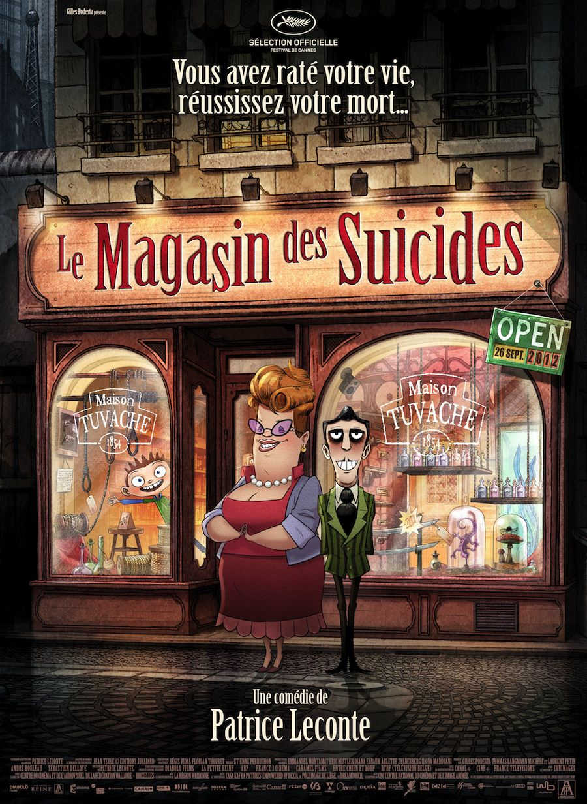
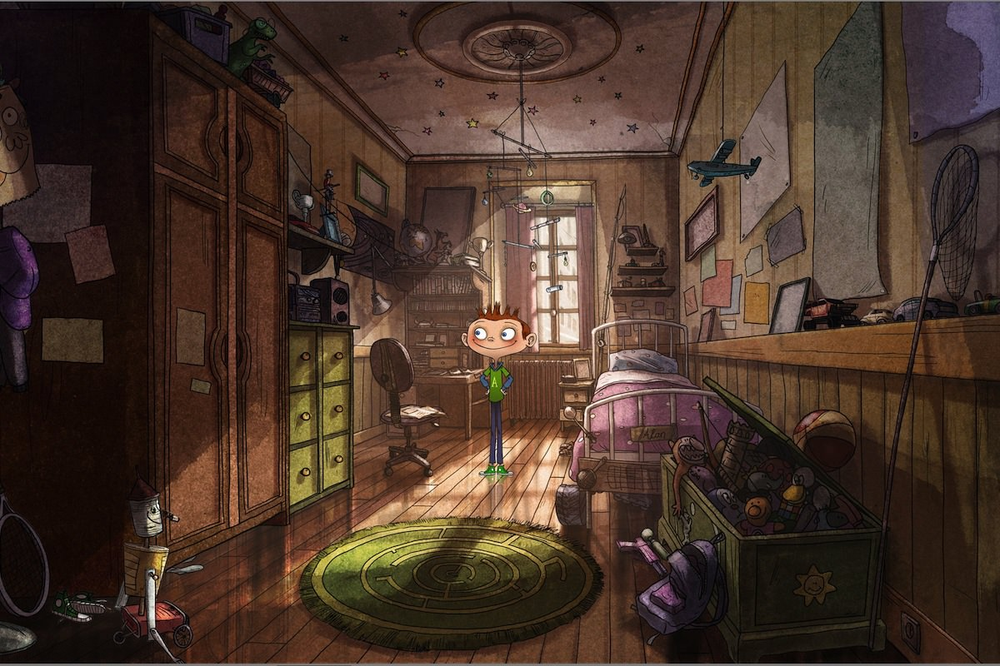

+++
type = "post"
titre = "<em>Le magasin des suicides</em>, Patrice Leconte"
title = "Le magasin des suicides, Patrice Leconte"
url = "/magasin-suicides-leconte"
date = "2012-09-26T23:19:11"
Lastmod = "2015-01-18T10:36:02"
cover = "le-magasin-des-suicides.jpg"
categorie = [ "À voir" ]
tag = [ "Animation", "Comédie musicale", "Enfance", "Famille", "Humour noir", "Mort", "Vite oublié" ]
createur = [ "Patrice Leconte" ]
annee = [ "2012" ]
weight = 2012
pays = [ "France" ]

+++

Le réalisateur des <em>Bronzés</em> qui sort un film d&rsquo;animation en 3D doté d&rsquo;un univers graphique original et d&rsquo;une histoire gonflée, le projet ne pouvait qu&rsquo;intriguer. <em>Le magasin des suicides</em> raconte l&rsquo;histoire de la famille Tuvache qui possède une prospère boutique destinée à tous ceux qui veulent en finir avec la vie. Une idée originale que Patrice Leconte traite sur le mode de la comédie musicale très noire… un pari risqué qui ne s&rsquo;avère finalement qu&rsquo;à moitié réussi. Si la description de l&rsquo;univers du film dans un premier temps fonctionne assez bien, la fin beaucoup trop conventionnelle déçoit

Chez les Tuvache, on aide tous ceux qui veulent en finir avec leur vie depuis 1854. Ce magasin des suicides propose une large gamme de produits pour mourir, sans risque de se rater : il y en a pour tous les goûts, du traditionnel nœud coulant au bout d&rsquo;une corde à tous les poisons imaginables, en passant par des morts plus originales à base de serpents ou d&rsquo;un sabre japonais. Dans la ville grise où le magasin est installé, il ne fait pas vraiment bon vivre et tout le monde est plus ou moins suicidaire, au moins triste et sérieux. Les suicides sont si courants que le gouvernement local les a interdits sur la voie publique et les punit d&rsquo;une amende… qui sera récupérée sur la famille en cas de suicide réussi bien évidemment. Autant dire qu&rsquo;il y a un marché pour les suicides et les affaires marchent très bien pour le couple Tuvache à la tête de la boutique. Leurs deux enfants sont de parfaits assistants, comprenez qu&rsquo;ils sont déprimés en permanence et n&rsquo;adorent rien de plus que de regarder les suicides des autres. Tout va bien pour eux, jusqu&rsquo;au jour où un troisième enfant arrive au monde. Problème, dès la naissance Alan semble… heureux ! Il sourit, joue et rigole tout le temps et ses parents doivent se rendre à l&rsquo;évidence : ce petit dernier n&rsquo;est bon à rien quand il s&rsquo;agit de vendre un suicide. Pis, le petit dernier se met en tête d&rsquo;arrêter les suicides, une véritable catastrophe.

« <em>Vous avez raté votre vie, réussissez votre mort…</em> » : la devise de la maison Tuvache résume bien l&rsquo;esprit du dernier film de Patrice Leconte. <em>Le magasin des suicides</em> est une comédie qui n&rsquo;est pas dépourvue d&rsquo;humour, mais d&rsquo;un humour particulièrement noir et macabre. Le film commence avec la description d&rsquo;un suicide : on suit un homme manifestement en bout de course essayer de se suicider en se faisant écraser par un camion, avant d&rsquo;être conduit au magasin, de choisir sa manière de mourir, puis rentrer chez lui boire le poison qu&rsquo;il a acheté. Le sujet n&rsquo;est pas très amusant, certes, mais Patrice Leconte parvient à trouver à ce moment le ton juste avec les deux parents vendeurs qui proposent, un large sourire aux lèvres, leur choix de poisons, de cordes et autres enclumes. Le décalage entre le suicide et la normalité de la boutique qui pourrait vendre n&rsquo;importe quels autres produits sur le même ton fait mouche et l&rsquo;ensemble est plaisant, passée la surprise de la comédie musicale. <em>Le magasin des suicides</em> fait en effet une large place à la musique et à des morceaux chantés où tous les personnages se mettent à pousser la chanson. C&rsquo;est un peu surprenant au départ, mais on s&rsquo;y fait vite et Patrice Leconte utilise encore ces chansons comme un levier comique, du moins au départ.

<em>Le magasin des suicides</em> commence plutôt bien, mais l&rsquo;arrivée d&rsquo;Alan chamboule le film autant que la famille. L&rsquo;idée est bonne : le petit dernier est considéré comme un raté parce qu&rsquo;il est joyeux et qu&rsquo;il sourit tout le temps. C&rsquo;est évidemment très mauvais pour le commerce et cette bonne humeur pourrait conduire des clients à changer d&rsquo;avis. Le garçon va jusqu&rsquo;à même couper légèrement les cordes pour qu&rsquo;elles se cassent et empêchent ainsi le suicide, une catastrophe pour une maison qui se vante de rembourser ses clients en cas de survie. Cette base devrait permettre à Patrice Leconte de construire une histoire solide, mais le cinéaste n&rsquo;en fait malheureusement pas grand-chose et il reste souvent au stade des idées à peine effleurées. Les personnages du film devraient être complexes et intéressants, mais il leur faudrait pour cela beaucoup plus de profondeur psychologique et quelques semaines après la sortie du très bon <a title="L’Étrange pouvoir de Norman, Sam Fell et Chris Butler" href="http://voiretmanger.fr/2012/08/25/etrange-pouvoir-norman-fell-butler/"><em>L’Étrange pouvoir de Norman</em></a>, <em>Le magasin des suicides</em> paraît bien décevant. Patrice Leconte a adapté le roman homonyme de Jean Teulé, mais il s&rsquo;est permis d&rsquo;en changer la fin ce qui est sans conteste sa plus grosse erreur. Si le début plait par son ton décalé et gonflé, la fin est au contraire beaucoup trop conventionnelle et cherche de manière un peu stupide à plaire au plus grand nombre. <em>Le magasin des suicides</em> ne peut de toute manière pas plaire aux enfants, il était dès lors inutile d&rsquo;essayer de les convaincre avec une fin guimauve qui tranche avec le reste du long-métrage.

L&rsquo;animation n&rsquo;est pas des plus modernes, mais ce n&rsquo;était pas l&rsquo;objectif. <em>Le magasin des suicides</em> évoque un peu le travail de Sylvain Chomet sur <em>Les Triplettes de Belleville</em> ou <a title="L’Illusionniste, Sylvain Chomet" href="http://voiretmanger.fr/2010/06/14/illusionniste-chomet/"><em>L’Illusionniste</em></a>, avec moins de recherche et un trait quand même plus grossier. On retrouve en tout cas cet esprit à l&rsquo;ancienne qui offre au dernier film de Patrice Leconte un côté intemporel plutôt réussi, même si l&rsquo;histoire semble plus se dérouler dans un futur proche qu&rsquo;au siècle dernier. L&rsquo;animation manque parfois de finesse, mais ce n&rsquo;est pas gênant ; la 3D est assez peu utilisée, comme souvent, au moins contribue-t-elle à noircir physiquement le film par l&rsquo;usage des lunettes. Dans l&rsquo;ensemble, <em>Le magasin des suicides</em> est plaisant à regarder et n&rsquo;a pas à rougir face à la concurrence en choisissant un style plus original, à la limite de la caricature. Patrice Leconte aurait peut-être gagné à aller plus loin encore de ce côté, mais ses personnages manquent là encore de profondeur. Les chansons et la bande originale composées par Étienne Perruchon manquent un peu d&rsquo;originalité, mais elles font l&rsquo;affaire et ajoutent encore une touche d&rsquo;originalité au film.

Après une ouverture vraiment réjouissante, car noire et gonflée, <em>Le magasin des suicides</em> s&rsquo;oriente peu à peu vers une histoire conventionnelle assez peu intéressante. Patrice Leconte parvient toutefois à offrir un film atypique où le suicide occupe le premier rôle, tout en faisant une comédie musicale pleine d&rsquo;un humour très noir qui manque souvent au cinéma français. Le tout reste ainsi intéressant, mais il faut réserver ce film aux plus grands. <em>Le magasin des suicides</em> a beau être un film d&rsquo;animation et il a beau avoir été présenté comme un film pour enfants à Cannes, c&rsquo;est une séance à réserver aux adolescents, au minimum…

<h3>Vous voulez <a href="http://voiretmanger.fr/soutien/">m&rsquo;aider</a> ?</h3>
<ul>
<li><a href="http://www.amazon.fr/gp/product/B00A4FVE3I/ref=as_li_ss_tl?ie=UTF8&amp;tag=leblogdenic07-21&amp;linkCode=as2&amp;camp=1642&amp;creative=19458&amp;creativeASIN=B00A4FVE3I">Acheter le film en Blu-ray sur Amazon</a></li>
<li><a href="http://www.amazon.fr/gp/product/B00A4FVDRK/ref=as_li_ss_tl?ie=UTF8&amp;tag=leblogdenic07-21&amp;linkCode=as2&amp;camp=1642&amp;creative=19458&amp;creativeASIN=B00A4FVDRK">Acheter le film en DVD sur Amazon</a></li>
<li><a href="https://itunes.apple.com/fr/movie/le-magasin-des-suicides/id590374669">Acheter ou louer le film sur l&rsquo;iTunes Store</a></li>
</ul>

