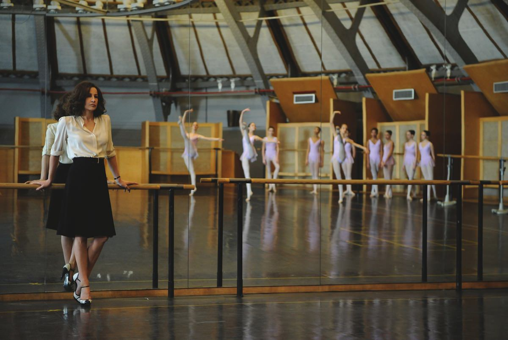

+++
type = "post"
titre = "<em>Main dans la main</em>, Valérie Donzelli"
title = "Main dans la main, Valérie Donzelli"
url = "/main-dans-la-main-donzelli"
date = "2012-11-28T00:02:43"
Lastmod = "2015-05-21T10:45:12"
cover = "main-dans-la-main-donzelli.jpg"
categorie = [ "À voir" ]
tag = [ "Amour", "Comédie romantique", "Danse", "Drame", "Fantastique", "Humour" ]
createur = [ "Valérie Donzelli" ]
acteur = [ "Jérémie Elkaïm", "Valérie Donzelli", "Valérie Lemercier" ]
annee = [ "2012" ]
weight = 2012
pays = [ "France" ]

+++

Pour son troisième film, Valérie Donzelli abandonne en apparence l’autobiographie pour raconter une histoire qui paraît plus impersonnelle, même si ce n’est qu’en apparence. <em>Main dans la main</em> est le récit étonnant d’un homme et d’une femme qui n’arrivent plus à se quitter et qui apprennent à s’aimer. Un scénario de comédie romantique, certes, mais on peut compter sur la jeune femme autodidacte pour ne rien faire comme les autres. De fait, son nouveau long-métrage est à nouveau marqué par une originalité formelle et une liberté grisante. Un très beau film, à ne surtout pas rater à sa sortie en salles.

Joachim vit chez sa sœur dans une petite ville de province. On sait que le jeune homme a eu quelques difficultés par le passé, mais on ne sait pas lesquelles. Depuis, il a retrouvé une stabilité grâce à sa sœur et à un petit boulot déniché dans une miroiterie. Un jour, il se rend à Paris pour prendre des mesures en vue de remplacer les miroirs de l’opéra Garnier. Perdu dans les nombreux couloirs du lieu, il finit par se retrouver dans une pièce rouge. Une femme y pleure, il lui tend un mouchoir et, sans explications, l’embrasse. Sans le savoir, il vient de se lier par une force surnaturelle à Hélène Marchal, professeur de danse renommée dans l’opéra. L’un comme l’autre ne peuvent plus se séparer, si l’un va à droite, l’autre aussi et ils font en permanence les mêmes gestes. Joachim et Hélène vont voir tous les spécialistes, mais aucun ne peut les aider et ils sont finalement contraints de vivre ensemble, pour le meilleur et pour le pire.

<a href="/2011/09/04/guerre-declaree-donzelli/" title="La Guerre est déclarée, Valérie Donzelli - À voir et à manger"><em>La Guerre est déclarée</em></a> évoquait un sujet grave — la maladie d’un enfant — qui ne prêtait guère à rire. Ce nouveau film commence au contraire comme une comédie légère et Valérie Donzelli nous fait rire de bon cœur avec ces deux personnages si différents. Joachim est un garçon très libre qui aime faire du skate dans la campagne, il est plutôt manuel et apprécie la compagnie de sa famille, des gens plutôt simples. Hélène au contraire est une vraie parisienne bourge et branchée, elle vit très confortablement, a un chauffeur et n’aime pas tellement sortir de son quotidien fait de classe et de luxe. Quand les deux êtres sont contraints de vivre ensemble, le clash est inévitable et <em>Main dans la main</em> le fait éclater dans la famille de Véro, la sœur de Joachim. Hélène et son amie inséparable découvrent un univers provincial qu’elles détestent et elles doivent supporter une ambiance qui leur est totalement étrangère. Par la suite, c’est Joachim au contraire qui doit s’adapter au mode de vie de Hélène et il y a forcément quelques difficultés quand il doit passer son temps à suivre les cours de danse au milieu des petits rats de l’opéra. Valérie Donzelli suit en apparence un scénario très convenu, un scénario déjà vu et revu dans des comédies françaises traditionnelles — on pense par exemple au récent <em>Mon pire cauchemar</em> –, mais <em>Main dans la main</em> ne tombe jamais dans la facilité. C’est d’abord la fraicheur de la cinéaste qui sauve l’ensemble, mais aussi un scénario qui s’avère vite plus riche que la simple caricature de classe.

Si <em>Main dans la main</em> commence comme une satire sociale efficace, certes, mais déjà vue mille fois, le long-métrage évolue en douceur vers autre chose. Dans un premier temps, les deux personnages principaux ne s’apprécient pas vraiment et ils ont plutôt envie de se donner mutuellement des baffes en permanence. La froideur et le snobisme de Hélène, la culture populaire et les manières un peu rustres de Joachim sont autant de motifs d’énervement, tandis que la proximité permanente crée immanquablement des tensions. Ce couple qui ne s’est pas choisi doit tout faire ensemble, y compris les choses les plus intimes, et ils doivent même dormir ensemble, dans le même lit. Le scénario écrit par Valérie Donzelli opère des changements avec finesse dans ce point de départ et Joachim finit par apprécier Hélène et réciproquement. On ne détaillera pas la fin de <em>Main dans la main</em>, ce n’est d’ailleurs pas la partie la plus intéressante, mais le film insuffle ainsi une émotion jamais simulée, toujours sincère et très belle qui prend un peu par surprise. On est loin de celle que pouvait susciter <em>La guerre est déclarée</em>, certes, mais Valérie Donzelli a su doser les deux éléments pour composer un long-métrage à la fois drôle — surtout dans sa première partie — et touchant — surtout dans la seconde. Dans les deux cas, la sincérité de la réalisatrice justifie tous les écarts qui pourraient paraître ridicules, voire risibles chez un autre cinéaste.

Depuis le très amateur <em>La Reine des Pommes</em>, la réalisation de Valérie Donzelli s’est professionnalisée, sans jamais effacer complètement l’amateurisme qui fait tout son charme. Plus encore que dans <em>La guerre est déclarée</em>, c’est son sens aigu du montage qui ressort dans <em>Main dans la main</em>. Dès la séquence d’ouverture, on est plongé dans un tourbillon d’images qui entremêle des histoires encore en parallèle, mais dont on sent qu’elles vont s’assembler. Loin des montages académiques que l’on voit trop souvent, les images filent ici avec un naturel déconcertant alors que la chronologie n’est jamais respectée. On passe d’un plan à l’autre, d’un personnage à l’autre aussi, avec une grande facilité et le spectateur n’est jamais perdu, preuve d’un dosage d’une belle précision. Au-delà du montage, le style de Valérie Donzelli est toujours affirmé dans sa liberté et ses expérimentations formelles. Ici, on est frappé par ces plans où le bruit numérique de l’image est tel qu’il compose des images pointillistes qui évoquent les tableaux de <a href="http://fr.wikipedia.org/wiki/Georges_Pierre_Seurat">Georges Seurat</a> ; une très belle idée qui donne au film un côté un peu intemporel. <em>Main dans la main</em> peut aussi compter sur son duo d’acteurs principaux, parfaits tout simplement. Valérie Lemercier n’a plus rien à prouver, elle se donne à nouveau totalement pour ce rôle pas facile d’une femme qui doit ouvrir peu à peu sa carapace. Jérémie Helkaïm de son côté est très juste et touchant sur son skate ou au milieu des jeunes danseuses de l’opéra.

Cela va finir par devenir une habitude : avec <em>Main dans la main</em>, Valérie Donzelli confirme son statut de réalisatrice qui compte dans le paysage cinématographique français. À part, elle continue de creuser son sillon avec un style qui tranche par sa liberté, mais aussi une infaillible sincérité qui rend ses films si touchants. <em>Main dans la main</em> est une comédie très drôle au départ qui termine en comédie romantique émouvante. C’est de toute manière un excellent film, à ne surtout pas rater lors de sa sortie.

<h3>Vous voulez m&rsquo;aider ?</h3>
<ul>
<li><a href="http://www.amazon.fr/gp/product/B00B4DI9IM/ref=as_li_ss_tl?ie=UTF8&tag=leblogdenic07-21&linkCode=as2&camp=1642&creative=19458&creativeASIN=B00B4DI9IM">Acheter le film en Blu-Ray sur Amazon</a></li>
<li><a href="http://www.amazon.fr/gp/product/B00B4DI9KA/ref=as_li_ss_tl?ie=UTF8&tag=leblogdenic07-21&linkCode=as2&camp=1642&creative=19458&creativeASIN=B00B4DI9KA">Acheter le film en DVD sur Amazon</a></li>
<li><a href="https://itunes.apple.com/fr/movie/main-dans-la-main/id611197381">Acheter ou louer le film sur l&rsquo;iTunes Store</a></li>
</ul>

