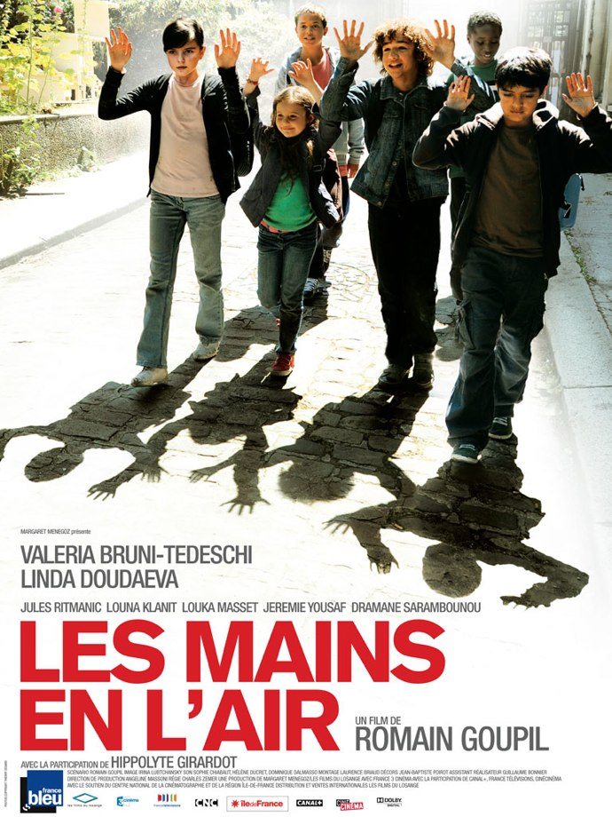
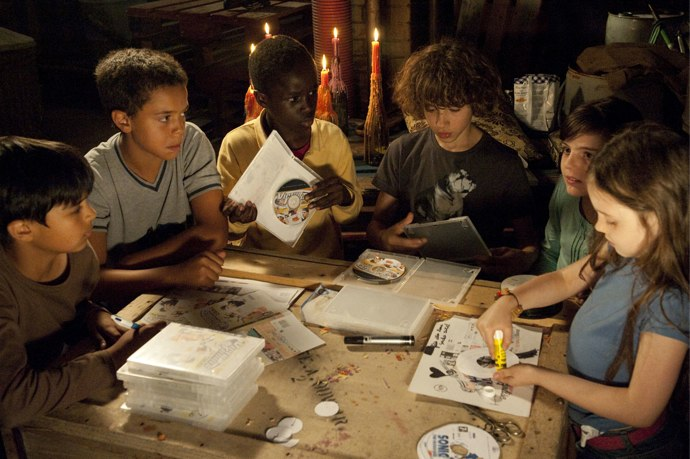
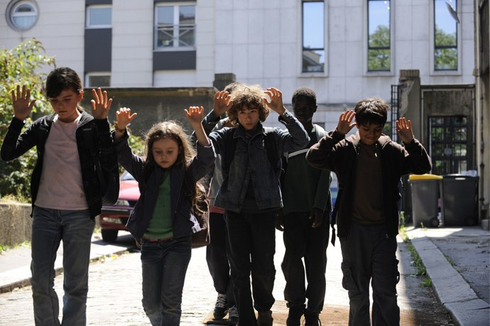

+++
type = "post"
titre = "Les mains en l&rsquo;air, Romain Goupil"
title = "Les mains en l'air, Romain Goupil"
url = "/mains-en-air-goupil"
date = "2010-06-10T23:43:16"
Lastmod = "2010-06-10T23:47:36"
cover = "les-mains-en-lair.jpg"
categorie = [ "À voir" ]
tag = [ "Drame", "Famille", "Politique", "Société" ]
createur = [ "Romain Goupil" ]
acteur = [ "Valeria Bruni Tedeschi" ]
annee = [ "2010" ]
weight = 2010
pays = [ "France" ]

+++

Un film dénonçant les arrestations et reports à la frontière d&rsquo;enfants en situation irrégulière ? Sujet casse-gueule au possible, casse-geullissime même si j&rsquo;osais, avec en fond le risque d&rsquo;un traitement larmoyant à la <em>Rafle</em>. Un risque évité en majeure partie par Romain Goupil, cinéaste malin qui place presque totalement son film à hauteur des enfants. Une bonne idée qui explique que <em>Les mains en l&rsquo;air</em> est une agréable surprise.

<a href="http://www.allocine.fr/film/fichefilm_gen_cfilm=170825.html" target="_blank">

</a>

<em>Les mains en l&rsquo;air</em> commence de manière très étrange comme un film de science-fiction, dans le futur. On est en 2067 et Minala, alors femme âgée, se souvient de ses dix ans. C&rsquo;était en 2008 ou 2009 et elle ne sait plus très bien qui était président de la République à ce moment-là, mais par contre elle se souvient des écoles, drôles d&rsquo;endroits où les jeunes du même âge étaient rassemblés pour tenter d&rsquo;apprendre en commun. Heureusement, le film plonge rapidement dans la fin des années 2000, car cette béquille scénaristique n&rsquo;est pas franchement la meilleure idée du film. En 2009 donc, on suit la jeune Minala et sa bande, soit six jeunes en tout dont cinq en CM2 et une plus jeune. Ils s&rsquo;entendent comme larron en foire et se sont créé un véritable trafic de DVD et jeux craqués. On les voit ainsi, au début du film, coller sur les CD et DVD des étiquettes et mettre le tout dans un bel emballage pour gagner un peu de sous. Ils s&rsquo;amusent bien dans leur planque aménagée dans un recoin d&rsquo;un garage, derrière un magasin où ils viennent se servir en boissons et bonbons.

Mais cette image idyllique de l&rsquo;enfance pleine d&rsquo;insouciance est interrompue brutalement avec l&rsquo;irruption de la réalité. Réalité des expulsions de familles en situation irrégulière avec des policiers zélés et qui, motivés par l&rsquo;appel des chiffres, n&rsquo;hésitent pas à arrêter des enfants dans une école primaire. <em>Les Mains en l&rsquo;air</em> se déroulant dans le XVIIIe arrondissement parisien, tout lien avec la réalité n&rsquo;est pas forcément fortuit et on peut dire sans prendre trop de risques que le film s&rsquo;inspire de faits réels. Dans la bande, Minala est une jeune Tchétchène sans papier qui risque, elle ainsi que sa famille, une expulsion. Pour la protéger, la mère de Blaise, son amoureux, la recueille pour la protéger. Quand la menace devient, croient-ils, trop importante, les enfants décident de se réfugier dans leur cache et restent introuvables et portés disparus pendant quatre jours.

On l&rsquo;a dit, la grande force du film de Romain Goupil est de se positionner plus près du sol, au niveau des enfants. <em>Les mains en l&rsquo;air</em> met de côté le monde des adultes, jugé en permanence menaçant et seule la mère de Blaise a droit à une véritable place dans le film. Les autres sont distants, souvent même absents du cadre rapproché et centré sur les têtes des enfants, quand ils ne sont pas violents à l&rsquo;image de policiers qui font subir un interrogatoire en bonne et due forme à un jeune d&rsquo;une douzaine d&rsquo;années. Le scénario choisit de ne jamais vraiment s&rsquo;éloigner de leur esprit, de leur point de vue et de leur logique. Ces enfants ne saisissent pas forcément des implications politiques qui les dépassent forcément, mais ils sont fort heureusement loin d&rsquo;être bêtes et font preuve d&rsquo;une maturité étonnante. À cet égard, on peut saluer un film qui n&rsquo;hésite pas à montrer des enfants sans les abrutir totalement, des enfants par certains aspects plus adultes que des adultes incapables de s&rsquo;écouter lors des débats qui suivent les arrestations. Ce traitement renforce considérablement la crédibilité du film, même si on comprend quand même mal comment 5 enfants pourraient disparaître pendant quatre jours tout en se cachant à quelques pas de leur école et de leur domicile. Mais peu importe, l&rsquo;essentiel est là : <em>Les mains en l&rsquo;air</em> présente des enfants totalement justes et vrais.

Ce point de vue plus près du sol n&rsquo;est malheureusement pas totalement tenu par <em>Les mains en l&rsquo;air</em> qui se laisse aller à plusieurs reprises à un retour au point de vue adulte. L&rsquo;idée de placer le film en 2067 n&rsquo;est pas franchement bonne, on l&rsquo;a déjà évoqué, d&rsquo;autant que les moyens utilisés pour signaler le futur (la caméra se pose sur une maison d&rsquo;architecte censée faire futuriste) sont faibles. Je craignais le pire à ce moment de la projection, mais heureusement le film plonge vite dans l&rsquo;enfance. Dommage que Romain Goupil ait choisi de rappeler cet ancrage futuriste à plusieurs reprises, ne serait-ce que par l&rsquo;intervention orale de la Minala âgée. Le réalisateur n&rsquo;a semble-t-il pas fait suffisamment confiance à ses spectateurs et alourdit ainsi le film de détails le plus souvent inutiles (à quoi bon préciser qu&rsquo;ils ont levé les mains instinctivement, sans se concerter avant ?). On sent la colère de Romain Goupil face à une situation effectivement intolérable, mais il aurait dû s&rsquo;en tenir à son point de vue original et salvateur puisque tous les passages de débat sont aussi légers qu&rsquo;un marteau-piqueur et sonnent totalement faux, comme plaqués sur un film par ailleurs plutôt léger. Dans ce contexte de dénonciation, le choix de Valeria Bruni Tedeschi — belle-sœur de note président adoré, faut-il le préciser — prend une résonance particulière. Certes, ce n&rsquo;est pas de sa faute si sa sœur est devenue première Dame de France, mais c&rsquo;est le cas et la voir jouer une mère résistant contre la politique du gouvernement donne un film côté revanchard un peu puéril vraiment étrange. On ne choisit pas sa famille, certes, mais on choisit ses rôles et le film profite évidemment de sa présence : quoi de mieux pour créer le buzz ramdam ?

<em>Les mains en l&rsquo;air</em> est indéniablement une bonne surprise. Romain Goupil a réussi à éviter la majeure partie des innombrables pièges d&rsquo;un sujet aussi sensible en se plaçant au niveau des enfants. Dommage cependant que ce point de vue n&rsquo;ait pas été tenu de bout en bout et que le réalisateur ait cédé à la facilité en introduisant des bribes de débat sur la question de l&rsquo;immigration. Cela dit, encore une fois, je craignais tellement le pire avec un tel sujet que la surprise n&rsquo;en est que plus grande…

Bon accueil général pour le film manifestement. Du côté des blogs, c&rsquo;est un peu le désert, mais notons la critique positive de <a href="http://www.surlarouteducinema.com/archive/2010/06/06/les-mains-en-l-air-de-romain-goupil.html">Pascale</a>. Critikat est partagé, faisant de <em>Les mains en l&rsquo;air</em> son film de la semaine <a href="http://www.critikat.com/Les-Mains-en-l-air.html">d&rsquo;un côté</a>, mais regrettant <a href="http://www.critikat.com/Les-Mains-en-l-air.html?artsuite=1">d&rsquo;un autre côté</a> un film manichéen et caricatural.

