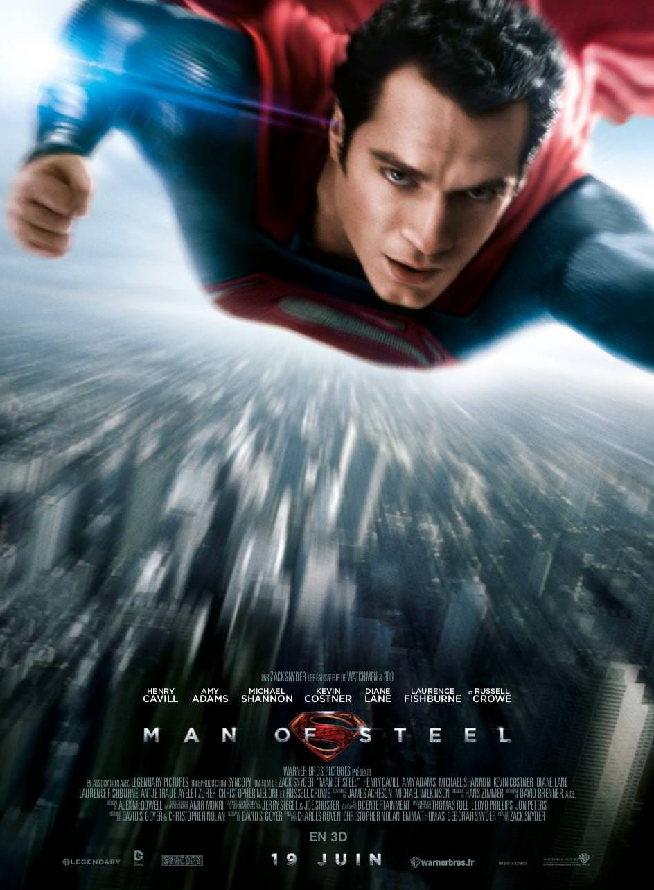
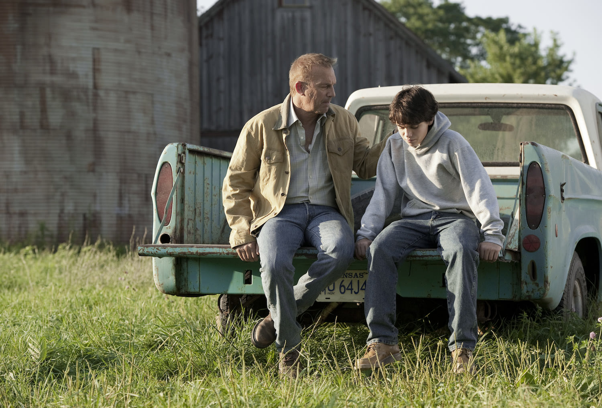
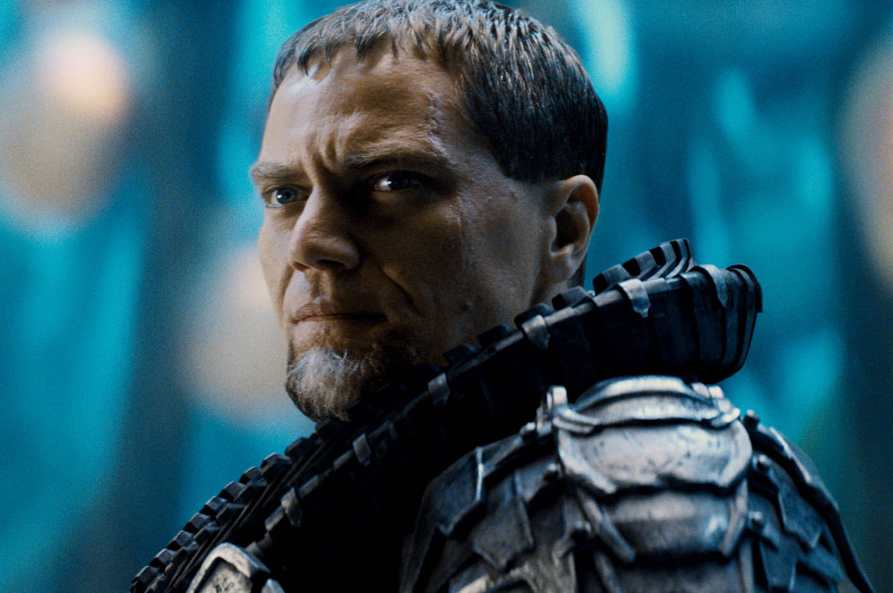

+++
type = "post"
titre = "<em>Man of Steel</em>, Zack Snyder"
title = "Man of Steel, Zack Snyder"
url = "/man-of-steel-snyder"
date = "2013-06-19T01:16:10"
Lastmod = "2013-10-31T08:34:00"
cover = "man-of-steel-henry-cavill-snyder.jpg"
categorie = [ "À voir" ]
tag = [ "Action", "Adaptation littéraire", "Blockbuster", "Comics", "Fantastique", "Science-Fiction", "Sorties du mois", "Superhéros" ]
createur = [ "Zack Snyder" ]
acteur = [ "Amy Adams", "Diane Lane", "Henry Cavill", "Kevin Costner", "Michael Shannon", "Russel Crowe" ]
annee = [ "2013" ]
weight = 2013
pays = [ "États-Unis" ]

+++

Les superhéros n’ont jamais été aussi populaires au cinéma avec une grande tendance depuis quelques années : le <em>reboot</em>. Après le <a href="/saga/batman-christopher-nolan/">Batman revu</a> par Christopher Nolan, après le <a href="/amazing-spider-man-webb/" title="The Amazing Spider-Man, Marc Webb">nouveau Spider-Man</a> de Marc Webb, c’est au tour de Superman de retrouver une seconde jeunesse. Il faut dire que le personnage mythique en avait bien besoin, la saga originale s’étant interrompue au cœur des années 2000 avec bien peu de succès. Pour retrouver un personnage digne d’intérêt, Zack Snyder a pris les commandes, un choix assez surprenant, même si le cinéaste s’est déjà frotté aux super-héros avec <a href="/watchmen-zack-snyder/" title="Watchmen, Zack Snyder"><em>Watchmen</em></a>. Plus étonnant encore, Christopher Nolan n’est pas loin, puisqu’il a produit et écrit <em>Man of Steel</em>. Deux cinéastes très différents qui travaillent sur un gros film d’action, cela donne un cocktail explosif : si l’on retrouve les qualités habituelles des scénarios de l’un, le goût pour le spectaculaire de l’autre n’est pas en reste. Au total, <em>Man of Steel</em> est un blockbuster très spectaculaire, qui en fait parfois trop, mais qui n’est pas stupide. Un bon équilibre et un nouveau départ plutôt réussi pour Superman. 

Comme tout bon reboot, <em>Man of Steel</em> recommence en partant du début. En l’occurrence, le film réalisé par Zack Snyder ouvre sur la planète Krypton qui est en train de connaître ses derniers instants. On apprend rapidement que son noyau est devenu instable suite à une mauvaise utilisation et l’histoire ouvre alors que le général Zod tente un coup d’État pour renverser un pouvoir qui ne réagit pas face à la menace. Face à lui, un scientifique décide de tenter le tout pour le tout et il envoie son fils qui vient juste de naître sur la première planète habitée qui n’est autre que la Terre. Quelques années passent et le fils de Krypton renommé Clark par ses parents adoptifs découvre ses super-pouvoirs qu’il vit comme des inconvénients majeurs, plus que comme un avantage. Il est très puissant, il ne peut pas être blessé et ses yeux peuvent envoyer des lasers très puissants : pour un enfant de cinq ou six ans, c’est difficile à supporter. <em>Man of Steel</em> montre quelques moments clés, comme il se doit : le bus sauvé, les crises d’angoisse à l’école et, plus tard, les expériences extrêmes à l’autre bout du monde. Zack Snyder passe d’une étape à l’autre pour mieux montrer la construction du superhéros qui est quand même le thème le plus intéressant d’une telle œuvre. Alors que Superman est parfois représenté comme un personnage assez monolithique et donc moins intéressant que d’autres superhéros plus torturés, <em>Man of Steel</em> réussit très bien à rendre toute sa complexité. Se construire comme être non seulement différent, mais en plus venu d’une autre planète pour sauver celle d’adoption, n’est pas facile et le film est très bon sur ces questions. Les deux jeunes acteurs qui interprètent le Clark jeune sont convaincants et leur relation avec le père est très belle. On peut d&rsquo;ailleurs saluer tout le casting qui, une fois n&rsquo;est pas coutume, est très bon, jusqu&rsquo;au héros interprété par Henry Cavill et au méchant qui prend vie grâce à un Michael Shannon que l&rsquo;on n&rsquo;attendait pas sur un tel projet.

Plutôt que d’adopter un scénario strictement linéaire et chronologique, <em>Man of Steel</em> parie sur l’intelligence du spectateur en mêlant les époques. C’est sans doute sur ce point que l’apport de Christopher Nolan est sensible : alors qu’on commence sur Krypton, on passe ensuite directement et sans autre cérémonie une trentaine d’années après, avec un Clark devenu adulte. Le long-métrage se construit ensuite sur des allers et retours entre le présent de l’histoire et le passé de celui qui ne s’appelle pas encore Superman. Sur le mode du Flashback, mais sans les codes qui alourdissent trop souvent les films, Zack Snyder reconstitue le passé compliqué de son personnage et surtout toutes les étapes qui mènent à la découverte de la vérité, puis à son acceptation. Ce choix plutôt audacieux pour un film de cette catégorie — et ce, d’autant plus qu’il n’y a aucun carton pour se repérer dans le temps — permet aux spectateurs qui connaîtraient déjà bien l’histoire de Superman de la revivre sans sentiment de redite. Les autres retrouveront avec <em>Man of Steel</em> tous les éléments importants de la formation du superhéros, avec une facilité à les suivre qui est assez déconcertante. À l’image d’un <a href="/inception-nolan/" title="Inception, Christopher Nolan"><em>Inception</em></a>, ce blockbuster ambitieux et ample sait rester toujours parfaitement clair, alors même qu’il raconte une histoire relativement complexe. On n’est jamais perdus, mais le scénario ne nous prend pas pour des andouilles non plus ce qui, <em>in fine</em>, oblige à rester concentré. 

Si l’influence de Christopher Nolan est sensible à l’écran, Zack Snyder n’a pas disparu pour autant. Au contraire même, <em>Man of Steel</em> apparait dès les premiers plans comme un film de ce réalisateur. En effet, la réalisation outrancière qui est sa marque de fabrique depuis <em>300</em> est ici encore au programme. S’il s’est calmé sur l’usage des filtres — la photographie reste malgré tout typée, avec une tendance à baisser la saturation de l’image —, le cinéaste n’a pas abandonné ses habitudes et il se venge sur l’action. De fait, <em>Man of Steel</em> est très impressionnant, c’est même le blockbuster qui en met le plus plein la vue depuis longtemps. Dès les premières images sur Krypton, le ton est donné : Zack Snyder filme des scènes qui tapent fort, les explosions et les tirs variés se font bien entendre, bref on est soufflé. Et ce n’est pas fini : pendant toute la durée du film (2h20), l’action n’est jamais loin et elle se conclut avec une scène d’anthologie qui voit la destruction de quasiment tout New York. Saluons encore une fois le talent du cinéaste qui offre des combats de haute voltige, notamment dans les airs, mais cette surenchère peut finir par lasser. Le long-métrage aurait sans doute gagné à être plus court sur la fin et <em>Man of Steel</em> qui avait réussi à rester léger sur les explications devient brutalement plus lourd, tandis que la fin — que l’on ne révélera pas, naturellement — s’avère assez ridicule et un peu trop simple au regard de tout ce qui a précédé. Au rang des critiques, la manie qu’a Zack Snyder de faire bouger sa caméra, même lorsqu’il s’agit d’une scène très calme, est pénible. Des défauts donc, mais qui ne parviennent pas à entacher un ensemble globalement très satisfaisant.

<em>Man of Steel</em> remplit son contrat : Superman est de retour et ce superhéros mythique bénéficie enfin d’un nouveau départ digne de lui. Devant les caméras de Zack Snyder, Henry Cavill est un superhéros convaincant et on apprécie les thèmes brassés autour de l’acceptation de la différence, d’un côté comme de l’autre. <em>Man of Steel</em> est d’abord un blockbuster et sur ce plan, on est servi : pendant près de 2h30, le cinéaste s’en donne à cœur joie pour détruire ses décors. S’il s’amuse plus que nous manifestement, il faut quand même noter que Zack Snyder s’en sort admirablement bien pour filmer des scènes d’action complexes. Il en fait trop, c’est indéniable, mais on lui pardonne, tant le blockbuster est d’une efficacité redoutable. On ne peut s’empêcher de se demander ce qu’aurait fait Christopher Nolan s’il s’était entièrement chargé du projet, mais en attendant ce <em>Man of Steel</em> mérite d’être vu !

<h3>Vous voulez m&rsquo;aider ?<a href="#footnote_0_9763" id="identifier_0_9763" class="footnote-link footnote-identifier-link" title="&Agrave; propos de la publicit&eacute;&hellip;">1</a></h3>
<ul>
<li><a href="http://www.amazon.fr/gp/product/B00DG8Y22U/ref=as_li_ss_tl?ie=UTF8&tag=leblogdenic07-21&linkCode=as2&camp=1642&creative=19458&creativeASIN=B00DG8Y22U">Acheter le film en Blu-Ray et DVD sur Amazon</a></li>
<li><a href="http://www.amazon.fr/gp/product/B00DG8Y10I/ref=as_li_ss_tl?ie=UTF8&tag=leblogdenic07-21&linkCode=as2&camp=1642&creative=19458&creativeASIN=B00DG8Y10I">Acheter le film en DVD sur Amazon</a></li>
<li><a href="https://itunes.apple.com/fr/movie/man-of-steel-2013/id705992412">Acheter ou louer le film sur l&rsquo;iTunes Store</a></li>
</ul>

<ol class="footnotes"><li id="footnote_0_9763" class="footnote"><a href="/soutien/">À propos de la publicité…</a> [<a href="#identifier_0_9763" class="footnote-link footnote-back-link">&#8617;</a>]</li></ol>
