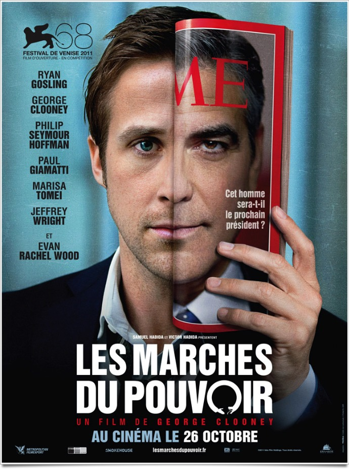
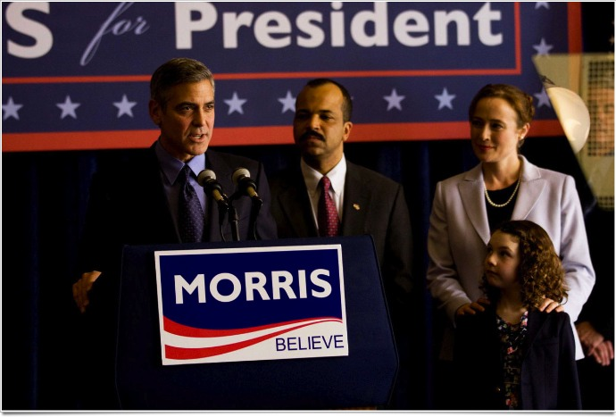
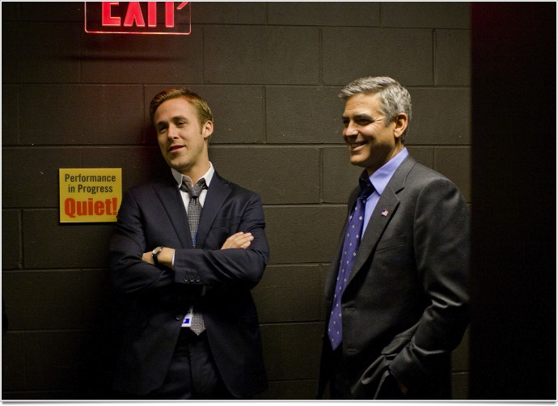

+++
type = "post"
titre = "<em>Les Marches du Pouvoir</em>, George Clooney"
title = "Les Marches du Pouvoir, George Clooney"
url = "/marches-pouvoir-clooney"
date = "2011-10-25T00:24:51"
Lastmod = "2014-09-20T21:32:38"
cover = "les-marches-du-pouvoir-gosling-clooney.jpg"
categorie = [ "À voir" ]
tag = [ "Apprentissage", "Politique", "Société" ]
createur = [ "George Clooney" ]
acteur = [ "George Clooney", "Jeffrey Wright", "Paul Giamatti", "Philip Seymour Hoffman", "Ryan Gosling" ]
annee = [ "2011" ]
weight = 2011
pays = [ "États-Unis" ]
original = "The Ides of March"

+++

Avec <em>Les Marches du Pouvoir</em>, George Clooney confirme qu&rsquo;il est plus que le bel et fameux acteur du &laquo;&nbsp;<em>What Else ?</em>&nbsp;&raquo; : c&rsquo;est aussi un excellent réalisateur. Ses précédents films empruntaient toujours un contexte éloigné par le temps, les années 1950 pour <em>Good Night and Good Luck</em> ou 1930 pour <em>Jeux de Dupes</em>, le cinéaste a choisi cette fois un cadre bien contemporain, quoiqu&rsquo;indéterminé. George Clooney a mis en scène une campagne présidentielle, ou plutôt les primaires démocrates qui précèdent la campagne. L&rsquo;occasion d&rsquo;une lutte sans merci entre idéalistes et cyniques… un film intense et réussi, sur le fond comme sur la forme.

Mike Morris est l&rsquo;un des deux candidats démocrates à s&rsquo;opposer au cours de la traditionnelle primaire qui précède toute élection présidentielle aux États-Unis. Le film choisit des candidats fictifs et il n&rsquo;est pas précisément daté, mais ce candidat pourrait être un Barack Obama blanc. La campagne va bon train alors que l&rsquo;Ohio doit voter : de ces résultats locaux pourraient dépendre la victoire du candidat démocrate et même celle des élections présidentielles. Autant dire que l&rsquo;enjeu est immense et dans un camp comme dans l&rsquo;autre, on fourbit ses armes. Dans l&rsquo;équipe qui travaille derrière Morris, le film s&rsquo;intéresse surtout à Stephen. Le jeune homme s&rsquo;occupe de la direction à donner à la campagne sous les ordres de Paul, responsable de la campagne de Morris. C&rsquo;est un homme ambitieux et qui plait terriblement aux médias : il sait leur parler, il sait amadouer les journalistes et il s&rsquo;avère excellent pour faire vivre son candidat sur le plan médiatique. Une brillante carrière l&rsquo;attend, mais c&rsquo;est alors que le responsable du candidat opposé à Morris l&rsquo;appelle pour le rencontrer…

<em>Les Marches du Pouvoir</em> plonge le spectateur dans un monde souvent mal connu : derrière les caméras, derrière les discours et les sourires du candidat, il y a une armée d&rsquo;hommes et de femmes qui dirigent une campagne. Plus encore qu&rsquo;en France, les campagnes politiques aux États-Unis coûtent énormément d&rsquo;argent et bénéficient ainsi de moyens considérables. Alors qu&rsquo;il ne s&rsquo;agit encore que de la primaire d&rsquo;un parti, chaque candidat a ses locaux bourdonnants de plusieurs dizaines de collaborateurs. Certains écrivent les discours, d&rsquo;autres contactent la presse, certains organisent les évènements à venir, convoquent ceux qui vont voter quand d&rsquo;autres encore parlent stratégie. Toute une armée qui s&rsquo;active dans un seul but : faire gagner son candidat. George Clooney connaît manifestement bien ce milieu, on sait qu&rsquo;il s&rsquo;implique lui-même sur le plan politique et on imagine qu&rsquo;il a rencontré de nombreux candidats. Toujours est-il que son portrait de ce milieu se veut très réaliste : loin de l&rsquo;idéaliser, il le présente sous tous ses aspects, les plus positifs comme les plus noirs. On y voit les journalistes ruser pour avoir des informations confidentielles, les politiques ruser pour faire passer les informations qu&rsquo;ils veulent : les jeux de pouvoir sont sans fin, à l&rsquo;extérieur comme à l&rsquo;intérieur.

C&rsquo;est justement l&rsquo;intérieur qui intéresse George Clooney. <em>Les Marches du Pouvoir</em> s&rsquo;intéresse tout particulièrement à Stephen, un jeune homme qui a encore plein d&rsquo;idéaux quand le film commence. Même s&rsquo;il se défend d&rsquo;être naïf, on le sent admiratif de Mike Morris, en accord avec ses idées et persuadé qu&rsquo;en se battant pour la bonne cause, ils parviendront toujours à s&rsquo;en sortir. <em>Les Marches du Pouvoir</em> est aussi le récit de son apprentissage de la dure réalité : Stephen commence naïf, il finira cynique après avoir traversé plusieurs épreuves. Évitons d&rsquo;en dévoiler trop sur une intrigue qui ménage malgré tout quelques surprises, mais le scénario s&rsquo;avère vraiment prenant et c&rsquo;est peut-être la plus grande réussite du film. George Clooney a choisi un format resserré (1h30) qui donne à son film un côté intense inattendu. Les tractations politiques, les stratégies détournées sont souvent très complexes, mais <em>Les Marches du Pouvoir</em> parvient à les rendre intelligibles. Les spectateurs apprennent en même temps que les héros du film la dure réalité d&rsquo;une campagne politique et le résultat est saisissant. Quand Stephen fait la morale à un personnage en lui affirmant que le monde politique ne tolère pas l&rsquo;erreur et s&rsquo;avère alors impardonnable, il ne sait pas encore que ce principe va se retourner contre lui peu après. Cet univers est, de fait, vraiment implacable et cette plongée offerte par les caméras de George Clooney est instructive…

Sans doute est-ce lié à son statut d&rsquo;acteur, mais George Clooney a le don pour bien s&rsquo;entourer et surtout bien diriger ses acteurs. <em>Les Marches du Pouvoir</em> est d&rsquo;abord un film d&rsquo;acteurs et de dialogues et son origine théâtrale n&rsquo;a pas été oubliée par le cinéaste. Ils sont tous excellents : Ryan Gosling, après une performance sans faille dans <em><a href="/2011/10/04/drive-winding-refn/">Drive</a></em> compose ici un jeune politicien parfait ; Philip Seymour Hoffman et Paul Giamatti sont deux excellents politiciens cyniques et George Clooney lui-même est le candidat idéal. Il serait faux néanmoins de résumer le quatrième film de George Clooney à ses acteurs : l&rsquo;acteur est aussi un véritable réalisateur qui conduit ses caméras de manière plutôt classique, mais toujours avisée. Il a souvent l&rsquo;habitude de faire commencer le son de la scène suivante avant même qu&rsquo;elle ne soit apparue à l&rsquo;écran, ce qui contribue à ce sentiment d&rsquo;urgence et à cette intensité qui vont si bien à <em>Les Marches du Pouvoir</em>

<em>Les Marches du Pouvoir</em> est une réussite indéniable pour George Clooney. On sait l&rsquo;homme politique impliqué aux États-Unis et ce film lui permet aussi, l&rsquo;air de rien, de faire passer ses idées (plus aucune voiture à essence produite aux États-Unis d&rsquo;ici dix ans). Son film n&rsquo;est pas tant un combat politique néanmoins qu&rsquo;une plongée bluffante dans l&rsquo;univers de la politique. Ces hommes et ses femmes qui se battent pour un candidat donnent tout pour cette lutte qui les détruit finalement complètement. On ne ressort pas indemne d&rsquo;une campagne, mais cela ne vaut pas que pour le candidat… Très beau film, à ne pas rater.

<h3>Vous voulez <a href="/soutien/">m&rsquo;aider</a> ?</h3>
<ul>
<li><a href="http://www.amazon.fr/gp/product/B006OVPP2W/ref=as_li_ss_tl?ie=UTF8&amp;tag=leblogdenic07-21&amp;linkCode=as2&amp;camp=1642&amp;creative=19458&amp;creativeASIN=B006OVPP2W">Acheter le film en Blu-ray sur Amazon</a></li>
<li><a href="http://www.amazon.fr/gp/product/B006OVPPIG/ref=as_li_ss_tl?ie=UTF8&amp;tag=leblogdenic07-21&amp;linkCode=as2&amp;camp=1642&amp;creative=19458&amp;creativeASIN=B006OVPPIG">Acheter le film en DVD sur Amazon</a></li>
<li><a href="https://itunes.apple.com/fr/movie/les-marches-du-pouvoir/id502803430">Acheter ou louer le film sur l&rsquo;iTunes Store</a></li>
</ul>

