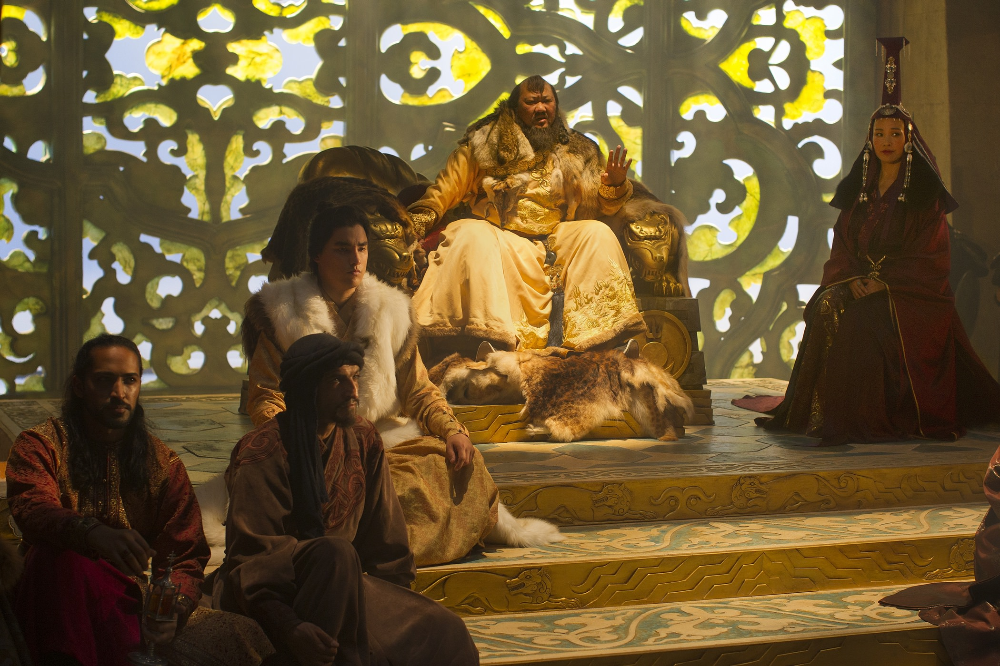
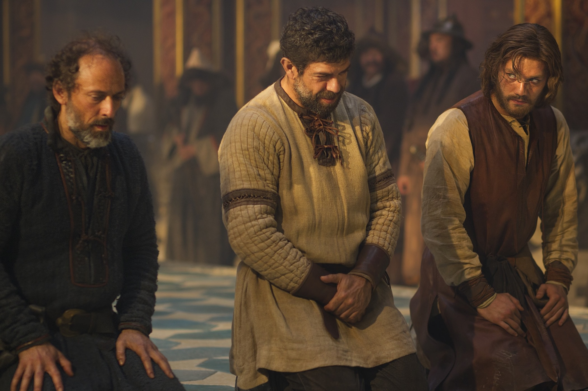
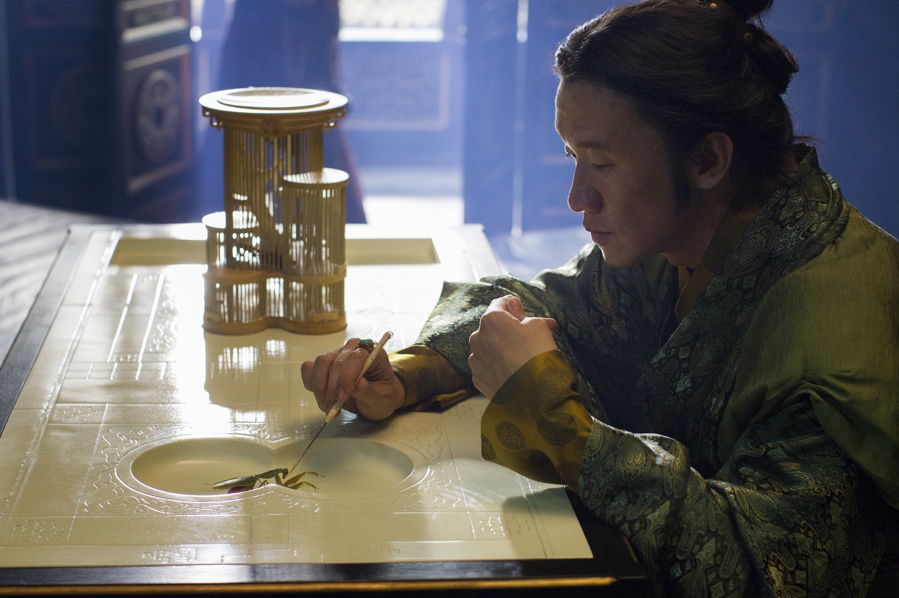

+++
type = "post"
titre = "<em>Marco Polo</em>, John Fusco (Netflix)"
title = "Marco Polo, John Fusco (Netflix)"
url = "/marco-polo-fusco-netflix"
date = "2015-01-06T22:22:01"
Lastmod = "2015-01-19T11:14:43"
cover = "marco-polo-fusco-netflix.jpg"
categorie = [ "À voir" ]
tag = [ "Action", "Biopic", "Drame", "Famille", "Guerre", "Histoire", "Histoire vraie", "Série", "Société" ]
createur = [ "John Fusco", "Netflix" ]
acteur = [ "Amr Waked", "Benedict Wong", "Chin Han", "Joan Chen", "Lorenzo Richelmy", "Rick Yune" ]
annee = [ "2014" ]
weight = 2014
pays = [ "États-Unis" ]

+++

Netflix n&rsquo;a pas eu besoin de beaucoup de temps pour se faire un nom dans l&rsquo;univers de séries. <a href="http://voiretmanger.fr/house-of-cards-willimon-netflix/" title="House of Cards, Beau Willimon (Netflix)"><em>House of Cards</em></a> et <a href="http://voiretmanger.fr/orange-is-the-new-black-kohan-netflix/" title="Orange is the New Black, Jenji Kohan (Netflix)"><em>Orange is the New Black</em></a> : deux noms qui ont suffi à faire du service de streaming vidéo par abonnement un acteur qui compte dans ce secteur. Autant dire que l&rsquo;annonce de nouvelles séries commandées par Netflix est désormais surveillée de près et que l&rsquo;on attendait avec impatience leur nouvelle production. Passant de la politique contemporaine et des prisons pour femme à une série historique, <em>Marco Polo</em> était un projet pour le moins intriguant. Filmé en partie au Kazakhstan, le projet était en outre ambitieux et on en attendait beaucoup… mais le résultat est un petit peu décevant. Certes, la qualité technique est indéniablement au rendez-vous, mais la série créée par John Fusco peine à passionner, du moins pendant sa première saison. Tout sonne un petit faux dans cette Asie médiévale où tout le monde parle parfaitement anglais et on ne se passionne pas vraiment pour les personnages. <em>Marco Polo</em> se regarde sans déplaisir, sans passion non plus.

Comme on pouvait le deviner, <em>Marco Polo</em> raconte la vie du célèbre marchand et explorateur du même nom, ou du moins s&rsquo;en inspire comme point de départ. On <a href="https://fr.wikipedia.org/wiki/Marco_Polo#Biographie">sait</a> que le vrai Marco Polo a accompagné son père et son oncle lors d&rsquo;un voyage sur la route de la soie, on sait aussi qu&rsquo;il a été reçu à Cambaluc<a href="#fn-12784-1" rel="footnote">1</a>, la cour mongole de l&rsquo;empereur Kubilai Khan, petit-fils du fameux Gengis Khan. Son histoire devient ensuite beaucoup plus floue, mais on sait qu&rsquo;il se retrouve au service de l&rsquo;empereur. John Fusco a profité des trous dans la biographie officielle de Marco Polo pour imaginer son histoire. La première saison de <em>Marco Polo</em> imagine ainsi pourquoi ce Vénitien parmi d&rsquo;autres est entré au service de l&rsquo;empereur mongol du moment et même si ce n&rsquo;est pas la réalité historique, le scénario envisage une hypothèse crédible. Pour faire simple, le personnage est abandonné par son père et son oncle, en guise de monnaie d&rsquo;échange : à cette condition, ils peuvent repartir vers l&rsquo;Occident et revenir avec des prêtres, puisque Kubilai s&rsquo;intéressait à toutes les religions et souhaitait avoir des représentants catholiques à sa cour. Une idée plutôt bonne, qui fait du personnage principal de la série d&rsquo;abord un prisonnier de l&rsquo;empereur, puis un conseiller, un confident et même un ami. <em>Marco Polo</em> filme la progression du personnage, qui veut d&rsquo;abord fuir, avant de tomber sous le charme de Cambulac et surtout du khan qui, sous des dehors très bourrus, est en fait un homme intelligent et ouvert. Au passage, on découvre aussi de nombreux autres personnages secondaires, en particulier les proches de l&rsquo;empereur, sa femme, son fils, et puis tous ses conseillers. Bientôt, c&rsquo;est toute la cour du khan qui occupe la série.

La première saison se déroule de l&rsquo;arrivée de Marco Polo au <a href="https://fr.wikipedia.org/wiki/Dynastie_Song#La_lutte_contre_les_Mongols">siège de Xiangyang</a> qui voit aussi la fin de la dynastie des Song et la prise de pouvoir des Mongols sur la Chine. Historiquement, cela correspond à quelques mois de l&rsquo;années 1273, bien assez pour occuper dix épisodes. D&rsquo;autant que la série ne manque pas de sujets d&rsquo;occupation : la captivité, puis la relation de plus en plus privilégiée de Marco Polo avec Kubilai Khan ne s&rsquo;est pas faite en un jour, et elle est semée d&rsquo;embuches. Il y a beaucoup de suspicions du côté des Mongols naturellement et puis des tensions qui montent parmi les proches de l&rsquo;empereur quand cet occidental, qu&rsquo;ils appellent tous avec dédain « le Latin », devient plus influent dans la cour. Entre histoires personnelles, luttes en interne pour le pouvoir et la guerre menée contre les Chinois et le cruel Jia Sidao qui dirige les Song, il y avait indéniablement de quoi remplir une série. Malheureusement, John Fusco ne parvient pas à vraiment passionner avec toutes ces histoires. Après l&rsquo;extraordinaire complexité de <em>House of Cards</em>, notamment sur le plan politique, on attendait une intrigue au moins aussi travaillée et complexe… il n&rsquo;en est rien. Sur ce point, <em>Marco Polo</em> est au contraire même presque grossier, avec des ficelles énormes qui nuisent à la crédibilité de l&rsquo;ensemble. D&rsquo;ailleurs, c&rsquo;est bien ce point qui pose surtout problème : on ne croit pas vraiment à ces personnages, la faute sans doute à des acteurs pas toujours bons. Benedict Wong, dans le rôle de Kubilai Khan, est très bien, mais on n&rsquo;en dira pas autant du rôle titre. Lorenzo Richelmy est assez transparent et il ne convainc jamais en Marco Polo et ce n&rsquo;est pas le léger accent de cet acteur italien qui aide la série. On voit bien l&rsquo;idée des producteurs, le personnage étant censé venir d&rsquo;Italie, autant qu&rsquo;il ait un accent. Sauf que tout le monde parle un anglais impeccable, dans un contexte linguistique qui devrait être beaucoup plus riche. <em>Marco Polo</em> aurait été peut-être moins accessible, mais jouer sur les langues et les problèmes de compréhension lui aurait ajouté non seulement de la crédibilité, mais aussi de la richesse.

<em>Marco Polo</em> était une série extrêmement prometteuse, non seulement parce que les séries historiques avec un budget suffisamment confortable pour de grandes reconstitutions sont rares, mais aussi parce que l&rsquo;on savait que Netflix pouvait signer d&rsquo;excellentes séries. Las, le résultat est loin de nos attentes : irréprochable sur le plan technique, la série souffre de ne pas avoir de personnages ou d&rsquo;intrigue suffisamment bien écrits. On a du mal à se passionner pour ces hommes et femmes qui sonnent faux et l&rsquo;intrigue politique qui devrait être au cœur du scénario est bien trop grossière pour intéresser. Les dix épisodes de la première saison se regardent assez bien, mais on est vraiment loin de la grande série. Est-ce que <em>Marco Polo</em> pourra se rattraper avec les saisons suivantes ? Peut-être, mais les scénaristes ont du pain sur la planche…

<h3>Vous voulez <a href="http://voiretmanger.fr/soutien/">m&rsquo;aider</a> ?</h3>
<ul>
<li><a href="http://www.netflix.com/WiMovie/70305883">Regarder la série sur Netflix</a></li>
</ul>

<ol>
<li id="fn-12784-1">
Cambaluc qui est <a href="https://fr.wikipedia.org/wiki/Cambaluc">située</a> à la position actuellement occupée par Pékin. Ce qui explique les trois ans de voyage nécessaires pour y venir de Venise : on est déjà loin de l&rsquo;actuelle Mongolie, et quasiment au bord de la mer.&#160;<a href="#fnref-12784-1" rev="footnote">&#8617;</a>
</li>
</ol>

