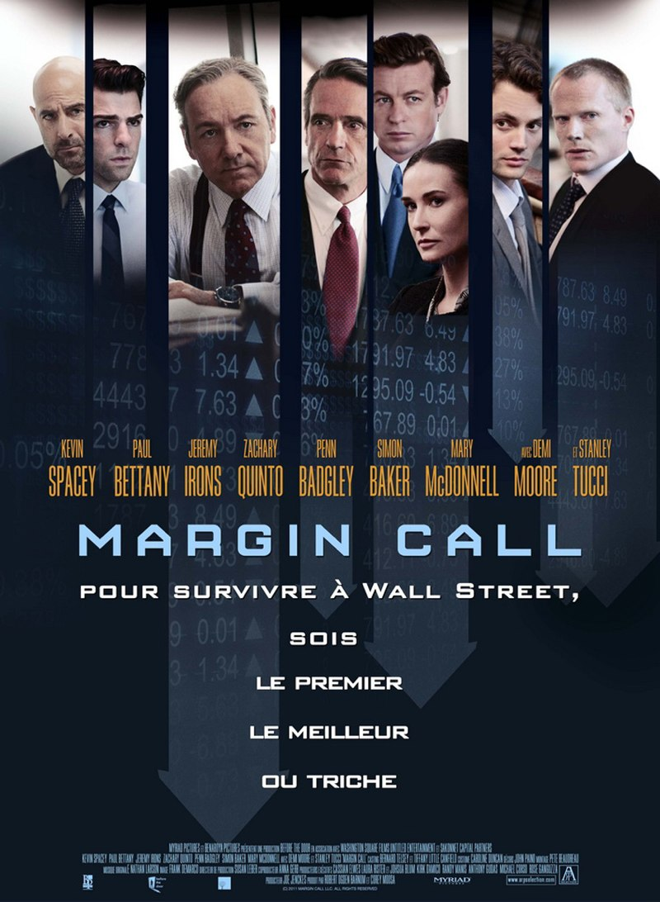

+++
titre = "<em>Margin Call</em>, J.C. Chandor"
title = "Margin Call, J.C. Chandor"
url = "/margin-call-chandor"
date = "2012-05-04T00:10:25"
Lastmod = "2014-12-31T23:04:19"
cover = "margin-call-kevin-spacey.jpg"
categorie = [ "À voir" ]
tag = [ "Crise", "Drame", "Économie", "Film choral", "Huis clos", "Société" ]
createur = [ "J.C. Chandor" ]
acteur = [ "Demi Moore", "Jeremy Irons", "Kevin Spacey", "Paul Bettany", "Zachary Quinto" ]
annee = [ "2012" ]
weight = 2012
pays = [ "États-Unis" ]

+++

Faire vivre le début de la crise des subprimes depuis l&rsquo;intérieur, depuis l&rsquo;une de ces entreprises pleines de traders millionnaires qui ont conçu le système. Voila le pari ambitieux de <em>Margin Call</em>. Une ambition vertigineuse qui n&rsquo;a pas effrayé J.C. Chandor qui signe en plus là son premier film. Le résultat est un ballet humain particulièrement efficace et remarquablement écrit. Un film à ne surtout pas rater, pas parce que vous sortirez incollable sur la crise, mais parce qu&rsquo;il s&rsquo;agit d&rsquo;un grand film, tout simplement.

New York, fin des années 2000 dans l&rsquo;une des innombrables tours de Manhattan. L&rsquo;open-space regroupe des dizaines d&rsquo;employés devant des écrans où chiffres et graphiques s&rsquo;animent en permanence : on est dans une entreprise dédiée à la bourse. Soudain, des hommes et femmes entrent et s&rsquo;approchent de plusieurs employés. Ceux qui ont été désignés les suivent bientôt, un carton sous le bras : ils ont été virés et laissent tout leur travail derrière eux. La dure réalité de cet univers impitoyable où l&rsquo;on peut tout perdre en une minute à peine frappe ainsi avec toute sa force dès les premières minutes de <em>Margin Call</em>. Parmi les employés concernés par cet anodin dégraissage, le responsable de la gestion du risque du département qui est congédié sans véritables raisons après vingt ans de service. En partant, il essaie bien de prévenir ses supérieurs qu&rsquo;il travaille sur quelque chose d&rsquo;important, personne ne l&rsquo;écoute puisqu&rsquo;il ne fait plus partie de l&rsquo;entreprise. Par dépit, il finit par laisser son projet à l&rsquo;une des personnes qui travaillaient avec lui. Peter, spécialiste également des risques en place depuis à peine un an, découvre alors que le système des subprimes qui fait la richesse de son entreprise depuis plusieurs années risque maintenant de coûter cher, si cher que l&rsquo;entreprise ne pourrait pas l&rsquo;assumer. Il est dix heures du soir, mais Peter appelle immédiatement son supérieur. Une longue nuit l&rsquo;attend tandis que le sort non seulement de l&rsquo;entreprise, mais aussi de l&rsquo;économie mondiale, est en discussion…

La <a href="http://fr.wikipedia.org/wiki/Crise_des_subprimes">crise des subprimes</a> n&rsquo;est jamais nommée : <em>Margin Call</em> a en effet la bonne idée de ne pas être situé trop précisément pour ne pas se démoder avec le temps. On ne connaît ainsi ni l&rsquo;année précise, ni même l&rsquo;entreprise dans laquelle se déroule le film, tout au plus peut-on reconnaître Manhattan. Ces informations ne sont de toute manière pas nécessaires : il ne fait aucun doute que J.C. Chandor évoque le tout début de cette crise apparue à l&rsquo;automne 2008 et dont on subit encore les conséquences aujourd&rsquo;hui. On comprend au cours du film que le problème concerne justement ces groupements de titres d&rsquo;origine plus ou moins douteuse, mais aussi les modèles mathématiques toujours plus complexes et surtout plus déconnectés de la réalité. L&rsquo;entreprise a établi des marges de sécurité et Peter s&rsquo;aperçoit qu&rsquo;elle est largement au-delà de cette limite depuis quinze jours. Pour sauver la firme, ses dirigeants qui sont prêts à tout pour survivre décident d&rsquo;être les premiers et de vendre massivement des subprimes devenus brutalement indésirables. À travers ce cas, <em>Margin Call</em> permet de comprendre le mécanisme qui a pu conduire au krach de 2008. Cette entreprise met sur le marché des milliards et des milliards d&rsquo;actions douteuses, ce qui a pour conséquence de faire brutalement baisser les prix. Le film ne s&rsquo;intéresse qu&rsquo;à la nuit qui suit la découverte de Peter et J.C. Chandor n&rsquo;évoque pas les conséquences, mais elles sont bien connues. Faute d&rsquo;avoir été les premières, d&rsquo;autres banques d&rsquo;affaires ont fait faillite à l&rsquo;image de Lehman Brothers.

Si J.C. Chandor s&rsquo;est inspiré de la crise des subprimes pour réaliser son film au point de nommer le patron de sa société John Tuld pour évoquer celui de Lehman Brothers (Richard S Fuld), <em>Margin Call</em> n&rsquo;a pas l&rsquo;ambition d&rsquo;expliquer cette crise. Le film n&rsquo;est en rien un docufiction façon <em><a href="http://voiretmanger.fr/2010/08/28/cleveland-wall-street-bron/">Cleveland contre Wall Street</a></em> ou un pamphlet à la Michael Moore (<em><a href="http://voiretmanger.fr/2009/11/29/capitalism-love-story-moore/">Capitalism, a love story</a></em>) et vous ne comprendrez pas mieux les évènements après l&rsquo;avoir vu. Mieux vaut même avoir quelques connaissances économiques de base pour comprendre <em>Margin Call</em> : il n&rsquo;est pas inutile de connaître le principe des <a href="http://fr.wikipedia.org/wiki/Subprime">subprimes</a> pour mieux comprendre ce qui se déroule, même si les dialogues évitent l&rsquo;utilisation de termes trop techniques. Et pour cause, les responsables de cette société de bourse ne comprennent pas grand-chose à cet univers si complexe. Leur force n&rsquo;est pas technique, mais plutôt un flair particulièrement efficace pour comprendre l&rsquo;avenir, ou tout simplement la chance. Même Peter qui a découvert la vérité n&rsquo;a pas fait d&rsquo;études dans la bourse puisqu&rsquo;il s&rsquo;agit d&rsquo;un scientifique spécialisé dans la physique. On découvre ainsi un fait fascinant : les hommes qui manipulent des milliards tous les jours ne savent pas nécessairement ce qu&rsquo;ils font… Plus que le mécanisme de la crise proprement dite, ce sont ainsi les hommes qui intéressent J.C. Chandor.

L&rsquo;affiche de <em>Margin Call</em> l&rsquo;indique bien, on a ici affaire à un film choral avec plusieurs personnages importants. Le scénario est d&rsquo;ailleurs construit dans toute sa première partie sur un principe simple : on part de Peter, en bas de la chaîne hiérarchique, pour monter progressivement de supérieur en supérieur, jusqu&rsquo;au patron de la société. Une hiérarchie scrupuleusement respectée, avec tous les codes qui l&rsquo;accompagnent : si les tenues sont plutôt décontractées dans un premier temps, les cravates se resserrent vite. La force de <em>Margin Call</em> est d&rsquo;avoir réussi à rendre réalistes tous ces personnages et à éviter au contraire les caricatures. Quand on voit pour la première fois le supérieur direct des employés licenciés, il pleure la mort prochaine de son chien atteint d&rsquo;un cancer. Une image révoltante qui sera toutefois peu à peu effacée jusqu&rsquo;aux dernières images du film qui viennent apporter un éclairage tout à fait différent. Et pour cause, si ces hommes et ces femmes travaillent dans cette société d&rsquo;abord et avant tout pour l&rsquo;argent — les salaires des uns et des autres résonnent dans le film —, c&rsquo;est leur solitude extrême qui frappe les spectateurs. Les personnages de J.C. Chandor sont tous, sans exception, seuls. Leur travail est leur vie, à tel point que la seule femme qui tient un rôle important dans <em>Margin Call</em> semble avoir épousé la société et le regrette amèrement à l&rsquo;heure où sa vie risque d&rsquo;être détruite par la crise. Tous ces employés sacrifient leur vie pour leur travail, mais on ne peut pas dire que leur entreprise leur soit reconnaissante et la fin du film est à cet égard fascinante et terrifiante à la fois. Le format du long-métrage ne permet pas de constituer des personnages aussi complexes et réalistes que les séries, mais le travail réalisé ici est remarquable. Tous ont droit à une belle place dans le film et même le grand patron qui pense d&rsquo;abord à sauver son argent n&rsquo;est pas le personnage odieux que l&rsquo;on pouvait attendre. Pour interpréter tous ces personnages et leur complexité, il fallait des acteurs de premier rang et J.C. Chandor ne déçoit pas. La brochette d&rsquo;acteurs qu&rsquo;il aligne dans <em>Margin Call</em> est impressionnante : Kevin Spacey est impeccable, de même que Jeremy Irons trop souvent cantonné aux seconds rôles.

<em>Margin Call</em> est un premier film, mais cela ne se voit pas. J.C. Chandor a réussi à utiliser parfaitement le peu de moyens techniques mis en œuvre pour tourner une œuvre dense, intense et passionnante. Le long-métrage s&rsquo;approche du huis clos : même si les personnages en sortent parfois, l&rsquo;essentiel du film se déroule dans une tour, et même dans quelques bureaux de cette tour. <em>Margin Call</em> doit en large partie sa réussite à son scénario et la qualité de ses dialogues. J.C. Chandor lui-même s&rsquo;est attelé à l&rsquo;écriture de son premier film et il a su trouver le bon ton, ni documentaire, ni pamphlet anti-capitaliste, mais réaliste tout en étant prenant comme un thriller. Le film ne brille pas par l&rsquo;inventivité de sa mise en scène, mais <em>Margin Call</em> s&rsquo;avère là encore parfaitement efficace et on apprécie en particulier l&rsquo;utilisation judicieuse de la bande-son pour créer une ambiance et un suspense. Encore une fois, rappelons qu&rsquo;il s&rsquo;agit d&rsquo;un premier film : un tel niveau de maîtrise surprend.

Difficile de bouder son plaisir : <em>Margin Call</em> est une franche réussite, non pas tant pour la qualité de son analyse ou de sa démonstration concernant la crise des subprimes, mais bien plus pour ses personnages et son scénario. En s&rsquo;intéressant à une entreprise à la veille de la crise, J.C. Chandor a su trouver le ton juste et à proposer ainsi une plongée saisissante dans l&rsquo;univers de la finance. Un film à ne rater sous aucun prétexte.

<h3>Vous voulez m&rsquo;aider ?</h3>
<ul>
<li><a href="http://www.amazon.fr/gp/product/B008JELN3M/ref=as_li_ss_tl?ie=UTF8&#038;tag=leblogdenic07-21&#038;linkCode=as2&#038;camp=1642&#038;creative=19458&#038;creativeASIN=B008JELN3M">Acheter le film en Blu-Ray sur Amazon</a></li>
<li><a href="http://www.amazon.fr/gp/product/B008JELMWY/ref=as_li_ss_tl?ie=UTF8&#038;tag=leblogdenic07-21&#038;linkCode=as2&#038;camp=1642&#038;creative=19458&#038;creativeASIN=B008JELMWY">Acheter le film en DVD sur Amazon</a></li>
<li><a href="http://itunes.apple.com/fr/movie/margin-call-vost/id558150385">Acheter ou louer le film sur l&rsquo;iTunes Store</a></li>
</ul>

