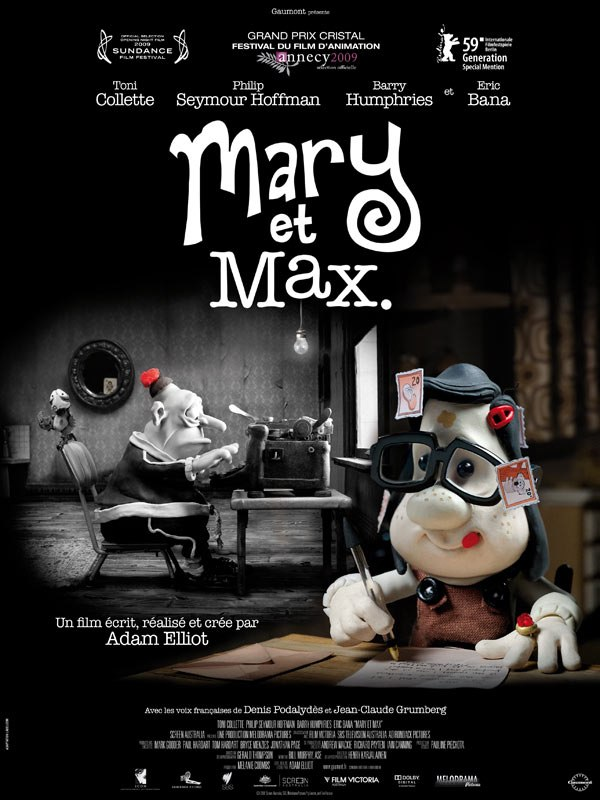
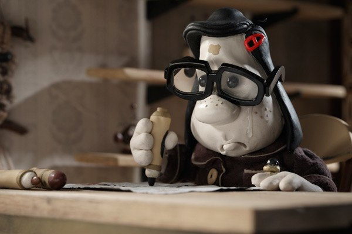
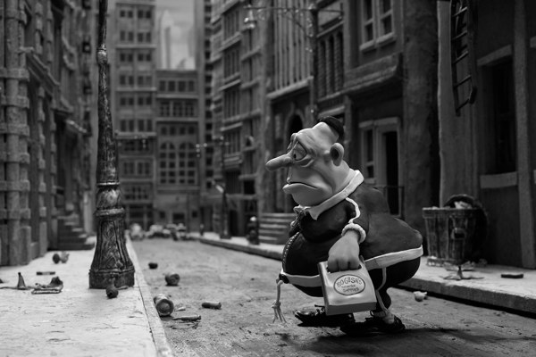
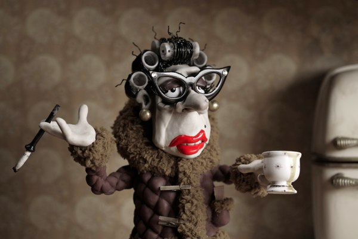

+++
type = "post"
titre = "Mary et Max, Adam Elliot"
title = "Mary et Max, Adam Elliot"
url = "/mary-et-max-elliot"
date = "2009-10-15T23:04:55"
Lastmod = "2010-03-15T15:55:51"
cover = "mary-and-max-elliot.jpg"
categorie = [ "À voir" ]
tag = [ "Animation", "Société" ]
createur = [ "Adam Elliot" ]
annee = [ "2009" ]
weight = 2009

+++

<em>Mary et Max</em> est un étonnant film d&rsquo;animation australien. Étonnant car bien que réalisé à l&rsquo;ancienne, uniquement à la pâte à modeler, ce film est très moderne et visuellement réjouissant. Ajoutons à cela une histoire aussi belle qu&rsquo;étonnante, et ce film pas pour les enfants apparaît définitivement comme un film à en rater sous aucun prétexte !

L&rsquo;histoire de <em>Mary et Max</em> est pour le moins improbable. Deux êtres que tout sépare, tant l&rsquo;âge (elle en a 8, il en a plus de 40), que la géographie (Australie et New-York) ou encore les proches (un père empailleur d&rsquo;oiseaux morts et d&rsquo;une mère alcoolique d&rsquo;un côté, personne ou seulement des êtres imaginaires ou des animaux de compagnie de l&rsquo;autre). Mais deux êtres rassemblés par la solitude et l&rsquo;incompréhension d&rsquo;un monde dont ils semblent tous les deux exclus. Ils regardent tous les deux la même série pour enfant un peu niaise où le héros a plein d&rsquo;amis, et ils se morfondent tous les deux dans leur solitude.

Le scénario les réunit d&rsquo;une manière étonnante, quand Mary, petite fille triste et abandonnée de tous, se demande comment les bébés naissent aux États-Unis. On lui a dit qu&rsquo;en Australie, ils naissaient dans des chopes de bière, mais ça ne peut pas être le cas aux États-Unis : naissent-ils alors dans une canette de Coca ? Pour répondre à cette question existentielle, elle décide d&rsquo;écrire au hasard à un Américain pour lui demander comment les bébés naissent chez l&rsquo;Oncle Tom. Le hasard choisit Max, un New-Yorkais qui n&rsquo;avait vraiment rien demandé. Souffrant du <a href="http://fr.wikipedia.org/wiki/Syndrome_d'Asperger">syndrome d&rsquo;Asperger</a>, sorte d&rsquo;autisme aigu, il craint à peu près tout ce qui n&rsquo;est pas connu, ne comprend rien au monde et prend tout au pied de la lettre, comme il le décrit lui-même. Autant dire que l&rsquo;arrivée d&rsquo;une lettre d&rsquo;une jeune inconnue de l&rsquo;autre côté du monde lui posant une question sur les bébés, lui qui ne connaît rien à la chose, le perturbe fortement.

Entre ces deux êtres si différents à première vue se tisse vite une relation très forte, mais uniquement épistolaire. Les réponses fusent de part et d&rsquo;autre sur plus de vingt ans, même si Max fait une crise de plusieurs années qui le conduit dans un hôpital psychiatrique quelques années. Max et Mary échangent à propos de tout et de rien, de leurs problèmes respectifs (et ils en ont), de la vie en général, du monde extérieur&#8230;

L&rsquo;excellente idée de <em>Mary et Max</em> est d&rsquo;éviter les dialogues. L&rsquo;histoire se raconte d&rsquo;une part par lettres, à la manière d&rsquo;un roman épistolaire, et d&rsquo;autre part par la voix d&rsquo;un narrateur. C&rsquo;est très bien vu, car cela donne au film un ton décalé parfaitement en accord avec l&rsquo;aspect visuel et l&rsquo;histoire. Le ton change en fonction de la personne qui parle, et les trois acteurs qui donnent leur voix aux deux personnages et au narrateur sont tous excellents et ajoutent une personnalité forte aux deux personnages (au moins en VO). La pâte à modeler n&rsquo;est pas le meilleur outil pour montrer les infinies variations du visage humain, mais la pâte plus l&rsquo;intonation de voix constitue indéniablement un duo très efficace.

L&rsquo;histoire de <em>Mary et Max</em> est vraiment très belle. Le film montre merveilleusement bien deux êtres en décalage total, deux êtres dans leur propre monde, un monde qui par un miracle inexpliqué, se retrouvent en fait. Deux êtres complexes et donc passionnants, que ce soit ce juif obèse qui s&rsquo;invente des personnages fictifs pour l&rsquo;accompagner et renouvèle régulièrement un poisson rouge nommé à la manière d&rsquo;une dynastie de rois ; ou cette jeune fille pas gâtée sur le plan physique non plus avec sa tache de naissance couleur boue et abandonnée autant par son père plus préoccupé d&rsquo;empailler des oiseaux trouvés morts sur le bord de la route que par sa mère occupée à boire du sherry toute la journée. Mary et Max dit des choses très intéressantes sur la dureté de la société face à ces êtres décalés que l&rsquo;on enferme en hôpital psychiatrique à la moindre occasion, ou que l&rsquo;on traite comme des moins que rien. Le psychiatre de Max est, à cet égard, vraiment génial.

Quand on évoque le scénario de Mary et Max, on a brusquement envie de partir en courant, de peur de faire une dépression en sortant de la salle. Et pourtant, ce film très triste est aussi très drôle et assez réjouissant. Certes, la vie n&rsquo;est pas tendre avec nos deux héros, mais ces derniers se battent comme ils peuvent et ne se débrouillent pas trop mal. En outre, leurs réactions peuvent être très drôles (OK, c&rsquo;est de l&rsquo;humour noir) et apportent une pause bienvenue dans le récit. Aussi surprenant que cela puisse paraître, on sort finalement de la salle heureux.

Mais au-delà de l&rsquo;histoire, <em>Mary et Max</em> époustoufle sur le plan graphique. Les images fixes peinent à transcrire une animation totalement maîtrisée et très intéressante sur le plan cinématographique. Le film assume totalement son côté fait main, tout en étant très moderne sur la gestion de la caméra et des plans. L&rsquo;esthétique est très éloignée du dessin animé (de toute façon, <em>Mary et Max</em> n&rsquo;est <em>pas</em> un film pour les enfants qu&rsquo;on se le dise), mais plus proche de ce que pourrait faire Tim Burton ou dans un tout autre registre, proche de <em>Sin City</em> par l&rsquo;usage de touches de couleurs. Le film est sinon majoritairement en noir et blanc pour la partie sur Max, et en sépia pour la partie Mary. Des choix très marqués et qui offrent au film une identité propre.

Au cas où vous ne l&rsquo;auriez pas encore compris, j&rsquo;ai vraiment adoré <em>Mary et Max</em>. Ce genre de films fait du bien, déjà parce que l&rsquo;on sort heureux de l&rsquo;avoir vu, et parce qu&rsquo;il redonne confiance au cinéma. Au milieu des films standards sort parfois une pépite, brusquement sans prévenir, un film sort et brille par sa nouveauté, son audace technique, son sujet inattendu, ou tout ça à la fois.

Pierre Murat a vraiment adoré le film, <a href="http://www.telerama.fr/cinema/films/mary-et-max,388629,critique.php">évoquant</a> même &laquo;&nbsp;une merveille&nbsp;&raquo;. Par contre, Vincent de Critikat a été <a href="http://critikat.com/Mary-et-Max.html">très déçu</a>&#8230; comme on dit souvent, nous n&rsquo;avons pas dû voir le même film. Je conclurai en citant <a href="http://www.toujoursraison.com/2009/10/mary-et-max.html">Rob Gordon</a> : &laquo;&nbsp;<em>On en ressort avec l&rsquo;envie de se taper un bon hot-dog au chocolat ou une boîte de lait concentré sucré, histoire de communier une dernière fois avec des anti-héros qu&rsquo;on n&rsquo;oubliera pas de sitôt.</em>&nbsp;&raquo; Il a totalement raison, et d&rsquo;ailleurs je regrette de ne pas avoir la recette des fameux hot-dogs&#8230;

