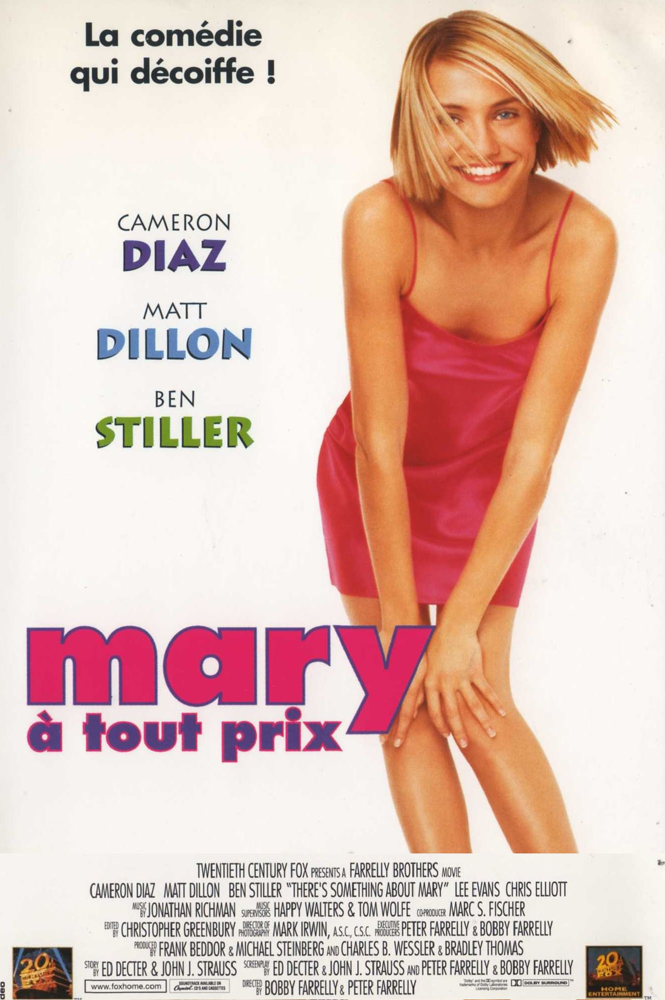
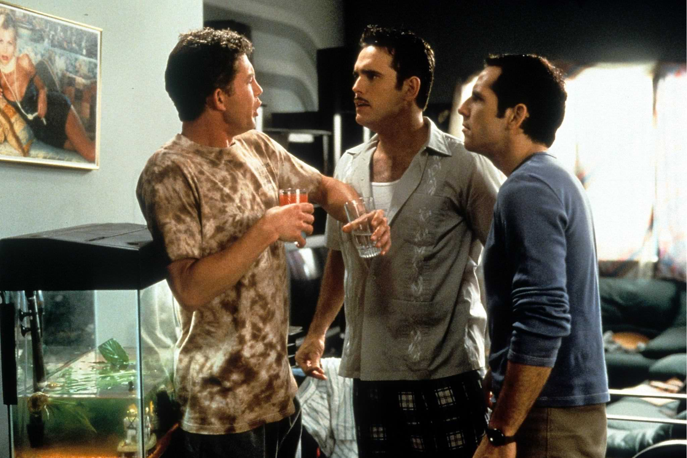

+++
type = "post"
titre = "<em>Mary à tout prix</em>, Peter et Bobby Farrelly"
title = "Mary à tout prix, Peter et Bobby Farrelly"
url = "/mary-tout-prix-farrelly"
date = "2014-12-28T00:21:59"
Lastmod = "2014-12-28T23:54:03"
cover = "mary-a-tout-prix-cameron-diaz.jpg"
categorie = [ "À voir" ]
tag = [ "Amour", "Comédie", "Comédie romantique", "Humour", "Parodie", "Sexe" ]
createur = [ "Bobby et Peter Farrelly" ]
acteur = [ "Ben Stiller", "Cameron Diaz", "Chris Elliott", "Lee Evans", "Lin Shaye", "Matt Dillon" ]
annee = [ "1998" ]
weight = 1998
pays = [ "États-Unis" ]
original = "There's Something about Mary"

+++

« <em>La comédie qui décoiffe !</em> » titrait l&rsquo;affiche originale et force est de constater, plus de quinze ans après sa sortie dans les salles, que <em>Mary à tout prix</em> reste une comédie potache extrêmement efficace. Peter et Bobby Farrelly ont connu la gloire mondiale avec ce film étonnant, qui sait faire preuve d&rsquo;un humour bas de plafond, mais extrêmement efficace, tout en ménageant quelques moments plus touchants. Un cocktail redoutable, avec plusieurs scènes restées cultes jusqu&rsquo;à aujourd&rsquo;hui et des acteurs impeccables. L&rsquo;ensemble n&rsquo;est pas toujours très fin, sans conteste, mais on aurait tort de bouder cette comédie romantique qui tend vers la parodie avec une bonne humeur décoiffante… parfois même au sens propre du terme. <em>Mary à tout prix</em>, un film à voir et à revoir à tout prix !

Le scénario imaginé par les frères Farrelly est, au fond, assez simple. Prenez la fille la plus belle qui soit et qui a ce quelque chose qui fait que tous les garçons autour d&rsquo;elles en deviennent instantanément amoureux. Prenez aussi le type que personne ne remarque vraiment, le looser qui n&rsquo;a rien pour lui et qui ne devrait surtout pas avoir cette fille. Dans une comédie romantique traditionnelle, elle devrait finalement tomber amoureux de lui… mais dans <em>Mary à tout prix</em>, les choses sont un petit peu plus complexes que cela. Tout commence pourtant bien, avec un prologue au lycée où Mary, la blonde qui fait chavirer les cœurs, invite Ted, le looser qui n&rsquo;a rien pour lui, au bal de fin d&rsquo;année. Cela semble impensable, mais c&rsquo;est bien ce qui arrive et tout irait pour le mieux… sauf que par un concours de circonstances totalement dingues, le malheureux se retrouve à l&rsquo;hôpital après s&rsquo;être coincé les parties génitales avec sa braguette. Sur ce, Mary déménage à Miami avec ses parents et cela devrait être la fin de l&rsquo;histoire, mais le long-métrage de Peter et Bobby Farrelly reprend en fait 13 ans plus tard. Devenu adulte, Ted n&rsquo;a jamais oublié cet amour de jeunesse et il envoie Pat, un enquêteur un peu louche, sur les traces de Mary. Sans surprise, il tombe à son tour amoureux de Mary et tente de la séduire… mais c&rsquo;est sans compter sur Tucker, son ami handicapé et architecte qui espère bien la séduire. <em>Mary à tout prix</em> met ainsi en place, non pas un trio amoureux, mais au moins un quatuor, voire plus à la fin du film. Les deux réalisateurs ne font jamais les choses à moitié, si bien qu&rsquo;ils multiplient les prétendants autant que les gags. Autour de leur héroïne, ils font graviter d&rsquo;abord un, puis deux, trois et bientôt cinq hommes qui veulent tous la séduire… alors que Mary cherche l&rsquo;homme idéal, une sorte de Prince charmant qui aurait tout ce qu&rsquo;elle veut dans la vie. Ce scénario de comédie romantique assez banal est dynamité par des gags en folie, incontestablement <em>le</em> point fort du film et du duo formé par les deux frères Farrelly. De la semence utilisée comme gel, au chien ressuscité à coup de prise électrique, en passant par la pêche malheureuse, le film ne fait pas dans la dentelle, mais à condition d&rsquo;accepter son humour potache, il est aussi très plaisant. On peut trouver que c&rsquo;est un peu lourd, mais l&rsquo;humour est bien dosé et, contrairement à certains films qui en abusent, il est ici suffisamment rare pour rester pertinent.

<em>Mary à tout prix</em> est devenu instantanément culte et ce n&rsquo;est pas un hasard : les frères Farrelly ont créé une excellente comédie romantique loufoque, où les gags les plus énormes se succèdent sans jamais montrer de signe de faiblesse. Naturellement, on pourra trouver que c&rsquo;est un peu trop gros, voire grossier, mais on ne peut que saluer les performances des acteurs, Ben Stiller en tête, et aussi reconnaître que l&rsquo;humour n&rsquo;est pas trop présent. <em>Mary à tout prix</em> sait ménager ses effets avec des pauses bienvenues entre les scènes comiques, et c&rsquo;est extrêmement bien vu. Un classique !

<h3>Vous voulez <a href="http://voiretmanger.fr/soutien/">m&rsquo;aider</a> ?</h3>
<ul>
<li><a href="http://www.amazon.fr/gp/product/B001W2YZ88/ref=as_li_ss_tl?ie=UTF8&amp;tag=leblogdenic07-21&amp;linkCode=as2&amp;camp=1642&amp;creative=19458&amp;creativeASIN=B001W2YZ88">Acheter le film en Blu-ray sur Amazon</a></li>
<li><a href="http://www.amazon.fr/gp/product/B0006MRM5S/ref=as_li_ss_tl?ie=UTF8&amp;tag=leblogdenic07-21&amp;linkCode=as2&amp;camp=1642&amp;creative=19458&amp;creativeASIN=B0006MRM5S">Acheter le film en DVD sur Amazon</a></li>
<li><a href="https://itunes.apple.com/fr/movie/mary-a-tout-prix/id367821780">Acheter ou louer le film sur l&rsquo;iTunes Store</a></li>
<li><a href="http://www.netflix.com/WiMovie/60026860">Regarder le film sur Netflix</a></li>
</ul>

