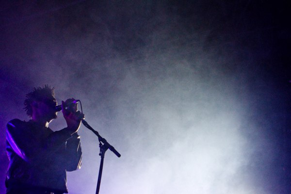
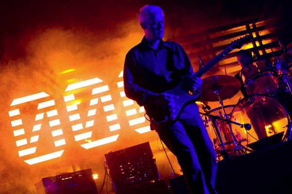
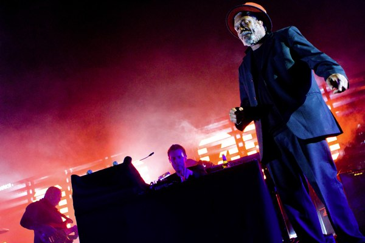
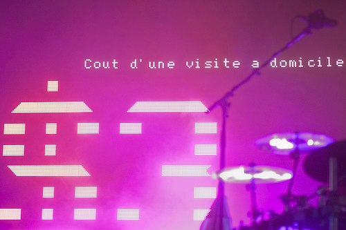

+++
type = "post"
titre = "Massive Attack au Zénith (11 novembre 2009)"
title = "Massive Attack au Zénith (11 novembre 2009)"
url = "/massive-attack-zenith-2009"
date = "2009-11-13T00:29:53"
Lastmod = "2010-04-23T14:36:26"
cover = "massive_attack_zenith.jpg"
categorie = [ "À voir… en live" ]
tag = [ "Concert", "Trip-Hop", "Zénith" ]
createur = [ "Massive Attack" ]
annee = [ "2009" ]
weight = 2009

+++

Massive Attack, groupe légendaire et pionnier dans ce qui deviendrait le trip-hop, est actuellement en tournée pour célébrer la sortie de son nouvel album&#8230; enfin c&rsquo;est ce qui était prévu avant que la date de sortie de l&rsquo;album en question soit à nouveau repoussée. Bref, un concert de Massive Attack, cela ne se rate sous aucun prétexte, et j&rsquo;ai donc assisté à mon premier concert du groupe. Le moins que l&rsquo;on puisse dire, c&rsquo;est que je n&rsquo;ai pas été déçu.

<em>© Jean-Sébastien Zanchi – <a href="http://www.goodkarma.fr/">www.goodkarma.fr</a></em>

La musique de Massive Attack n&rsquo;est pas des plus évidentes à imaginer sur scène. Souvent complexe, parfois lente, parfois plus musclée, mais toujours finement construite, ciselée même à certains moments. Le groupe a de plus connu plusieurs évolutions depuis ses débuts dans les années 1990 et a ainsi employé plusieurs chanteurs différents. Le passage sur scène est donc risqué, et on craint un peu le concert aussi passionnant qu&rsquo;un journal télévisé, un concert où tous les morceaux seraient joués consciencieusement à la note près, sans âme ni motivation réelle (nonobstant la motivation financière s&rsquo;entend).

Fort heureusement, rien de tout ça au Zénith en ce jour férié. Au contraire, les titres les plus anciens sont revisités, parfois en profondeur, pour notre plus grand plaisir. À ma surprise, tous les titres passent bien sur scène, même les plus &laquo;&nbsp;alambiqués&nbsp;&raquo;, le public est réceptif et réagit au quart de tour. Certes, les morceaux les plus récents, extraits du futur album potentiel, moins connus (et pour cause&#8230;) ont reçu un accueil plus frais. Mais même sur cela, l&rsquo;engouement est arrivé, notamment sur le dernier récent joué (je crois que c&rsquo;était l&rsquo;avant-dernier du concert) qui, manifestement, est bien taillé pour la scène. Bon point donc pour un groupe qui a su garder de la distance par rapport à sa musique, de quoi la réarranger pour le plus grand plaisir de son public. À noter, d&rsquo;ailleurs, une mise en avant surprenante (au moins à titre personnel) des guitares, le concert se faisant quasiment rock sur certains morceaux. Cela n&rsquo;était pas pour me déplaire.

<em>© Jean-Sébastien Zanchi – <a href="http://www.goodkarma.fr/">www.goodkarma.fr</a></em>

Ce concert de Massive Attack fut exceptionnel à la fois pour les oreilles et pour la vue. Puisqu&rsquo;il s&rsquo;agit, quand même, avant tout de musique, commençons par cela. Le son était hier très fort, très puissant, mais aussi très propre. Une belle preuve que l&rsquo;on peut faire fort et bien&#8230; Signalant sans aucun doute la bonne qualité, le son n&rsquo;a jamais été agressif, alors que les sonorités électroniques diverses et variées — souvent gênantes — ne manquaient pas. Malgré la complexité des scènes sonores construites par le groupe britannique, on entend distinctement les instruments, la voix&#8230; tout y est. Certes, ça n&rsquo;était pas parfait, mais pour un concert dans une grande salle, cela me semblait plus que satisfaisant !

Sur scène, j&rsquo;ai dénombré pas moins de 12 intervenants. Certes, ils ne sont jamais tous ensemble (je crois que le maximum a été 10 musiciens et chanteurs en simultané), mais c&rsquo;est impressionnant. Le groupe sur scène se compose d&rsquo;abord de cinq musiciens, deux batteurs (enfin, en tout cas tappeurs de trucs&#8230;), un qui se noie derrière des claviers, un guitariste et un bassiste. Massive Attack aujourd&rsquo;hui, c&rsquo;est d&rsquo;abord deux hommes, 3D et Daddy G : on peut parler, je suppose, de &laquo;&nbsp;leaders&nbsp;&raquo; même si le charisme n&rsquo;est sans doute pas parmi leur plus grande qualité. Ils assurent en tout cas la majeure partie du chant, et nous demandent de temps en temps si on va bien. Concernant le chant, le plus impressionnant fut sans doute la présence d&rsquo;Horance Andy, chanteur de reggae plus tout jeune, mais à la voix reconnaissable entre toute et associée pour ma part indéniablement à Massive Attack (je ne connais pas le reste de sa carrière). La reconnaissance du public fut immédiate, et on comprend pourquoi en l&rsquo;écoutant. C&rsquo;est en tout cas vraiment plaisant de voir un homme comme lui participer à un concert de Trip-Hop, il y a comme un décalage a priori qui s&rsquo;efface totalement dès les premières mesures&#8230; non vraiment, plaisant.

<em>© Jean-Sébastien Zanchi – <a href="http://www.goodkarma.fr/">www.goodkarma.fr</a></em>

Le concert de Massive Attack fut sans doute parmi les plus beaux concerts qu&rsquo;il m&rsquo;ait été donné de voir. Dans le genre minimalisme classe, on n&rsquo;a guère fait mieux. Le principe est simple : l&rsquo;éclairage ne vient que de derrière ou des côtés, il n&rsquo;y a rien devant, rien dessus. En arrière de la scène, un mur de Leds réparties sur plusieurs bandes fait alternativement office d&rsquo;éclairage ou d&rsquo;écran. Derrière ce mur ajouré, des projecteurs fournissent l&rsquo;essentiel de l&rsquo;éclairage de la scène et de la salle plus largement. Les personnes sur scène sont donc souvent des ombres, une astuce scénique toujours aussi efficace.

Les photos ne rendent pas justice à ce type d&rsquo;éclairage jouant énormément sur les contractes et souvent très fins (par exemple les rayons lumière blanche se décomposaient en arc-en-ciel à travers la fumée). Globalement, on sent le travail des équipes en charge de l&rsquo;éclairage et le sens du détail, l&rsquo;écran affichant parfois du texte qui reste lisible malgré les puissants projecteurs derrière. J&rsquo;ai beaucoup aimé les rampes de projecteurs qui montent ou descendent au grès du concert. Non vraiment, je dois dire que les concerts aussi travaillés sur le plan visuel sont rares. À tel point d&rsquo;ailleurs que l&rsquo;on ne sait plus trop où donner de la tête : l&rsquo;aspect visuel aurait presque tendance à s&rsquo;imposer sur la musique, mais &laquo;&nbsp;presque&nbsp;&raquo; seulement. Je regrette juste la position fosse, pour un tel concert il n&rsquo;est pas mauvais de prendre un peu de recul par rapport à la scène. Néanmoins, l&rsquo;ambiance était bonne&#8230;

<em>© Jean-Sébastien Zanchi – <a href="http://www.goodkarma.fr/">www.goodkarma.fr</a></em>

J&rsquo;ai été surpris par l&rsquo;aspect très politique du concert. Une chanson a été ainsi dédiée explicitement à tous les civils en guerre malgré eux, tandis qu&rsquo;une autre a été introduite en évoquant la condition féminine. Même sans cela, le panneau a affiché plusieurs messages politiques, qui vont de très explicites références à propos de la liberté (de la Déclaration des Droits de l&rsquo;Homme à Rousseau en passant par Mandela) à de plus subtiles mentions, comme des comparaisons de prix (une intervention de jardinier d&rsquo;un député anglais = un an d&rsquo;un humanitaire au Soudan) ou encore des messages plus ou moins subliminaux sur nos hommes politiques.

Des messages engagés donc, mais tous en français et en plus actualisés. On a ainsi eu une référence à la visite-qui-tombait-vachement-bien-quand-même de Nicolas Sarkozy à Berlin, en ce beau 11 novembre 1989. Je ne sais pas si la France a un traitement de faveur (après tout, le nombre de dates sur le sol français est impressionnant) ou si le groupe fait ça partout, mais c&rsquo;est sympa. Messages politiques appuyés pour Massive Attack donc, mais heureusement, ça n&rsquo;était que du texte. En clair, ces messages pouvaient aisément être ignorés, d&rsquo;autant qu&rsquo;ils étaient rarement faciles à lire. Cette mise en avant ne m&rsquo;a donc pas gêné outre mesure, on est loin des <a href="/2009/10/30/this-is-it-jackson/">clips kitschissimes de feu Michael</a>.

<em>© Hanaofangel &#8211; <a href="http://www.le-hiboo.com/18852-massive-attack-zenith-paris-10-11-2009">Le HibOO</a></em>

Bref, vous l&rsquo;aurez compris, ce concert de Massive Attack était un grand moment. Je ne connaissais pas le groupe sur scène et je n&rsquo;ai pas été déçu. L&rsquo;aperçu du nouvel album mérite des écoutes supplémentaires, mais cela me semble prometteur. Et j&rsquo;ai rarement assisté à des concerts aussi bons techniquement que réjouissants à voir et à entendre.

Jean-Sébastien, que je remercie au passage pour les photos grand format, <a href="http://www.goodkarma.fr/2009/11/12/massive-attack-zenith/">évoque</a> un concert épique apparemment très éloigné des concerts des débuts et il n&rsquo;a pas tort. Je ne sais pas s&rsquo;il reste encore des places dans la tournée, mais le cas échéant, ruez-vous sur les dernières places !

&gt; Les autres photos du concert du <a href="http://www.le-hiboo.com/18852-massive-attack-zenith-paris-10-11-2009">10 novembre</a> ; du <a href="http://www.le-hiboo.com/18855-massive-attack-zenith-paris-11-11-2009">11 novembre</a>.

<em>Crédit photo couverture : lhdlovebooh @ <a href="http://www.flickr.com/photos/lhdlovebooh/4097217331/">Flickr</a></em>

