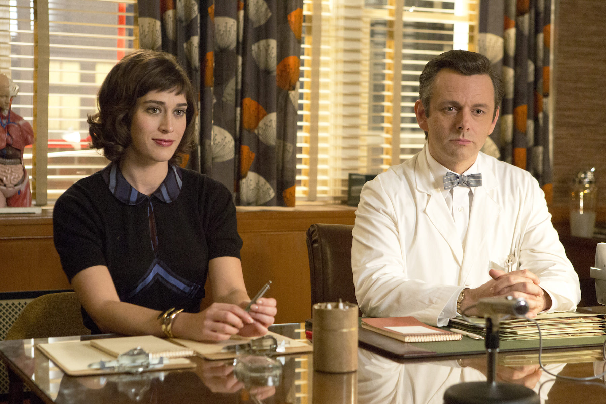
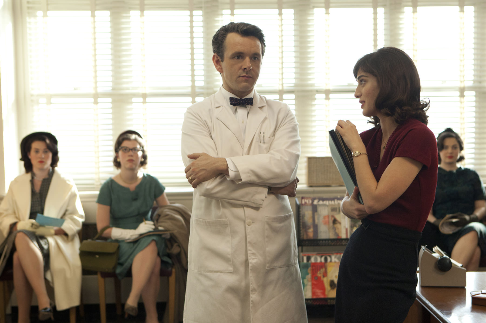
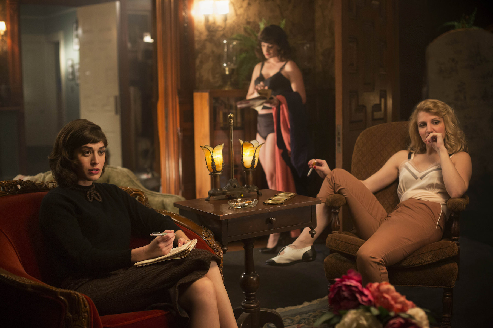

+++
titre = "<em>Masters of Sex</em>, Michelle Ashford (Showtime)"
title = "Masters of Sex, Michelle Ashford (Showtime)"
url = "/masters-of-sex-ashford-showtime"
date = "2014-03-01T19:08:15"
Lastmod = "2014-03-01T19:23:32"
cover = "masters-of-sex-lizzy-caplan.jpg"
categorie = [ "À voir" ]
tag = [ "Adaptation littéraire", "Biopic", "Histoire", "Histoire vraie", "Médecine", "Série", "Sexe", "Société" ]
createur = [ "Michelle Ashford", "Showtime" ]
acteur = [ "Caitlin Fitzgerald", "Julianne Nicholson", "Lizzy Caplan", "Michael Sheen", "Nicholas D'Agosto", "Teddy Sears" ]
annee = [ "2013" ]
weight = 2013
pays = [ "États-Unis" ]

+++

Les meilleures séries sont rarement inspirées d’histoires vraies, encore moins des biopics, mais <em>Masters of Sex</em> vient contredire cette idée reçue. Michelle Ashford a créé une série qui raconte la vie de William Masters et de Virginie Johnson, les deux premiers sexologues au sens moderne du terme. Le premier est un gynécologue réputé qui décide de mesurer scientifiquement les effets physiques de l’acte sexuel sur le corps humain. La seconde est son assistante qui s’est passionnée pour l’étude et pour son instigateur. Une histoire qui intrigue d’emblée, mais c’est tout l’art des scénaristes d’avoir su en faire une série passionnante. Entre étude scientifique et histoire d’amour, <em>Masters of Sex</em> est une plongée plus vraie que nature dans les États-Unis des années 1950 et une initiation réussie à la découverte de la sexualité moderne. Une série à ne rater sous aucun prétexte !

Université Washington à Saint Louis, Missouri, fin des années 1950. William Masters pratique la gynécologie avec tant de succès que l’hôpital connaît un très beau succès dans le pays entier. Même si cette réussite personnelle lui plait, ce n’est pas ce qui le motive vraiment : ce médecin très sérieux qui a même la réputation d’être un peu détestable au quotidien, veut étudier le sexe. À cette époque où la libération de la fin des années 1960 n’était encore qu’un cauchemar pour la majorité des Américains, la connaissance populaire sur le sexe était souvent composée uniquement de préjugés et de jugements moraux. Pour ce scientifique, cela ne suffit pas et il se met en tête d’étudier avec beaucoup de sérieux ce qui se passe quand un homme ou une femme se masturbe, ou quand un couple a une relation sexuelle. Si le personnage principal de <em>Masters of Sex</em> a une excellente réputation dans l’établissement, il va sans dire que cette étude ne va pas de soi et qu’elle est jugée comme pornographique par tous ses pairs. L’un des enjeux de la série est précisément la lutte entre William Masters et sa hiérarchie et l’étude qu’il mène est le plus souvent clandestine. À un moment donné, elle est même expulsée de l’hôpital pour se retrouver dans un bordel de la ville, où les prostituées servent de candidates pour mesurer les réactions physiologiques en se masturbant. La série créée par Michelle Ashford bénéficie d’une reconstitution parfaite qui rappelle un peu celle que l’on avait déjà dans <a href="http://voiretmanger.fr/mad-men-weiner-amc/" title="Mad Men, Matthew Weiner (AMC)"><em>Mad Men</em></a>. Les deux séries se déroulent d’ailleurs à peu près à la même époque et on retrouve la même ambiance, même si les sujets n’ont rien à voir.

Comme toutes les bonnes séries, <em>Masters of Sex</em> intéresse d’abord pour ses personnages. L’aspect historique est passionnant et très bien rendu, c’est vrai, mais on est accroché par les deux personnages principaux et leurs relations. Pour mener à bien son étude, William Masters n’est pas seul, en effet : il engage aussi celle qui n’est d’abord que sa secrétaire, Virginia Johnson. La jeune femme n’a jamais fait d’études en médecine, mais elle s’intéresse dès le départ à la quête du médecin et elle veut très vite l’aider à mieux comprendre les orgasmes, et notamment les féminins. La jeune femme ne connaît peut-être rien à la science, mais elle ajoute à l’étude ce côté humain que le docteur Masters est incapable d’offrir et la pair fonctionne très bien. Tout irait pour mieux, mais ne serait guère passionnant, si l’amour ne venait pas s’y mêler. Derrière l’Histoire scientifique, Michelle Ashford filme bien sûre une histoire d’amour, puisque les deux tombent peu à peu amoureux l’un de l’autre. Même s’ils ne veulent pas se l’avouer dans un premier temps, leur amour est évident et quand ils participent eux-mêmes à l’enquête, officiellement pour pallier la rareté des candidats, on sent bien qu’il y a une ambiguïté. Ainsi, plus que l’aspect historique, c’est cette histoire d’amour qui maintient l’intérêt de <em>Masters of Sex</em> au fil des épisodes. Le scénario est très bien écrit, avec toute la finesse nécessaire, mais on retiendra surtout le talent des deux acteurs. Michael Sheen est excellent et il trouve enfin un rôle à la mesure de son talent, après s’être retrouvé dans plusieurs seconds rôles assez médiocres. Lizzy Caplan est elle aussi parfaite en secrétaire ambitieuse et elle incarne avec beaucoup de finesse cette femme qui tombe amoureuse, mais qui n’ose l’accepter.

Le sujet est sulfureux et même s’il n’a plus le parfum de scandale de l’époque, on ressent bien le scandale et c’est bien là toute la réussite de <em>Masters of Sex</em>. Michelle Ashford a su recréer la fin des années 1950 avec beaucoup de soin pour un résultat très réussi : on est propulsé dans le temps et on vit, avec les personnages, cette époque où la nudité était déjà considérée comme de la pornographie et où la masturbation féminine en particulier était encore un interdit absolu. Au milieu de ce contexte historique, <em>Masters of Sex</em> déploie des histoires de cœur avec beaucoup de subtilité et des personnages très bien écrits. Une série très réussie, à ne surtout pas rater !

<h3>Vous voulez m’aider ?</h3>
<ul>
<li><a href="http://www.amazon.fr/gp/product/B00H7WDZ24/ref=as_li_ss_tl?ie=UTF8&#038;tag=leblogdenic07-21&#038;linkCode=as2&#038;camp=1642&#038;creative=19458&#038;creativeASIN=B00H7WDZ24">Acheter la série en Blu-Ray sur Amazon</a></li>
<li><a href="http://www.amazon.fr/gp/product/B00H7WDYCU/ref=as_li_ss_tl?ie=UTF8&#038;tag=leblogdenic07-21&#038;linkCode=as2&#038;camp=1642&#038;creative=19458&#038;creativeASIN=B00H7WDYCU">Acheter la série en DVD sur Amazon</a></li>
<li><a href="https://itunes.apple.com/fr/tv-season/masters-of-sex-saison-1-vost/id724785932">Acheter ou louer la série sur l’iTunes Store</a></li>
</ul>

