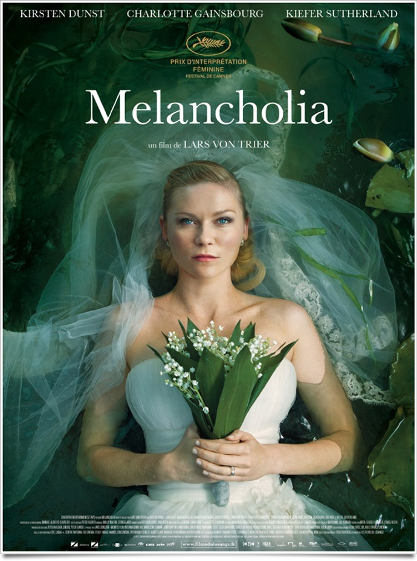
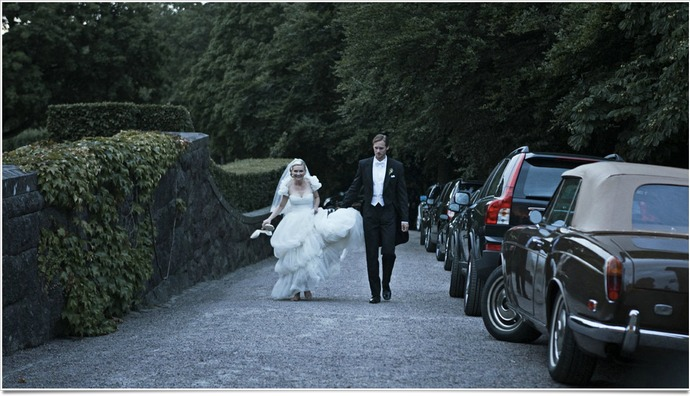
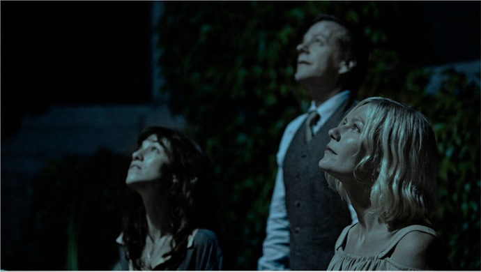

+++
titre = "<em>Melancholia</em>, Lars von Trier"
title = "Melancholia, Lars von Trier"
url = "/melancholia-trier"
date = "2011-08-09T01:06:12"
Lastmod = "2014-11-16T18:11:33"
cover = "melancholia.jpg"
categorie = [ "À voir" ]
tag = [ "Apocalypse", "Dépression", "Drame", "Famille", "Fantastique", "Mort" ]
createur = [ "Lars von Trier" ]
acteur = [ "Charlotte Gainsbourg", "Kiefer Sutherland", "Kirsten Dunst" ]
annee = [ "2011" ]
weight = 2011
pays = [ "Danemark", "France" ]

+++

Montrer l&rsquo;apocalypse. Roland Emmerich l&rsquo;a déjà fait récemment dans <em><a href="http://voiretmanger.fr/2009/11/14/2012-emmerich/">2012</a></em> et on connaît le résultat : un film spectaculaire (encore que), plein d&rsquo;émotion forcée et finalement bien vide et vain. La solution choisie par Lars von Trier ne pourrait être plus différente : la fin du monde est sans espoir dans <em>Melancholia</em> et elle ne cherche pas le spectacle, mais au contraire l&rsquo;intimité. Sans surprise, le résultat est époustouflant. Un film imparfait, mais qui fait oublier ses imperfections par un final bluffant. À voir.

L&rsquo;introduction de <em>Melancholia</em> rappelle fortement <em><a href="http://voiretmanger.fr/2011/05/17/tree-of-life-malick/">The Tree of Life</a></em> de Terrence Malick, mais dans une version stylisée qui évoque les toiles des grands peintres classiques. Tout est ralenti et extrêmement fluide, les images sublimes et surréalistes : on ne comprend pas tout, mais on comprend que le film dévoile d&rsquo;emblée sa conclusion. La fin importe peu, <em>Melancholia</em> montre la fin du monde, la fin de notre planète explosée en mille morceaux par une autre planète, la fin de l&rsquo;homme. Passée cette introduction aussi belle que mystérieuse, Lars von Trier annonce une première partie dédiée à l&rsquo;une de ses deux héroïnes : Justine. <em>Melancholia</em> est divisée en deux parties à peu près égale en longueur ; la seconde sera consacrée à Claire, la sœur de Justine. Le film commence avec le mariage de Justine : elle épouse Michael et est la plus heureuse des femmes… du moins elle essaye de s&rsquo;en convaincre. Jutine souffre de dépression et elle semble tout simplement incapable d&rsquo;aimer un homme et d&rsquo;être heureuse. Elle reste insensible au fastueux mariage organisé par sa sœur et son beau-frère et elle préfère s&rsquo;isoler dans la baignoire ou sur le splendide golf de la propriété plutôt que de rester auprès de son mari. Ce dernier, lassé, fini par jeter l&rsquo;éponge et abandonner sa belle après un mariage catastrophique. La deuxième partie ouvre peu après. Justine est entrée d&rsquo;une phase de dépression aiguë, elle ne fait que dormir et ne marche plus sans une épaule pour l&rsquo;aider. Alors qu&rsquo;elle vient en convalescence chez sa sœur, Claire et son mari se préparent à un événement exceptionnel : la Terre va croiser la planète Melancholia. En théorie, les deux planètes se frôleront, mais ne toucheront pas. En pratique, on le sait d&rsquo;emblée, les choses ne seront pas aussi simples.

Film dual, <em>Melancholia</em> est un film déséquilibré. Les deux parties ne sont pas d&rsquo;égal intérêt, même si aucune n&rsquo;est vraiment honteuse. Le problème vient plutôt du lien entre les deux : la seconde, apocalyptique, a bien peu de point commun avec la première, drame familial réussi, mais moins original. Cette description d&rsquo;un mariage parfait sur le papier et totalement raté est assez sidérante. Dès le départ, l&rsquo;échec de la fête est patent : les mariés arrivent avec deux bonnes heures de retard, après avoir abandonnés leur limousine et terminés à pied le trajet. La suite n&rsquo;est qu&rsquo;une longue série de catastrophes : la mère qui déteste les mariages, le père et ses deux Betty, le patron encombrant… rien ne fonctionne dans ce mariage. Cette première partie est, il est vrai, assez drôle et plutôt réussie. On sent bien la tristesse mélancolique de la mariée, mais celle-ci sait encore se tenir et l&rsquo;espoir d&rsquo;une fin heureuse au milieu des pommiers est encore permis. Cela ne dure qu&rsquo;un temps néanmoins : la noirceur finit par remonter et le marié, désespéré, quitte les noces, seul.

La deuxième partie, dédiée à Claire, est plus originale et intéressante. Le programme est connu : les derniers jours de la Terre avant le crash. Lars von Trier ne choisit jamais d&rsquo;adopter un point de vue global comme l&rsquo;auraient faits tous les réalisateurs de blockbuster. Le cinéaste reste dans le grand manoir qui devient un huis clos (le film n&rsquo;en sort d&rsquo;ailleurs jamais) retenant ses quelques occupants en captivité pour le spectacle. Cette économie de moyens est justement ce qui offre à <em>Melancholia</em> toute son émotion et sa force dans les derniers moments. Nuls pleurs inutiles ici, mais des détails comme cette cabane bâtie à la hâte pour protéger ses occupants. Alors que Claire assumait le rôle de la femme forte et décidée dans la première partie, elle perd ses moyens au fur et à mesure que le film avance et les rôles s&rsquo;inversent. Justine s&rsquo;apaise avec l&rsquo;imminence de la catastrophe : elle dit d&rsquo;ailleurs l&rsquo;attendre à un moment du film et on peut comprendre que l&rsquo;introduction anticipatoire était la projection de son esprit. L&rsquo;inversion vaut aussi pour John, le mari de Claire, un scientifique sûr de lui jusqu&rsquo;à la terrible découverte que ses calculs étaient faux, une découverte qu&rsquo;il ne peut supporter. La fin est très belle et puissante et elle efface la première partie qui semble en regard plus faible. Le problème tient surtout dans le lien entre les deux : Lars von Trier fait-il de l&rsquo;explosion du couple une métaphore en avance de l&rsquo;explosion des deux planètes ? Justine est identifiée assez clairement par sa dépression et par une scène de masturbation nocturne à la planète Melancholia, Michael pourrait alors être la Terre et la première partie montrerait leur union impossible. C&rsquo;est une hypothèse, mais le film ne permet pas vraiment de la valider ou de l&rsquo;invalider. Il manque quelque chose à cette partie pour l&rsquo;intégrer pleinement, mais étant donnée la force du final, on pardonne sans peine à <em>Melancholia</em> ce petit défaut.

Pour son treizième film, Lars von Trier s&rsquo;essaie non pas tant à la science-fiction, mais au fantastique tendance apocalypse. Sa vision est très personnelle, surtout dans l&rsquo;introduction où chaque plan est pensé comme un tableau. La symétrie est alors souvent parfaitement respectée, les plans sont équilibrés et stables. Tous les plans sont par ailleurs montrés au ralenti, mais avec une fluidité exceptionnelle qui donne un très beau résultat. Par la suite, le cinéaste change de technique : la caméra devient mobile, les plans tremblent et les cadres sont hésitants. La différence est sensible, trop peut-être : les premiers peuvent paraître maniérés, les seconds systématiques. Ne boudons pas notre plaisir, <em>Melancholia</em> parvient à toucher et c&rsquo;est bien l&rsquo;essentiel. Dans cette réussite, deux composantes essentielles : d&rsquo;abord le duo d&rsquo;actrices vraiment exceptionnelles, même si seule Kirsten Dunst a été récompensée à Cannes. Ensuite, la musique de Richard Wagner, extrait de <em>Tristan und Isolde</em>, qui parvient à rendre merveilleusement l&rsquo;ambiance de fin de monde qui prévaut dans le film.

La fin du monde est un sujet fascinant, au cinéma comme ailleurs. Lars von Trier en propose sa vision, une vision belle et émouvante grâce à des choix judicieux : peu de personnages et un lieu unique en particulier. Les deux parties qui composent <em>Melancholia</em> ne sont pas égales en intérêt en qualité, mais la première reste plaisante malgré tout et le final vient de toute manière soulever l&rsquo;enthousiasme. Un très beau film, à ne pas rater.

<h3>Vous voulez <a href="http://voiretmanger.fr/soutien/">m&rsquo;aider</a> ?</h3>
<ul>
<li><a href="http://www.amazon.fr/gp/product/B005XQ90IO/ref=as_li_ss_tl?ie=UTF8&amp;tag=leblogdenic07-21&amp;linkCode=as2&amp;camp=1642&amp;creative=19458&amp;creativeASIN=B005XQ90IO">Acheter le film en Blu-ray sur Amazon</a></li>
<li><a href="http://www.amazon.fr/gp/product/B005XQ90KW/ref=as_li_ss_tl?ie=UTF8&amp;tag=leblogdenic07-21&amp;linkCode=as2&amp;camp=1642&amp;creative=19458&amp;creativeASIN=B005XQ90KW">Acheter le film en DVD sur Amazon</a></li>
<li><a href="http://itunes.apple.com/fr/movie/melancholia-vost/id488190764">Acheter ou louer le film sur l&rsquo;iTunes Store</a></li>
</ul>

