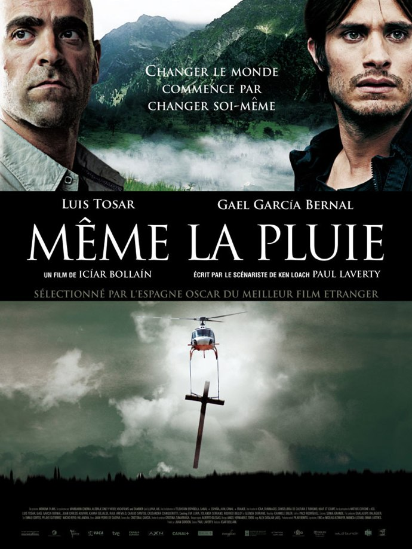
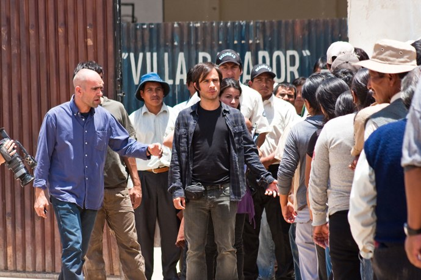

+++
type = "post"
titre = "Même la pluie, Icíar Bollain"
title = "Même la pluie, Icíar Bollain"
url = "/meme-la-pluie-bollain"
date = "2010-12-12T01:45:48"
Lastmod = "2013-04-02T15:03:59"
cover = "meme-la-pluie-garcia-bernal.jpg"
categorie = [ "À voir" ]
tag = [ "Arcs 2010", "Drame", "Festival", "Histoire", "Metafilm", "Société" ]
createur = [ "Icíar Bollain" ]
acteur = [ "Carlos Aduviri", "Gael García Bernal", "Luis Tosar" ]
annee = [ "2011" ]
weight = 2011
pays = [ "France", "Mexique" ]
original = "También la lluvia"

+++

Film sur un film en train de se faire, <em>Même la pluie</em> appartient donc à cette catégorie assez classique des metafilms. Le dernier long-métrage de la réalisatrice espagnole Icíar Bollain a néanmoins la bonne idée de ne pas en rester à cet aspect. Osant un parallèle entre la colonisation espagnole et la privatisation de l&rsquo;eau en Amérique du Sud, où l&rsquo;exploitation demeure, non plus pour de l&rsquo;or, mais pour de l&rsquo;eau, <em>Même la pluie</em> gagne en originalité. Si la comparaison est parfois un peu forcée, on ne peut nier son efficacité.

Sébastiàn est un jeune réalisateur qui débarque en Bolivie pour tourner le film qu&rsquo;il rêve de réaliser depuis de nombreuses années : une reconstitution historique des premières années de la colonisation américaine par les Espagnols. Le film se veut engagé et se concentre ainsi sur la personne de Bartolomé de Las Casas, célèbre moine qui s&rsquo;est engagé contre l&rsquo;esclavage et en faveur des Indiens qu&rsquo;il était l&rsquo;un des rares à considérer comme des êtres humains et non des bêtes. Face à lui, des colonisateurs autour de la figure mythique de Christophe Colomb, sûrs de leur bon droit et interprétant à leur guise les textes bibliques. Le film n&rsquo;est pas un blockbuster hollywoodien à gros budget, bien au contraire, et c&rsquo;est bien pour ça que le film est tourné en Colombie et avec un maximum de figurants locaux, payés deux dollars par jour. Mais le hasard du calendrier perturbe le bon déroulement du tournage : l&rsquo;eau vient d&rsquo;être privatisée à Cochabamba et les tarifs augmentent brusquement de 300 %. Une bonne partie de la population n&rsquo;y a alors plus accès et cette perte d&rsquo;un élément vital est insupportable, au sens premier du terme : une révolution éclate alors dans la ville et bouleverse le tournage, mais aussi ses participants.

<em>Même la pluie</em> est donc un film assez étonnant, mélange de reconstitutions historiques, de film sur un film en tournage avec les répétitions d&rsquo;acteurs, les castings ou encore le making-of en train de se faire, mais c&rsquo;est aussi un film de société sur la Bolivie d&rsquo;aujourd&rsquo;hui. C&rsquo;est un film engagé qui dénonce les dérives d&rsquo;un système capitaliste aussi extrême qu&rsquo;absurde ou l&rsquo;eau devient du jour au lendemain une denrée privée qui entend forcer les habitants à payer beaucoup plus pour ce qu&rsquo;ils avaient jusque-là à un tarif très réduit. La population étant composée en grande partie de personnes sous le seuil de pauvreté, l&rsquo;achat de l&rsquo;eau est tout simplement impossible. En clair, la privatisation prive une partie des habitants de la ville d&rsquo;un accès à l&rsquo;eau potable, c&rsquo;est-à-dire un accès à un élément absolument indispensable à la survie de l&rsquo;homme. Comme l&rsquo;histoire a eu maintes occasions de le montrer, c&rsquo;est seulement quand la survie est en jeu qu&rsquo;une population se révolte sérieusement et c&rsquo;est ce que montre très bien le film. L&rsquo;État a beau envoyer les forces de l&rsquo;ordre, puis l&rsquo;armée, rien n&rsquo;y fait puisque les habitants n&rsquo;ont plus rien à perdre. La violence ne peut dès lors que monter et c&rsquo;est justement ce qui arrive : l&rsquo;armée intervient à balles réelles, les blessés et les morts s&rsquo;accumulent et on est proche de la guerre civile. La fin est connue puisque le scénario s&rsquo;inspire de faits ayant réellement eu lieu en 2000 : la rue finit par l&rsquo;emporter, l&rsquo;eau est à nouveau nationalisée et l&rsquo;augmentation de tarif annulée.

Outre cet aspect social, <em>Même la pluie</em> montre le tournage en cours d&rsquo;un film historique. Pas grand-chose à voir avec le film de société à première vue, et pourtant les deux sont liés de manière plus profonde qu&rsquo;il pouvait n&rsquo;y paraître. Le lien le plus simple est évidemment technique : la grogne puis la révolte des habitants de Cochabamba gênent le tournage, quand elles ne le bloquent tout simplement pas. Un des acteurs principaux du film se trouve aussi être un des principaux leaders du mouvement et son action protestataire perturbe régulièrement le tournage, d&rsquo;autant qu&rsquo;il se fait blesser ou emprisonner par les policiers boliviens. Quand la situation s&rsquo;aggrave encore, le tournage doit quitter la région devenue trop dangereuse. Mais les liens sont plus forts encore puisque le film établit progressivement un parallèle entre les conquistadors en quête d&rsquo;or du XVIe siècle et les entreprises privées souvent espagnoles en quête d&rsquo;or, toujours, mais sous une forme différente. L&rsquo;eau a remplacé le métal, mais les oppositions demeurent entre Hispaniques et Indiens, même si c&rsquo;est désormais indirectement et si les oppositions sont plus internes, entre les Boliviens de l&rsquo;État et les Boliviens des rues. Dans certaines scènes, le parallèle est vraiment manifeste : les méthodes ont peut-être changé, mais les différences de traitement demeurent. On le voit aussi sur le tournage : les figurants indiens ou tous ceux qui construisent les décors sont regardés avec condescendance par l&rsquo;équipe d&rsquo;Occidentaux. Si ce parallèle est en règle générale plutôt fin et pas trop appuyé, Icíar Bollain se laisse aller à plusieurs reprises à la facilité avec un côté larmoyant un peu trop appuyé. La musique, très présente et un peu lourde, y participe bien sûr, mais il s&rsquo;agit aussi des larmes versées par les descendants des Indiens esclaves quand ils écoutent un prêtre s&rsquo;opposer à l&rsquo;esclavage. C&rsquo;est un peu trop gros, et en même temps c&rsquo;est un dispositif troublant et à cet égard assez efficace. Troublant parce que l&rsquo;on en vient à oublier le tournage, comme s&rsquo;il ne s&rsquo;agissait pas de répétitions pour un film en devenir, mais qu&rsquo;il s&rsquo;agissait vraiment du film d&rsquo;époque.

À film multiple, réalisation complexe. <em>Même la pluie</em> ne fait pas exception, avec un mélange de formats pour s&rsquo;adapter à ce que montre le film. Les images du film qui est en train de tourner bénéficient ainsi d&rsquo;une mise en scène particulière, assez classique, tandis que les scènes du réel entre les acteurs ou entre Boliviens sont filmées avec plus de naturel, sans forcément aller jusqu&rsquo;à la caméra à l&rsquo;épaule, mais avec un esprit documentaire. On trouve aussi des séquences en noir et blanc qui sont les séquences de making-of vues à travers l&rsquo;écran de contrôle d&rsquo;une petite caméra. Ce genre de construction complexe est dangereux tant il peut perturber la compréhension du film. Icíar Bollain s&rsquo;en sort plutôt bien et utilise volontairement les effets de décalage entre les différentes couches de son film. C&rsquo;est flagrant quand la voiture de policiers débarque après une scène assez impressionnante où des Indiens sont brûlés vifs par des soldats espagnols : les deux policiers deviennent à leur tour des Conquistadors et le film en train d&rsquo;être filmé semble se poursuivre alors que l&rsquo;on est bien entendu retourné à la réalité. <em>Même la pluie</em> doit beaucoup à ses comédiens : Gael Garcia Bernal est bon en jeune réalisateur plein de doutes, mais on retiendra surtout la performance de Carlos Aduviri, jeune acteur non professionnel bolivien qui est vraiment parfait dans son rôle difficile.

<em>Même la pluie</em> est indéniablement un film intéressant. Si son point de départ, le tournage d&rsquo;un film, est classique, l&rsquo;ajout de la réalité d&rsquo;un combat social est plus original et intéressant. Le parallèle entre les deux univers, l&rsquo;historique et le contemporain, fonctionne dans l&rsquo;ensemble plutôt bien, même si on regrette de temps en temps une trop grande insistance qui tend au larmoyant. C&rsquo;est dommage, parce que le film n&rsquo;avait pas besoin de cela pour toucher. Cela dit, le film d&rsquo;Icíar Bollain mérite amplement d&rsquo;être vu, ne serait-ce que pour en savoir plus sur cette privatisation d&rsquo;une denrée pourtant vitale et l&rsquo;incroyable lutte qui a suivi à Cochabamba.

<h3>Vous voulez m&rsquo;aider ?<a href="#footnote_0_4320" id="identifier_0_4320" class="footnote-link footnote-identifier-link" title="&Agrave; propos de la publicit&eacute;&hellip;">1</a></h3>
<ul>
<li><a href="http://www.amazon.fr/gp/product/B007BJPOJK/ref=as_li_ss_tl?ie=UTF8&#038;tag=leblogdenic07-21&#038;linkCode=as2&#038;camp=1642&#038;creative=19458&#038;creativeASIN=B007BJPOJK">Acheter le film en Blu-Ray sur Amazon</a></li>
<li><a href="http://www.amazon.fr/gp/product/B004SAVPDY/ref=as_li_ss_tl?ie=UTF8&#038;tag=leblogdenic07-21&#038;linkCode=as2&#038;camp=1642&#038;creative=19458&#038;creativeASIN=B004SAVPDY">Acheter le film en DVD sur Amazon</a></li>
<li><a href="https://itunes.apple.com/fr/movie/meme-la-pluie/id440087871">Acheter ou louer le film sur l&rsquo;iTunes Store</a></li>
</ul>

<ol class="footnotes"><li id="footnote_0_4320" class="footnote"><a href="http://voiretmanger.fr/soutien/">À propos de la publicité…</a> [<a href="#identifier_0_4320" class="footnote-link footnote-back-link">&#8617;</a>]</li></ol>
