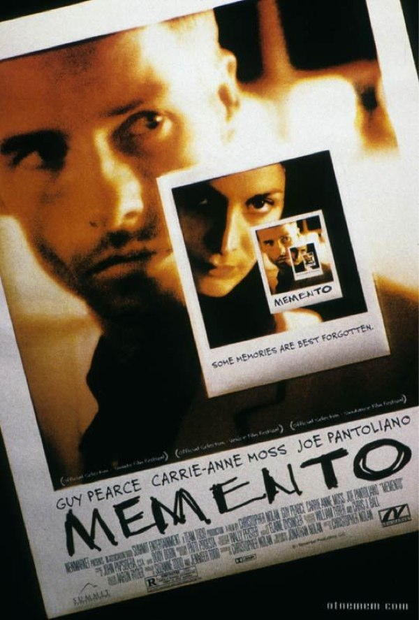
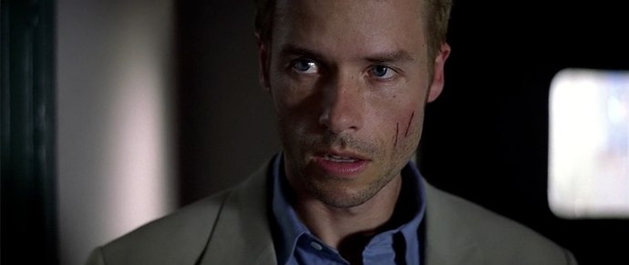
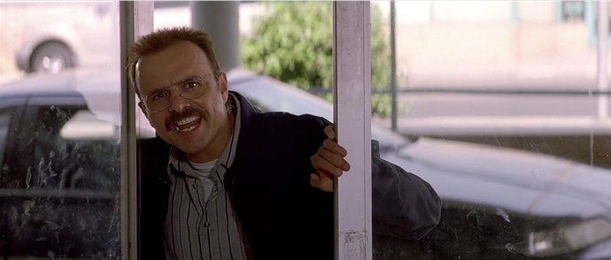

+++
type = "post"
titre = "<em>Memento</em>, Christopher Nolan"
title = "Memento, Christopher Nolan"
url = "/memento-nolan"
date = "2010-08-10T23:36:58"
Lastmod = "2014-11-05T22:38:54"
cover = "nolan-memento.jpg"
categorie = [ "À voir" ]
tag = [ "Amour", "Drame", "Mémoire", "Thriller" ]
createur = [ "Christopher Nolan" ]
acteur = [ "Carrie-Anne Moss", "Guy Pearce" ]
annee = [ "2000" ]
weight = 2000
pays = [ "États-Unis" ]

+++

Deuxième long-métrage de Christopher Nolan, <em>Memento</em> ne sort qu&rsquo;un an après <em><a href="/2010/08/02/following-nolan/">Following</a></em> et pourtant tout, ou presque, a changé pour le réalisateur. Le temps du petit film bricolé avec des amis est bel et bien terminé, place au film à gros budget américain. Le réalisateur n&rsquo;a pas cependant perdu ses ambitions en obtenant un budget conséquent, bien au contraire. Christopher Nolan joue, avec <em>Memento</em>, sur nos attentes de spectateurs habitués au cinéma traditionnel en déconstruisant totalement la linéarité attendue d&rsquo;un récit. Le résultat est brillant et porté par une maîtrise technique autant que scénaristique époustouflante.

Le film ouvre sur une image. On reconnaît sans peine le cliché de mauvaise qualité sorti d&rsquo;un Polaroïd et on distingue vaguement une forme tachée par ce qui ne semble pas être du ketchup, mais bien du sang. La main qui tient l&rsquo;image la secoue, pour la faire sécher, mais les couleurs s&rsquo;effacent et l&rsquo;image devient plus floue. On comprend vite que le film est en train d&rsquo;être passé à l&rsquo;envers et le générique entier sera l&rsquo;occasion de remonter jusqu&rsquo;au coup de feu, l&rsquo;occasion du&rsquo;n magnifique plan qui en impose immédiatement par sa maîtrise. Mais ce n&rsquo;est pas à un exercice de style futile que Christopher Nolan se livre : il annonce en fait, en quelques secondes de générique, tout le principe de <em>Memento</em>. L&rsquo;histoire qui nous est racontée l&rsquo;est par la fin. On voit le meurtre qui conclut en fait le film, on connaît le tueur, on connaît la victime : tous ces éléments sont autant de détails presque futiles, en tout cas d&rsquo;une faible importance. Ce que montre <em>Memento</em>, c&rsquo;est comment on est arrivé à ce meurtre, en partant de ce dernier pour remonter jusqu&rsquo;aux origines, le tout du point de vue du tueur qui se trouve aussi être complètement amnésique.

Leonard, c&rsquo;est son nom, a perdu sa femme dans des évènements tragiques, comme on dit pudiquement : des hommes l&rsquo;ont violé et assassiné chez eux, une nuit. Voulant l&rsquo;aider, il se fait agresser par un des malfrats et s&rsquo;en tire avec une amnésie totale pour tous les évènements récents. Il se souvient parfaitement de sa vie antérieure, mais n&rsquo;a aucun souvenir de sa vie après l&rsquo;accident. Il peut discuter avec quelqu&rsquo;un, et oublier totalement deux minutes après qu&rsquo;il a déjà rencontré cette personne. Pourtant, Leonard a une obsession depuis le meurtre de sa femme : retrouver et tuer le meurtrier. Pour ne pas oublier cette quête de vengeance, il prend des notes en permanence, photographie tout ce qu&rsquo;il peut et va même jusqu&rsquo;à se graver sur toute la surface de sa peau les éléments les plus importants. Cette vengeance est la seule raison qui le pousse à vivre et il consacre toute son énergie à elle. <em>Memento</em> ne s&rsquo;intéresse qu&rsquo;à quelques jours de sa vie ; on ne sait pas au début depuis combien de temps il cherche vengeance, lui-même ne le sait plus. On le voit traquer un certain John G., entouré de plusieurs personnes qui semblent toutes vouloir l&rsquo;aider. Il y a Teddy, un policier un peu louche et Natalie, une jeune serveuse aux motifs pas vraiment très clairs. Autant le dire, on sent d&rsquo;emblée que ces deux-là ne sont pas forcément totalement gentils et bien attentionnés. Il faut dire que cet amnésique est une cible trop facile : on peut lui dire quelque chose à un moment, et lui dire autre chose cinq minutes après sans qu&rsquo;il s&rsquo;en aperçoive. On comprend vite que Teddy comme Natalie poursuivent leurs propres objectifs et se servent d&rsquo;un Leonard bien trop crédule.

L&rsquo;idée de commencer une histoire par la fin n&rsquo;est pas très originale : de nombreuses œuvres, romanesques ou cinématographiques, suivent cette logique. Mais en général, elles commencent par la fin avant de reprendre la chronologie pour expliquer ce qui a conduit à la fin. Christopher Nolan a décidé de prendre le problème à bras le corps et d&rsquo;inverser totalement son film qui ouvre sur la fin et se termine sur le début. Sur le papier, c&rsquo;est assez banal, une simple question de montage inversé. Mais ce pari est très risqué, tant l&rsquo;histoire peut devenir incompréhensible ou le film peut contenir des invraisemblances. Pourtant, <em>Memento</em> s&rsquo;engage d&rsquo;un pas décidé sur cette voie et il la tient d&rsquo;une main de maître de la première image au dernier plan. Pendant près de deux heures, Christopher Nolan réussit l&rsquo;exploit de nous raconter une histoire à l&rsquo;envers sans perdre les spectateurs, et sans perdre lui-même son histoire. Une telle maîtrise est bluffante, surtout quand on considère la faible expérience du réalisateur, mais elle l&rsquo;est d&rsquo;autant plus que, ne reculant devant aucune difficulté, <em>Memento</em> reprend par moment le sens chronologique. Pour bien marquer la différence, Nolan utilise le principe bien connu du noir et blanc qui signale en temps normal un flashback. Le film n&rsquo;étant entièrement qu&rsquo;un flashback, ce n&rsquo;est pas vraiment le cas ici, mais on comprend aisément que les couleurs s&rsquo;effacent pour signaler que le temps s&rsquo;écoule à nouveau dans le sens normal. Les deux récits, chronologique et inversement chronologique, se déroulent en parallèle pour se rejoindre finalement quand une scène bascule du noir et blanc à la couleur. On est frappé, en regardant le film, de constater que Christopher Nolan parvient à rendre toute cette structure parfaitement transparente, au point même de finir par la trouver bien banale. Le spectateur déjà abasourdi par tant de maîtrise est achevé <em>in fine</em> par un twist que je ne révélerai pas, mais qui permet de relire entièrement le film. Classique, là encore, mais bien vu.

Ce jeu sur la chronologie est aussi l&rsquo;occasion de développer quelques thématiques intéressantes autour du souvenir et de la mémoire. La quête de vengeance de cet amnésique devient totalement absurde : sans ses tatouages, sans ses notes et sans sa propre mythologie, il aurait totalement oublié jusqu&rsquo;à l&rsquo;existence de sa femme. Cet acharnement est très impressionnant parce qu&rsquo;il est absurde, justement. En venir à marquer de manière définitive son corps avec une plaque de voiture en dit long sur sa folie, ou son amour sans limites, c&rsquo;est selon. L&rsquo;histoire qu&rsquo;il ne cesse de se répéter et de répéter à qui veut l&rsquo;entendre de cet homme qui souffre des mêmes symptômes que lui et qui finit par tuer sa femme qui espérait toujours qu&rsquo;il allait retrouver sa mémoire, est le symbole de cet amour absolu et en même temps de l&rsquo;incapacité de vivre sans mémoire. Un homme sans mémoire est-il encore vraiment humain ? Regarder <em>Memento</em> 10 ans après, c&rsquo;est aussi constater que Christopher Nolan brasse quelques thématiques communes de film en film, comme s&rsquo;il ne faisait jamais qu&rsquo;un seul film, sur des modes différents. On retrouve cette passion pour les scénarios alambiqués en même temps qu&rsquo;une capacité assez sidérante pour les rendre totalement clairs et même transparents. On retrouve aussi la perte d&rsquo;une femme comme point originel de toute l&rsquo;histoire, exactement comme dans <em><a href="/2010/07/17/inception-nolan/">Inception</a></em> pour se limiter à son travail le plus récent.

Quand <em>Memento</em> se termine, on reste un peu abasourdi devant tant de maîtrise et de naturel pour raconter une histoire entièrement dans le sens inverse, de la fin au début. Sans jamais perdre l&rsquo;ombre d&rsquo;un instant un spectateur, Christopher Nolan déroule avec une assurance complète son scénario, sans le remettre en cause et sans offrir de failles. Un puzzle brillant et qui plus est remis en cause à la toute fin… un vrai bonheur qui ne nie jamais pour autant son statut de film grand public. Une réussite, à (re)voir !

<h3>Vous voulez <a href="/soutien/">m&rsquo;aider</a> ?</h3>
<ul>
<li><a href="http://www.amazon.fr/gp/product/B003YCM03Q/ref=as_li_ss_tl?ie=UTF8&amp;tag=leblogdenic07-21&amp;linkCode=as2&amp;camp=1642&amp;creative=19458&amp;creativeASIN=B003YCM03Q">Acheter le film en Blu-ray sur Amazon</a></li>
<li><a href="http://www.amazon.fr/gp/product/B00A3WSQ92/ref=as_li_ss_tl?ie=UTF8&amp;tag=leblogdenic07-21&amp;linkCode=as2&amp;camp=1642&amp;creative=19458&amp;creativeASIN=B00A3WSQ92">Acheter le film en DVD sur Amazon</a></li>
</ul>

