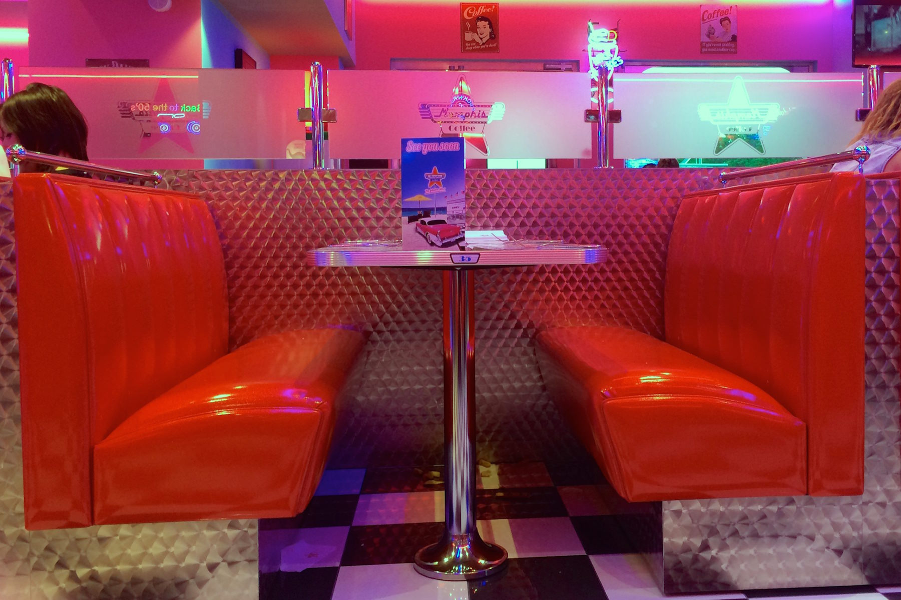
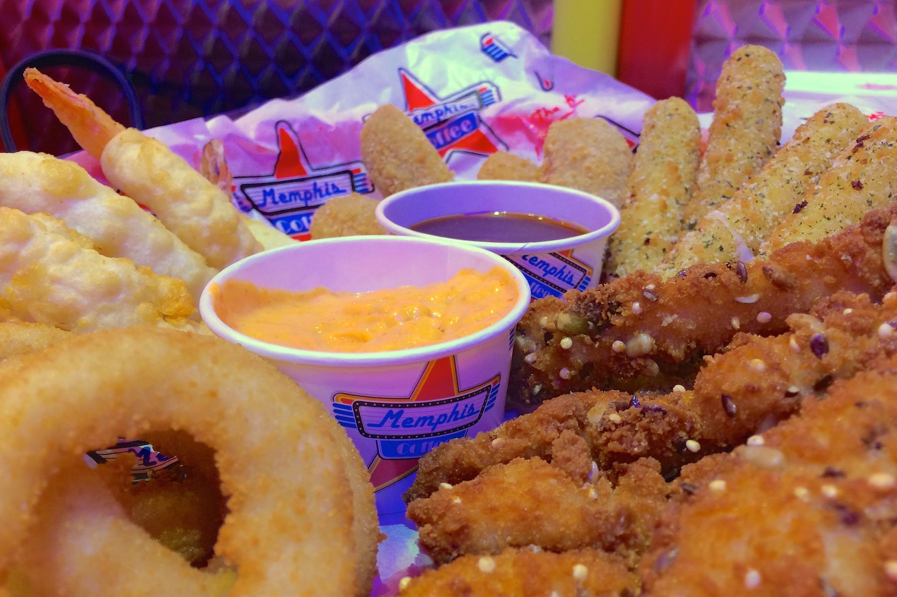
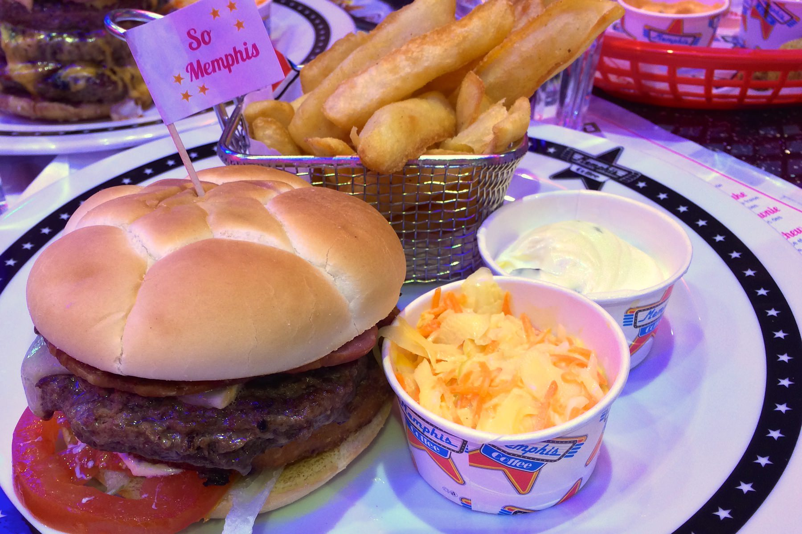
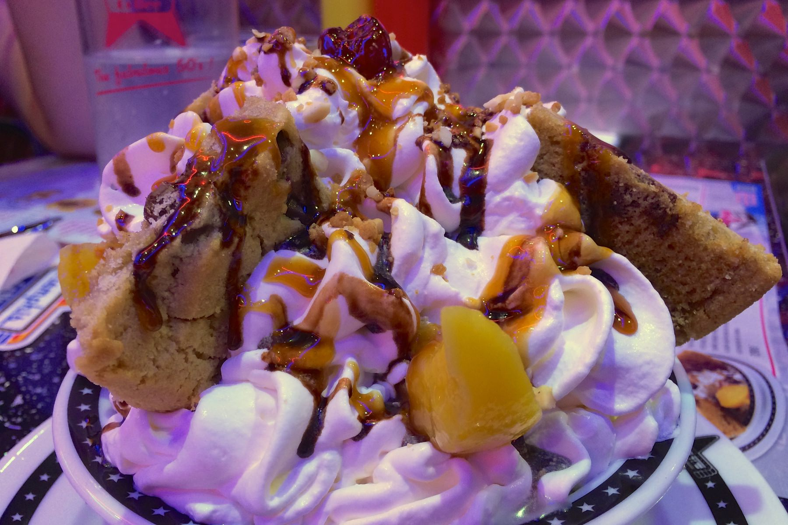

+++
titre = "Le Memphis Coffee à Vénissieux"
title = "Le Memphis Coffee à Vénissieux"
url = "/memphis-coffee-venissieux"
date = "2014-06-29T12:16:40"
Lastmod = "2014-06-29T12:21:38"
cover = "memphis-coffee-lyon.jpg"
categorie = [ "À manger" ]
tag = [ "Cadre original", "Cuisine américaine", "Fast-food", "Hamburger" ]

+++

Parmi tous les réseaux de restaurants américains, la trentaine de franchises <a href="http://www.memphis-coffee.com/fr/memphis_coffee-1.html"><strong>Memphis Coffee</strong></a> a fait un choix radical. Chaque adresse ressemble à un vrai <em>diner</em> à l&rsquo;américaine, comme ceux que l&rsquo;on voit dans les films. Banquettes en skaï pailletées, couleurs criardes jusqu&rsquo;aux néons omniprésents, tables en aluminium… on se croirait dans les années 1950. Une vraie réussite pour le décor, mais qu&rsquo;en est-il des burgers ?

Premier constat quand on entre dans un <strong>Memphis Coffee</strong> : l&rsquo;illusion est réussie. Celui de Vénissieux, collé contre le périphérique, coincé entre un Leclerc Drive et un Babou, avait bien besoin de cette touche d&rsquo;exotisme pour oublier son cadre totalement dénué de charme. Pourtant, avec sa façade en métal brillant, on le remarque et on commence déjà à se sentir loin de la banlieue lyonnaise. À l&rsquo;intérieur, le monde ajouté à la musique d&rsquo;Elvis assez forte créent une ambiance bruyante un peu lourde. Le dimanche soir, il y a beaucoup de familles avec enfants et l&rsquo;ambiance est survoltée, mais on ne vient pas ici pour un repas dans le calme, on vient ici pour manger américain. Et à nouveau, il faut saluer le décor soigné et pensé jusqu&rsquo;aux moindres détails. Même les serveurs sont habillés comme, on imagine, l&rsquo;étaient ceux des vrais <em>diners</em> des années 1950. De quoi se mettre dans l&rsquo;ambiance avant de commander…

À la carte, <a href="http://www.memphis-coffee.com/fr/la_carte-69.html">aucune surprise</a> : on vient pour manger américain, on aura de l&rsquo;américain. On peut compter ainsi sur un large choix de burgers, tous assez traditionnels. Contrairement à d&rsquo;autres chaînes de burgers, comme <a href="http://voiretmanger.fr/big-fernand-lyon/" title="Big Fernand à Lyon"><strong>Big Fernand</strong></a>, on reste ici dans la pure tradition avec des steaks de bœuf, du bacon, du fromage et quelques crudités. Le fromage varie d&rsquo;un sandwich à l&rsquo;autre, on peut aussi augmenter le nombre de steaks et donc la hauteur du burger, mais on ne peut pas vraiment sortir des sentiers battus, même si le poulet est représenté timidement. Si vous n&rsquo;aimez pas les burgers, vous pourrez compter sur quelques sandwichs club, des salades, un peu de tex-mex et des grillades, mais l&rsquo;essentiel ici se concentre autour du burger, ce qui est logique. Niveau prix, comptez une dizaine d&rsquo;euros au minimum pour un hamburger avec frites, les prix montant jusqu&rsquo;à 25 € pour le « Crazy Memphis » qui compte quatre pains et six steaks, rien de moins. Pour agrémenter ce plat de résistance, les plus gourmands peuvent compter sur quelques entrées et des desserts gargantuesques… on ne vient pas ici pour un régime.

Dans l&rsquo;assiette, on a des produits de meilleure qualité qu&rsquo;une chaîne de restauration rapide traditionnelle, ce qui est encore heureux au prix demandé. Les tapas sont corrects, même si on sent bien qu&rsquo;il s&rsquo;agit uniquement de produits congelés. Les sauces font la différence et c&rsquo;est une entrée à partager réussie. Les burgers sont bien réalisés et plutôt savoureux : on aurait aimé une viande un peu moins banale, mais au moins était-elle cuite comme on le souhaitait. Les fromages auraient pu avoir plus de caractère, mais ils sont présents en bouche, les pains font le travail demandé. À défaut d&rsquo;être les meilleurs de la ville, ce sont des burgers très honorables. Pour onze ou douze euros, on en a pour son argent, avec en plus des frites en quantité et un peu de coleslaw, tradition américaine oblige. Les desserts ne sont jamais des patisseries faites sur place, mais on pourra se tourner vers les desserts glacés qui devraient être difficiles à terminer, même pour les plus gourmand. Le « King of the Kings » rassemble trois boules de glace quelconques, mais c&rsquo;est surtout la tonne de chantilly, les énormes morceaux de cookies, les pèches et le caramel et le chocolat liquide sur le dessus qui font la différence. Mieux vaut être trois ou quatre pour finir ce dessert chargé en chantilly au-delà du raisonnable…

<strong>Memphis Coffee</strong> n&rsquo;a pas l&rsquo;ambition de servir une cuisine inventive ou moderne, encore moins une cuisine légère. Décoré comme un <em>diner</em> sorti tout droit des États-Unis des années 1950, ce restaurant propose des plats traditionnels et lourds comme il faut. Les prix sont raisonnables et la qualité au rendez-vous dans l&rsquo;ensemble : si vous cherchez ce genre de cuisine, c&rsquo;est donc un bon choix.

