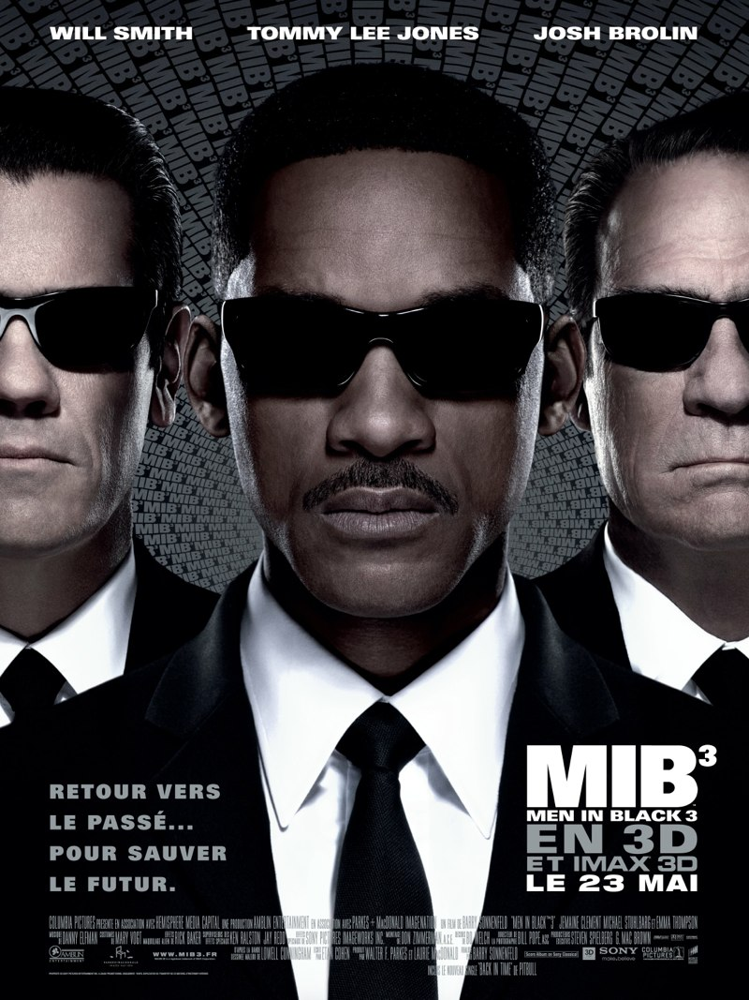
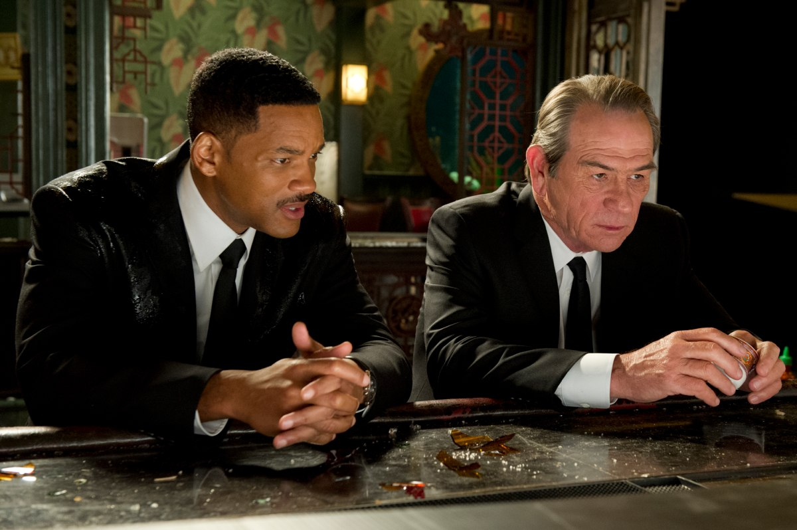
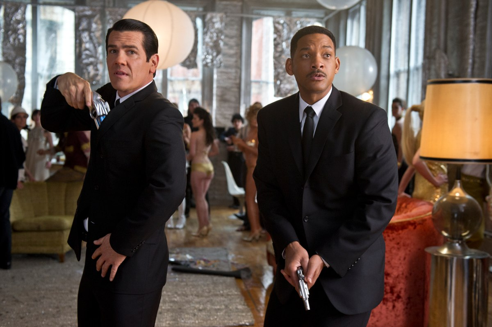

+++
type = "post"
titre = "<em>Men In Black 3</em>, Barry Sonnenfeld"
title = "Men In Black 3, Barry Sonnenfeld"
url = "/men-in-black-3-sonnenfeld"
date = "2012-05-27T19:11:41"
Lastmod = "2014-10-24T23:59:22"
cover = "men-in-black-3-sonnenfeld-lee-jones-smith.jpg"
categorie = [ "À voir" ]
tag = [ "Action", "Blockbuster", "Extra-terrestre", "Humour", "Saga", "Science-Fiction", "Vite oublié", "Voyage temporel" ]
createur = [ "Barry Sonnenfeld" ]
acteur = [ "Josh Brolin", "Tommy Lee Jones", "Will Smith" ]
annee = [ "2012" ]
weight = 2012
saga = [ "Men in Black" ]
pays = [ "États-Unis" ]

+++

Dix ans après <em><a href="/2012/04/23/men-in-black-sonnenfeld/">MIIB</a></em>, le deuxième épisode des hommes en noir présents sur Terre pour contrôler les extraterrestres, la saga revient sur les écrans. Pour renouveler le plaisir et éviter la répétition, Barry Sonnenfeld utilise pour <em>Men In Black 3</em> une idée qui a toujours eu beaucoup de succès en science-fiction : le voyage dans le temps. Le résultat est plaisant, même si l&rsquo;effet de surprise du tout premier film est bien passé. Un blockbuster sympa pour une séance ciné que l&rsquo;on pourra ensuite vite oublier…

L&rsquo;agent J a été employé par l&rsquo;agence des Men In Black depuis une quinzaine d&rsquo;années. Il est toujours en équipe avec l&rsquo;agent K, repêché dans un bureau de Poste de l&rsquo;Amérique profonde dans <em>MIIB</em>, ce même agent qui l&rsquo;avait embauché 15 ans auparavant, dans <a href="/2012/04/23/men-in-black-sonnenfeld/"><em>Men In Black</em></a>. Les deux hommes ont fait un long chemin ensemble, mais J ignore toujours tout de K, ou presque. Le vieil agent ne semble pas particulièrement prêt à dévoiler tout son passé à son coéquipier et les deux agents ne se connaissent pas véritablement. Les évènements vont toutefois précipiter un retour vers le passé : le terriblement laid Boris s&rsquo;échappe de sa prison lunaire construite spécialement pour le retenir. Il revient alors sur Terre, plus énervé que jamais et décide de remonter dans le temps. Été 1969, ce vil extraterrestre voulait déjà détruire notre planète, mais le tout jeune agent K des MIB l&rsquo;arrête juste à temps et l&rsquo;emprisonne pour quarante ans. Boris entend revenir sur ces faits et tuer cet agent pour détruire enfin la Terre. Pour sauver à la fois son équipier et la planète, l&rsquo;agent J voyage à son tour dans le temps où il doit faire équipe avec le jeune agent K…

Le voyage dans le temps est une idée qui fascine la science-fiction depuis que le genre existe. L&rsquo;idée de pouvoir remonter le temps et vivre ce qui s&rsquo;est passé il y a plusieurs années est l&rsquo;objet de tous les fantasmes, mais c&rsquo;est un exercice difficile. Le voyage temporel met à mal la logique en introduisant nécessairement la notion de réalités parallèles : si vous remontez le temps et que vous modifiez le passé, vous modifiez nécessairement le présent dans le même temps. <em>Men In Black 3</em> se frotte à cet exercice difficile, en prenant le parti plutôt avisé de rester assez simple. Barry Sonnenfeld en reste ainsi à un seul voyage temporel : l&rsquo;agent J remonte en 1969 où il rencontre l&rsquo;agent K qui n&rsquo;a alors même pas 30 ans. Ils modifient ce passé en ne changeant qu&rsquo;une seule chose : K tue Boris plutôt que de l&rsquo;emprisonner comme il l&rsquo;avait fait dans la réalité initiale. Au total, quand on revient au présent du film, rien n&rsquo;a changé, ou presque. Nonobstant un changement de personnalité du côté de K, le présent n&rsquo;a pas été bouleversé par ce voyage et la logique reste globalement en place. <em>Men In Black 3</em> n&rsquo;est ainsi pas un de ces films qui imposent à ses spectateurs un véritable puzzle où les pièces doivent être replacées, souvent sans logique parfaite. Certains le regretteront peut-être, mais le film reste dans la logique des blockbusters et Barry Sonnenfeld a su proposer un troisième opus fun.

<em>Men In Black 3</em> reste globalement assez léger et on retrouve l&rsquo;humour des deux premiers. Le sarcasme de l&rsquo;agent K fait toujours son effet dans le présent du film, tandis que toute la partie située en 1969 joue sur les décalages de la société. L&rsquo;agent J est noir, ce qui n&rsquo;est pas anodin dans un pays encore profondément raciste. Barry Sonnenfeld s&rsquo;amuse à intégrer à son récit l&rsquo;histoire connue de tous : on croise ainsi un Andy Warhol devenu l&rsquo;agent W. L&rsquo;artiste travaille en fait pour les MIB et son statut n&rsquo;est qu&rsquo;une couverture dont il se lasse d&rsquo;ailleurs : l&rsquo;entendre dire qu&rsquo;il n&rsquo;a plus d&rsquo;idées et qu&rsquo;il en est réduit à peindre des boites de conserve est évidemment très efficace pour les contemporains. Comme Michael Bay avant lui dans <a href="/2011/06/30/transformers-3-face-cachee-lune-bay/"><em>Transformers 3 : La Face cachée de la Lune</em></a>, le cinéaste utilise la conquête spatiale et en particulier les premiers pas de l&rsquo;homme sur la Lune, mais <em>Men In Black 3</em> le fait de manière beaucoup plus subtile. Malgré ces touches légères, voire humoristiques, et malgré le renouvellement du couple de flic qui fonctionne plutôt bien, le dernier film de la saga ne fonctionne plus aussi bien qu&rsquo;avant. L&rsquo;effet de nouveauté est de l&rsquo;histoire ancienne et <em>Men In Black 3</em> semble par moment aussi las que peut l&rsquo;être l&rsquo;agent K. Le résultat reste plaisant et parfait pour une séance du dimanche, mais on espère que la saga en restera là.

<em>Men In Black</em> et <em>MIIB</em> nous avaient habitué à un défilé de créatures toutes plus répugnantes les unes que les autres. <em>Men In Black 3</em> a réduit sensiblement la dose, mais son unique méchant est particulièrement réussi. En dix ans, les techniques ont évolué et les effets spéciaux de ce film sont bien fichus. Les scènes de combat sont intenses et bien fichues, même si le film accuse par moment de légères baisses de rythme. Barry Sonnenfeld fait toutefois son travail correctement et on ne s&rsquo;ennuie pas, avec une 3D qui est, une fois n&rsquo;est pas coutume, bien utilisée. On est ici dans le domaine du gadget, contrairement à ce que l&rsquo;on a pu voir chez <a href="/createur/james-cameron/">James Cameron</a> par exemple, mais c&rsquo;est un gadget bien utilisé et on se prend plein de bouillie d&rsquo;extraterrestres et autres projectiles à la figure. Si vous n&rsquo;êtes pas allergique au procédé, on peut le recommander pour une fois. <em>Men In Black 3</em> emploie à nouveau Tommy Lee Jones et Will Smith pour ses rôles principaux et les deux acteurs n&rsquo;ont plus rien à prouver. La bonne surprise vient plutôt d&rsquo;un Josh Brolin épatant pour interpréter l&rsquo;agent K, jeune. La ressemblance physique entre les deux acteurs n&rsquo;est pas évidente au premier abord, mais il a su prendre les mêmes mimiques et expressions que Tommy Lee Jones et la comparaison est troublante, d&rsquo;autant que la voix est extrêmement similaire.

Si vous avez aimé les deux premiers films de la saga, vous devriez apprécier <em>Men In Black 3</em> sans trop de problèmes. Même si l&rsquo;effet de surprise du premier n&rsquo;est plus là, même si l&rsquo;humour n&rsquo;est pas toujours aussi présent qu&rsquo;avant, Barry Sonnenfeld a réussi à proposer un film qui tient la route et qui reste très fun à regarder. L&rsquo;idée du retour dans le passé était risquée, mais elle est bien maîtrisée et l&rsquo;ensemble reste plaisant. <em>Men In Black 3</em> a peut-être simplement comme défaut de se prendre un peu trop au sérieux, mais le spectacle est sans conteste au rendez-vous…

<h3>Vous voulez m&rsquo;aider ?<a href="#footnote_0_6575" id="identifier_0_6575" class="footnote-link footnote-identifier-link" title="&Agrave; propos de la publicit&eacute;&hellip;">1</a></h3>
<ul>
<li><a href="http://www.amazon.fr/gp/product/B007SVG4UO/ref=as_li_ss_tl?ie=UTF8&tag=leblogdenic07-21&linkCode=as2&camp=1642&creative=19458&creativeASIN=B007SVG4UO">Acheter le film en Blu-Ray sur Amazon</a></li>
<li><a href="http://www.amazon.fr/gp/product/B002L73XTU/ref=as_li_ss_tl?ie=UTF8&tag=leblogdenic07-21&linkCode=as2&camp=1642&creative=19458&creativeASIN=B002L73XTU">Acheter le film en DVD sur Amazon</a></li>
<li><a href="http://www.amazon.fr/gp/product/B00865827O/ref=as_li_ss_tl?ie=UTF8&tag=leblogdenic07-21&linkCode=as2&camp=1642&creative=19458&creativeASIN=B00865827O">Acheter la trilogie en Blu-Ray sur Amazon</a></li>
<li><a href="http://clk.tradedoubler.com/click?p=23753&a=403761&g=0&td_partnerId=2003&url=http://itunes.apple.com/fr/movie/men-in-black-3/id550453639">Acheter ou louer le film sur l&rsquo;iTunes Store</a></li>
</ul>

<ol class="footnotes"><li id="footnote_0_6575" class="footnote"><a href="http://nicolinux.fr/soutien/">À propos de la publicité…</a> [<a href="#identifier_0_6575" class="footnote-link footnote-back-link">&#8617;</a>]</li></ol>
