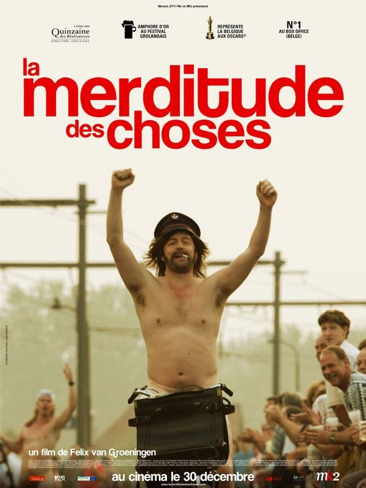
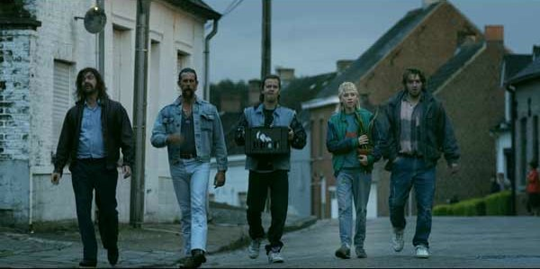
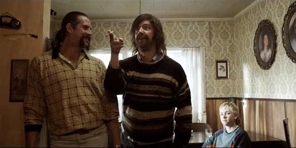

+++
titre = "<em>La merditude des choses</em>, Felix van Groeningen"
title = "La merditude des choses, Felix van Groeningen"
url = "/merditude-choses-groeningen"
date = "2010-01-13T00:16:08"
Lastmod = "2014-02-17T14:55:03"
cover = "De-Helaasheid-der-Dingen.jpg"
categorie = [ "À voir" ]
tag = [ "Adaptation littéraire", "Comédie dramatique", "Famille", "Humour" ]
createur = [ "Felix van Groeningen" ]
acteur = [ "Johan Heldenbergh", "Koen De Graeve", "Pauline Grossen", "Wouter Hendrickx" ]
annee = [ "2009" ]
weight = 2009
pays = [ "Belgique", "Pays-Bas" ]
original = "De Helaasheid der Dingen"

+++

Le très ségolénien titre ne me disait rien qui vaille, pas plus que l&rsquo;affiche, encore moins que le synopsis. Rien ne me disait en fait dans ce film belge de Felix van Groeningen et pourtant, <em>La merditude des choses</em> ne manque pas de qualités. C&rsquo;est même un beau film sur une famille un peu barrée et un garçon qui essaie de s&rsquo;en sortir au milieu de tout ça.

À la manière de Proust et de sa <em>Recherche</em><a href="#footnote_0_2476" id="identifier_0_2476" class="footnote-link footnote-identifier-link" title="Euh, toutes proportions gard&eacute;es, quand m&ecirc;me&hellip; :-D">1</a>, le film raconte l&rsquo;histoire de Günther Strobbe adulte qui écrit un livre sur son enfance. Ce livre en train de s&rsquo;écrire, c&rsquo;est le film qui se ferme d&rsquo;ailleurs sur la promesse d&rsquo;une publication. <a href="http://www.allocine.fr/article/fichearticle_gen_carticle=18590962.html">Apparemment</a>, le film est l&rsquo;adaptation d&rsquo;un roman et il n&rsquo;y aurait donc aucun lien entre Felix van Groeningen, réalisateur et scénariste, et Günther. Ceci étant, le récit est souvent troublant de réalisme, d&rsquo;autant que l&rsquo;action se passe dans des années 1980 (à la louche, c&rsquo;était peut-être 1970&rsquo;s) fort bien reconstituées.

Cette famille de losers ivrognes obligés de vivre chez leur mère à 30 ou 40 ans passés est très crédible et assez horrible. Son univers se limite aux bars et à la bière, parfois coupée de vodka ou de whisky. Les frères Strobbe passent leur temps au café et à décuver, quand ils ne participent pas à la course cycliste locale (qui se pratique, on l&rsquo;aura compris, nu) ou au concours du plus gros buveur de bières. Günther, 13 ans, a du mal à trouver sa place au milieu de ces ivrognes, dont son père fait partie d&rsquo;ailleurs. Sa mère l&rsquo;a abandonné et il ne lui reste plus, outre les frères, que sa grand-mère qui essaie vainement de ramener ses fils à la raison et la sobriété. Alcool aidant, la famille connaît régulièrement la violence, le plus souvent psychologique, mais aussi parfois physique. Le père bat son fils, le fils sait descendre une pinte d&rsquo;une traite, il fume et c&rsquo;est lui qui doit appeler le patron de son père pour signaler l&rsquo;absence de ce dernier après l&rsquo;avoir retrouvé allongé dans son propre vomi.

L&rsquo;esthétisme n&rsquo;est pas au vocabulaire de <em>La merditude des choses</em> qui emprunte au contraire une image très réaliste, souvent granuleuse d&rsquo;ailleurs. Résultat, toute cette atmosphère entre boisson, chansons paillardes (dont une mémorable sur une chatte humide, mais pas à cause de la pluie) et vomi fait forte impression au début. Mais on s&rsquo;y habitue vite et il finit même par se dégager de cet univers crade une certaine poésie. Le film ne donne jamais vraiment dans la surenchère parodique, mais privilégie au contraire le réalisme. Comme je l&rsquo;ai dit, on y croit.

On croit aussi à ce jeune Günther qui gère comme il peut son vélo en panne qui le fait arriver en retard à l&rsquo;école et les multiples punitions qu&rsquo;il y reçoit. Il a tellement l&rsquo;habitude des punitions qu&rsquo;il demande immédiatement à son professeur le sujet. L&rsquo;excellente idée du scénario est de faire remonter le désir d&rsquo;écrire du Günther adulte dans ces punitions : à force, Günther le jeune prend du plaisir à écrire ce qui lui passe par la tête puisque, de toute façon, personne ne le lit. Peu à peu, on a le sentiment qu&rsquo;il se fait punir exprès pour pouvoir rédiger un nouveau texte. Et c&rsquo;est finalement un écrivain qui naît dans ce cadre pour le moins hostile au développement littéraire. Une belle idée, je trouve…

Finalement, on sort de la salle content d&rsquo;avoir passé quasiment 2h en compagnie d&rsquo;une famille de tarés dans un univers des plus sales, voire glauques. Le film accuse bien de quelques longueurs sur la fin, mais on ne s&rsquo;ennuie pas, on rigole parfois (mais pas tant que ça) et on regarde avec émotion comment un homme tente tant bien que mal de s&rsquo;en sortir alors que les choses sont, comme le titre le signale, une belle merditude. La vie d&rsquo;adulte n&rsquo;est pas beaucoup plus rose pour Günther, même si la <em>Merditude des choses</em> se termine positivement : comparé à ce qui précède, on peut même parler de <em>happy-end</em>.

Les avis sont positifs dans la blogosphère, que ce soit chez <a href="http://plan-c.over-blog.com/article-la-merditude-des-choses-des-brelles-dans-la-vie-du-brel-dans-l-esprit-42161137.html">Alexandre</a>, chez <a href="http://www.surlarouteducinema.com/archive/2010/01/05/la-merditude-des-choses-de-felix-van-groeningen.html">Pascale</a> (qui fait de <em>La merditude des choses</em> un anti <em>Bienvenue chez les Ch&rsquo;tis </em>: je trouve ça très bien trouvé&#8230;) ou chez <a href="http://www.critikat.com/La-Merditude-des-choses.html"><em>Critikat</em></a>.

<h3>Vous voulez m&rsquo;aider ?<a href="#footnote_1_2476" id="identifier_1_2476" class="footnote-link footnote-identifier-link" title="&Agrave; propos de la publicit&eacute;&hellip;">2</a></h3>
<ul>
<li><a href="http://www.amazon.fr/gp/product/B003BWDEVG/ref=as_li_ss_tl?ie=UTF8&#038;tag=leblogdenic07-21&#038;linkCode=as2&#038;camp=1642&#038;creative=19458&#038;creativeASIN=B003BWDEVG">Acheter le film en DVD sur Amazon</a></li>
</ul>

<ol class="footnotes"><li id="footnote_0_2476" class="footnote">Euh, toutes proportions gardées, quand même… :-D [<a href="#identifier_0_2476" class="footnote-link footnote-back-link">&#8617;</a>]</li><li id="footnote_1_2476" class="footnote"><a href="http://voiretmanger.fr/soutien/">À propos de la publicité…</a> [<a href="#identifier_1_2476" class="footnote-link footnote-back-link">&#8617;</a>]</li></ol>
