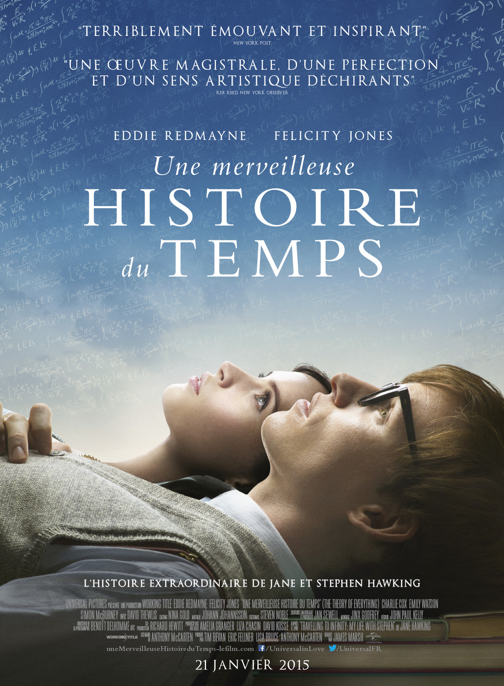

+++
titre = "<em>Une merveilleuse histoire du temps</em>, James Marsh"
title = "Une merveilleuse histoire du temps, James Marsh"
url = "/merveilleuse-histoire-temps-marsh"
date = "2015-01-21T00:15:42"
Lastmod = "2015-01-21T00:20:37"
cover = "merveilleuse-histoire-du-temps-eddie-redmayne.jpg"
categorie = [ "À voir" ]
tag = [ "Adaptation littéraire", "Amour", "Biopic", "Drame", "Espace", "Famille", "Handicap", "Histoire vraie", "Maladie", "Mélodrame", "Science", "Sorties du mois", "Vite oublié" ]
createur = [ "James Marsh" ]
acteur = [ "David Thewlis", "Eddie Redmayne", "Felicity Jones", "Harry Lloyd" ]
annee = [ "2015" ]
weight = 2015
pays = [ "Grande-Bretagne" ]
original = "The Theory of Everything"

+++

Avec pareil titre, vous vous attendiez à une relecture vulgarisée d&rsquo;<em>Une brève histoire du temps</em> de Stephen Hawking ? Grave erreur : le dernier long-métrage de James Marsh est un biopic du célèbre scientifique handicapé par une grave maladie tout autant que génie de l&rsquo;espace et du temps. Facteur aggravant, <em>Une merveilleuse histoire du temps</em> est l&rsquo;adaptation d&rsquo;une biographie écrite par Jane, sa première épouse. Autant dire qu&rsquo;il ne faut pas s&rsquo;attendre à de longs discours scientifiques et que vous en apprendrez beaucoup plus en lisant la <a href="https://fr.wikipedia.org/wiki/Stephen_Hawking">fiche Wikipedia de Stephen Hawking</a> qu&rsquo;en deux heures de film. Ce qui intéresse James Marsh, c&rsquo;est plutôt l&rsquo;histoire d&rsquo;amour entre Stephen et Jane et leur combat au quotidien. Il faut reconnaître que c&rsquo;est une histoire assez incroyable, mais il faut aussi accepter une bonne dose de mélo pour la suivre. L&rsquo;ensemble est d&rsquo;un classicisme un peu lourdaud, mais <em>Une merveilleuse histoire du temps</em> reste agréable à regarder.

Classique, c&rsquo;est bien le mot qui convient pour caractériser <em>Une merveilleuse histoire du temps</em>. Comme tout bon biopic qui se respecte, il suit strictement l&rsquo;ordre chronologique et s&rsquo;intéresse aux années les plus intéressantes de l&rsquo;homme raconté, en l&rsquo;occurrence des années d&rsquo;études à Cambridge jusqu&rsquo;à la reconnaissance internationale de Stephen Hawking avec la publication de son livre <em>Une brève histoire du temps</em>. De 1963 à la fin des années 1980, James Marsh résume une vie en deux heures, mais comme on le disait en préambule, il ne s&rsquo;intéresse pas vraiment au travail de son sujet. Du scientifique génial, on ne voit que peu de choses, si ce n&rsquo;est quelques équations sur des tableaux noirs et sur le papier blanc d&rsquo;une thèse, et quelques très brefs extraits de conférences où Hawking a pu exposer ses dernières idées, ainsi que des réflexions éparses avec sa femme sur l&rsquo;espace, le temps et la création de l&rsquo;univers. Autant le dire, c&rsquo;est un décor plus qu&rsquo;un vrai sujet et le film se contente le plus de saupoudrer quelques scènes de pincées scientifiques. <em>Une merveilleuse histoire du temps</em> ne fait pas vraiment illusion et l&rsquo;on sortira déçu si l&rsquo;on attendait plus, ce n&rsquo;est clairement pas le sujet choisi par le réalisateur qui adapte la biographie de Jane Hawking. De fait, la femme de Stephen est très présente dans le récit, on peut même presque dire que c&rsquo;est elle qui est le personnage principal. Leur rencontre motive la majorité de la première partie à Cambridge et par la suite, le film adopte souvent son point de vue, plus que celui du scientifique. Sans surprise, leur histoire d&rsquo;amour est au cœur des enjeux, comme l&rsquo;affiche le montrait bien, au fond.

Stephen Hawking vient à peine de rencontrer sa future épouse qu&rsquo;il apprend qu&rsquo;il est malade. Les docteurs ne lui donnent que deux ans à vivre au mieux et il cherche logiquement à couper les ponts avec ses amis et avec Jane. Mais celle-ci refuse cet isolement et elle s&rsquo;obstine : elle l&rsquo;aime et elle veut vivre le maximum de temps possible avec lui. C&rsquo;est une bien belle histoire, incontestablement, et on comprend que James Marsh s&rsquo;en empare. <em>Une merveilleuse histoire du temps</em> devient ainsi le récit atypique d&rsquo;une histoire d&rsquo;amour très surprenante. Au fur et à mesure que le film avance, l&rsquo;état du scientifique s&rsquo;aggrave à vue d&rsquo;œil et il ne faut pas longtemps pour qu&rsquo;il ne puisse plus se déplacer seul, et même qu&rsquo;il finisse par ne plus parler du tout. Jane ne savait probablement pas qu&rsquo;elle allait affronter une vie aussi difficile avec un mari aussi dépendant et même si c&rsquo;est horrible à dire, on finit par comprendre qu&rsquo;elle ne pensait pas vivre aussi longtemps avec Stephen Hawking. Elle s&rsquo;est peut-être mariée pensant qu&rsquo;il disparaitrait rapidement et elle finit par se fatiguer de cette vie impossible. C&rsquo;est horrible, cela aurait été un excellent sujet de film, mais ce n&rsquo;est pas celui de James Marsh. <em>Une merveilleuse histoire du temps</em> reste bien éloigné de ces considérations, alors que le cinéaste reste obstinément sur le mode du mélodrame. Le scénario avait de la matière à exploiter pour être vraiment passionnant, soit autour de ce mariage heureux qui se délite, soit autour des théories scientifiques de Stephen Hawing qui s&rsquo;inversent constamment<a href="#fn-12934-1" rel="footnote">1</a>. Le film reste pourtant au biopic facile et un peu plat, ce qui est vraiment dommage, d&rsquo;autant qu&rsquo;il tient un acteur vraiment parfait dans le mimétisme. Sa prestation est taillée pour les récompenses, il n&rsquo;en reste pas moins qu&rsquo;Eddie Redmayne est spectaculaire et compose un Stephen Hawking plus vrai que nature.

<em>Une merveilleuse histoire du temps</em> est bourré de défauts, avec un traitement visuel aussi caricatural que sa musique — les nappes de violon sur des images sepia, ça fait beaucoup de clichés pour un seul film — et son traitement assez plat, loin des enjeux les plus passionnants, est assez frustrant. James Marsh se contente de signer un biopic classique, beaucoup trop classique, là où on voyait un film aux enjeux autrement plus importants. Malgré tout, la performance de son acteur principal reste si impressionnante qu&rsquo;elle compense à elle seule ces défauts et justifie de voir le film. <em>Une merveilleuse histoire du temps</em> est peut-être calibré pour les Oscars, mais c&rsquo;est un divertissement qui sait rester efficace… à défaut d&rsquo;être un film mémorable.

<ol>
<li id="fn-12934-1">
Dans le film, on voit déjà une inversion entre la thèse initiale du scientifique qui considère que l&rsquo;univers à une origine, à une idée ultérieure qui veut que l&rsquo;univers est en fait infini et sans point d&rsquo;origine. Depuis, Stephen Hawking a encore changé d&rsquo;avis sur les trous noirs, qu&rsquo;il <a href="https://fr.wikipedia.org/wiki/Stephen_Hawking#Nouvelle_th.C3.A9orie_sur_les_trous_noirs">estime impossibles</a>… Voilà un sujet, certes complexe, mais qu&rsquo;il aurait été passionnant de traiter.&#160;<a href="#fnref-12934-1" rev="footnote">&#8617;</a>
</li>
</ol>

