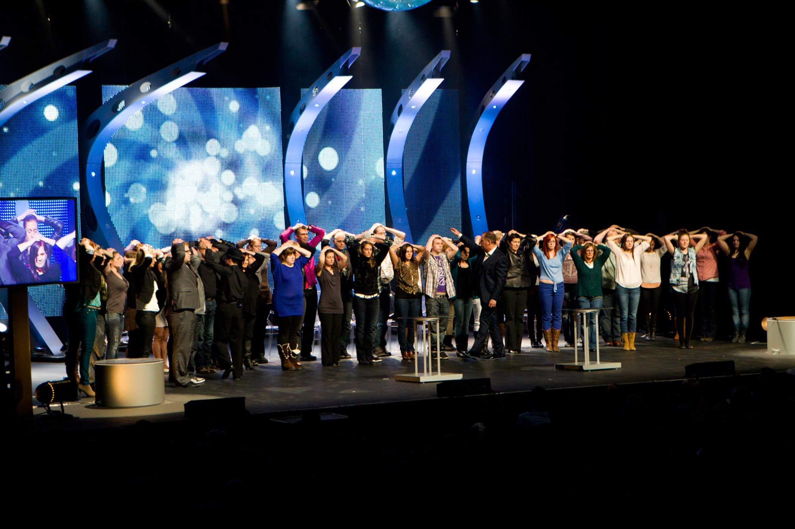

+++
titre = "<em>Messmer Intemporel</em> à la Bourse du Travail (20 février 2015)"
title = "Messmer Intemporel à la Bourse du Travail (20 février 2015)"
url = "/messmer-intemporel-lyon-fevrier-2015"
date = "2015-02-21T00:39:09"
Lastmod = "2015-02-21T00:41:12"
cover = "messmer-intemporel.jpg"
categorie = [ "À voir… en live" ]
tag = [ "Humour", "Hypnose", "Spectacle" ]
createur = [ "Messmer" ]
pays = [ "Canada" ]
lieu = [ "Bourse du Travail" ]

+++

Je dois reconnaître que je faisais partie des sceptiques. En matière d&rsquo;hypnose, comme dans beaucoup de domaines qui sortent de la science cartésienne la plus primaire, je doute. Ainsi, j&rsquo;avais vu l&rsquo;hypnotiseur canadien Messmer sur les plateaux télévisés et dans des reportages, mais je n&rsquo;arrivais pas à y croire. C&rsquo;est forcément truqué, me disais-je, il y a nécessairement une préparation et tous ceux qui tombent comme des mouches face au « fascinateur », comme on dit de l&rsquo;autre côté de l&rsquo;Océan, devaient être des complices. Pour ne pas mourir totalement idiot, nous avons décidé de voir ce que Messmer pouvait donner sur scène. Autant sur un plateau télévisé, tout peut être préparé, autant dans une salle de spectacle, avec un vrai public, c&rsquo;est beaucoup plus compliqué. Je suis entré sceptique, pour ressortir de <em>Messmer Intemporel</em> totalement convaincu et surtout ravi d&rsquo;avoir vu deux heures époustouflantes et, contre toute attente, très drôles.

<em>Messmer Intemporel</em> commence pourtant assez mal. Pour une raison qui reste assez mystérieuse, le spectacle ouvre… sur une revue de presse. Sur les écrans placés de part et d&rsquo;autre de la scène, on a d&rsquo;abord des extraits d&rsquo;émission où Messmer a été applaudi et même des coupures de presse illisibles à cette distance. L&rsquo;ensemble est assez déplacé, car l&rsquo;hypnotiseur semble avoir besoin de justifier sa présence et sa popularité, ce qui pourrait renforcer les sceptiques. S&rsquo;il a besoin de tant se justifier, n&rsquo;est-ce pas un écran de fumée qui cache sa nature de charlatan ? Fort heureusement, cette séquence ne dure qu&rsquo;un temps et l&rsquo;homme finit par entrer sur scène, une entrée d&rsquo;ailleurs extrêmement théâtrale, à l&rsquo;américaine. Tout le <em>show</em> est à l&rsquo;égal de cette arrivée : c&rsquo;est millimétré, réglé avec minutie et la mise en scène n&rsquo;a jamais peur d&rsquo;en faire trop. Les éclairages sont spectaculaires, la musique est toujours énorme et Messmer n&rsquo;hésite pas à sortir un véritable faux grimoire pour tirer sur la corde sensible familiale ; bref, c&rsquo;est un vrai <em>show</em> et on sent bien que ce n&rsquo;est pas un spectacle européen. Un paradoxe, quand on sait que <em>Messmer Intemporel</em> est entièrement construit grâce à des volontaires sélectionnés dans la salle, et donc que c&rsquo;est un spectacle changeant, chaque jour un petit peu différent. Et d&rsquo;ailleurs, à part les ouvertures et fermetures théâtrales, la majorité des deux heures que l&rsquo;on passe avec Messmer respirent un peu plus, et sont beaucoup plus agréables. Car, le clou du spectacle, c&rsquo;est bien entendu l&rsquo;hypnose.

Les pieds bien à plat et parallèle, collez les paumes des deux mains au-dessus de vos têtes, fermez les yeux et au bout de trois, vous ne pourrez plus écarter vos mains. Passées les formalités introductives, Messmer entre rapidement dans le vif du sujet avec un premier test pour déterminer les bons sujets, c&rsquo;est-à-dire les personnes dans le public qui sont les plus réceptives à l&rsquo;hypnose. Pour la majorité de la salle, ces instructions suivies à la lettre ne donnent rien : un peu déçu, on peut ouvrir la main, et on commence à se dire que c&rsquo;est un petit peu n&rsquo;importe quoi. Sauf qu&rsquo;autour de vous, quelques dizaines de personnes ont toujours leurs mains bien collées au-dessus de la tête. Elles ne semblent plus conscientes, elles ne réagissent plus vraiment… si ce n&rsquo;est aux instructions de l&rsquo;hypnotiseur. Tous ceux qui ont réagi correctement sont appelés à monter sur scène et le spectacle peut alors vraiment commencer. Il faut le voir pour le croire : Messmer fait ce qu&rsquo;il veut des candidats qu&rsquo;il sélectionne, mais vraiment tout. Ils peuvent avoir l&rsquo;impression de dormir, retomber en enfance en marchant à quatre pattes, ou alors retomber à l&rsquo;ère préhistorique en devant des australopithèques qui ne marchent pas droit. Ils peuvent danser n&rsquo;importe quelle danse, devenir n&rsquo;importe qui, ou même un animal. Lors de notre représentation, un homme qui avait l&rsquo;air tout à fait sain d&rsquo;esprit est devenu un kangourou et pendant près d&rsquo;une heure, il a passé son temps à sauter sur ses pieds et à attraper des cacahouètes au vol. Et que dire de ce couple d&rsquo;hommes sommé de simuler un accouchement, avec l&rsquo;un deux qui hurle de douleurs quand on lui suggère qu&rsquo;il a des contractions ? Ou bien cet autre couple sommé de venir s&rsquo;enlacer dès qu&rsquo;ils entendent la musique de <em>Top Gun</em> et qui, tout hétérosexuels qu&rsquo;ils étaient manifestement, ne peuvent rien faire, si ce n&rsquo;est se retrouver à chaque fois qu&rsquo;ils entendent la musique.

Il faut bien reconnaître que, malgré son spectacle un peu trop huilé parfois, Messmer est vraiment bluffant. Vous pouvez entrer aussi sceptique que vous voulez, vous ne pourrez pas croire un instant à de la manipulation. Les personnes qui sont hypnotisées ne peuvent pas simuler leur surprise quand elles sortent de leur état d&rsquo;hypnose et quand elles se rappellent, parfois vaguement, ce qu&rsquo;elles ont fait. Quand on voit le regard inquiet des proches quand ils découvrent que le charme a agit sur une connaissance et quand on voit la réaction de choc des hypnotisés, on ne peut que reconnaître que ce n&rsquo;est pas une arnaque. <em>Messmer Intemporel</em> est, à cet égard, vraiment impressionnant et on en sort avec l&rsquo;envie d&rsquo;en savoir plus sur cet art finalement assez méconnu. Messmer s&rsquo;en sert aujourd&rsquo;hui à des fins de divertissement, avec beaucoup de succès d&rsquo;ailleurs — on rigole souvent, à l&rsquo;insu des volontaires et on comprend mieux pourquoi les caméras sont strictement interdites —, mais ce n&rsquo;est pas qu&rsquo;un jeu. Manifestement, l&rsquo;hypnose peut beaucoup plus, et ce spectacle est une bonne introduction, en plus d&rsquo;être un excellent divertissement. Si Messmer passe près de chez vous, vous auriez tort de ne pas vous précipiter…

