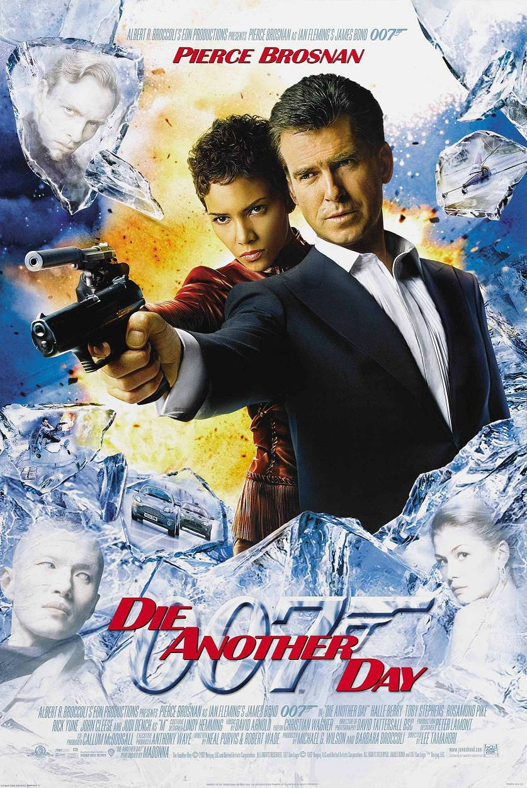
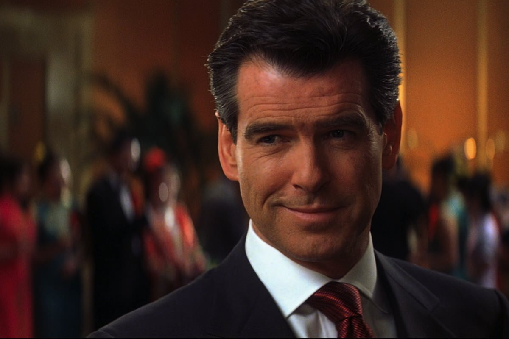
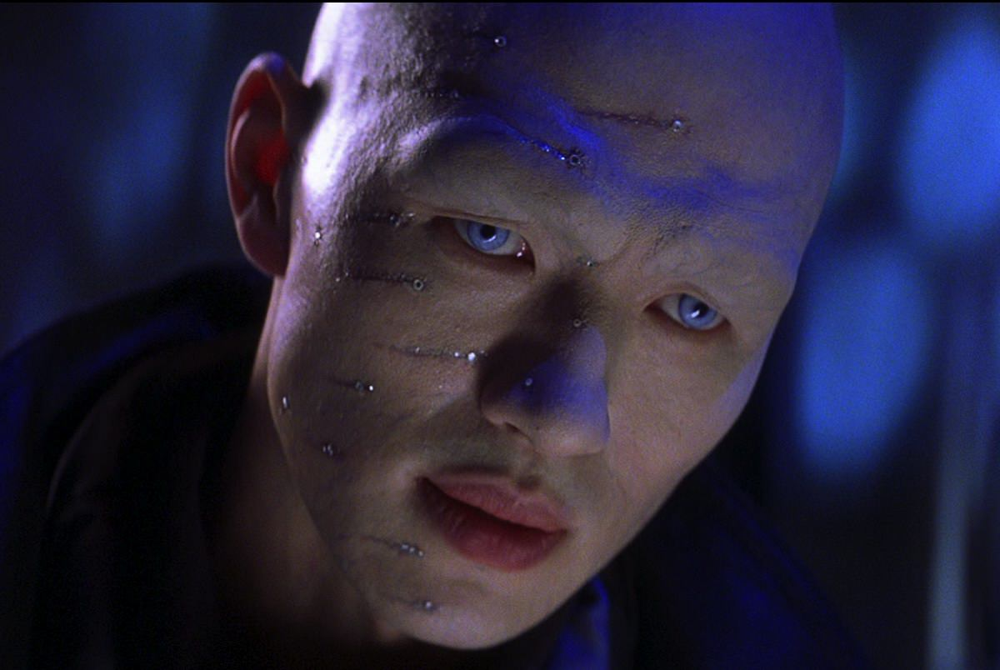

+++
type = "post"
titre = "<em>Meurs un autre jour</em>, Lee Tamahori"
title = "Meurs un autre jour, Lee Tamahori"
url = "/meurs-un-autre-jour-tamahori"
date = "2012-12-16T09:00:15"
Lastmod = "2013-05-11T09:53:48"
cover = "pierce-brosnan-meurs-un-autre-jour.jpg"
categorie = [ "À voir" ]
tag = [ "Action", "Blockbuster", "Espionnage", "James Bond" ]
createur = [ "Lee Tamahori" ]
acteur = [ "Halle Berry", "John Cleese", "Judi Dench", "Pierce Brosnan", "Rosamund Pike", "Toby Stephens" ]
annee = [ "2002" ]
weight = 2002
saga = [ "James Bond" ]
pays = [ "États-Unis" ]
original = "Die another day"

+++

Le vingtième film de la saga <em>James Bond</em> coïncide avec son quarantième anniversaire. <em>Meurs un autre jour</em> sort en 2002, quarante ans tout juste après les débuts de l’agent secret dans <em>James Bond 007 contre Dr No</em>. Un épisode important d’abord pour cette raison, mais aussi parce que c’est le dernier de Pierce Brosnan, le dernier représentant d’une certaine époque également. Épisode de rupture, <em>Meurs un autre jour</em> signe la fin d’une époque avec un hommage appuyé à toute la saga, tente à moitié une modernisation avec un début très noir, sans toutefois atteindre le sérieux de l’époque Daniel Craig. Lee Tamahori se fait manifestement plaisir avec ce blockuster explosif, quitte à en faire vraiment trop. Après des débuts prometteurs, le long-métrage revient dans l’outrance et l’excès… dommage.

L’histoire commence cette fois en Corée du Nord. James Bond est en mission pour tuer le fils d’un général qui vend illégalement des armes. Il prend la place d’un acheteur qui vient dans le pays avec une mallette pleine de diamants, mais l’agent secret est trahi. Il tente une mission pour s’en sortir et alors que tout semble se dérouler comme au début de <a href="http://voiretmanger.fr/2012/12/02/demain-ne-meurt-jamais-spottiswoode/" title="Demain ne meurt jamais, Roger Spottiswoode - À voir et à manger"><em>Demain ne meurt jamais</em></a>, l’impensable se produit. L’agent 007 est capturé et fait prisonnier. Pendant près d’un an et demi, il croupit au fond de geôles nord-coréennes où il est torturé sans relâche, jusqu’au jour où le MI6 l’échange pour le mettre à la retraite. James Bond n’entend pas en rester là toutefois et il part à la recherche de celui qui l’a trahi. D’abord seul, sans le soutien du MI6 et même poursuivi par son agence, il suit la trace du traitre et découvre un vaste plan qui met la sécurité de la planète en danger…

<em>Meurs un autre jour</em> commence de façon très originale dans la saga. La première séquence en Corée du Nord impose d’emblée sa différence avec une image totalement désaturée, assez proche du noir et blanc qui ouvre <a href="http://voiretmanger.fr/2012/11/18/casino-royale-campbell/" title="Casino Royale, Martin Campbell - À voir et à manger"><em>Casino Royale</em></a>. Ce n’est pas qu’une coquetterie de Lee Tamahori toutefois : le pré-générique de ce vingtième épisode est très sérieux, brutal même. L’action se veut réaliste et, à l’exception de quelques explosions déjà un peu trop impressionnantes pour être vraies, <em>Meurs un autre jour</em> s’avère très efficace, d’autant que la fin sur l’emprisonnement de James Bond constitue une vraie surprise alors que tout semblait aller pour le mieux pour l’agent secret. Le générique lui-même surprend : s’il reprend l’approche esthétique des films précédents et même s’il exploite la chanson d’une star — Madonna en l’occurrence —, il participe à l’intrigue du long-métrage en détaillant les conditions d’emprisonnement de l’agent et surtout ses tortures successives. <em>Meurs un autre jour</em> reprend ensuite dix-sept mois après avec un James Bond fatigué, sali et barbu. C’est une première pour la saga qui avait jusque-là l’habitude de présenter un agent toujours impeccable et en tout cas jamais aussi abimé. C’est gonflé et bien vu, une idée qui modernise une saga qui avait tendance à perdre de son souffle, une idée qui sera d’ailleurs exploitée à plusieurs reprises par la suite, que ce soit dans <em>Casino Royale</em> ou encore le très récent <a href="http://voiretmanger.fr/2012/10/27/skyfall-mendes/" title="Skyfall, Sam Mendes - À voir et à manger"><em>Skyfall</em></a>. 

Ce début prometteur ne fait que renforcer la déception de ce qui suit. Après une première demi-heure modernisée avec cette séquence réaliste en Corée du Nord, <em>Meurs un autre jour</em> revient sur les rails et offre tous les archétypes de la saga, jusqu’à l’excès. Le film de Lee Tamahori aurait pourtant pu bien se terminer, l’enquête menée par un James Bond rejeté par le MI6 qui croit qu’il a parlé pendant sa torture n’est pas sans intérêt et les nombreux clins d’œil à la saga <em>James Bond</em> dans son ensemble sont plaisants. Le scénario opère finalement un revirement en faisant réintégrer l’agent secret. À partir du moment où il retrouve le MI6, James Bond reprend ses habitudes avec la secrétaire Moneypenny, les gadgets de Q, le briefing de M et tout le décorum. On peut considérer que <em>Meurs un autre jour</em> offre un hommage appuyé à la saga en ce quarantième anniversaire et c’est sûrement le cas, en partie du moins. Hommage ou non, Lee Tamahori donne trop dans la surenchère pour convaincre et même si le scénario reste plus simple et lisible que dans <em>Le monde ne suffit pas</em> — il y a bien des agents doubles, mais un seul qui ne change pas de camp plusieurs fois —, on retrouve ce même désir d’action exacerbée qui convient si peu à la saga. Ce vingtième épisode ne manque pourtant pas d’idées, à l’image de ce très bel hôtel de glace et du décor alentour qui offre quelques impressionnantes scènes de course-poursuite. Le film semble toutefois dépassé par les moyens techniques à sa disposition, et perd ainsi en réalisme. 

Les effets spéciaux numériques ont fait leur apparition dans <a href="http://voiretmanger.fr/2012/11/25/goldeneye-campbell/" title="GoldenEye, Martin Campbell - À voir et à manger"><em>GoldenEye</em></a>, sept ans avant le film de Lee Tamahori. Le cinéaste néo-zélandais les utilise avec la ferme intention d’en mettre plein la vue, mais cette utilisation à excès conduit plutôt à l’effet inverse. À force de voir d’énormes explosions produites par une seule balle, on finit par ne plus croire aux scènes d’action de <em>Meurs un autre jour</em>. De même, les gadgets sont surexploités dans ce film, à tel point que la course-poursuite qui devait pourtant être mythique — avec le retour des Aston Martin — ne ressemble finalement qu’à une caricature de course-poursuite de <em>James Bond</em>. Sans compter que le scénario exploite ces gadgets un peu à la légère, à l’image de la voiture censée devenir transparente qui manque de crédibilité. Fort heureusement, Pierce Brosnan assure le show, sans être exceptionnel non plus, même si l’acteur révèle un autre aspect de son jeu avec sa période d’emprisonnement. Autour de l’agent secret, Halle Berry constitue une James Bond girl étonnante qui accompagne et aide le héros, John Cleese fait une apparition trop courte en guise de Q et Rosamund Pike est la deuxième girl du film. <em>Meurs un autre jour</em> ne brille pas par sa distribution, renforçant le sentiment que les effets spéciaux plus que tout autre chose ont motivé les concepteurs du film.

<em>Le monde ne suffit pas</em> était tombé dans un excès de complexité, avec un scénario qui ne tenait pas la route en étant trop compliqué. Avec <em>Meurs un autre jour</em>, les producteurs sont tombés dans l’excès inverse : l’usage trop intense des gadgets et les effets pyrotechniques démesurés donnent le sentiment que tout est facile pour James Bond. Un comble pour un film qui commence au contraire sur la torture de l’agent secret ! Lee Tamahori n’a pas su exploiter ce début original et c’est bien dommage. En l’état, <em>Meurs un autre jour</em> est un film d’action assez banal et un <em>James Bond</em> plutôt décevant… 

<strong>James Bond reviendra dans… <a href="http://voiretmanger.fr/2012/11/18/casino-royale-campbell/" title="Casino Royale, Martin Campbell - À voir et à manger"><em>Casino Royale</em></a></strong>

<h3>Vous voulez m’aider ?<a href="#footnote_0_7961" id="identifier_0_7961" class="footnote-link footnote-identifier-link" title="&Agrave; propos de la publicit&eacute;&hellip;">1</a></h3>
<ul>
<li><a href="http://www.amazon.fr/gp/product/B001D45CI2/ref=as_li_ss_tl?ie=UTF8&#038;tag=leblogdenic07-21&#038;linkCode=as2&#038;camp=1642&#038;creative=19458&#038;creativeASIN=B001D45CI2">Acheter le film en Blu-Ray sur Amazon</a></li>
<li><a href="http://www.amazon.fr/gp/product/B000NJM5WE/ref=as_li_ss_tl?ie=UTF8&#038;tag=leblogdenic07-21&#038;linkCode=as2&#038;camp=1642&#038;creative=19458&#038;creativeASIN=B000NJM5WE">Acheter le film en DVD sur Amazon</a></li>
<li><a href="https://itunes.apple.com/fr/movie/meurs-autre-jour-die-another/id561626857">Acheter ou louer le film sur l’iTunes Store</a></li>
</ul>
<ul>
<li><a href="http://www.amazon.fr/gp/product/B006VCDMQU/ref=as_li_ss_tl?ie=UTF8&#038;tag=leblogdenic07-21&#038;linkCode=as2&#038;camp=1642&#038;creative=19458&#038;creativeASIN=B006VCDMQU">Acheter le coffret <em>James Bond</em> en Blu-Ray sur Amazon</a></li>
<li><a href="http://www.amazon.fr/gp/product/B006VCDMD8/ref=as_li_ss_tl?ie=UTF8&#038;tag=leblogdenic07-21&#038;linkCode=as2&#038;camp=1642&#038;creative=19458&#038;creativeASIN=B006VCDMD8">Acheter le coffret <em>James Bond</em> en DVD sur Amazon</a></li>
</ul>

<ol class="footnotes"><li id="footnote_0_7961" class="footnote"><a href="http://voiretmanger.fr/soutien/">À propos de la publicité…</a> [<a href="#identifier_0_7961" class="footnote-link footnote-back-link">&#8617;</a>]</li></ol>
