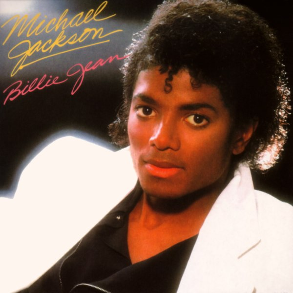
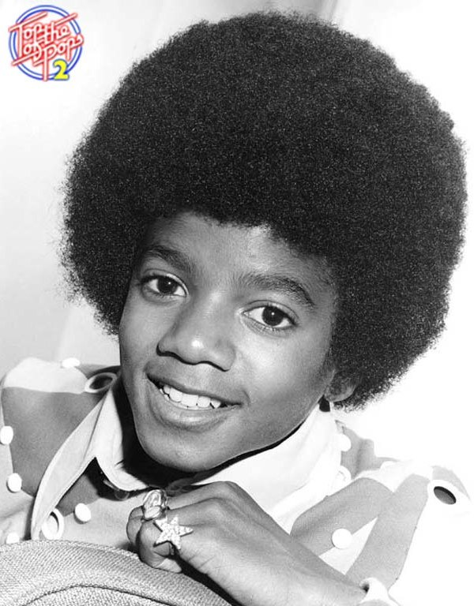
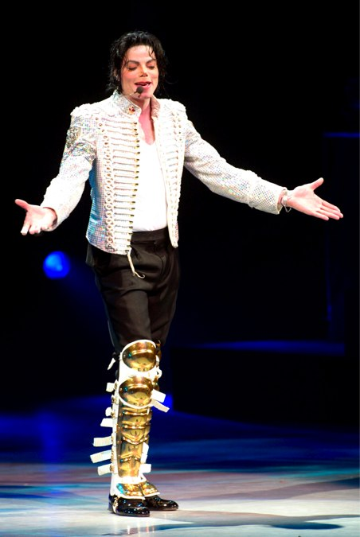
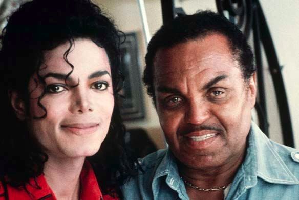
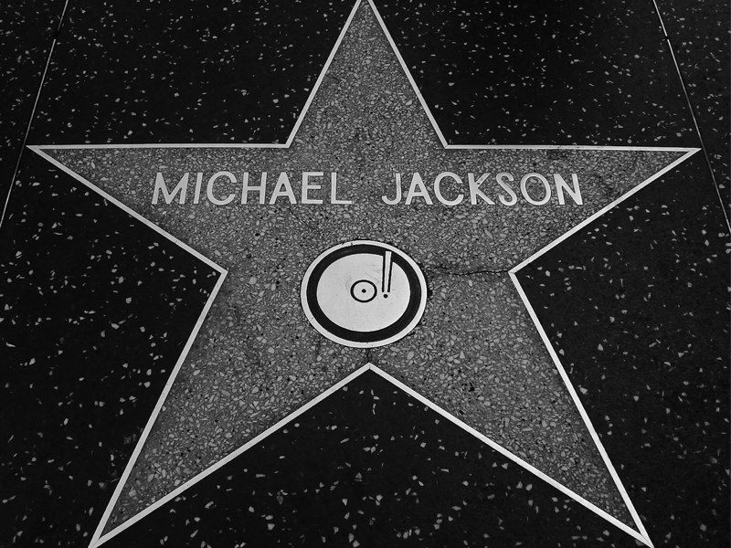

+++
titre = "Michael Jackson, un phénomène fascinant"
title = "Michael Jackson, un phénomène fascinant"
url = "/michael-jackson-phenomene-fascinant"
date = "2009-07-18T00:03:22"
Lastmod = "2012-02-11T11:55:30"
cover = "michael-jackson-flickr.jpg"
categorie = [ "Musique" ]
tag = [ "Pop", "Société", "Star" ]
createur = [ "Michael Jackson" ]
annee = [ "2009" ]
weight = 2009
pays = [ "États-Unis" ]

+++

Ce billet ne devrait sans doute pas exister. J&rsquo;ai d&rsquo;ailleurs longuement hésité, mais il me travaille depuis trop longtemps pour l&rsquo;ignorer. À quoi bon écrire sur Michael Jackson ? Que n&rsquo;a-t-on pas déjà dit et écrit, jusqu&rsquo;à l&rsquo;épuisement total du sujet ? Tous les qualificatifs possibles et imaginables sont ressortis pour qualifier la vie et l&rsquo;œuvre du &laquo;&nbsp;<em>King of pop</em>&laquo;&nbsp;, jusqu&rsquo;à l&rsquo;absurde même.

J&rsquo;ai longtemps totalement ignoré Michael Jackson. Bien sûr, je connaissais vaguement ses classiques, mais j&rsquo;ignorais ostensiblement l&rsquo;artiste aussi bien que l&rsquo;œuvre. Il faut dire que je l&rsquo;ai découvert tardivement, pendant les années 1990, années qui ne sont pas vraiment restées dans la mémoire comme de bonnes années pour Michael Jackson. Étonnamment donc, ça n&rsquo;est pas sa mort qui m&rsquo;a conduit à le découvrir, mais le hasard plutôt.

Comme j&rsquo;ai déjà eu longuement l&rsquo;occasion de l&rsquo;évoquer ici, j&rsquo;ai découvert le rap en fin d&rsquo;année dernière et je crois que cela a durablement changé quelque chose dans ma façon d&rsquo;écouter et de concevoir la musique. Beaucoup de cloisonnements ont disparu, et notamment celui qui me faisait identifier la musique des années 1980 à de la soupe commerciale inaudible. C&rsquo;est à l&rsquo;occasion d&rsquo;un <a href="http://www.igen.fr/itunes/la-fnac-propose-aussi-des-albums-en-mp3-2-99-8065">test de musique pas chère pour iGeneration</a> que j&rsquo;ai repéré <em>Thriller</em> à 3 € et que je me suis lancé. J&rsquo;avais été incité en cela par <a href="http://www.lechoix.fr/chroniques/2008/10/26/michael-jackson-thriller-1982-critique-album/">un excellent article</a> d&rsquo;Eddie sur le sujet. Un article qui m&rsquo;avait perturbé : comment quelqu&rsquo;un qui a des goûts musicaux proches des miens peut évoquer &laquo;&nbsp;un pur génie musical&nbsp;&raquo; et même lancer en guise de conclusion, &laquo;&nbsp;Un des meilleurs albums jamais enregistrés, tout simplement.&nbsp;&raquo;, si ça n&rsquo;est pas effectivement le cas ?

La mort de Michael Jackson m&rsquo;a surpris, comme tout le monde. Depuis, on en a tellement entendu parler que je sature un peu, mais cela n&rsquo;enlève rien à ce qu&rsquo;il est. Le titre de &laquo;&nbsp;King of Pop&nbsp;&raquo; n&rsquo;est pas usurpé. Après tout, on parle de l&rsquo;artiste qui a le plus vendu de disques au monde, d&rsquo;un artiste capable de vendre 100 millions de copies sur un seul album, d&rsquo;un artiste qui a transcendé les générations, les nations, qui a conquis toutes les cultures, bref, disons-le, d&rsquo;un génie. Un génie éphémère certes, mais génie quand même.

Soyons franc, je ne connais de Michael Jackson que <em>Thriller</em>. À dire vrai, je m&rsquo;en contente très bien tant cet album est riche, et tant la suite me semble décevante. À la limite tous les albums qui précèdent, ceux avec ses frères et sœurs notamment, m&rsquo;intéressent, mais la suite, bof. Cet album en tout cas, a sans conteste révolutionné la musique. Par bien des aspects, <em>Thriller</em> est l&rsquo;apogée du disque et du modèle commercial qu&rsquo;il impliquait. On ne peut pas prédire l&rsquo;avenir bien sûr, mais je ne pense pas qu&rsquo;un album se vendra plus que celui-ci. Cette année 1982 a fait entrer un artiste dans la légende, incontestablement, elle a aussi entraîné l&rsquo;industrie du disque sur l&rsquo;irrémédiable pente du déclin. La mort de Michael Jackson s&rsquo;identifie dès lors, symboliquement, à la mort du disque elle-même.

Je renvoie à nouveau à <a href="http://www.lechoix.fr/chroniques/2008/10/26/michael-jackson-thriller-1982-critique-album/">l&rsquo;article de Mlle Eddie sur <em>Thriller</em></a>, elle a exprimé bien mieux que je ne pourrais le faire ce que je pense de cet album. Soit un concentré époustouflant de tubes planétaires, des pépites pop toutes aussi impressionnantes les unes que les autres. À titre plus personnel, j&rsquo;ai découvert un Michael Jackson que je ne soupçonnais pas, plus varié ou inventif que je ne l&rsquo;imaginais. Ainsi, le mythique riff de &laquo;&nbsp;Beat It&nbsp;&raquo; donne à ce titre un son très rock, alors que &laquo;&nbsp;Wanna Be Stratin&rsquo; Somethin'&nbsp;&raquo; se termine sur des chants plus proches du gospel&#8230; Bref, c&rsquo;est un album infiniment plus varié que la soupe uniforme qui débarquera dans les années 1990.

La carrière de cet artiste ne se conçoit pas sans les clips. La naissance de MTV, en gros concomitante de la sortie de <em>Thriller</em>, signale la toute-puissance des clips au cours des années 1980 et 1990. Michael Jackson a été le premier à systématiser les clips et surtout à éviter les clips basiques où le groupe se contentait de jouer devant la caméra. Avec &laquo;&nbsp;Thriller&nbsp;&raquo;, le clip se fait même court-métrage d&rsquo;un quart d&rsquo;heure, un film dans le film et de multiples références cinématographiques à l&rsquo;appui. Ce clip est aussi fascinant vu en 2009 : on est vraiment revenu à un conformisme plat pour la majorité de la production actuelle, et je me demande vraiment qui pourrait sortir un tel clip aujourd&rsquo;hui.

Si usuellement les artistes eux-mêmes m&rsquo;intéressent infiniment moins que leur musique, le cas Michael Jackson est une exception à mes yeux. Sa vie est vraiment fascinante, d&rsquo;une part en raison de son destin exceptionnel (il a connu le succès dès son enfance) et d&rsquo;autre part par ses multiples transformations successives qui l&rsquo;ont peu à peu transformé en une sorte de robot méconnaissable.

L&rsquo;histoire est connue, un père tyrannique, le succès des cinq frères et sœurs Jackson, puis le début d&rsquo;une carrière solo. Sans chercher à excuser ses comportements de la fin de vie, on peut néanmoins constater que son enfance difficile n&rsquo;a pas aidé, si tant est qu&rsquo;il ait eu une enfance tout court. Il n&rsquo;a que 24 ans en 1982, mais il paraît déjà plus âgé, comme s&rsquo;il était passé directement de la petite enfance à l&rsquo;âge adulte. Retrouver l&rsquo;enfant qu&rsquo;il n&rsquo;a jamais été semble être une constante dans sa vie, et ses transformations physiques successives en sont aussi des témoins. Cela se voit aussi dans certaines chansons, comme &laquo;&nbsp;Heal The World&nbsp;&raquo; que j&rsquo;ai eu l&rsquo;occasion de voir sur une chaîne musicale, lors des interminables émissions spéciales, en concert. Dans cette chanson gnangnan comme c&rsquo;est pas permis, il fait venir un groupe d&rsquo;enfants sur scène, comme si ses chansons pouvaient effectivement apporter la paix dans le monde par les enfants.

Le plus impressionnant reste évidemment la transformation physique. C&rsquo;est bien simple, je crois qu&rsquo;il n&rsquo;y a aucun cas dans l&rsquo;histoire de l&rsquo;humanité d&rsquo;un tel déni de soi et surtout de la concrétisation de ce déni autrement que par le suicide. Des hommes qui se détestent, il y a en a des millions. Mais en moyenne, soit ils finissent par s&rsquo;habituer, soit ils ne se supportent plus et se suicident. Michael Jackson a eu les moyens techniques et financiers de se transformer, avec comme point d&rsquo;horizon de s&rsquo;éloigner le plus possible de la figure paternelle. L&rsquo;image ci-dessous est à cet égard très significative : difficile de trouver le moindre point commun entre le père et le fils. Avant même Thriller, le nez avait été raboté ; à la sortie de <em>Bad</em> en 1987 la peau avait sérieusement blanchi. Ensuite, opération après opérations, Michael Jackson s&rsquo;est éloigné de ce qu&rsquo;il était jeune, jusqu&rsquo;à devenir une sorte de robot. Les derniers concerts sont assez horribles sur ce point, je trouve du moins. Il était plutôt mignon garçon, mais il a fini comme une ombre de lui-même.

Le plus fascinant dans l&rsquo;histoire, c&rsquo;est qu&rsquo;il n&rsquo;a jamais vraiment réussi à se débarrasser de ses origines noires américaines. Malgré tous ses efforts pour devenir un WASP normal, sa musique est restée fondamentalement ancrée dans ses origines de la musique noire américaine. Michael Jackson a, en quelque sorte, réussi à fusionner de manière parfaite les deux univers musicaux, mais jamais à abandonner celui des origines. Cela se voit aussi dans les chorégraphies qui évoquent souvent, au moins dans mon imaginaire personnel (et en la matière, il est plutôt réduit). Musicalement, cela donne une richesse incontestable (au moins sur <em>Thriller</em>), mais c&rsquo;est assez ironique quand on sait toute l&rsquo;énergie qu&rsquo;il a mis pour se débarrasser de son passé noir.

Michael Jackson est bien plus qu&rsquo;une star. En quelque sorte, c&rsquo;est LA star, la quintessence de la star, c&rsquo;est-à-dire l&rsquo;artiste qui transcende cultures et générations pour s&rsquo;imposer, d&rsquo;une manière ou d&rsquo;une autre, à tous. Même si sa fin de carrière est musicalement navrante, elle n&rsquo;efface en rien de brillants débuts. Et on ne peut raisonnablement pas dédaigner un artiste qui a vendu au moins 750 millions d&rsquo;albums à sa mort. Pas plus qu&rsquo;on ne peut ignorer un phénomène d&rsquo;une si grande ampleur qu&rsquo;il a fait vaciller même les plus gros géants d&rsquo;Internet, à commencer par Google.

Longtemps, j&rsquo;ai voulu résister, je pense mû par l&rsquo;idée que la musique de Michael Jackson, trop populaire, ne pouvait me convenir à moi, esprit cultivé au-dessus de tout ça. Mêlée à un reste de rejet stupide de tout ce qui connaît le succès hérité de ma période rock progressif, j&rsquo;en étais venu à ignorer consciemment l&rsquo;artiste et l&rsquo;œuvre. J&rsquo;ai conscience aujourd&rsquo;hui de mon erreur. Tout en ignorant tout ce qui suit <em>Bad</em> (et déjà <em>Bad</em>&#8230;) et en tâchant tant bien que mal d&rsquo;échapper au battage médiatique qui a suivi sa mort, j&rsquo;écoute Michael Jackson, et je ne le regrette pas.

<em>Crédit photo :<a href="http://www.flickr.com/photos/serchswitch/2718491133/"> Serch (flickr)</a></em>

Pour finir sur une note plus amusante, je recommande la lecture de <a href="http://www.playlistsociety.fr/2009/06/michael-jackson-resurrection-410.html">la critique de </a><em><a href="http://www.playlistsociety.fr/2009/06/michael-jackson-resurrection-410.html">Resurrection</a></em><a href="http://www.playlistsociety.fr/2009/06/michael-jackson-resurrection-410.html">, par Benjamin de Playlist Society</a>, au mieux de sa forme ! Outre la bluffante critique,  on a un décryptage fort intéressant du traitement médiatique de la mort.

