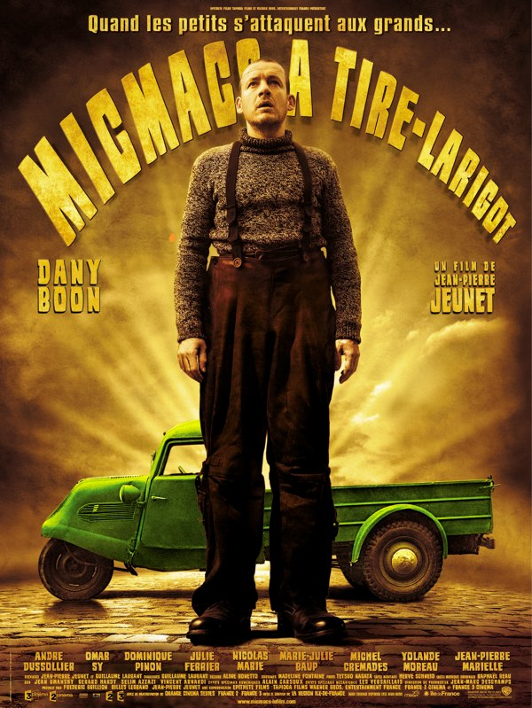
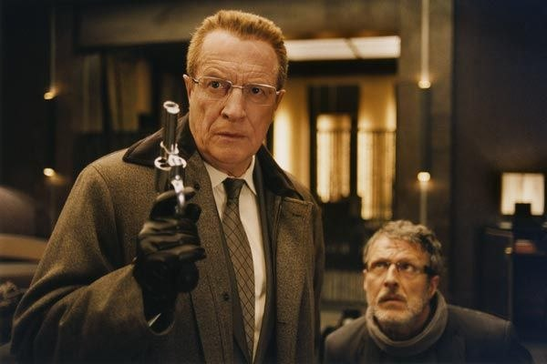
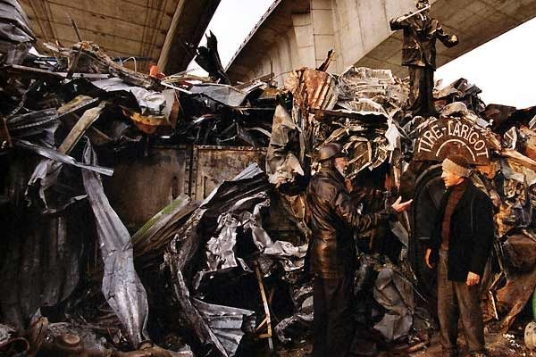
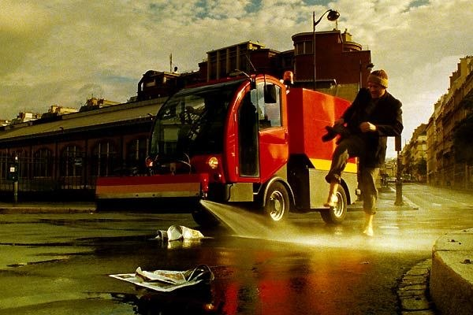

+++
titre = "Micmacs à tire-larigot, Jean-Pierre Jeunet"
title = "Micmacs à tire-larigot, Jean-Pierre Jeunet"
url = "/micmacs-tire-larigot-jeunet"
date = "2009-10-29T01:08:55"
Lastmod = "2013-04-21T17:22:24"
cover = "micmacs-tire-larigot1.jpg"
categorie = [ "À voir" ]
tag = [ "Humour", "Vite oublié" ]
acteur = [ "André Dussollier", "Dany Boon", "Nicolas Marié", "Omar Sy" ]
annee = [ "2009" ]
weight = 2009
pays = [ "France" ]

+++

Séance complète, et là c&rsquo;est le drame, il faut un plan B. Devant le vide sidérant des sorties digne d&rsquo;intérêt, on se rabat finalement sur le nouveau Jean-Pierre Jeunet, <em>Micmacs à tire-larigot</em>. Et à la sortie de la salle, oh surprise, ça n&rsquo;est pas une mauvaise surprise. Sans être un grand film, le dernier Jeunet oublie de se prendre au sérieux, et c&rsquo;est une bonne idée&#8230;

Pourtant, l&rsquo;idée d&rsquo;aller voir Dany Boon dans un film de Jean-Pierre Jeunet pendant une heure et demie n&rsquo;avait grand-chose pour me plaire. <em>Un long dimanche de fiançailles</em>, le précédent film du cinéaste le plus français de tous les réalisateurs français était quand même plus que moyen pour rester correct, et <em>Amélie Poulain</em>, film pas désagréable, mais tellement survendu depuis que je ne peux plus le voir en images, étaient franchement loin d&rsquo;être ce que je préfère en cinéma et concentraient même en quelque sorte la substantifique moelle de ce que je n&rsquo;aime pas dans le cinéma français. Alors, l&rsquo;idée de réunir ce cinéma-là avec Dany Boon, sans doute l&rsquo;acteur que je supporte le moins depuis le fameux succès des Chtis, n&rsquo;avait vraiment rien pour plaire.

Néanmoins, cette histoire complètement loufoque d&rsquo;une bande de SDF s&rsquo;attaquant à deux géants de l&rsquo;armement français ne se prend jamais au sérieux, et c&rsquo;est indéniablement ce qui sauve le film. Le scénario importe peu, de toute façon on s&rsquo;en fiche et le film est plus une série de sketches qu&rsquo;un film vraiment scénarisé. C&rsquo;est sans doute ce qui permet à <em>Micmacs à tire-larigot</em> d&rsquo;éviter l&rsquo;écueil du gnangnan, un risque pourtant présent quand on pense que le film se veut aussi une critique de l&rsquo;industrie d&rsquo;armement, et une valorisation des petites gens sur les gros industriels véreux.

Ces derniers se résument aux deux PDG de deux concurrents dans le domaine de l&rsquo;armement. Incarnés par André Dussolier et Nicolas Marié, tous deux excellents, ils sont jouissifs dans le rôle, certes classique, de vendeurs d&rsquo;armes sans foi ni loi et prêt à tous les coups tordus pour marquer des points. Je dis toujours que les méchants sont les plus intéressants, et ce film ne fait que confirmer mon avis. À côté des deux méchants, les gentils sont&#8230; ben gentils quoi.

Les acteurs sont d&rsquo;ailleurs bien plus décevants côté gentils, chacun semblant strictement à s&rsquo;incarner eux-mêmes. Dany Boon danyboonise tandis que Yolande Moreau yolandemorise et qu&rsquo;Omar paraît bien seul sans Fred dans un SAV bis et sépia. Soyons honnêtes, ils sont tous assez efficaces dans leur genre, mais leur rôle n&rsquo;a vraiment rien d&rsquo;étonnant, et on aimerait un peu dynamiser tout ça.

Le cinéma de Jean-Pierre Jeunet est marqué par un style très appuyé. Les filtres jaunes ou sépia sont déjà utilisés quasiment en permanence, pour des films qui font toujours vieillot, invariablement. Le style de <em>Micmacs à tire-larigot</em> évoque, à cet égard, en tout point les précédents films. On aime, ou on n&rsquo;aime pas, mais en l&rsquo;occurrence le style s&rsquo;accorde bien avec l&rsquo;aspect également très bricolo du film. Jeunet a beau disposer de sommes faramineuses pour tourner, il sait donner le sentiment de toujours construire des films à partir de trois bouts de ficelle usagés. Force est de constater que cela est efficace, avec à la clé un visuel qui s&rsquo;approche parfois des films de Tim Burton, ou dans le principe, à <em>Please Be Kind, Rewind</em>.

Par l&rsquo;histoire notamment, le film évoque aussi le cinéma de Dupontel, en moins frappé évidemment. Néanmoins, cette improbable quête contre un ennemi en théorie inaccessible a un côté absurde assez sympathique, tout en véhiculant un message pas si niais que prévu (la fin sur YouTube est intéressante par exemple). Bon, entendons-nous bien, il ne s&rsquo;agit nullement d&rsquo;un film vraiment engagé, on sent que ce qui intéresse d&rsquo;abord Jean-Pierre Jeunet, c&rsquo;est de mettre en scène un univers et des personnages. Le côté <em>Lord of War</em> bricoleur du dimanche est néanmoins assez drôle je trouve.

Bon, je ne vais pas m&rsquo;étendre plus longtemps sur ce film. Ni chef-d&rsquo;œuvre, ni même grand film, <em>Micmacs à tire-larigot</em> fait partie de ces bonnes surprises, ces films que l&rsquo;on pensait détester, et qui finalement passe bien. Disons-le, j&rsquo;ai passé un bon moment et l&rsquo;univers si &laquo;&nbsp;à l&rsquo;ancienne&nbsp;&raquo; et &laquo;&nbsp;vieille France&nbsp;&raquo; ne m&rsquo;a pas gêné outre mesure. Ceci étant, je recommande la lecture de <a href="http://www.critikat.com/Micmacs-a-tire-larigot.html">la critique de chez Critikat</a>, comme d&rsquo;habitude intéressante et argumentée. Elle pointe du doigt un univers mortifère, où la vie n&rsquo;a pas sa place, et où les personnages ne sont que des pantins à l&rsquo;intérieur d&rsquo;un univers clos où la réalité n&rsquo;a aucune influence. Tout ceci est vrai, mais je trouve la conclusion dure contre le film. Pourquoi Jean-Pierre Jeunet n&rsquo;aurait pas le droit de faire des films fermés sur eux-mêmes et dotés de leur propre univers.

James Cameron a bien le droit, lui. Oui, j&rsquo;ai vu la fameuse bande-annonce d&rsquo;<em>Avatar</em> sur (très) grand écran. Et je confirme ce que je pensais en voyant des images statiques : ce film à l&rsquo;esthétique vieillotte d&rsquo;un jeu vidéo me semble bien moche&#8230;

<h3>Vous voulez m&rsquo;aider ?<a href="#footnote_0_1995" id="identifier_0_1995" class="footnote-link footnote-identifier-link" title="&Agrave; propos de la publicit&eacute;&hellip;">1</a></h3>
<ul>
<li><a href="http://www.amazon.fr/gp/product/B002VBXRE2/ref=as_li_ss_tl?ie=UTF8&#038;tag=leblogdenic07-21&#038;linkCode=as2&#038;camp=1642&#038;creative=19458&#038;creativeASIN=B002VBXRE2">Acheter le film en Blu-Ray sur Amazon</a></li>
<li><a href="http://www.amazon.fr/gp/product/B002VBXRDI/ref=as_li_ss_tl?ie=UTF8&#038;tag=leblogdenic07-21&#038;linkCode=as2&#038;camp=1642&#038;creative=19458&#038;creativeASIN=B002VBXRDI">Acheter le film en DVD sur Amazon</a></li>
<li><a href="https://itunes.apple.com/fr/movie/micmacs-a-tire-larigot/id363995941">Acheter ou louer le film sur l&rsquo;iTunes Store</a></li>
</ul>

<ol class="footnotes"><li id="footnote_0_1995" class="footnote"><a href="http://voiretmanger.fr/soutien/">À propos de la publicité…</a> [<a href="#identifier_0_1995" class="footnote-link footnote-back-link">&#8617;</a>]</li></ol>
