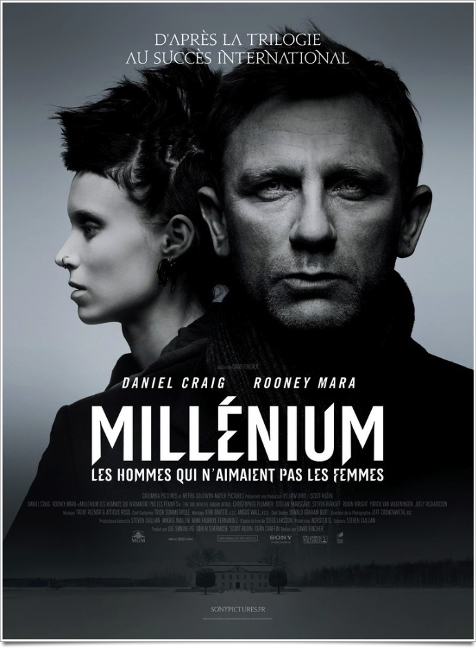
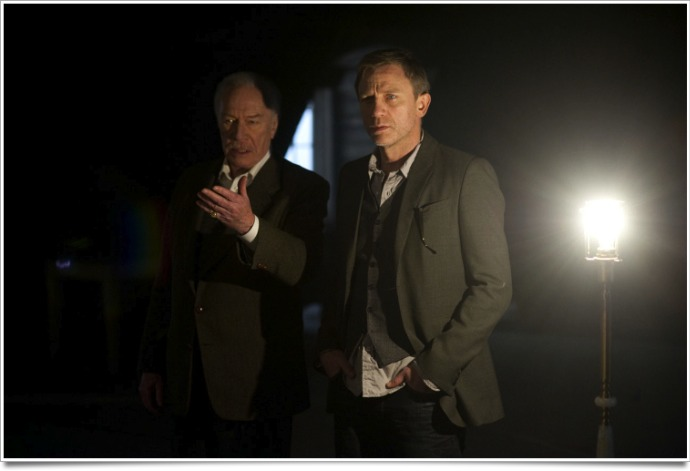
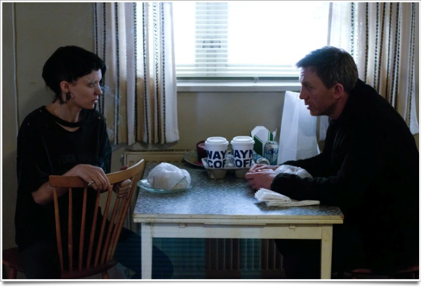

+++
type = "post"
titre = "<em>Millenium : Les hommes qui n’aimaient pas les femmes</em>, David Fincher"
title = "Millenium : Les hommes qui n’aimaient pas les femmes, David Fincher"
url = "/millenium-hommes-aimaient-pas-femmes-fincher"
date = "2012-01-19T00:41:53"
Lastmod = "2014-10-11T21:37:41"
cover = "millenium-fincher-mara.jpg"
categorie = [ "À voir" ]
tag = [ "Adaptation littéraire", "Drame", "Enquête", "Famille", "Polar", "Thriller" ]
createur = [ "David Fincher" ]
acteur = [ "Christopher Plummer", "Daniel Craig", "Rooney Mara", "Stellan Skarsgard" ]
annee = [ "2012" ]
weight = 2012
pays = [ "États-Unis" ]
original = "The Girl With The Dragon Tattoo"

+++

Trois ans après <em>Millenium, le film</em>, un téléfilm suédois vaguement adapté pour le grand écran, la célèbre saga <em>Millenium</em> revient au cinéma. Cette fois, l&rsquo;adaptation est américaine et c&rsquo;est David Fincher qui la réalise avec un casting international. Le projet avait de quoi rendre sceptique et on sentait venir le film de commande qui n&rsquo;a comme objectif que de proposer une version plus grand public, car anglo-saxonne, du film suédois. <em>Millenium : Les hommes qui n&rsquo;aimaient pas les femmes</em> est plus que cela, heureusement. Après le téléfilm gentil, c&rsquo;est un véritable film que propose David Fincher. À voir, même si on a déjà vu le film de Niels Arden Oplev.

Si vous avez miraculeusement réussi à passer à travers les gouttes de la folie <em>Millenium</em>, on peut résumer le premier tome adapté ici à une enquête policière. Mikael est le rédacteur en chef d&rsquo;un magazine dont le sérieux ne fait aucun doute… jusqu&rsquo;au jour où il se fait avoir par un puissant industriel suédois sur lequel il travaille. Le procès pour diffamation jette l&rsquo;opprobre sur son journal, mais surtout sur son nom et quand un autre industriel à la retraite l&rsquo;appelle dans le nord du pays, loin de Stockholm, pour une enquête, il n&rsquo;hésite pas longtemps. Mikael découvre alors une histoire étrange : quarante ans auparavant, une fille disparaît sur une île. Cette île appartient à une même famille réunie ce jour-là pour une réunion familiale. Personne n&rsquo;est entré, personne n&rsquo;est sorti de l&rsquo;île : le meurtrier était forcément sur place. L&rsquo;enquête ne donne rien et Mikael doit la ressusciter des années après. C&rsquo;est sans doute pour se faire oublier qu&rsquo;il accepte la mission un peu folle et commence une enquête qui le mène finalement beaucoup plus loin…

On l&rsquo;aura compris, <em>Millenium : Les hommes qui n&rsquo;aimaient pas les femmes</em> est d&rsquo;abord une enquête policière. Une personne a disparu, on suppose logiquement qu&rsquo;il s&rsquo;agit d&rsquo;un meurtre, il s&rsquo;agit de trouver le coupable. Comme dans certains livres d&rsquo;Agatha Christie, tous les protagonistes étaient situés sur l&rsquo;île et le coupable ne peut ainsi être que l&rsquo;un des membres de la famille. L&rsquo;enquête menée sur le moment ne donne rien et elle rebondit quarante ans après grâce au travail de Mikael aidé de Lisbeth. Le dernier film de David Fincher suit un scénario policier où l&rsquo;enquête avance peu à peu. Mikael commence avec l&rsquo;enquête initiale et réussit à faire des avancées supplémentaires en comprenant que le meurtre sur lequel il enquête n&rsquo;est pas isolé. Il le relie très vite à d&rsquo;autres crimes réalisés cette fois dans tout le pays, sur une longue période. Comme dans toute enquête, l&rsquo;étau se resserre peu à peu autour de l&rsquo;auteur du crime jusqu&rsquo;à la révélation finale qui fait la lumière sur toute l&rsquo;affaire. <em>Millenium : Les hommes qui n&rsquo;aimaient pas les femmes</em> est ainsi un film plein de suspense, du moins pour ceux qui ne connaissent pas l&rsquo;histoire originale. Même si vous la connaissez, vous devriez toutefois être emporté par ce film qui s&rsquo;avère très efficace.

L&rsquo;enquête est menée au départ uniquement par Mikael, mais il est très vite rejoint par Lisbeth Salander. Plus encore qu&rsquo;un film policier, <em>Millenium : Les hommes qui n&rsquo;aimaient pas les femmes</em> est d&rsquo;abord le récit de la rencontre entre ces deux personnages que tout oppose en apparence. Mikael est un journaliste à l&rsquo;ancienne : il travaille pour un magazine imprimé et ses méthodes sont ancestrales. Il collecte sur un carnet les points de vue de toutes les personnes présentes sur les lieux du crime, scrute des photos de l&rsquo;époque, trouve des photos supplémentaires pour multiplier les angles et tenter de recouper des informations… Mikael possède bien un ordinateur, mais on sent bien que ce n&rsquo;est pas vraiment quelque chose qu&rsquo;il maîtrise, au contraire de Lisbeth. Cette jeune fille asociale a été placée sous tutelle pour des raisons qui sont encore largement obscures à ce stade. Elle n&rsquo;est pas idiote cela dit, bien au contraire même : Lisbeth est très intelligente et il n&rsquo;y a pas meilleure qu&rsquo;elle pour pirater n&rsquo;importe quel ordinateur pour y trouver des informations. Elle prend moins de gants que Mikael et rentre plus facilement dans le tas et elle s&rsquo;avère extrêmement rapide et efficace. <em>Millenium : Les hommes qui n&rsquo;aimaient pas les femmes</em> les oppose très efficacement et la scène de leur première rencontre résume bien cette confrontation qui se mue en complémentarité. David Fincher a incontestablement bien cerné cet aspect des deux personnages principaux, mieux que dans le film suédois ce qui rend son travail plus intéressant.

<em>Millenium, le film</em> était issu d&rsquo;un téléfilm et le résultat était honorable, sans plus. La mise en image était appréciable parce que de toute manière c&rsquo;était la seule. <em>Millenium : Les hommes qui n&rsquo;aimaient pas les femmes</em> est d&rsquo;un tout autre niveau néanmoins. David Fincher suit fidèlement l&rsquo;histoire originale, mais il apporte également tout son savoir-faire technique et son univers. Le résultat est incomparable : il s&rsquo;agit vraiment de cinéma et de cinéma parfaitement maîtrisé. La très belle <a href="http://www.youtube.com/watch?v=TL30ovEdf8M&amp;feature=youtu.be">séquence d&rsquo;ouverture</a> donne au film un ton et surtout un rythme qui ne le quittera plus. <em>Millenium : Les hommes qui n&rsquo;aimaient pas les femmes</em> dure plus de 2h30, mais on ne s&rsquo;ennuie jamais grâce à un rythme très rapide qui fait avancer l&rsquo;intrigue à toute allure. Le livre de Stieg Larson est particulièrement riche et David Fincher a nécessairement effectué des coupes dans le récit. Le début et ses nombreuses ellipses est très réussi, la suite est parfois trop bavarde ou pas assez — certaines branches de l&rsquo;intrigue auraient mérité de ne pas apparaître du tout, ou d&rsquo;être au contraire développées –, mais l&nbsp;&raquo;ensemble tient tout à fait la route et s&rsquo;avère convaincant.

<em>Millenium : Les hommes qui n&rsquo;aimaient pas les femmes</em> gagne énormément en rythme et en mise en scène, il perd un peu en ambiance, la faute notamment au choix de l&rsquo;anglais en lieu et place du suédois. La <a href="http://itunes.apple.com/fr/album/girl-dragon-tattoo-soundtrack/id487028650">bande originale</a> est à nouveau composée par Trent Reznor et Atticus Ross qui fournissent un travail de qualité, quoique moins mémorable <em>a priori</em> que pour <em><a href="http://voiretmanger.fr/2010/10/12/social-network-fincher/">The Social Network</a></em>. S&rsquo;il est un élément que l&rsquo;on ne pouvait pas retirer au film suédois, c&rsquo;est bien le choix de son actrice principale. Noomi Rapace formait une excellente Lisbeth et Rooney Mara est ici très bien dans ce rôle, elle peine quand même à faire oublier sa devancière. Daniel Craig est un choix étonnant au premier abord pour interpréter Mikael qui n&rsquo;a rien d&rsquo;un James Bond dans le livre, sauf en ce qui concerne les femmes ; l&rsquo;acteur se révèle finalement très bon dans ce rôle de journaliste et enquêteur.

Réussir l&rsquo;adaptation au cinéma d&rsquo;un livre est toujours difficile, réussir une seconde adaptation du même livre est quasiment une mission impossible. Pari réussi toutefois pour David Fincher : son <em>Millenium : Les hommes qui n&rsquo;aimaient pas les femmes</em> est incontestablement bien meilleur que le précédent. Si vous découvrez la saga, ce film est une excellente entrée en matière, mais vous pouvez même le revoir sans risque si vous avez déjà lu le livre ou regardé <em>Millienium, le film</em>.

<h3>Vous voulez m&rsquo;aider ?<a href="#footnote_0_5517" id="identifier_0_5517" class="footnote-link footnote-identifier-link" title="&Agrave; propos de la publicit&eacute;&hellip;">1</a></h3>
<ul>
<li><a href="http://www.amazon.fr/gp/product/B006YOC4IW/ref=as_li_ss_tl?ie=UTF8&#038;tag=leblogdenic07-21&#038;linkCode=as2&#038;camp=1642&#038;creative=19458&#038;creativeASIN=B006YOC4IW">Acheter le film en Blu-Ray sur Amazon</a></li>
<li><a href="http://www.amazon.fr/gp/product/B006YOC28Y/ref=as_li_ss_tl?ie=UTF8&#038;tag=leblogdenic07-21&#038;linkCode=as2&#038;camp=1642&#038;creative=19458&#038;creativeASIN=B006YOC28Y">Acheter le film en DVD sur Amazon</a></li>
<li><a href="http://itunes.apple.com/fr/album/girl-dragon-tattoo-soundtrack/id487028650">Acheter la bande originale du film sur l&rsquo;iTunes Store</a></li>
</ul>

<ol class="footnotes"><li id="footnote_0_5517" class="footnote"><a href="http://voiretmanger.fr/a-propos/publicite/">À propos de la publicité…</a> [<a href="#identifier_0_5517" class="footnote-link footnote-back-link">&#8617;</a>]</li></ol>
