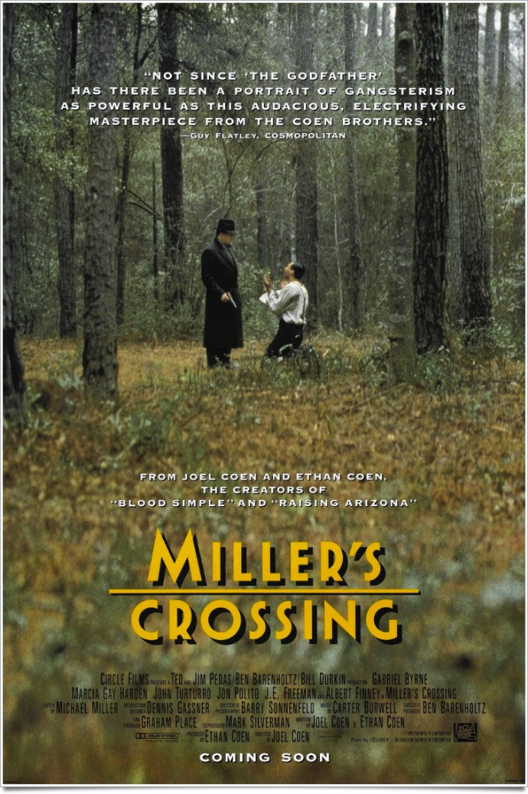
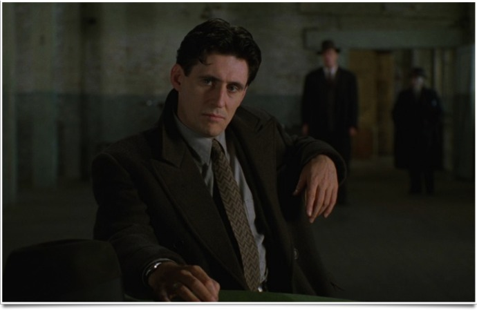
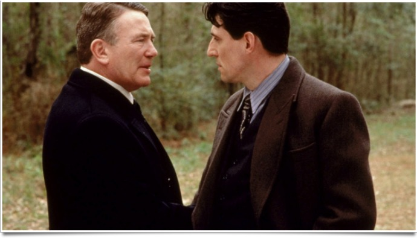

+++
titre = "<em>Miller&rsquo;s Crossing</em>, Joel Coen"
title = "Miller's Crossing, Joel Coen"
url = "/miller-s-crossing-coen"
date = "2012-01-30T00:15:52"
Lastmod = "2013-11-13T23:20:35"
cover = "coen-miller-s-crossing.jpg"
categorie = [ "À voir" ]
tag = [ "Drame", "Film noir", "Histoire", "Mafia" ]
createur = [ "Joel et Ethan Coen" ]
acteur = [ "Gabriel Byrne" ]
annee = [ "1990" ]
weight = 1990
pays = [ "États-Unis" ]

+++

Boudé par le public à sa sortie, <em>Miller&rsquo;s Crossing</em> a été un aussi grand échec commercial qu&rsquo;un succès critique. Une vingtaine d&rsquo;années après sa sortie, le troisième film des frères Coen reste un film noir très fort sur la mafia des années 1920 aux États-Unis. Une vraie réussite, à (re)découvrir sans hésiter.

États-Unis, années 1920 : la Prohibition bat son plein et les villes sont tenues par la mafia locale. Dans cette ville indéterminée, c&rsquo;est Leo, un Irlandais, qui tient la mairie et la police et donc la ville. Son pouvoir est toutefois menacé par un de ses seconds, Caspar, un Italien qui en a assez d&rsquo;être sous la coupe de Leo. La relation entre les deux s&rsquo;envenime vite : Caspar veut que Leo tue Bernie, un gangster de seconde zone qui le gêne, mais Leo, amoureux de la sœur de Bernie, refuse. Tom Reagan est le confident de Leo, mais cette fois il ne le suit pas. Il lui conseille de ne pas s&rsquo;en prendre à Caspar et d&rsquo;abandonner Bernie et il finit par se fâcher avec son protecteur. Opportuniste, il va alors tenter de se rapprocher de Caspar alors que la guerre entre les deux hommes fait rage.

<em>Miller&rsquo;s Crossing</em> est en apparence un film assez classique sur la mafia et ses conflits. À l&rsquo;image de la saga <em>Le Parrain</em> de Francis Ford Coppola d&rsquo;ailleurs mis en avant sur son affiche, ce film évoque le conflit entre deux mafieux pour le contrôle d&rsquo;une ville. Le sujet est d&rsquo;ailleurs introduit d&rsquo;emblée puisque l&rsquo;on attaque ici <em>in medias res</em>, avec une discussion qui s&rsquo;échauffe entre Leo et Caspar au sujet de Bernie. Sans grande surprise non plus, le conflit d&rsquo;intérêt entre les deux hommes est doublé d&rsquo;un conflit ethnique : Leo est Irlandais, Caspar Italien et Bernie Juif. Dans cette Amérique encore fortement marquée par l&rsquo;immigration, le patchwork culturel se retrouve dans ce mélange des origines et des styles. Quelle que soit l&rsquo;origine, l&rsquo;enjeu reste toujours le même : le pouvoir et donc l&rsquo;argent. Les frères Coen le montrent très bien avec les représentants de l&rsquo;autorité qui se mettent aux ordres tantôt de l&rsquo;un, tantôt de l&rsquo;autre : le maire et le chef de la police sont d&rsquo;abord chez Leo, avant d&rsquo;aller chez Caspar quand le vent tourne et ils font fermer les bars de l&rsquo;un, puis de l&rsquo;autre pour la même raison. <em>Miller&rsquo;s Crossing</em> propose une intrigue assez complexe, mais réussie, qui montre parfaitement ces différents enjeux et qui rappelle surtout qu&rsquo;au-delà même du pouvoir ou de l&rsquo;argent, l&rsquo;essentiel est encore ailleurs.

Si les personnages sont nombreux et l&rsquo;intrigue plutôt complexe, <em>Miller&rsquo;s Crossing</em> évoque d&rsquo;abord l&rsquo;histoire de Tom. Comme souvent chez Ethan et Joel Coen, les apparences sont trompeuses : le point de départ est ainsi celui, très classique, d&rsquo;un film de gangsters et l&rsquo;on croit tout naturellement que Tom sera le bras droit de Leo. Comme le rappelle d&rsquo;ailleurs très justement ce dernier, Tom est un homme très intelligent toutefois et il se révèle vite beaucoup plus fort que tous les autres gangsters. On comprend très vite qu&rsquo;il utilise le conflit entre son protecteur et Caspar à son avantage, pour survivre, mais aussi pour se rapprocher de la femme qu&rsquo;il aime. Une femme, tel est bien l&rsquo;enjeu premier dans <em>Miller&rsquo;s Crossing</em>, d&rsquo;autant qu&rsquo;il ne s&rsquo;agit pas de n&rsquo;importe quelle femme. Tom aime Verna, la sœur de Bernie, celle-là même que vise Leo. Ainsi, le conflit entre les deux hommes est d&rsquo;abord lié à une histoire d&rsquo;amour et Tom va utiliser la situation à son avantage, pour écarter son concurrent de la femme qu&rsquo;il convoite. Disons-le, l&rsquo;intrigue conçue par les deux frères Coen est touffue et complexe, mais c&rsquo;est aussi la raison de la réussite du film. Tom semble toujours avoir une longue d&rsquo;avance sur ses concurrents, mais aussi souvent sur les spectateurs et il s&rsquo;en sort par une série de pirouettes qui exigent de fait un peu de concentration. <em>Miller&rsquo;s Crossing</em> échappe ainsi peu à peu à son statut de film de gangsters traditionnel pour aller beaucoup plus loin.

Joel Coen est le seul crédité sur ce troisième film, mais son frère Ethan est également à la barre comme sur toute leur filmographie. De fait, <em>Miller&rsquo;s Crossing</em> ne peut pas renier son origine : la marque de fabrique des cinéastes américains est bel et bien sensible avec un scénario riche et complexe et une histoire teintée de cet humour noir si particulier. Comme toujours, le film joue sur les apparences : apparent hommage au film noir, il tourne parfois au pastiche en jouant sur les clichés du genre. Beaucoup de plans sont sombres, trop sombres même, les objets typiques des films noirs sont trop présents tandis que l&rsquo;intrigue joue aussi avec les codes et s&rsquo;avère plus complexe que prévu. Caricature ou non, la photographie de <em>Miller&rsquo;s Crossing</em> est une réussite alors que les plans font preuve d&rsquo;une maîtrise rare. Un vrai plaisir à regarder, bien servi par une galerie d&rsquo;acteurs vraiment efficaces.

<em>Miller&rsquo;s Crossing</em> n&rsquo;est pas le film le plus connu des frères Coen, mais ce film de gangsters revisité mériterait plus d&rsquo;attention. Les deux réalisateurs font preuve de tout leur talent avec cette histoire alambiquée où la noirceur et le drame se mêlent, comme toujours, d&rsquo;humour noir. Un très grand film sur la mafia, et même un très grand film tout court.

<h3>Vous voulez m&rsquo;aider ?<a href="#footnote_0_5599" id="identifier_0_5599" class="footnote-link footnote-identifier-link" title="&Agrave; propos de la publicit&eacute;&hellip;">1</a></h3>
<ul>
<li><a href="http://www.amazon.fr/gp/product/B0052OSMHW/ref=as_li_ss_tl?ie=UTF8&#038;tag=leblogdenic07-21&#038;linkCode=as2&#038;camp=1642&#038;creative=19458&#038;creativeASIN=B0052OSMHW">Acheter le film en Blu-Ray sur Amazon</a></li>
<li><a href="http://www.amazon.fr/gp/product/B00008NEPD/ref=as_li_ss_tl?ie=UTF8&#038;tag=leblogdenic07-21&#038;linkCode=as2&#038;camp=1642&#038;creative=19458&#038;creativeASIN=B00008NEPD">Acheter le film en DVD sur Amazon</a></li>
</ul>

<ol class="footnotes"><li id="footnote_0_5599" class="footnote"><a href="http://voiretmanger.fr/a-propos/publicite/">À propos de la publicité…</a> [<a href="#identifier_0_5599" class="footnote-link footnote-back-link">&#8617;</a>]</li></ol>
