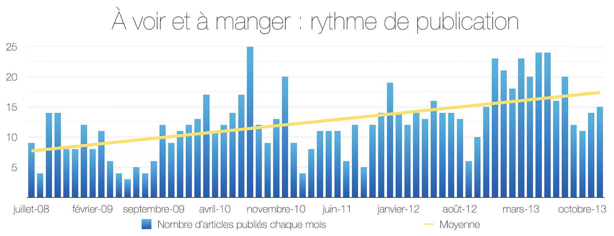
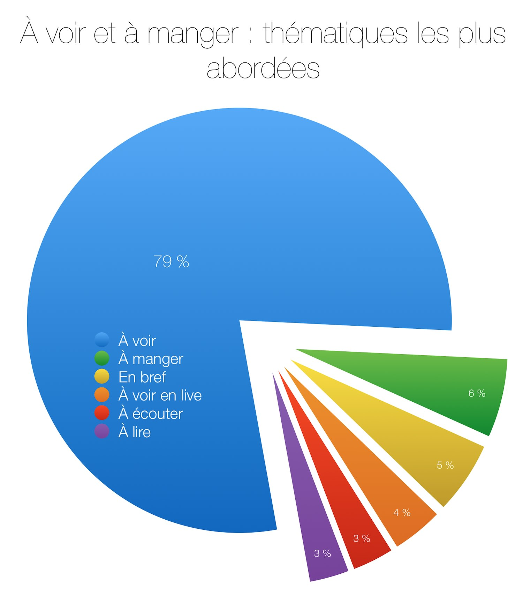

+++
type = "post"
titre = "Un million de mots après"
title = "Un million de mots après"
url = "/million-mots"
date = "2014-01-12T15:50:05"
Lastmod = "2014-01-12T16:03:09"
cover = "voir-et-manger-un-million-de-mots.jpg"
categorie = [ "Le blog" ]
tag = [ "Le blog", "Statistiques" ]

+++

Novembre 2010, ce blog ne s’appelait pas encore comme aujourd’hui, mais il comptait 300 articles et 370 000 mots. À l’époque, <a href="http://voiretmanger.fr/300-articles-370000-mots-plus-tard/">cela me semblait énorme</a>, mais beaucoup de chemin a été parcouru depuis. Avec plus de 820 articles au compteur, ce petit blog personnel qui ne savait pas trop ce qu’il voulait dire à ses débuts a dépassé le million de mots publiés. Dans la base de données, plus d’un million de mots écrits par mes soins — on ne compte pas les commentaires qui ajouteraient quelques dizaines de milliers de mots encore —, un volume considérable qui me surprend le premier. Un million de mots, cela représente quand même plus que le contenu de la <em>Bible</em>…

À l&rsquo;occasion de ce cap, voici quelques statistiques sur ces cinq années et demie de publication. Depuis son ouverture, au cœur de l’été 2008, j’ai publié sur le blog 12,5 articles en moyenne chaque mois. Il y a eu de gros mois — 25 articles en <a href="http://voiretmanger.fr/2010/09">septembre 2010</a>, record absolu — et des mois à vide — trois seulement en <a href="http://voiretmanger.fr/2009/06/">juin 2009</a>, je crois que mes études m’avaient beaucoup occupé ce mois-ci.  

Au-delà des hauts et des bas chaque mois, la courbe continue de croitre avec une moyenne qui dépasse les 15 articles par mois, soit une publication tous les deux jours. Là encore, depuis juillet 2008, la fréquence de publication augmente en moyenne, même si elle a un peu baissé ces derniers mois. Cette tendance ne me surprend pas, j’ai pris la résolution de ne jamais voir de film sans publier une critique derrière, ou presque jamais. À une époque, j’étais moins régulier, mais je finis toujours par regretter d’avoir oublié d’écrire sur tel ou tel film. 

Sur ce blog, je ne me suis jamais imposé de limite stricte sur la longueur des articles. J’essaie toutefois de me contenir en écrivant des articles d’une taille plus raisonnable… ce qui n’est jamais facile pour moi. Dans les faits, un article est composé en moyenne de légèrement plus de 1200 mots soit environ 7500 caractères. À ma grande surprise, cette valeur est plutôt stable depuis les origines. Là encore, il y a eu des variations importantes selon les mois, mais dans l’ensemble on reste autour de 1200 mots par article depuis le début. Je note quand même que la courbe rouge va dans la bonne direction au cours des derniers mois. 

En cumulant tous ces mots mois après mois, on arrive au million dans le courant du mois de décembre 2013. Le graphique met bien en valeur les mois à vide et ceux très productifs — j’ai écrit jusqu’à 35 000 mots en un seul mois sur ce blog… —, mais la progression générale est finalement plus régulière que ce que j’aurais imaginé.

Même si ce blog n’a jamais eu la vocation de se consacrer exclusivement au cinéma, les <a href="http://voiretmanger.fr/category/cinema/">critiques de films et séries</a> ont pris le dessus dès le départ et elles représentent aujourd’hui près de 80 % du total. À côté, les <a href="http://voiretmanger.fr/archives/restaurants/">critiques de restaurants</a> ont beau être la deuxième catégorie la plus représentée, elles sont loin derrière avec près de 50 critiques et seulement 6 % du total. Il faut dire que si l’on peut facilement s’abonner au cinéma, le budget nécessaire aux critiques de restaurant est bien plus élevé, malheureusement… 

J’ai donné l’intégralité de mes articles à <a href="https://www.facebook.com/goumprod">Goum Prod</a>. Derrière ce nom, un couple talentueux qui ne manque pas d’idées pour illustrer de manière très originale une <a href="https://www.facebook.com/photo.php?fbid=593168140754643&#038;set=a.592621624142628.1073741832.592584884146302&#038;type=1&#038;stream_ref=10">œuvre de musique</a> ou <a href="https://www.facebook.com/media/set/?set=a.592620020809455.1073741830.592584884146302&#038;type=1">un roman</a>. J’étais sûr qu’ils sauraient faire quelque chose de ce million de mots et je dois dire que je n’ai pas été déçu <a href="http://voiretmanger.fr/wp-content/2014/01/voir-et-manger-un-million-de-mots.jpg">du résultat</a>. Merci beaucoup à eux pour le travail effectué !

