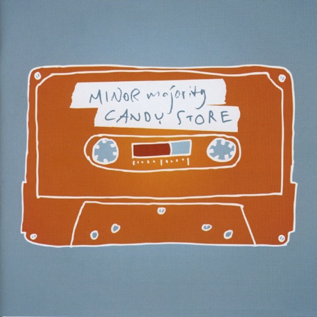
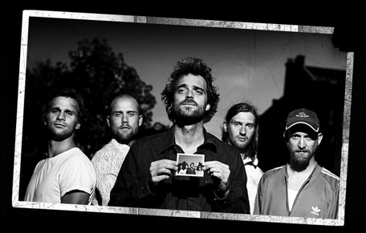

+++
type = "post"
titre = "Minor Majority, de la pop légère et agréable"
title = "Minor Majority, de la pop légère et agréable"
url = "/minor-majority-pop-legere-agreable"
date = "2008-11-23T23:59:44"
Lastmod = "2010-02-01T18:28:41"
cover = "minor-majority.jpg"
categorie = [ "Musique" ]
tag = [ "Pop" ]
createur = [ "Minor Majority" ]
annee = [ "2008" ]
weight = 2008

+++

<em> </em>

Une fois n&rsquo;étant pas coutume<a href="#footnote_0_955" id="identifier_0_955" class="footnote-link footnote-identifier-link" title="&Eacute;tant donn&eacute; le nombre de fois o&ugrave; j&rsquo;ai &eacute;crit cette formule, je me demande bien quelle est la coutume&hellip;">1</a>,  je vais évoquer un best-of.

Oui, je sais, les best-of, c&rsquo;est le mal, il faut écouter les albums de la première à la dernière chanson. Oui mais voilà, il se trouve que j&rsquo;ai découvert un groupe par son dernier album qui se trouve être un best-of. Je ne connais que ce best-of et ne voulais pas attendre d&rsquo;en connaître la discographie complète par cœur avant d&rsquo;en parler, tant cette découverte m&rsquo;enthousiasme. Je veux parler de <em>Candy Store</em>, par les Minor Majority.

Minor Majority, comme sa musique ne l&rsquo;indique pas du tout (mais alors vraiment pas), est un groupe norvégien. Pourtant, la musique du groupe est à des années lumières de ce que l&rsquo;on associe habituellement à la musique nordique. J&rsquo;avoue ici mon ignorance totale de cette musique qui n&rsquo;existe sans doute que dans ma tête, mais je pense à des groupes comme Sigur Ros ou des artistes comme Björk. Rien de tel ici, non, on se croirait plutôt de l&rsquo;autre côté de l&rsquo;Océan (ou au moins du Channel), autour d&rsquo;un feu de camp, sous la pleine lune. Ou dans une pièce chaleureuse avec un feu dans la cheminée (notez comme le feu constitue un thème central&#8230;). Mais pas sur la neige du grand Nord. Par ailleurs, le chant est dans un anglais parfait sans la moindre trace d&rsquo;un accent.

La musique de Minor Majority ne révolutionne rien du tout, c&rsquo;est le moins que l&rsquo;on puisse dire. Ça n&rsquo;est de toute façon pas son but et l&rsquo;on reste ici en terrain connu : les voix se posent sur des guitares sèches souvent accompagnées de piano et/ou de cordes. Les chœurs sont souvent présents tandis qu&rsquo;apparaît, de temps à autre, la batterie. Bref, rien d&rsquo;original, mais un ensemble diablement efficace pour les longues soirées d&rsquo;hiver.

C&rsquo;est, en effet, un album réjouissant que cet album et je suis content de l&rsquo;avoir découvert. Si j&rsquo;aime l&rsquo;expérimentation, écoutant des choses parfois très bizarroïdes, j&rsquo;aime aussi, de temps en temps, me poser et écouter des groupes plus accessibles, plus immédiats, plus pop. Maintenant que j&rsquo;y pense, Minor Majority me rappelle l&rsquo;un de mes groupes préférés dans le genre, les Tindersticks. Mais aussi, dans une moindre mesure, toute l&rsquo;œuvre de Will Oldham (Bonnie Prince Billy, Palace Music, etc.).

Bref, de belles références pour un groupe qui, <a href="/index.php/2008/11/06/ez3kiel-groupe-qui-gagnerait-a-etre-connu/">lui aussi</a>, gagnerait à être connu.

<h2 id="955_pour-en-savoir-plus_1">Pour en savoir plus&#8230;</h2>
<ul>
<li><a href="http://fr.wikipedia.org/wiki/Minor_Majority">L&rsquo;article de Wikipedia est un bon début</a>&#8230;</li>
<li>Outre le site officiel (accessible en cliquant sur l&rsquo;image du disque, ci-dessus), je recommande <a href="http://www.minormajority-fr.com">ce site francophone</a>.</li>
<li><a href="http://www.lastfm.fr/music/Minor+Majority">Si vous voulez écouter Minor Majority</a>.</li>
<li>Et si vous voulez acheter : <a href="http://www.amazon.fr/s/ref=nb_ss_w?__mk_fr_FR=%C5M%C5Z%D5%D1&amp;url=search-alias%3Daps&amp;field-keywords=minor+majority&amp;x=0&amp;y=0">Amazon</a> ou <a href="http://itunes.apple.com/WebObjects/MZStore.woa/wa/viewArtist?id=62635869">iTunes Store</a></li>
</ul>
<ol class="footnotes"><li id="footnote_0_955" class="footnote">Étant donné le nombre de fois où j&rsquo;ai écrit cette formule, je me demande bien quelle est la coutume&#8230; [<a href="#identifier_0_955" class="footnote-link footnote-back-link">&#8617;</a>]</li></ol>
