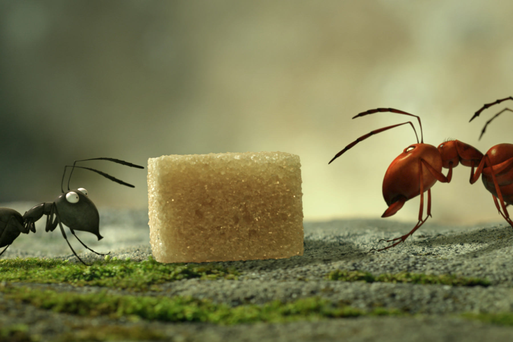
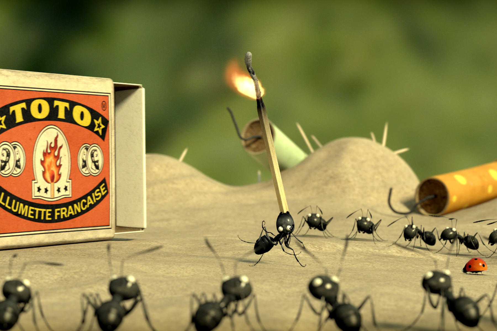

+++
type = "post"
titre = "<em>Minuscule: la Vallée des Fourmis Perdues</em>, Thomas Szabo et Hélène Giraud"
title = "Minuscule: la Vallée des Fourmis Perdues, Thomas Szabo et Hélène Giraud"
url = "/minuscule-vallee-fourmis-perdues-szabo-giraud"
date = "2014-02-07T00:06:37"
Lastmod = "2014-02-07T00:10:00"
cover = "minuscule-vallee-fourmis-perdues.jpg"
categorie = [ "À voir" ]
tag = [ "Animation", "Épopée", "Guerre", "Humour", "Insectes", "Nature", "Sorties du mois" ]
createur = [ "Hélène Giraud", "Thomas Szabo" ]
annee = [ "2014" ]
weight = 2014
pays = [ "France" ]

+++

À l’origine, <em>Minuscule</em> est une série d’animation composée de petits épisodes de cinq minutes. Avant cela, c’était un court-métrage qui avait la drôle d’idée de mettre en scène des insectes pour raconter une histoire, mais sans dialogue. Ces deux formats ayant eu beaucoup de succès, voilà maintenant un long-métrage. <em>Minuscule : la Vallée des Fourmis Perdues</em> maintient l’idée générale et ce film d’animation nous raconte une histoire pendant une heure trente sans aucun dialogue et uniquement avec une coccinelle et des fourmis. Un pari très ambitieux et une réussite éclatante : mis à part une petite baisse de régime à la fin, le long-métrage réalisé par Thomas Szabo et Hélène Giraud est rythmé et vivant, tour à tour drôle et touchant, épique et ridiculement petit… bref, c’est un énorme plaisir de cinéma qui n’est pas du tout réservé aux enfants. À voir !

<em>Minuscule : la Vallée des Fourmis Perdues</em> commence avec des images réelles. On suit une voiture rouge qui monte une route de montagne et qui casse un petit peu la douceur de la nature tout en ressemblant, déjà, à un insecte. On voit ensuite un couple qui pique-nique et la femme, enceinte, qui va accoucher. N’importe quel autre film suivrait les deux amoureux vers la clinique, mais pas celui-ci qui reste avec le pique-nique… et avec un vacarme assourdissant. Pour le premier contact avec leurs insectes, Thomas Szabo et Hélène Giraud nous plongent dans une ambiance paradoxalement bruyante. L’une des bonnes idées du film, c’est d’utiliser des bruits de moteurs pour les insectes : une coccinelle fait le bruit d’un moteur électrique étouffé, mais une grosse mouche celui d’une moto, quand une abeille fera le bruit d’une voiture de course par exemple. À partir de cette introduction bruyante et enivrante, <em>Minuscule : la Vallée des Fourmis Perdues</em> nous fait évoluer dans un univers étrange, à mi-chemin entre l’animation traditionnelle et un documentaire sur les insectes. Le mélange d’éléments filmés et d’additions animées est étonnant, mais c’est une merveilleuse idée et le rendu est excellent. Pour compenser le réalisme des décors, les animateurs n’ont pas cherché le réalisme pour dessiner les insectes et c’est très bien ainsi. Les fourmis et la coccinelle qui sont les héros de l’histoire ressemblent aux originaux, mais on voit bien que leurs traits sont simplifiés. Sans tomber dans la caricature, Thomas Szabo et Hélène Giraud ont trouvé l’équilibre parfait entre le réalisme du documentaire et l’animation traditionnelle. On retrouve, pour ce dernier point, une touche d’humour typique dans le genre, un humour de situation ou de geste puisque, faute de dialogues, c’est le seul que le film peut véhiculer.

De l’aveu même de ses concepteurs, <em>Minuscule : la Vallée des Fourmis Perdues</em> est une sorte de <em>Microcosmos</em> déjanté et revisité façon <a href="/saga/le-seigneur-des-anneaux/"><em>Le Seigneur des Anneaux</em></a>. Un mélange improbable sur le papier, mais qui paraît totalement logique et naturel à l’écran. Le scénario suit l’histoire d’une petite coccinelle qui perd sa famille peu de temps après sa naissance et qui trouve refuge dans la boîte de sucre abandonnée par le couple que l’on voit au début. Cette coccinelle est encore dans la boite quand des fourmis passent par là et décident de ramener toute la boite de sucre à leur fourmilière. Coccinelle et fourmi deviennent amis et ils vivent quelques extraordinaires aventures à la fois pour emporter tout le sucre et surtout pour échapper à une terrible bande de fourmis rouges. Thomas Szabo et Hélène Giraud ne mentent pas quand ils disent qu’ils se sont inspirés de l’épopée de Tolkien : le film a quelque chose de la saga avec la quête où le sucre remplace l’anneau et un combat gigantesque où des centaines de milliers de fourmis rouges assiègent la forteresse des fourmis noires. On ne s’attendait vraiment pas à retrouver de telles scènes dans un film pour enfants, mais <em>Minuscule : la Vallée des Fourmis Perdues</em> n’est absolument pas un film réservé aux enfants. Même si on peut le voir à partir de trois ans — avec quelques réserves tout de même, certains insectes sont impressionnants —, les adultes ne s’ennuieront pas face à un spectacle bien mené et plutôt spectaculaire. Le travail sur la taille minuscule des insectes a été bien fait et le film fourmille<a href="#fn-11110-1" rel="footnote">1</a> de détails amusants, à l’image des multiples objets humains rassemblés dans la fourmilière ou encore du rôle de la 2CV à plusieurs reprises dans le récit. Même si on note une petite baisse de régime sur la fin, les scénaristes n’ont pas manqué d’idées et ils ont réussi à raconter une histoire vivante et rythmée sans jamais prononcer le moindre mot, mais sans jamais perdre les spectateurs pour autant. Une belle performance, assurément…

<em>Minuscule : la Vallée des Fourmis Perdues</em> est un film surprenant qui ne devrait pas fonctionner sur le papier, mais qui est une vraie réussite à l’écran. Thomas Szabo et Hélène Giraud ont imaginé un univers réaliste par certains aspects, caricatural par d’autres, mais un univers qui fonctionne parfaitement. Sans entendre un seul mot, uniquement par la musique, quelques cris d’insectes et surtout des expressions, ils parviennent à raconter une histoire touchante et drôle à la fois. <em>Minuscule : la Vallée des Fourmis Perdues</em> devrait enchanter les enfants et ravir les parents qui les accompagneront : ne le ratez sous aucun prétexte !

<ol>
<li id="fn-11110-1">
Non, ce n’est pas un mauvais jeu de mots…&#160;<a href="#fnref-11110-1" rev="footnote">&#8617;</a>
</li>
</ol>

