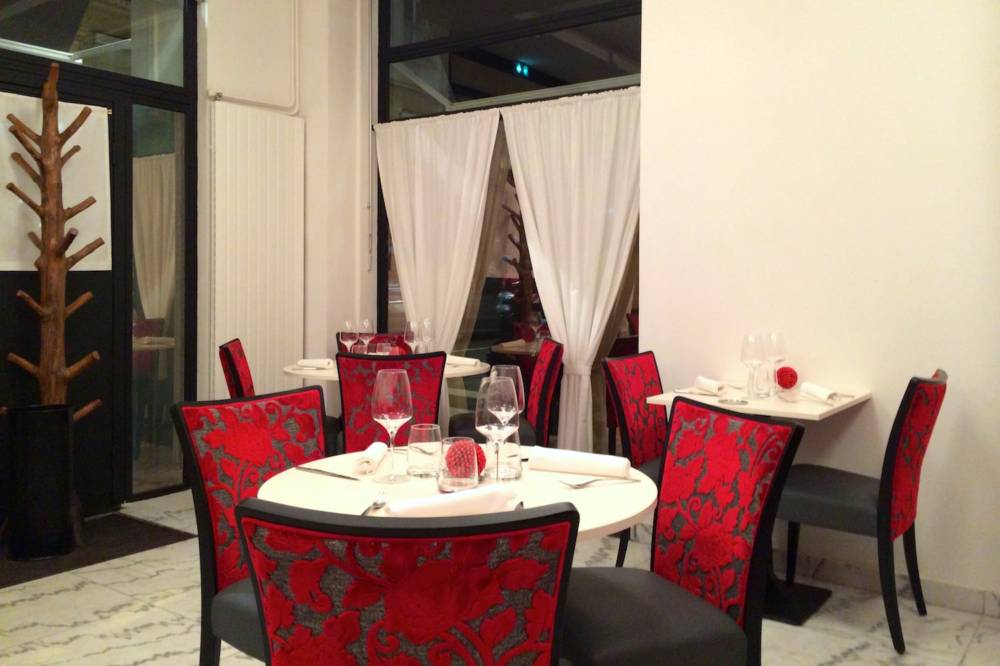
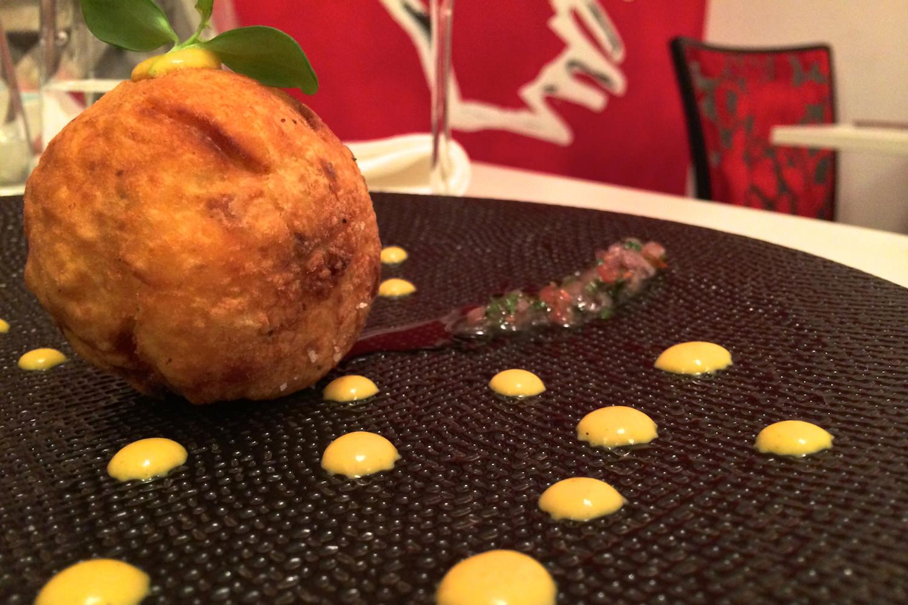
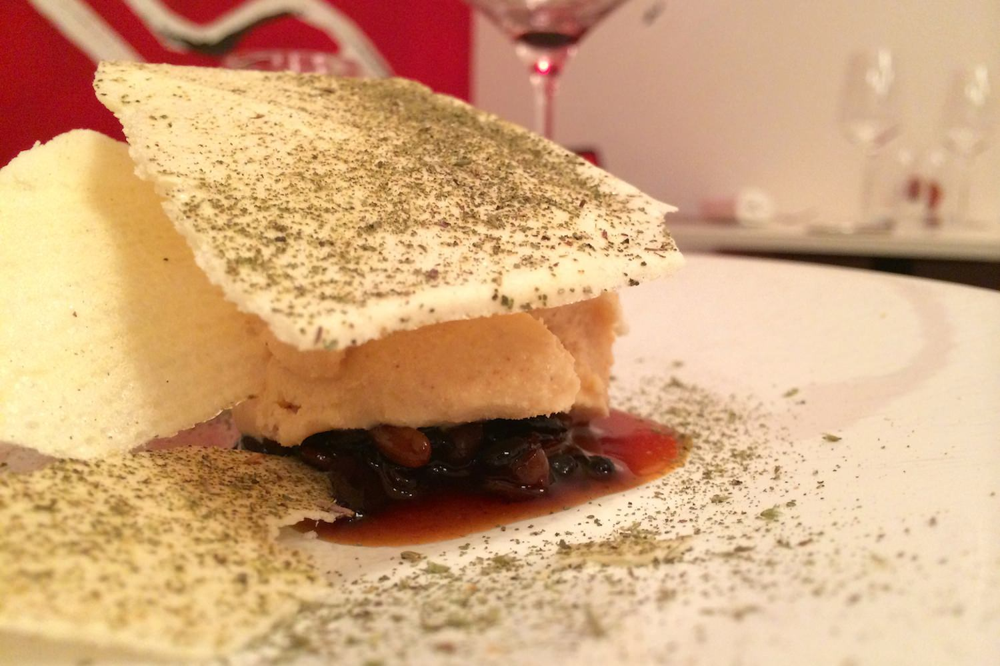

+++
type = "post"
titre = "Le Miraflores à Lyon"
title = "Le Miraflores à Lyon"
url = "/miraflores-lyon"
date = "2013-10-17T23:11:35"
Lastmod = "2013-10-18T09:24:15"
cover = "miraflores-lyon.jpg"
categorie = [ "À manger" ]
tag = [ "Cuisine moderne", "Cuisine péruvienne" ]

+++

Au cœur du sixième arrondissement lyonnais, un peu perdu le long de la rue Garibaldi, le <a href="http://www.lyonresto.com/restaurant-Lyon/restaurant-Miraflores-Lyon/restaurant-Miraflores-Lyon-10353.html"><strong>Miraflores</strong></a> ne séduit pas par sa devanture bien trop discrète. On aurait tort de ne pas s’arrêter pourtant : cette adresse ouverte depuis deux mois offre une cuisine franco-péruvienne d’excellente tenue. Un voyage à l’autre bout du monde pour un repas très original, raffiné et traditionnel à la fois. Si vous cherchez un peu d’originalité à Lyon, ne passez pas à côté !

Derrière les vitres du <strong>Miraflores</strong>, une toute petite salle qui accueille au maximum une vingtaine de personnes. Jouant sur les blancs et le rouge, cette salle est très élégamment décorée et fait jeu égal avec des restaurants bien plus onéreux. Seule fausse note dans cet ensemble, des tables en plastique dressées sans nappe qui sont assez banales. En ce jeudi soir, les tables sont toutes vides quand on entre et seul un couple s’ajoutera aux convives du soir. Autant dire que l’ambiance était calme et feutrée, tandis que le service n’a pas trainé. Difficile toutefois de savoir si c’est ainsi tous les soirs, on souhaite en tout cas aux restaurateurs que la salle soit complète pour la majorité des services. À ce propos, le <strong>Miraflores</strong> propose tous les dimanches un repas à la péruvienne, avec musique locale et sans le décorum d’un restaurant à la française. Si vous venez chercher du dépaysement, c’est peut-être la meilleure formule, mais les assiettes vous dépayseront tous les jours de la semaine. 

De fait, le dépaysement commence déjà avec la carte qui contient un glossaire à la fin. Une originalité qui n’est pas de trop pour déchiffrer les composantes de chaque assiette : le <strong>Miraflores</strong> assume pleinement son origine péruvienne et ne masque pas les produits derrière des intitulés occidentalisés. Vous découvrirez ainsi le <em>lucuma</em> — un fruit qui rappelle le fruit de la passion — ou encore la sauce <em>Huancayna</em> à base d’un fromage local. On déchiffre ainsi peu à peu chaque plat et les serveurs ne sont pas de trop pour avoir une idée plus précise du résultat, mais l’explosion des saveurs en bouche reste une vraie surprise. C’est tout l’intérêt de cette adresse qui fait le pari de faire découvrir une cuisine originale que l’on connaît de fait très mal. Si vous avez l’esprit d’aventure, vous pouvez tenter le menu découverte : pour 52 €, vous vous laisserez guider dans la gastronomie péruvienne selon les envies du chef. Moins ambitieux, deux formules proposent de piocher dans la carte pour une entrée, un plat, un dessert et éventuellement un peu de fromage en plus. Comptez 34 € pour trois assiettes, 40 € avec le fromage, un tarif extrêmement raisonnable étant données les prestations. Si vous le souhaitez, vous pouvez ajouter des verres de vin et vous laisser guider par les conseils de l’équipe pour accorder au mieux assiettes et verres. Disons-le, la carte des vins n’est pas le point fort du restaurant qui propose un ensemble très conventionnel où, malheureusement, le Pérou est totalement absent. Même si le pays n’est pas réputé pour sa viticulture, on regrette de ne pas pouvoir pousser l’expérience de la découverte jusque là.

Fort heureusement, le <strong>Miraflores</strong> se rattrape sur la qualité et l’originalité de ses assiettes. Le repas commence avec un trio d’amuse-bouches, rien que ça et le foie de lotte cuit en tempura était une vraie réussite, avec un produit très proche du foie de morue, mais avec plus de goût encore. Toutes les entrées de la carte ont été testées autour de la table : trois assiettes très différentes, mais toutes réussies. La « <em>Papa Rellena</em> », une boulette de pomme de terre fourrée avec de la viande hachée et assaisonnée avec une petite salade très relevée, était bonne, mais on retiendra surtout le <em>Ceviche</em> — du poisson à peine cuit par une marinade citronnée, sans doute le plat le plus connu du pays — et plus encore le foie gras sous une coque de chocolat et accompagné d’un granité de maïs violet qui a fait l’unanimité des amateurs. D’emblée, la cuisine frappe par sa recherche sur les saveurs, sur les textures ou encore sur les températures, avec des assiettes crées avec beaucoup de finesse. Les plats confirment cette impression : d’un côté, le poulpe tout en finesse accompagné d’huile d’olive et d’une sauce très acide, ainsi que de betterave ; de l’autre du magret de canard cuit à la perfection accompagné de « quinoa à la <em>Norteña</em> », une autre spécialité péruvienne qui surprend par ses saveurs. On connaît bien en France le quinoa, mais cette cuisson dans de la bière enrichit la graine et lui offre beaucoup de saveur. Cette assiette résume bien la philosophie des lieux et montre tout le savoir-faire du <strong>Miraflores</strong> en matière de mélange des cuisines. Quant aux desserts, ils concluent le repas sur une note spectaculaire, pas moins. Les variations autour du chocolat n’étaient certainement pas très péruviennes, mais quelle mise en scène avec ces feuilles extrêmement fines et ces projections de poudre de cacao ! Un délice pour les yeux et pour les papilles avec une mousse de chocolat blanc vraiment réussie. Le lucuma glacé était beaucoup plus original, car composé uniquement de produits péruviens. Un dessert au goût unique et là encore, tout en finesse.

Inutile de le nier, le <strong>Miraflores</strong> est une excellente adresse qui séduit avec sa cuisine vraiment originale. On connaît mal la gastronomie péruvienne et ce restaurant permet de la découvrir avec beaucoup de raffinement, tant pour les yeux que pour les papilles. On apprécie le voyage culturel et on découvre avec gourmandise des saveurs que l’on ne connaissait pas. Avis à tous les curieux, c’est une adresse à ne pas rater !

