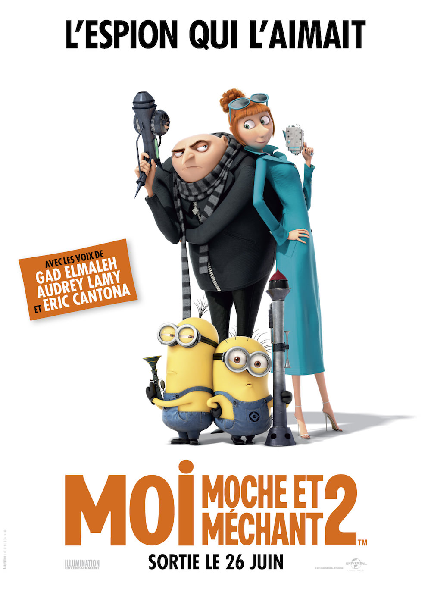
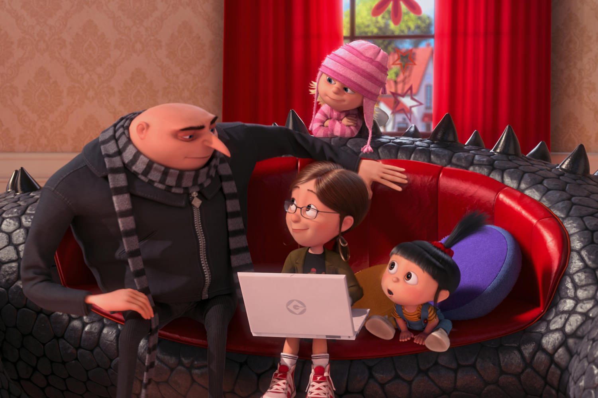
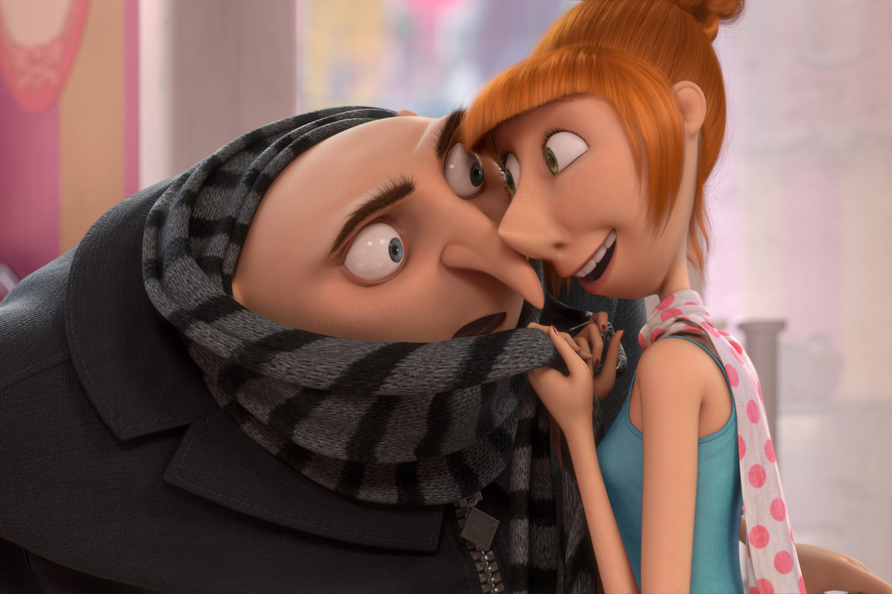

+++
type = "post"
titre = "<em>Moi, moche et méchant 2</em>, Chris Renaud et Pierre Coffin"
title = "Moi, moche et méchant 2, Chris Renaud et Pierre Coffin"
url = "/moi-moche-et-mechant-2-renaud-coffin"
date = "2013-06-27T00:19:32"
Lastmod = "2014-12-26T18:34:47"
cover = "moi-moche-mechant-2-renaud-coffin.jpg"
categorie = [ "À voir" ]
tag = [ "Amour", "Animation", "Blockbuster", "Comédie", "Espionnage", "Famille", "Humour", "Sorties du mois" ]
createur = [ "Chris Renaud", "Pierre Coffin" ]
annee = [ "2013" ]
weight = 2013
saga = [ "Moi moche et méchant" ]
pays = [ "États-Unis", "France" ]
original = "Despicable Me 2"

+++

Sorti en 2010, <a href="http://voiretmanger.fr/moi-moche-mechant-coffin-renaud/" title="Moi, moche et méchant, Pierre Coffin et Chris Renaud - À voir et à manger"><em>Moi, moche et méchant</em></a> réussissait son pari en offrant une animation familiale, mais pas stupide et la dose d’originalité nécessaire grâce à ce personnage de méchant raté en guise de héros à contre-emploi. Trois ans plus tard, Chris Renaud et Pierre Coffin offrent à ce premier succès une suite, sobrement nommée <em>Moi, moche et méchant 2</em>. On y retrouve Gru, le fameux méchant qui ne parvient à effrayer personne, mais aussi les trois petites filles qu’il a adoptées et, bien évidemment, les milliers de Minions qui apportaient la touche comique supplémentaire. À l’écran, le pari est à nouveau réussi et ce nouvel opus est encore une fois un blockbuster familial réussi. S’il a perdu l’effet de surprise, <em>Moi, moche et méchant 2</em> reste vraiment amusant et il n’est pas qu’une copie du premier opus. 

Gru a abandonné ses ambitions pour devenir un super méchant. L’homme maladroit s’est rangé et il élève désormais dans son pavillon de banlieue les trois petites filles qu’il a finalement adoptées à la fin de l’épisode précédent. Il peut compter pour cela sur l’aide de Néfario, son assistant, mais aussi des Minions, ces créatures jaunes stupides, mais attachantes. Une vie sans intérêt en somme, que <em>Moi, moche et méchant 2</em> va venir chambouler, on s’en doute bien. Chris Renaud et Pierre Coffin ne perdent pas de temps et introduisent leur scénario en quelques plans : une base secrète emportée par un inconnu, une agence secrète qui ne parvient pas à l’identifier et qui décide de faire appel à Gru pour ses connaissances sur les autres super méchants. D’abord opposé à l’idée, notre méchant devenu papa poule heureux, certes, mais qui s’ennuie un peu, accepte finalement la proposition et s’engage aux côtés de Lucy, espionne pour le compte de l’agence secrète. Ensemble, ils doivent trouver celui qui a volé le laboratoire et surtout le produit extrêmement dangereux qu’il contenait. <em>Moi, moche et méchant 2</em> ne cherche pas à surprendre à tout prix avec ce scénario : on sait bien que rien ne passera comme prévu et de fait, rien ne se passe comme prévu. Pourtant, si leur scénario est prévisible, les deux réalisateurs ont réussi à renouveler l’intérêt du film et on ne s’ennuie jamais pendant le film, tandis que l’intrigue réserve suffisamment de (petites) surprises pour maintenir un intérêt intact du début à la fin. En d’autres termes, ce n’est pas très novateur, certes, mais c’est bien fait et on rigole de bon cœur.

L’humour en effet est toujours au cœur de cette suite. Les Minions prennent de l’importance et, comme Scrat dans <em>L’Âge de Glace</em>, ils occupent souvent la première place dans <em>Moi, moche et méchant 2</em>. Chris Renaud et Pierre Coffin ont toutefois su utiliser convenablement leurs petits personnages jaunes qui ne sont pas que des créatures stupides, mais qui ont désormais de vraies personnalités. Ils sont en tout cas toujours aussi drôles et amuseront autant les enfants qui n’y verront que des créatures « trop mignonnes » que les adultes qui s’amuseront à noter toutes les références qui passent par eux. Le premier opus était resté assez discret sur ce plan, mais la suite multiplie les clins d’œil à d’autres univers, le plus évident étant bien sûr la saga <em>James Bond</em>. Évoquée dès l’affiche (« <em>L’espion qui l’aimait</em> », une référence explicite à <a href="http://voiretmanger.fr/espion-aimait-gilbert/" title="L'espion qui m'aimait, Lewis Gilbert - À voir et à manger"><em>L’espion qui m’aimait</em></a>), ces citations sont sensibles surtout au début : personnages et gadgets — la voiture qui se transforme en sous-marin, comme dans cet épisode des aventures de l’agent 007 —, mais aussi musique… tout est inspiré très directement par l’univers de cette saga. <em>Moi, moche et méchant 2</em> ne se contente pas d’être une version alternative et parodique des films du plus célèbre espion cependant. Le film trouve vite sa propre voie et il faut reconnaître que les scénaristes s’en sont donnés à cœur joie, avec une histoire réussie et qui trouve un bel équilibre entre l’action et l’intimité. Autre nouveauté de cette suite, Pierre Coffin et Chris Renaud font tomber leur personnage principal amoureux de Lucie, l’agent avec laquelle il doit travailler. Loin du cliché que l’on pouvait craindre, leur relation est assez belle et même touchante, une surprise dans un tel film.

<em>Moi, moche et méchant 2</em> n’est pas le chef-d’œuvre qui vient bousculer le paysage de l’animation, c’est un fait. Ce n’est pas non plus l’ambition de cette suite qui parvient encore à faire rire en évitant le sentiment de redite. Chris Renaud et Pierre Coffin ont su construire une belle suite, toujours très drôle, spectaculaire quand il faut, menée par une <a href="http://www.amazon.fr/gp/product/B00CMB8MXC/ref=as_li_ss_tl?ie=UTF8&#038;tag=leblogdenic07-21&#038;linkCode=as2&#038;camp=1642&#038;creative=19458&#038;creativeASIN=B00CMB8MXC">très bonne bande originale</a> et aussi touchante par moment. Les Minions prennent plus de place, certes, mais ce n’est pas au détriment du reste et il faut avouer que ces bestioles jaunes sont une vraie réussite. Techniquement au point, <em>Moi, moche et méchant 2</em> est un pari gagnant pour ses deux réalisateurs, et un excellent conseil pour une séance en famille. 

