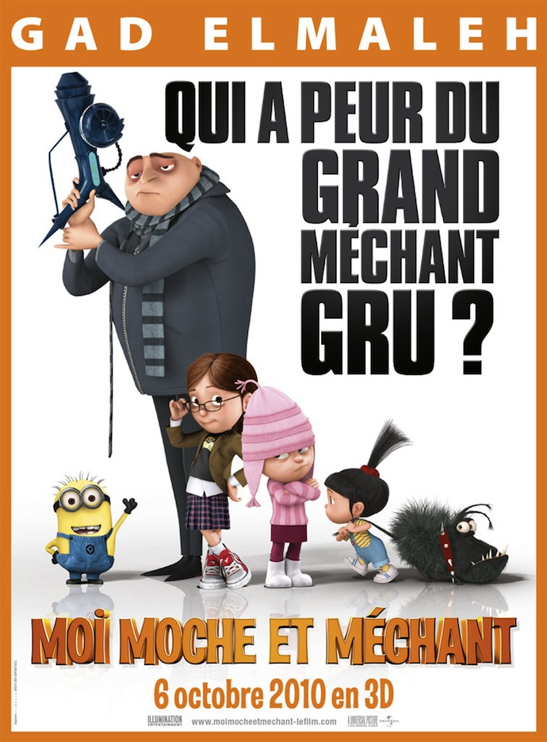
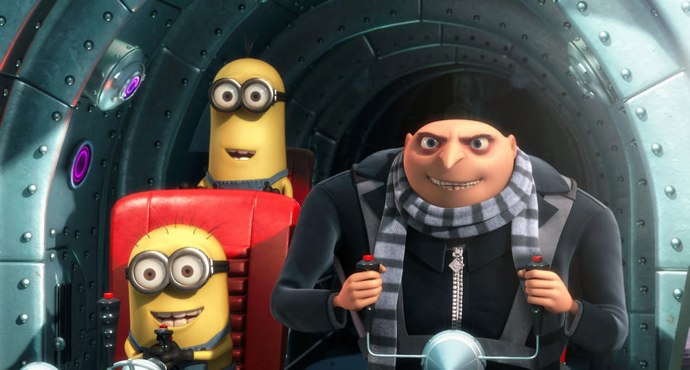
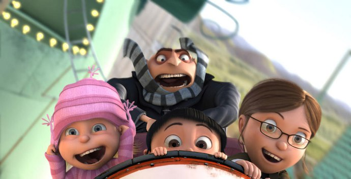

+++
type = "post"
titre = "<em>Moi, moche et méchant</em>, Pierre Coffin et Chris Renaud"
title = "Moi, moche et méchant, Pierre Coffin et Chris Renaud"
url = "/moi-moche-mechant-coffin-renaud"
date = "2010-10-16T00:40:27"
Lastmod = "2014-12-26T18:42:19"
cover = "despicable-me.jpg"
categorie = [ "À voir" ]
tag = [ "3D", "Animation", "Comédie", "Famille", "Humour", "Vite oublié" ]
createur = [ "Chris Renaud", "Pierre Coffin" ]
annee = [ "2010" ]
weight = 2010
saga = [ "Moi moche et méchant" ]
pays = [ "États-Unis" ]
original = "Despicable Me"

+++

<em>Moi, moche et méchant</em> s&rsquo;annonçait plutôt mal. Bande-annonce pénible en trois morceaux différents pour un film d&rsquo;animation qui semblait tout sauf intéressant, un film vu et revu avec gags visuels pour les enfants et références plus ou moins subtiles pour les parents. Bref, un film d&rsquo;animation familial comme on en a tant vu et qui ne mérite aucune attention. Intrigué par des critiques souvent très positives, j&rsquo;ai néanmoins dédié de laisser une chance au film, tout en évitant soigneusement la voix de Gad Elmaleh, argument de vente massue pour la version française. <em>Moi, moche et méchant</em> se révèle finalement une plutôt bonne surprise : s&rsquo;il s&rsquo;agit bien d&rsquo;un film d&rsquo;animation familial assez classique, il est efficace et drôle.

Monsieur Gru est un vilain méchant, un comploteur hors pair qui envisage pas moins que de voler la lune après s&rsquo;être fait voler la vedette par Vector, un jeune méchant qui a volé une des pyramides d&rsquo;Égypte. Gru aimerait être méchant, au moins, mais il n&rsquo;est pas vraiment doué pour ça. Lui et ses troupes, les « Minions », de petits êtres jaunes pas très fins, n&rsquo;ont pas réussi à voler grand-chose, si ce n&rsquo;est la Statue de la Liberté et la Tour Eiffel… de Las Vegas. Gru fait tout pour être méchant, il a une grosse maison sinistre au milieu d&rsquo;une banlieue paisible, il a un gros véhicule surmonté d&rsquo;une fusée qui lui permet d&rsquo;aller vite et certainement de beaucoup polluer, il invente des armes maléfiques qui congèlent tous ceux qui l&rsquo;ennuient et il adore faire peur aux enfants dans la rue. Malgré ces apparences, Gru peine à assumer son statut de méchant qu&rsquo;il oublie rapidement quand il est chez lui, avec ses créatures jaunes. Il a bien un grand projet quand même, un projet qui, s&rsquo;il réussit, ferait de lui le plus grand méchant de la planète. Il envisage ainsi de voler la lune, après l&rsquo;avoir réduite à la taille d&rsquo;une balle de tennis en utilisant une arme capable de réduire tous les objets ou êtres touchés par son rayon. Mais ce projet va être mis à mal par l&rsquo;arrivée dans sa vie de trois petites filles…

On le comprend vite, <em>Moi, moche et méchant</em> va bousculer ce personnage de Gru et révéler un autre être, gentil et touchant à la fois. Le scénario est assez classique : confrontation entre deux univers qui n&rsquo;ont rien à voir (le méchant d&rsquo;un côté, les fillettes de l&rsquo;autre), rejet des deux univers dans un premier temps avant une découverte mutuelle et enfin apprentissage d&rsquo;une vie commune. De cette confrontation, on s&rsquo;en doute, les filles comme le méchant apprendront des choses et en sortiront grandis. Comme le synopsis le dit, Gru découvre stupéfait que ces petites filles ne le voient pas comme un méchant, mais comme un père et cette découverte remet son engagement de méchant en question. Et si, finalement, il faisait aussi un père gentil ? Et si ce rôle de méchant qui est explicitement lié à une frustration de l&rsquo;enfance et au désir de rendre sa mère fière n&rsquo;était pas une quête un peu vaine qu&rsquo;il pouvait abandonner au profit de ces filles qu&rsquo;il héberge d&rsquo;abord par intérêt personnel ? Le happy-end est attendu dans ce genre de films, et il ne fait pas défaut dans <em>Moi, moche et méchant</em>. Il est d&rsquo;ailleurs peut-être trop prévisible dans le registre du &laquo;&nbsp;tout est bien qui finit bien&nbsp;&raquo;, mais il n&rsquo;enlève rien à l&rsquo;intérêt de ce qui précède.

Comme prévu, <em>Moi, moche et méchant</em> fait la part belle à l&rsquo;humour. Contrairement aux autres films du genre, l&rsquo;humour n&rsquo;est pas vraiment ici lié au second degré et aux références à d&rsquo;autres œuvres : s&rsquo;il y a bien quelques inévitables clins d&rsquo;œil ici ou là, ils se font plutôt discrets et ce n&rsquo;est pas plus mal. L&rsquo;humour se recentre alors sur les traditions et se concentre sur Gru et ses Minions. Outre les maladresses attendues de la part des Minions, le film se moque constamment, mais gentiment, de son personnage principal, ce méchant raté qui tente pourtant désespérément pour qu&rsquo;on le prenne au sérieux et qu&rsquo;on le craigne. Mais personne n&rsquo;y croit vraiment : son banquier (pourtant dédié aux méchants) ne le prend pas au sérieux, les trois filles ne sont jamais vraiment effrayées et même son voisin doute quand Gru menace de tuer son chien. Le pire, c&rsquo;est bien sûr sa mère qui considère son fils avec dédain, voire l&rsquo;ignore totalement. Ce personnage de Gru est vraiment réussi, et je dois dire que la voix de Steve Carell (Gad Elmaleh en version française), dans un rôle parfois étonnamment proche de celui qu&rsquo;il tenait dans la série <em>The Office</em>, y est pour beaucoup. Tantôt menaçante et assurée, tantôt implorante et tremblante, elle est pour beaucoup dans la drôlerie du personnage. Si l&rsquo;humour est omniprésent, <em>Moi, moche et méchant</em> se distingue de la production standard avec une touche d&rsquo;émotion ou de mélancolie inattendue. C&rsquo;est l&rsquo;apport des jeunes filles, je dois dire assez touchantes dans leur terrible orphelinat puis dans leur quête d&rsquo;amour et de famille. Là encore, le thème est on ne peut plus classique et le traitement convenu, mais le film est efficace et parvient à susciter un peu d&rsquo;émotion. On n&rsquo;est pas au niveau d&rsquo;un Pixar, certes, mais cette touche mélancolique et bienvenue.

<em>Moi, moche et méchant</em> n&rsquo;est pas sorti des usines de Disney, Pixar ou Dreamworks, mais le film n&rsquo;a pas à rougir face à ces monstres. Sans atteindre la dextérité technique de Pixar, le film propose une animation propre qui ne privilégie pas forcément la performance technique pure. Le film est diffusé en 3D et si les apports réels sont limités, la technologie est manifestement suffisamment au point pour ne plus être une gêne (à moins que l&rsquo;on soit maintenant habitué, c&rsquo;est une raison que je n&rsquo;exclue pas). Le film est rythmé et les gags autant que le récit s&rsquo;enchaînent à toute vitesse, ce qui est un très bon point pour ce genre de film. <em>Moi, moche et méchant</em> est la première réalisation de <a href="http://en.wikipedia.org/wiki/Illumination_Entertainment">Illumination Entertainment</a>, studio d&rsquo;animation de Universal Pictures et ce sera peut-être un concurrent sérieux aux studios en place…

<em>Moi, moche et méchant</em> est effectivement un film d&rsquo;animation familial très sympathique. Son humour, plus traditionnel, sera aussi efficace pour les grands que pour les petits (qui trouveront sans aucun doute les Minions &laquo;&nbsp;trop mignons&nbsp;&raquo;). Malheureusement, le film ne va pas vraiment au-delà de la sympathie et ne sera pas inoubliable. Il manque au film quelque chose, peut-être un scénario plus fort encore, peut-être un méchant encore plus méchant, même si l&rsquo;idée de la banque dédiée aux sales affaires et ancienne Lehamn Brothers est plutôt bien vue. Un film que l&rsquo;on pourra voir sans crainte en famille.

<h3>Vous voulez m&rsquo;aider ?</h3>
<ul>
<li><a href="http://www.amazon.fr/gp/product/B0045Y1JCK/ref=as_li_ss_tl?ie=UTF8&tag=leblogdenic07-21&linkCode=as2&camp=1642&creative=19458&creativeASIN=B0045Y1JCK">Acheter le film en Blu-Ray et DVD sur Amazon</a></li>
<li><a href="http://www.amazon.fr/gp/product/B0045Y1JCA/ref=as_li_ss_tl?ie=UTF8&tag=leblogdenic07-21&linkCode=as2&camp=1642&creative=19458&creativeASIN=B0045Y1JCA">Acheter le film en DVD sur Amazon</a></li>
<li><a href="https://itunes.apple.com/fr/movie/moi-moche-et-mechant/id402248509">Acheter ou louer le film sur l&rsquo;iTunes Store</a></li>
</ul>

