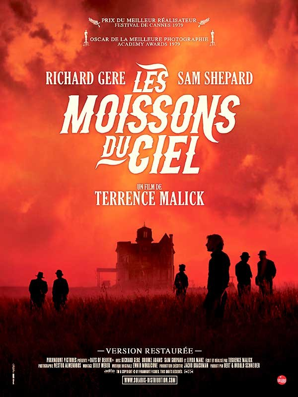
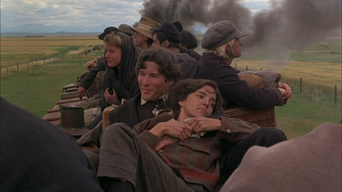
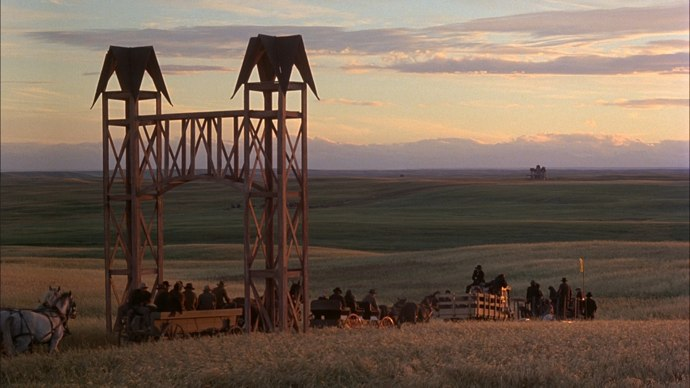
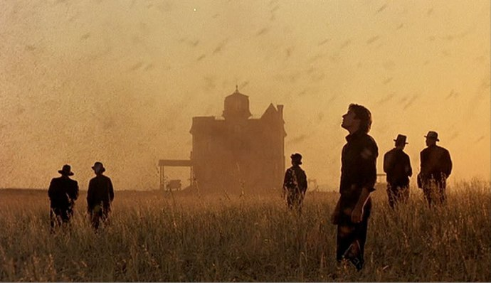

+++
type = "post"
titre = "<em>Les moissons du ciel</em>, Terrence Malick"
title = "Les moissons du ciel, Terrence Malick"
url = "/moissons-ciel-malick"
date = "2010-06-26T23:53:05"
Lastmod = "2015-05-09T10:19:44"
cover = "les-moissons-du-ciel-malick.jpg"
categorie = [ "À voir" ]
tag = [ "Amour", "Cinéma classique", "Drame", "Histoire", "Nature", "Triangle amoureux" ]
createur = [ "Terrence Malick" ]
acteur = [ "Brooke Adams", "Linda Manz", "Richard Gere", "Sam Shepard" ]
annee = [ "1979" ]
weight = 1979
pays = [ "États-Unis" ]
original = "Days of Heaven"

+++

Je l&rsquo;avoue sans mal, je ne porte pas Terrence Malick dans mon cœur depuis que j&rsquo;ai vu <a href="http://voiretmanger.fr/2012/02/19/nouveau-monde-malick/" title="Le Nouveau Monde, Terrence Malick"><em>Le Nouveau Monde</em></a> au cinéma. Ce Pocahontas revisité m&rsquo;avait semblé d&rsquo;une niaiserie sans borne et la valorisation totale de la nature, des petites plantes dans le coucher du soleil et des petits animaux m&rsquo;avait agacé. J&rsquo;en étais resté plus ou moins là avec ce réalisateur pourtant unanimement apprécié de la critique, mais son second film, <em>Les moissons du ciel</em>, vient de ressortir dans une version restaurée. Je ne pouvais rester insensible aux critiques à nouveau excellentes, et j&rsquo;ai donc décidé d&rsquo;aller voir le film. Je ne le regrette pas : si la valorisation de la nature reste présente, et si l&rsquo;amour est également de la partie, ce film emporte par une réalisation sans faille et un traitement original de l&rsquo;amour. À découvrir ou à revoir…

<em>Les moissons du ciel</em> ne brille pas par l&rsquo;originalité de son scénario. L&rsquo;action se déroule aux États-Unis, au début du XXe siècle, pendant la Première Guerre mondiale même. Une époque où ce grand pays est encore tout jeune, mais commence déjà à construire sa puissance qui s&rsquo;imposera au monde entier après la crise de 1929 et pendant la Seconde Guerre mondiale. C&rsquo;est une époque où le territoire est maîtrisé dans ses grandes lignes, mais où le <em>Far West</em> fait encore sens, surtout dans les régions de Prairies où quelques gros propriétaires terriens règnent sur d&rsquo;énormes champs à perte de vue. Le film commence néanmoins à Chicago. Bill travaille dans une aciérie (ou équivalent) et charge toute la journée du charbon dans un énorme four. Les conditions de travail sont déplorables et on comprend vite que c&rsquo;est un gagne-pain qui lui déplait fort. On assiste à une dispute avec celui qui doit être son contremaître, dispute qui tourne mal et se termine avec un coup de pelle dans la tête du responsable. Bill s&rsquo;enfuit alors avec deux jeunes filles qu&rsquo;il fait passer pour ses sœurs. L&rsquo;une d&rsquo;entre elles est en fait une jeune femme et on comprend sans difficulté qu&rsquo;il y a plus que l&rsquo;amitié fraternelle entre les deux. On ne saura jamais pourquoi ils ne vivent pas leur liaison au grand jour, tout au plus apprend-on qu&rsquo;ils craignent le qu&rsquo;en-dira-t-on.

Leur fuite de Chicago les mène tout droit au Texas. Le train qui les transporte traverse des contrées totalement vides à perte de vue et recouvertes de champs ou de grandes prairies. Ces paysages nous sont encore familiers aujourd&rsquo;hui, même si la voie ferrée a sans doute été remplacée depuis par une route parcourue de stations-services. Ils arrivent à une ferme qui recrute des saisonniers pour faire les moissons et se font engager. Le travail est difficile et mal payé, là encore c&rsquo;est purement alimentaire. Ils auraient dû repartir après les moissons, mais le propriétaire des lieux s&rsquo;est entiché de la supposée sœur de Bill. Ce richissime propriétaire est aussi gravement malade, le docteur ne lui donnant pas plus d&rsquo;un an pour vivre. Bill voit là une opportunité pour s&rsquo;enrichir et pousse donc son amie à l&rsquo;épouser. Sauf qu&rsquo;il n&rsquo;avait pas prévu que l&rsquo;amour d&rsquo;une femme allait redonner au propriétaire ses couleurs, mais surtout pas que son amie allait tomber amoureuse de cet homme. <em>Les moissons du ciel</em> propose donc un triangle amoureux traditionnel, avec un inévitable affrontement final entre les deux prétendants. Le film semble suivre un schéma classique, tel qu&rsquo;on pourrait en voir dans une tragédie par exemple. Son intérêt n&rsquo;est pas vraiment là, à dire vrai.

Si <em>Les moissons du ciel</em> n&rsquo;offre pas une histoire innovante, il propose par contre énormément d&rsquo;éléments intéressants, tant sur le contexte historique que, même, sur l&rsquo;histoire d&rsquo;amour. Le film date de 1979, soit environ 60 ans après les faits. Soixante ans qui ont radicalement changé les États-Unis, si bien que le film pourrait, à quelques détails près, se dérouler à la fin du XIXe siècle. Je crois que la restitution est fidèle, et elle est passionnante pour l&rsquo;ancien khâgneux qui se souvient avec émotion d&rsquo;un de ses programmes d&rsquo;histoire<a href="#fn-3530-1" rel="footnote">1</a>. On découvre un pays déjà très mobile — une caractéristique qui est toujours vraie et qui ne manque pas de nous étonner, nous qui sommes si enclins à la sédentarité —, aux inégalités sociales déjà marquées, mais où il était aussi facile d&rsquo;être viré que de trouver un nouvel emploi. On apprend aussi beaucoup de choses sur les conditions de travail de l&rsquo;époque, que ce soit en usine ou dans les champs. Terrence Malick semble être fasciné par les machines, il les filme sous tous les angles, de près et il est vrai qu&rsquo;elles sont très photogéniques. Les campagnes américaines de l&rsquo;époque sont en gros au niveau des campagnes françaises de la Belle Époque : la mécanisation a commencé, mais la force humaine reste essentielle. Les moissonneuses tirées par des chevaux et les batteuses animées par la vapeur sont là pour accélérer des moissons gigantesques, mais les hommes sont toujours là, ne serait-ce que pour déplacer les épis. Les tracteurs animés par la vapeur ou des moteurs diésel sont néanmoins présents, tandis que la priorité est déjà la productivité.

L&rsquo;histoire d&rsquo;amour est également intéressante, mais pour d&rsquo;autres raisons. Son traitement est en effet plutôt original puisque l&rsquo;on ne voit jamais aucun signe explicite de l&rsquo;amour entre le mari et sa femme. Ils dorment dans le lit, mais concrètement, ils pourraient très bien ne jamais se toucher. Il en va de même avec Bill, même si les gestes sont plus explicites, ils sont toujours équivoques et pourraient, effectivement, évoquer un amour filial très marqué, mais innocent. Tout se passe comme si le réalisateur avait voulu rejeter l&rsquo;histoire d&rsquo;amour hors du champ, non pas qu&rsquo;elle ne soit pas importante, mais c&rsquo;est un moyen très efficace de renforcer la fin du film. À la manière des tragédies classiques, le dernier acte est celui des résolutions et en l&rsquo;occurrence de l&rsquo;affrontement : ce n&rsquo;est qu&rsquo;à la fin que le mari et Bill deviennent ouvertement jaloux. Ce traitement de l&rsquo;intrigue amoureuse étonne aujourd&rsquo;hui, époque où on aurait tendance au contraire à la mettre en avant. J&rsquo;ai trouvé cela très efficace, cette insouciance affichée par <em>Les moissons du ciel</em> vis-à-vis de ce qui est pourtant son sujet principal fonctionne très bien.

La thématique de la nature est manifestement essentielle chez Terrence Malick. D&rsquo;emblée, on sent qu&rsquo;il critique l&rsquo;urbanisation de la période industrielle et qu&rsquo;il valorise au contraire une nature présentée comme pure. Ce thème vieux comme le monde (au moins comme JJ Rousseau…) est ici évident : il faut voir ces plans larges sur les paysages pour en prendre conscience. Malick aime ces paysages et cela se voit : ses images sont souvent magnifiques et mises encore en valeur par une lumière naturelle à couper le souffle. La référence qui revient souvent est <a href="http://voiretmanger.fr/2011/05/22/barry-lyndon-kubrick/" title="Barry Lyndon, Stanley Kubrick"><em>Barry Lindon</em></a> de Kubrick, et je pense qu&rsquo;elle n&rsquo;est pas usurpée. <em>Les moissons du ciel</em> est vraiment un film magnifique et qui fait oublier le côté un peu rousseauiste au premier degré de la merveilleuse nature. Cela dit, ne soyons pas injustes : Malick filme une nature pure, mais souillée par l&rsquo;homme qui doit alors subir la terrible vengeance des éléments. Celle-ci prend la forme à la fin d&rsquo;une des plaies égyptiennes, dans une séquence de nuit aussi éprouvante que magnifique à voir. L&rsquo;opposition n&rsquo;est donc pas aussi marquée, aussi franche, aussi caricaturale que l&rsquo;on pouvait le craindre.

<em>Les moissons du ciel</em> est ressorti au cinéma, une quarantaine d&rsquo;années après sa première sortie en salles, dans une version remastérisée. N&rsquo;ayant vu que cette version, je ne peux juger du travail effectué, mais la copie numérique que j&rsquo;ai vue était vraiment de qualité. Il est intéressant de regarder aujourd&rsquo;hui des films anciens comme celui-ci : on prend alors conscience du rythme effréné des productions actuelles, mais aussi des évolutions des techniques. Le film de Malick a été filmé en lumières naturelles la majeure partie du temps, sans traitement numérique derrière. Alors certes, cela se voit parfois, cela s&rsquo;entend aussi (on ne sort pas du Dolby Surround d&rsquo;une piste qui n&rsquo;était que stéréo), mais le travail réalisé sur l&rsquo;image et les couleurs est par ailleurs magnifique. Je trouve que ce film n&rsquo;a pas trop mal vieilli : certains dialogues sonnent un peu faux, la voix off est un procédé un peu vieillot, mais le film, par sa maîtrise et son économie de moyens, semble très moderne aujourd&rsquo;hui. Un mot également sur la bande originale composée par Ennio Morricone, rien que cela, et qui accompagne admirablement le film. Le travail sur le son est remarquable d&rsquo;ailleurs, avec une précision et une multitude de détails que l&rsquo;on entend rarement au cinéma.

Je suis entré un peu sceptique dans la salle pour voir <em>Les moissons du ciel</em>, second film de Terrence Malick. Je suis ressorti conquis par cette épopée historique et amoureuse aux images si belles. Le traitement original de l&rsquo;histoire amoureuse, rejetée hors plan, m&rsquo;a bien plu tandis que l&rsquo;opposition nature/culture est mieux passée que je ne le craignais. Non, vraiment, c&rsquo;est un très beau film.

Je remercie donc <a href="http://www.plan-c.fr/article-les-moissons-du-ciel-de-terrence-malick-1979-52423857.html">Alexandre</a> qui est responsable de ma décision de voir <em>Les moissons du ciel</em>. Du coup, j&rsquo;ai bien envie de revoir les autres, à commencer par <em>Le Nouveau Monde</em>, pour tenter de comprendre pourquoi j&rsquo;en garde un si mauvais souvenir. <a href="http://www.critikat.com/Les-Moissons-du-ciel.html">Critikat</a> de son côté s&rsquo;est lancé dans une analyse très philosophique du film.

<h3>Vous voulez m&rsquo;aider ?</h3>
<ul>
<li><a href="http://www.amazon.fr/gp/product/B00005KGN2/ref=as_li_ss_tl?ie=UTF8&#038;tag=leblogdenic07-21&#038;linkCode=as2&#038;camp=1642&#038;creative=19458&#038;creativeASIN=B00005KGN2">Acheter le film en DVD sur Amazon</a></li>
<li><a href="https://itunes.apple.com/fr/movie/les-moissons-du-ciel/id435897852">Acheter ou louer le film sur l&rsquo;iTunes Store</a></li>
</ul>

<ol>
<li id="fn-3530-1">
Les États-Unis au vingtième siècle. Une année difficile, il a fallu regarder des tas de films américains sur toute la période… Je me demande pourquoi on ne nous avait pas conseillé celui-ci, d&rsquo;ailleurs.&#160;<a href="#fnref-3530-1" rev="footnote">&#8617;</a>
</li>
</ol>

