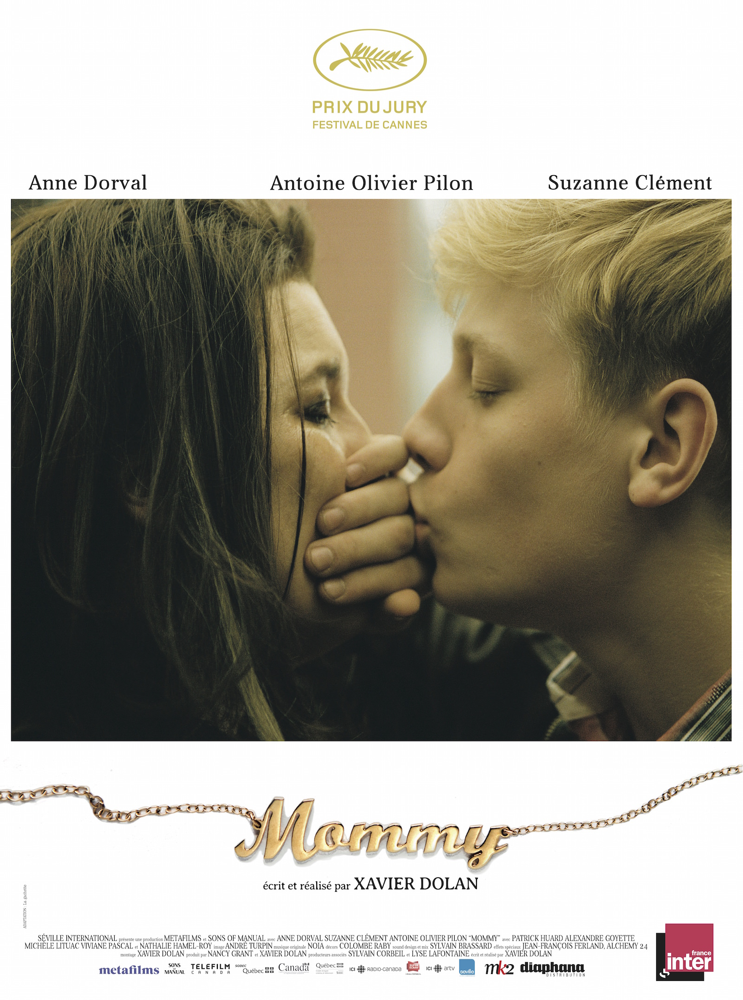
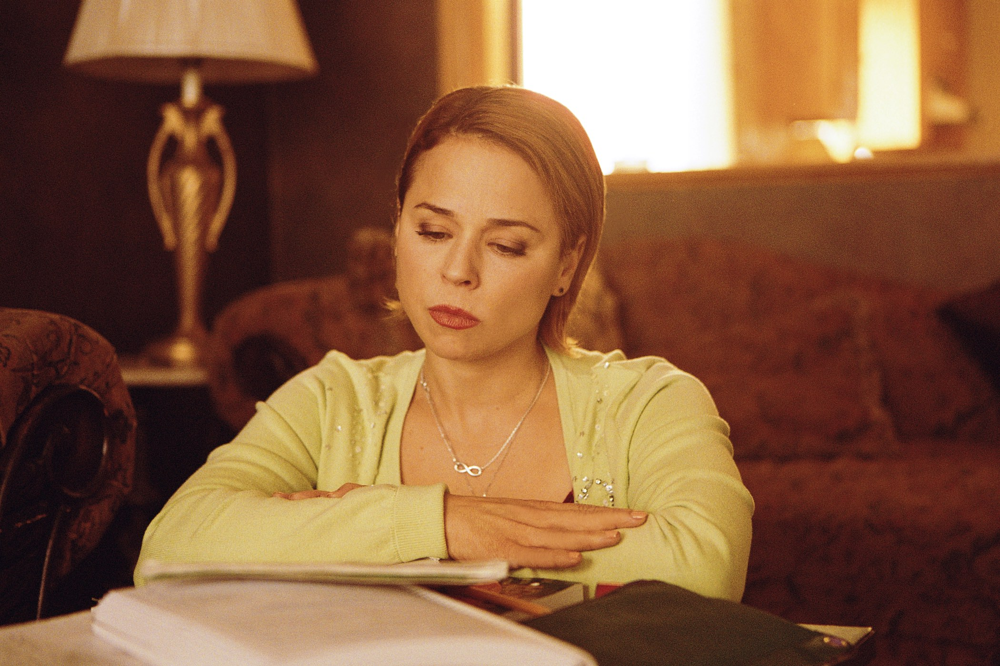

+++
titre = "<em>Mommy</em>, Xavier Dolan"
title = "Mommy, Xavier Dolan"
url = "/mommy-dolan"
date = "2014-10-02T00:40:17"
Lastmod = "2015-03-15T00:57:22"
cover = "mommy-antoine-olivier-pilon.jpg"
categorie = [ "À voir" ]
tag = [ "Adolescence", "Amour", "Drame", "Famille", "Humour", "Psychologie", "Sorties du mois", "Violence" ]
createur = [ "Xavier Dolan" ]
acteur = [ "Anne Dorval", "Antoine Olivier Pilon", "Suzanne Clément" ]
annee = [ "2014" ]
weight = 2014
pays = [ "Canada" ]

+++

En 2009, Xavier Dolan n&rsquo;avait que 19 ans et il commençait son impressionnante carrière cinématographique en tuant symboliquement sa mère. Cinq ans seulement après <a href="http://voiretmanger.fr/jai-tue-ma-mere-dolan/" title="J’ai tué ma mère, Xavier Dolan"><em>J’ai tué ma mère</em></a>, le jeune prodige sort son cinquième long-métrage et cette fois, entend réhabiliter sa mère, ou plutôt <em>LA</em> mère en général comme il le dit lui-même. <em>Mommy</em> opère un retournement de situation d&rsquo;autant plus troublant qu&rsquo;Anne Dorval interprète à nouveau le personnage de la mère et semble passer de la tortionnaire à la victime. C&rsquo;est un point de vue intéressant, mais on ne saurait réduire ce long-métrage de plus de deux heures à cette simple idée. Cinéaste marqué par une esthétique aussi soignée que marquée depuis le début, Xavier Dolan atteint avec <em>Mommy</em> un niveau qu&rsquo;il n&rsquo;avait jamais touché jusque-là. Même si l&rsquo;on est encore en terrain connu, à coups de ralentis et de musique pour rythmer le film, ce nouveau long-métrage est le mieux maîtrisé, tant sur le plan formel que sur l&rsquo;histoire. Le résultat est époustouflant : avec cette relation mère-fils difficile, le réalisateur nous touche comme jamais. Un coup de cœur !

D&rsquo;emblée, Xavier Dolan montre qu&rsquo;il maîtrise un autre registre. Après s&rsquo;être essayé à l&rsquo;horreur et au suspense avec <a href="http://voiretmanger.fr/tom-ferme-dolan/" title="Tom à la ferme, Xavier Dolan"><em>Tom à la ferme</em></a>, il commence ce nouveau film quasiment avec une comédie. Toutes ses réalisations étaient marquées par une ironie mordante et parfois drôle, mais cette première scène où Diane est contrainte de récupérer son fils dans un centre spécialisé est vraiment comique. On retrouve dès cette scène Anne Dorval, actrice qui accompagne le réalisateur et qui est incroyablement bonne dans <em>Mommy</em>, avec un rôle compliqué, entre les rires et les larmes. De fait, il n&rsquo;y a pas de quoi rire : Steve est un garçon difficile depuis la mort de son père, qui a eu lieu quelques années auparavant. Enfant hyperactif, il est devenu un adolescent violent qui vit d&rsquo;un centre spécialisé à un autre, sans jamais vraiment se calmer, sans jamais entrer dans la norme, encore moins dans la société. <em>Mommy</em> commence alors que Steve retourne habiter avec sa mère, faute de solution alternative. La situation de Diane est pourtant précaire et elle se fait justement licencier quand commence aussi le récit. Élever seule un enfant qu&rsquo;elle ne peut pas maîtriser, alors qu&rsquo;elle ne peut même pas payer son loyer : la situation est explosive. On s&rsquo;attend au pire, mais le scénario s&rsquo;avère en fait plus compliqué que cela. Xavier Dolan sait même entretenir le suspense sur l&rsquo;avenir de cette famille atypique, pour ne pas dire plus, si bien que l&rsquo;on se gardera de dévoiler la fin. Toujours est-il que le cinéaste, qui a écrit son propre film, est devenu un scénariste plus précis et plus riche. <em>Mommy</em> frappe par la rigueur de son écriture, ce qui n&rsquo;est en aucun cas une critique : le récit est tendu d&rsquo;un bout à l&rsquo;autre et on le suit avec beaucoup de simplicité, ce qui permet de mieux se concentrer sur les images.

Comme dans <em>J&rsquo;ai tué ma mère</em>, Xavier Dolan orchestre une confrontation explosive entre un fils et sa mère. Il y a bien quelques points communs entre ce premier film et <em>Mommy</em>, de la mono-parentalité à la violence verbale des scènes de conflits, mais il y a au fond plus de différences. Loin de se répéter, le réalisateur présente une situation bien différente et assez complexe. Incarné par Antoine Olivier Pilon, un jeune acteur qui s&rsquo;impose à l&rsquo;écran avec une présence rare et que Xavier Dolan retrouve après le fameux clip « <a href="https://www.youtube.com/watch?v=Rp5U5mdARgY"><em>College Boys</em></a> », Steve est un garçon violent, qui souffre de crises régulières qui le mettent hors de lui et qu&rsquo;il ne peut absolument pas maîtriser. Dans ces phases, il est incontrôlable et même sa mère ne peut pas le gérer : peu après leur retour, une scène d&rsquo;une grande violence tourne mal et Diane doit s&rsquo;enfermer dans un placard pour ne pas être frappée par ce fils hors de lui. Dans ces conditions, on conçoit bien que le personnage maternel ne soit plus la source des problèmes, mais plutôt la victime. La mère d&rsquo;ailleurs a bien du mal à tenir depuis la mort de son mari et elle gère du mieux qu&rsquo;elle peut cet enfant instable, bien plus fort qu&rsquo;elle. Pour autant, est-elle tout à fait une victime ? Les choses sont plus complexes qu&rsquo;elles n&rsquo;en ont l&rsquo;air dans <em>Mommy</em> et même si la mère est sans conteste dépassée par son fils, elle est loin d&rsquo;être la mère parfaite qui fait tout ce qu&rsquo;il faut pour Steeve. Quand elle l&rsquo;emmène à son rendez-vous galant avec un voisin qu&rsquo;elle ne veut séduire que pour un service, on sait qu&rsquo;elle fait une erreur et on n&rsquo;est pas surpris quand cette sortie déclenche une crise. Diane n&rsquo;est pas parfaite, mais le film est très tendre avec cette femme qui fait ce qu&rsquo;elle peut, uniquement par amour. À l&rsquo;inverse, Steve est infernal quand il s&rsquo;y met, mais c&rsquo;est aussi un jeune homme extrêmement charismatique et très touchant quand il témoigne de son amour inconditionnel — et un peu envahissant — à sa mère. Cette finesse dans l&rsquo;écriture des personnages, une finesse que l&rsquo;on ne peut que grossièrement rendre ici d&rsquo;ailleurs, éloigne <em>Mommy</em> des précédents films du réalisateur.

Xavier Dolan est encore jeune, mais il a gagné en maturité, et cela se sent. Une évolution qui ne nie pas pour autant son univers : à bien des égards, ce long-métrage marque une étape en reprenant des thèmes que l&rsquo;on connaît bien, mais en leur donnant aussi une autre dimension. Un bon exemple tient au troisième personnage, Kyla, une voisine qui vient en aide en donnant des cours à Steve. Cette ancienne enseignante qui bégaie, sans que l&rsquo;on sache pourquoi et sans que cela ne soit nécessaire, est très bien interprétée par Suzanne Clément, autre habituée du réalisateur. Alors que la situation de départ semble désespérément noire, ce personnage apporte l&rsquo;espoir nécessaire et <em>Mommy</em> n&rsquo;est absolument pas un drame plombant grâce à elle. Au contraire, c&rsquo;est même un film plein d&rsquo;espoirs et de rêves et même si on en reste parfois aux rêves, <em>Mommy</em> n&rsquo;est pas seulement une comédie féroce et très drôle, ce n&rsquo;est pas non plus seulement un drame social, c&rsquo;est aussi un long-métrage touchant, presque poignant par moment. En voyant ce film, on comprend quelque chose d&rsquo;essentiel : Xavier Dolan a appris à gérer plus finement ses effets, et son style a lui aussi gagné en finesse et en maturité. Certes, les ralentis sont toujours très présents, mais ils sont moins gratuits qu&rsquo;avant et ont plus de sens pour accompagner le récit. Certes, la musique est toujours aussi audible et disparate — de Céline Dion à Oasis, en passant par Andrea Bocelli à Dido, il y en a vraiment pour tous les goûts —, mais le réalisateur sait maintenant qu&rsquo;il faut parfois l&rsquo;arrêter et certains plans totalement silencieux sont d&rsquo;autant plus forts que la musique n&rsquo;est plus là. Certes, le format carré qui s&rsquo;étend quand l&rsquo;espoir renaît est un peu facile, mais c&rsquo;est aussi un choix qui se comprend tout à fait : <em>Mommy</em> entend être au plus près des personnages, et ce carré parfait est idéal pour un portrait. Les cadres sont souvent au plus près et ils atteignent une forme de perfection par leur simplicité, tandis que ce format carré permet aussi à Xavier Dolan de s&rsquo;amuser avec des plans qui se dévoilent très progressivement.

<em>Mommy</em> est-il le film de Xavier Dolan le plus accessible ? Son concepteur le présente comme un film populaire et ose même la comparaison avec des comédies populaires, comme <em>Matilda</em> ou <em>Madame Doubtfire</em>. En affinant son style, en limitant son côté un peu lourd et systématique parfois, le cinéaste gagne en maturité, mais sans perdre sa particularité. Ce nouveau long-métrage a beau être accessible, il divisera sans doute autant le public, et c&rsquo;est tant mieux. Que vous aimiez ou non le style Dolan, vous auriez tort de passer à côté de <em>Mommy</em>, ne serait-ce que pour son trio d&rsquo;acteurs exceptionnel. Suzanne Clément est parfaite en voisine mystérieuse qui apporte de l&rsquo;espoir autant qu&rsquo;elle progresse elle-même. Antoine Olivier Pilon est un jeune acteur, mais il a une maturité et un talent qui devraient faire rougir certains de ses aînés. Mais la vraie star, incontestablement, c&rsquo;est Anne Dorval qui habite ce personnage de Diane avec une force et une précision qui n&rsquo;inspire que le respect. S&rsquo;il ne fallait qu&rsquo;une raison de voir ce film, ce serait elle, mais <em>Mommy</em> a d&rsquo;autres arguments à faire valoir. Une réussite !

<h3>Vous voulez <a href="http://voiretmanger.fr/soutien/">m&rsquo;aider</a> ?</h3>
<ul>
<li><a href="http://www.amazon.fr/gp/product/B00ORUJD5C/ref=as_li_ss_tl?ie=UTF8&amp;tag=leblogdenic07-21&amp;linkCode=as2&amp;camp=1642&amp;creative=19458&amp;creativeASIN=B00ORUJD5C">Acheter le film en Blu-ray sur Amazon</a></li>
<li><a href="http://www.amazon.fr/gp/product/B00ORUJC5S/ref=as_li_ss_tl?ie=UTF8&amp;tag=leblogdenic07-21&amp;linkCode=as2&amp;camp=1642&amp;creative=19458&amp;creativeASIN=B00ORUJC5S">Acheter le film en DVD sur Amazon</a></li>
<li><a href="https://itunes.apple.com/fr/movie/mommy/id922890242">Acheter ou louer le film sur l&rsquo;iTunes Store</a></li>
</ul>

