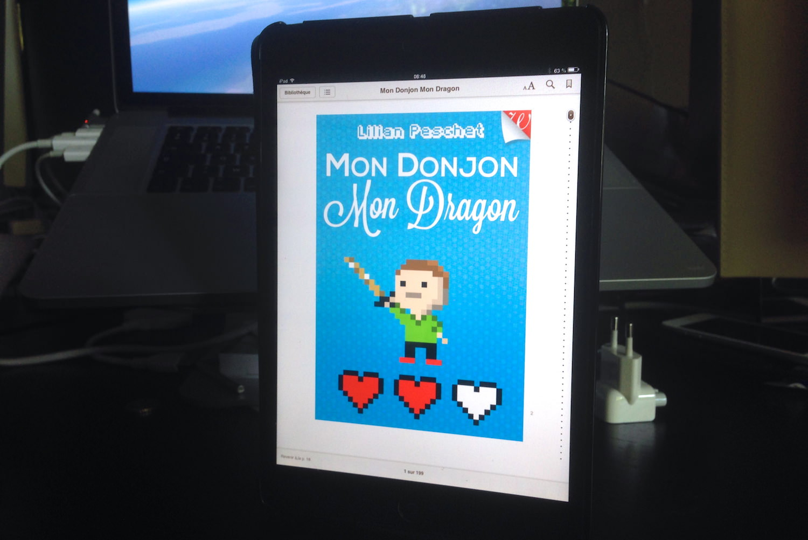
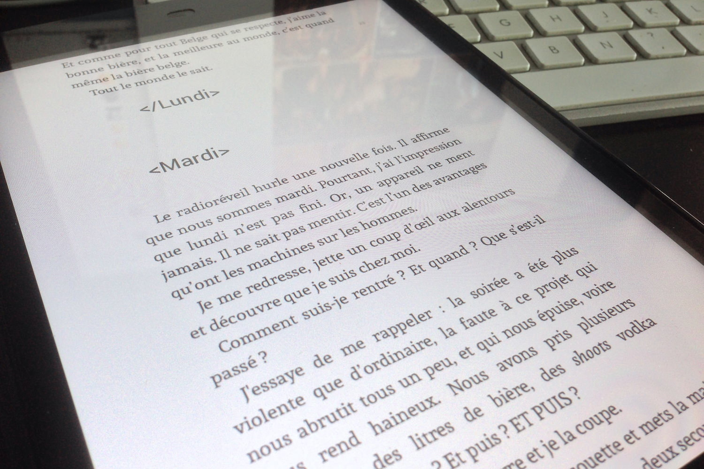

+++
type = "post"
titre = "<em>Mon Donjon Mon Dragon</em>, Lilian Peschet"
title = "Mon Donjon Mon Dragon, Lilian Peschet"
url = "/mon-donjon-mon-dragon-peschet"
date = "2013-07-02T13:43:22"
Lastmod = "2013-07-02T13:50:06"
cover = "mon-donjon-mon-dragon-perschet.jpg"
categorie = [ "À lire" ]
tag = [ "Amour", "Clichés", "Geek", "Informatique", "Politique", "Roman", "Société" ]
createur = [ "Lilian Peschet" ]
annee = [ "2013" ]
weight = 2013
pays = [ "France" ]

+++

<blockquote class="pull-quote">
Mon Donjon Mon Dragon est plus qu’un roman : c’est un manifeste du nerd, une véritable exploration sociologique de l’étrange univers dans lequel évoluent les geeks, et une déclaration d’humour noir et grinçant.<cite class="author"> — Lilian Peschet, Mon Donjon Mon Dragon, quatrième de couverture</cite>

</blockquote>

Le quotidien d’un geek, un vrai : telle est la promesse de <em>Mon Donjon Mon Dragon</em>, le dernier roman de Lilian Peschet. De fait, Bram, son personnage principal, est une vraie caricature de geek : développeur web dans une grosse boîte, il passe son temps à coder ou à jouer à des jeux de rôle et il n’a strictement aucune vie sociale. Jusqu’au jour où il rencontre Aurore, une collègue du travail qui tombe amoureuse de lui et l’entraîne dans une aventure extraordinaire. Ce bref roman commence comme une plongée caricaturale, mais réussie dans l’univers des geeks, avant de changer de registre avec cette histoire de démocratie participative sur internet. Une pointe d’utopie pour cette fin moins passionnante, mais <em>Mon Donjon Mon Dragon</em> se lit rapidement et avec plaisir, même si vous ne comprenez pas cette citation : « <em>Je me suis fait un petit trou. Un endroit rassurant. Protégé. Une sorte de DMZ contre le monde extérieur.</em> » (<em>Mon Donjon Mon Dragon</em>, chapitre &laquo;&nbsp;Jour J&nbsp;&raquo;)

Le portrait que dresse <em>Mon Donjon Mon Dragon</em> d’un développeur web ne fait pas vraiment envie. Il faut dire que Bram cumule les défauts, même s’il est un bon développeur : sur le plan humain en revanche, il est déprimé, enfermé dans un univers virtuel qu’il pratique entre amis tous les week-ends, il n’a aucune vie sociale et déteste plus que tout son boulot et surtout, son chef de projet. La caricature du <em>looser</em> n’est pas très nouvelle, mais il faut reconnaître qu’elle est bien menée et amusante : Lilian Peschet s’est manifestement bien renseigné sur cet univers et s’il ne cherche pas du tout à en dresser un portrait sociologique fidèle, il s’amuse des clichés et c’est réussi. Les touches geeks — termes techniques ou encore utilisation d’éléments réservés aux langages de développement, comme les &laquo;&nbsp;<code>< ></code>&nbsp;&raquo; — sont suffisamment nombreuses pour évoquer quelque chose à certains, à renforcer le mystère pour les autres, même si comme le note <a href="http://anthony.nelz.in/bib/2013/05/lilian-peschet-mon-donjon-mon-dragon/?journal/livres/lilian-peschet-mon-donjon-mon-dragon/">Anthony</a>, on n’utilise plus du tout MSN aujourd’hui… Qu’importent ces approximations, <em>Mon Donjon Mon Dragon</em> ne se veut pas réaliste et toute cette première partie dans les murs de l’entreprise qui emploie Bram et dans son quotidien de joueurs les week-ends est plutôt réussie. 

La suite change de registre. Le côté geek reste constamment présent et jusqu’à la fin <em>Mon Donjon Mon Dragon</em> reste un récit baigné dans la culture informatique et dans les clichés geeks. L’arrivée d’Aurore change tout pour Bram, comme pour le texte de Lilian Peschet. Le style change et des répétitions à l’infini entre pauses café et réunions avec les clients on passe à une fuite en avant frénétique. La nouvelle copine du héros est en effet très active, tout particulièrement au lit, mais aussi dans son quotidien : elle veut offrir à son père souffrant d’un cancer en phase terminale un site participatif, une sorte de démocratie virtuelle. Elle demande à Bram de le coder et commence alors une longue phase de développement en même temps qu’une course contre la montre, puisqu’il faut publier le site avant la mort du beau-père. On n’en dira pas plus de peur de dévoiler l’intrigue, mais <em>Mon Donjon Mon Dragon</em> ne séduit pas autant sur cette partie. Difficile de dire exactement ce qui cloche, mais c’est peut-être que Lilian Peschet est un peu trop sérieux et l’humour noir mis en avant par l’éditeur est trop rarement sensible, en tout cas dans cette partie. Le roman reste très bref et se lit rapidement et sans déplaisir, mais il peine aussi à rester dans les mémoires, peut-être aussi parce qu’il va un peu trop loin dans la caricature. À supporter ce qu’il endure, Bram n’est pas que geek, il est surtout stupide…

Sentiment mitigé à la lecture de <em>Mon Donjon Mon Dragon</em> : le roman commence sur de bonnes bases, mais il déçoit un petit peu dans sa deuxième partie. Le récit de Lilian Peschet est toutefois assez bref (200 pages), il se lit très bien et il est toujours plaisant. Que vous vous identifiez vous-même comme un geek ou que vous soyez simplement curieux de cet univers, <em>Mon Donjon Mon Dragon</em> est une bonne lecture le temps d’un trajet vers les vacances, à défaut d’être un grand roman. 

<h3>Vous voulez m&rsquo;aider ?<a href="#footnote_0_9842" id="identifier_0_9842" class="footnote-link footnote-identifier-link" title="&Agrave; propos de la publicit&eacute;&hellip;">1</a></h3>
<ul>
<li><a href="http://www.amazon.fr/gp/product/B00D1YHCKI/ref=as_li_ss_tl?ie=UTF8&tag=leblogdenic07-21&linkCode=as2&camp=1642&creative=19458&creativeASIN=B00D1YHCKI">Acheter le livre au format Kindle sur Amazon</a></li>
<li><a href="https://itunes.apple.com/fr/book/mon-donjon-mon-dragon/id655057240?mt=11&affId=2165610">Acheter le livre sur l&rsquo;iBookstore</a></li>
<li><a href="http://store.walrus-books.com/mon-donjon-mon-dragon/">Le livre sur le Walrus Bookstore</a></li>
</ul>

<ol class="footnotes"><li id="footnote_0_9842" class="footnote"><a href="/soutien/">À propos de la publicité…</a> [<a href="#identifier_0_9842" class="footnote-link footnote-back-link">&#8617;</a>]</li></ol>
