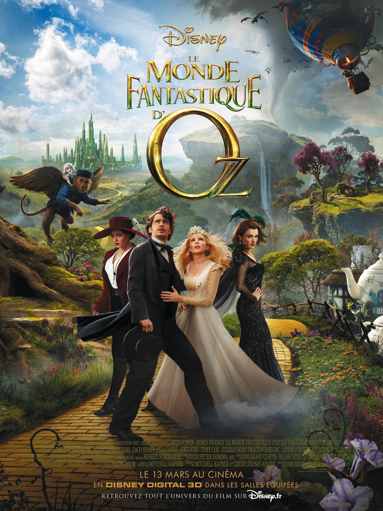
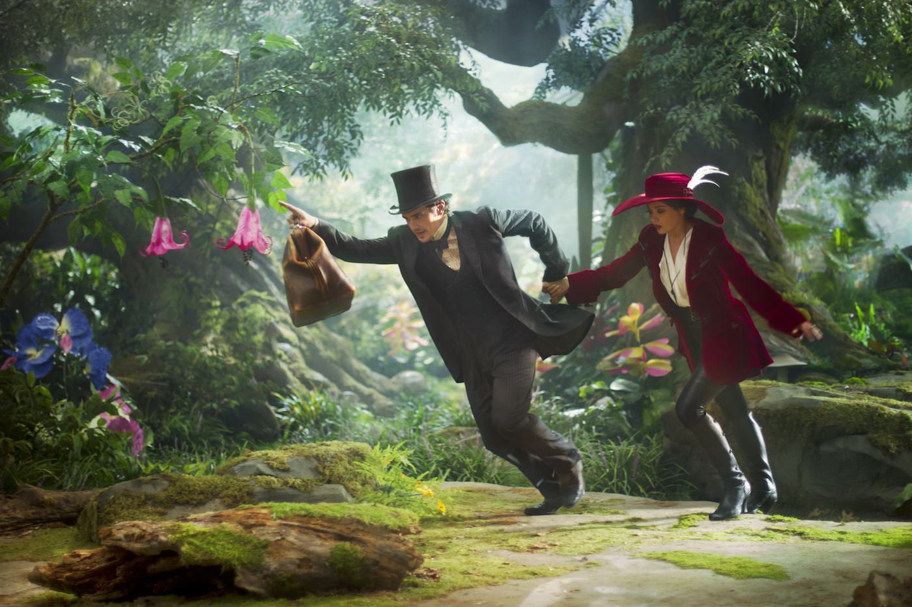

+++
type = "post"
titre = "Le Monde fantastique d&rsquo;Oz, Sam Raimi"
title = "Le Monde fantastique d'Oz, Sam Raimi"
url = "/monde-fantastique-oz-raimi"
date = "2013-03-15T00:07:48"
Lastmod = "2013-03-15T00:16:21"
cover = "le-monde-fantastique-oz-sam-raimi.jpg"
categorie = [ "À voir" ]
tag = [ "Blockbuster", "Fantastique", "Heroïc-Fantasy", "Kitsch", "Vite oublié" ]
createur = [ "Sam Raimi" ]
acteur = [ "James Franco", "Michelle Williams", "Mila Kunis", "Rachel Weisz" ]
annee = [ "2013" ]
weight = 2013
pays = [ "États-Unis" ]
original = "Oz: The Great and Powerful"

+++

Sam Raimi, le spécialiste des films d’horreur avec la série <em>Evil Dead</em> qui s’est fait mondialement connaître avec sa trilogie <a href="/2012/01/15/trilogie-spider-man-raimi/" title="La trilogie Spider-Man, Sam Raimi - À voir et à manger"><em>Spider-Man</em></a>, chez Disney ? L’idée avait de quoi surprendre et inquiéter en même temps, d’autant que le projet n’était rien de moins que de remettre <em>Le magicien d’Oz</em> au goût du jour. Au total, cette association donne <em>Le Monde fantastique d’Oz</em>, un long-métrage qui commence bien, mais échoue à cause d’un univers kitsch bien trop propre et surtout d’un scénario qui manque d’originalité en se contentant de recycler avec paresse les thèmes déjà vus et revus de l’héroïc-fantasy. Décevant…

<em>Le Monde fantastique d’Oz</em> débute avec un noir et blanc et un format carré, pour un film rétro qui n’est pas sans rappeler <a href="/2011/10/16/artist-hazanavicius/" title="The Artist, Michel Hazanavicius - À voir et à manger"><em>The Artist</em></a>. La volonté de faire un film à l’ancienne est la même et Sam Raimi se débrouille plutôt bien avec cette séquence réussie. La 3D est utilisée astucieusement avec des éléments qui sortent du cadre carré et l’ambiance début du XXe siècle fonctionne très bien. On y découvre Oscar, un magicien itinérant un peu minable qui a un peu de talent en tant que prestidigitateur, sans plus, et qui n’hésite pas à les exploiter pour séduire les femmes. Lui qui vole aussi son associé n’est pas un type très sympa, ce qui est assez inattendu dans un tel film. Cette introduction se termine quand le magicien, fuyant un mari très énervé à cause de sa tentative de séduction sur sa femme, est emporté dans une tornade à bord d’un ballon. On s’en doute, il termine dans le monde fantastique d’Oz et <em>Le Monde fantastique d’Oz</em> change alors d’aspect. L’image s’écarte et les couleurs font leur retour, un procédé assez conventionnel, mais qui fonctionne bien. Sam Raimi nous fait découvrir l’environnement extrêmement coloré imaginé pour le film et il utilise au maximum la 3D. C’est bien simple, ce long-métrage est peut-être celui qui utilise le plus les effets en relief, au point même de lasser. Même si c’est techniquement très bien fait, <em>Le Monde fantastique d’Oz</em> donne souvent le sentiment d’avoir été conçu pour le <a href="/2012/03/20/visite-futuroscope/" title="Une visite au Futuroscope - À voir et à manger">Futuroscope</a>. C’est assez fatigant et cela n’apporte pas énormément à l’histoire tout en compliquant la compréhension de certaines scènes en mouvement. L’utilisation abusive de la 3D ne justifie pas tout et c’est le film dans son ensemble qui pâtit de décors souvent plutôt moches. Toutes ces couleurs vives, les petites créatures « trop mignonnes ! » qui émaillent <em>Le Monde fantastique d’Oz</em> ne sont pas très heureuses, d’autant que Sam Raimi ne tend jamais au second degré et reste beaucoup trop sérieux.

Outre ce manque visuel de décalage et ce kitsch peut-être assumé, mais assez moche, <em>Le Monde fantastique d’Oz</em> souffre surtout de son scénario. Le personnage d’Oscar assez déplaisant au début inspire une transformation progressive au cours du film et c’est exactement ce qui se passe. Quand on découvre les premières sorcières présentées comme étant les gentilles, on se dit que les apparences sont sans doute trompeuses, et c’est exactement le cas avec l’arrivée de la vraie sorcière gentille peu après. Tout est prévisible, on devine très vite tout ce qui pourrait se passer et Sam Raimi déçoit en appliquant méthodiquement ce scénario que l’on avait déjà entièrement compris. <em>Le Monde fantastique d’Oz</em> manque cruellement d’effets de surprise, de nouveautés qui évitent l’ennui qui s’instaure inexorablement. Pis, les scénaristes ont imaginé une fin guerrière très à la mode ces derniers temps, mais qui a déjà été vue et revue des dizaines de fois. On pourrait même croire que l’on est face au dernier long-métrage de Tim Burton tant il ressemble, dans l’esprit et dans la réalisation, à son <a href="/2010/03/25/alice-au-pays-des-merveilles-burton/" title="Alice au Pays des Merveilles, Tim Burton - À voir et à manger"><em>Alice au Pays des Merveilles</em></a>, avec le même attrait pour une ambiance gothique, même si elle est moins marquée ici. On retrouve aussi la mode des contes revus et corrigés, comme le médiocre <a href="/2012/06/13/blanche-neige-chasseur-sanders/" title="Blanche-Neige et le Chasseur, Rupert Sanders - À voir et à manger"><em>Blanche-Neige et le Chasseur</em></a> sorti l’an dernier. Le bilan reste toujours le même : l’idée est peut-être bonne sur le papier, mais elle ne fonctionne pas concrètement. Sam Raimi n’a pas trouvé la bonne formule et son blockbuster éclatant de mille couleurs ne séduit pas plus, bien au contraire même. <em>Le Monde fantastique d’Oz</em> a en outre été filmé essentiellement devant des fonds verts et les acteurs n’ont manifestement pas trop su qu’en faire. James Franco donne parfois le sentiment de réciter son texte sans trop y croire, il est au mieux à peine correct. Autour de lui, Mila Kunis est la sorcière la plus convaincante, mais elle ne parvient pas à faire oublier les fausses notes, comme ces personnages secondaires présents uniquement pour la touche comique qui fonctionne d’autant moins qu’elle est totalement artificielle. La <a href="http://www.amazon.fr/gp/product/B00BMINEBQ/ref=as_li_ss_tl?ie=UTF8&tag=leblogdenic07-21&linkCode=as2&camp=1642&creative=19458&creativeASIN=B00BMINEBQ">musique</a> omniprésente de Danny Elfman n’arrange pas les choses, pour un résultat qui frôle l’indigestion. 

Qu’est venu faire Sam Raimi dans cette galère ? <em>Le Monde fantastique d’Oz</em> n’est pas totalement indigne, mais ce film à réserver aux plus jeunes peine vraiment à convaincre. Trop kitsch, trop sérieux, trop prévisible, trop lourd… ce blockbuster aurait pu être un délire visuel réjouissant, mais ce n’est qu’une attraction fatigante. Le cinéaste a-t-il simplement voulu jouer avec la 3D et les fonds verts ? De ce point de vue, le film est réussi, mais malheureusement cela n’en fait pas une réussite pour autant. 

