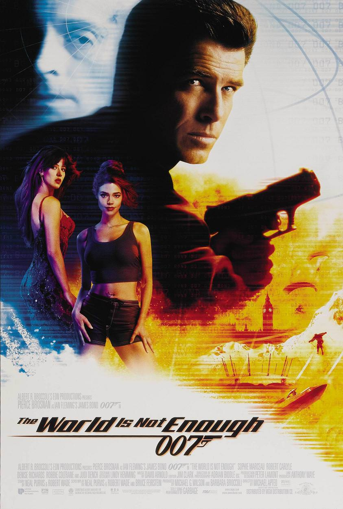

+++
type = "post"
titre = "<em>Le monde ne suffit pas</em>, Michael Apted"
title = "Le monde ne suffit pas, Michael Apted"
url = "/monde-suffit-pas-apted"
date = "2012-12-09T17:50:23"
Lastmod = "2013-05-11T09:58:14"
cover = "le-monde-ne-suffit-pas-pierce-brosnan-apted.jpg"
categorie = [ "À voir" ]
tag = [ "Action", "Blockbuster", "Espionnage", "James Bond", "Vite oublié" ]
createur = [ "Michael Apted" ]
acteur = [ "Denise Richards", "Judi Dench", "Pierce Brosnan", "Sophie Marceau" ]
annee = [ "1999" ]
weight = 1999
saga = [ "James Bond" ]
pays = [ "États-Unis" ]
original = "The World Is not Enough"

+++

<em>Le monde ne suffit pas</em> est le dix-neuvième film de la saga <em>James Bond</em>, le troisième avec Pierce Brosnan. Le succès des deux derniers films a assuré la légitimité de cet acteur qui a repris le rôle de 007 en lui offrant un second souffle et une certaine classe. Deux ans après <a href="http://voiretmanger.fr/2012/12/02/demain-ne-meurt-jamais-spottiswoode/" title="Demain ne meurt jamais, Roger Spottiswoode - À voir et à manger"><em>Demain ne meurt jamais</em></a>, Michael Apted prend la relève et met en scène un scénario original qui n’emprunte au travail de Ian Flemming que son titre, tiré du roman <em>Au service secret de Sa Majesté</em>. Les films de ma saga exploitent en général des scénarios assez simples, mais celui de <em>Le monde ne suffit pas</em> fait figure d’exception. Son intrigue est complexe, mais pas toujours maîtrisée, pour un film un peu brouillon, même si le (grand) spectacle est toujours au rendez-vous.

L’intrigue commence cette fois autour d’une mallette d’argent que James Bond doit récupérer dans une banque suisse. Après avoir réussi à s’échapper avec les billets, l’agent secret le rend à son propriétaire au siège du MI6, mais ne se rend pas compte à temps qu’il s’agissait d’un piège et Sir Robert meurt au cœur de l’agence. <em>Le monde ne suffit pas</em> s’attache par la suite à sa fille, Electra. L’agent 007 est envoyé pour la protéger en Azerbaïdjan où elle poursuit le travail de son père, la construction d’un gigantesque pipeline en Asie Mineure. Il va toutefois vite se douter que les choses ne se déroulent pas comme elles devraient et les suspicions se portent vite sur celle qu’il devait protéger. Les personnages complexes, c’est bien la spécialité du film de Michael Apted. La situation initiale se révèle peu à peu bien éloignée de la réalité, si bien que le spectateur finit, un peu comme James Bond, par être totalement perdu. Les personnages ne sont pas inintéressants, d’autant que les méchants ne sont pas toujours ceux que l’on croit et qu’ils sont plus finement présentés que la moyenne. Une intrigue complexe n’est pas une mauvaise chose en soi, mais <em>Le monde ne suffit pas</em> ne propose pas une histoire qui tient parfaitement la route, le scénario semble plus brouillon que malin. Il reste finalement trop de zones d’ombres pour que l’on puisse penser que c’est volontaire ; il s’agit d’un blockbuster après tout… C’est dommage, car l’idée de base n’était pas mauvaise : en cette fin des années 1990, cette histoire de pipeline autour du pétrole fonctionne plutôt bien, à défaut d’être très originale. 

Par certains aspects, <em>Le monde ne suffit pas</em> ressemble à un best of de la saga. L’épisode est très riche, non seulement par son intrigue complexe, mais aussi par la profusion des scènes typiques des <em>James Bond</em>. L’agent 007 fait à peu près tout dans cet épisode, puisque l’on a des courses-poursuites en bateau, à ski et dans un pipeline, des scènes de combat dans une mine, dans une usine et dans un sous-marin, une scène de casino, plusieurs James Bond girls et même une scène de torture. Michael Apted donne parfois le sentiment d’avoir lu un résumé pour les nuls de la saga et qu’il prend un soin presque scolaire à mettre tous les éléments dans son film, jusqu’à l’outrance. <em>Le monde ne suffit pas</em> en fait tant qu’il ressemble parfois à une caricature de <em>James Bond</em>, un effet surprenant qui aurait pu être réussi si le long-métrage n’était pas autant dépourvu d’humour. Contrairement au personnage mis en place par Pierce Brosnan depuis 	<a href="http://voiretmanger.fr/2012/11/25/goldeneye-campbell/" title="GoldenEye, Martin Campbell - À voir et à manger"><em>GoldenEye</em></a>, l’agent 007 est ici très sérieux, mis à part en de trop rares occasions et l’intrigue complexe vient s’ajouter à ce sérieux pour un résultat bien triste. Certaines scènes restent malgré tout réussies en offrant un spectacle de qualité, notamment celle très bien trouvée du pipeline ou la plus conventionnelle, mais très efficace, course-poursuite en bateau dans le pré-générique. Elles ne suffisent cependant pas à annuler le côté étrangement boursouflé de cet épisode. Pour preuve, <em>Le monde ne suffit pas</em> détient le record de la séquence la plus longue avant son générique, près de 14 minutes qui finissent par ne plus impressionner personne. 

À trop en faire, <em>Le monde ne suffit pas</em> finit par ne rien faire de bien. Le jugement est un peu trop sévère, le dix-neuvième épisode de la saga conserve malgré tout son charme, notamment grâce à quelques séquences d’anthologie. Reste que Michael Apted en fait trop, ou du moins le scénario qu’il a mis en scène, si bien que l’on a parfois plus le sentiment de voir une caricature de <em>James Bond</em>, un comble quand on sait que c’est un épisode extrêmement sérieux. Le scénario plus simple fera son retour dans <em>Meurs un autre jour</em> et c’est peut-être, au fond, ce qui manquait le plus ici… 

<strong>James Bond reviendra dans… <a href="http://voiretmanger.fr/2012/12/16/meurs-un-autre-jour-tamahori/" title="Meurs un autre jour, Lee Tamahori"><em>Meurs un autre jour</em></a></strong>

<h3>Vous voulez m&rsquo;aider ?<a href="#footnote_0_7935" id="identifier_0_7935" class="footnote-link footnote-identifier-link" title="&Agrave; propos de la publicit&eacute;&hellip;">1</a></h3>
<ul>
<li><a href="http://www.amazon.fr/gp/product/B001TEKHVI/ref=as_li_ss_tl?ie=UTF8&tag=leblogdenic07-21&linkCode=as2&camp=1642&creative=19458&creativeASIN=B001TEKHVI">Acheter le film en Blu-Ray sur Amazon</a></li>
<li><a href="http://www.amazon.fr/gp/product/B000NJM5W4/ref=as_li_ss_tl?ie=UTF8&tag=leblogdenic07-21&linkCode=as2&camp=1642&creative=19458&creativeASIN=B000NJM5W4">Acheter le film en DVD sur Amazon</a></li>
<li><a href="https://itunes.apple.com/fr/movie/le-monde-ne-suffit-pas-world/id562151851">Acheter ou louer le film sur l&rsquo;iTunes Store</a></li>
</ul>
<ul>
<li><a href="http://www.amazon.fr/gp/product/B006VCDMQU/ref=as_li_ss_tl?ie=UTF8&tag=leblogdenic07-21&linkCode=as2&camp=1642&creative=19458&creativeASIN=B006VCDMQU">Acheter le coffret <em>James Bond</em> en Blu-Ray sur Amazon</a></li>
<li><a href="http://www.amazon.fr/gp/product/B006VCDMD8/ref=as_li_ss_tl?ie=UTF8&tag=leblogdenic07-21&linkCode=as2&camp=1642&creative=19458&creativeASIN=B006VCDMD8">Acheter le coffret <em>James Bond</em> en DVD sur Amazon</a></li>
</ul>

<ol class="footnotes"><li id="footnote_0_7935" class="footnote"><a href="http://voiretmanger.fr/soutien/">À propos de la publicité…</a> [<a href="#identifier_0_7935" class="footnote-link footnote-back-link">&#8617;</a>]</li></ol>
