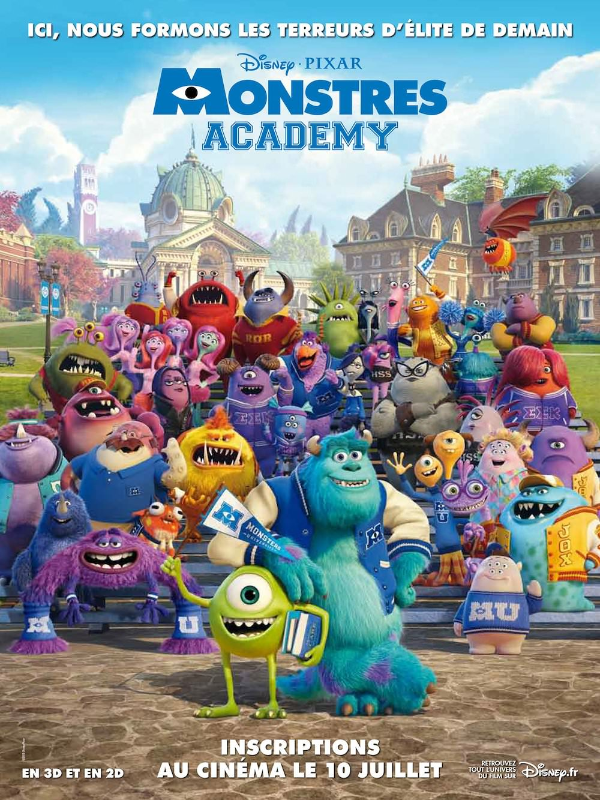
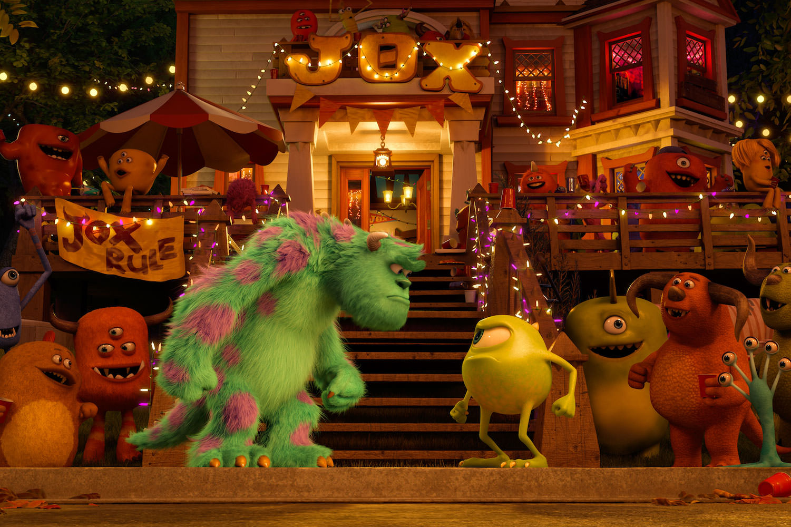
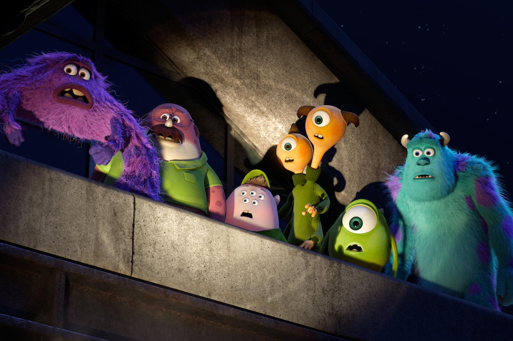

+++
titre = "<em>Monstres Academy</em>, Dan Scanlon"
title = "Monstres Academy, Dan Scanlon"
url = "/monstres-academy-scanlon"
date = "2013-07-10T00:02:20"
Lastmod = "2014-10-05T18:19:17"
cover = "monstres-academy-dan-scanlon.jpg"
categorie = [ "À voir" ]
tag = [ "Adolescence", "Animation", "Blockbuster", "Éducation", "Humour", "Préquelle", "Sorties du mois" ]
createur = [ "Don Scanlon", "Pixar" ]
annee = [ "2013" ]
weight = 2013
pays = [ "États-Unis" ]
original = "Monsters University"

+++

Sorti en 2001, <a href="http://voiretmanger.fr/monstres-et-cie-docter-silverman-unkrich/" title="Monstres &#038; Cie, Pete Docter"><em>Monstres &amp; Cie</em></a> était le quatrième film d’animation de Pixar et la troisième histoire originale racontée par le studio. Son univers à base de monstres qui vont effrayer les enfants pour alimenter l’univers des monstres en électricité était brillant d’originalité et particulièrement bien trouvé, tandis que son scénario construit autour de la découverte de l’altérité était drôle et émouvant à souhait. Bref, une réussite que le studio cherche à prolonger cette année avec <em>Monstres Academy</em>. Plutôt qu’une suite et peut-être pour éviter l’échec relatif de <a href="http://voiretmanger.fr/cars-2-pixar/" title="Cars 2, Pixar - À voir et à manger"><em>Cars 2</em></a> qui sentait trop la redite pour convaincre, ce nouveau long-métrage est une préquelle. Cette fois, c’est Dan Scanlon qui se charge de la réalisation, mais derrière ce nouveau venu<a href="#footnote_0_9886" id="identifier_0_9886" class="footnote-link footnote-identifier-link" title="Qui &eacute;tait quand m&ecirc;me l&rsquo;un des sc&eacute;naristes de Cars et qui a travaill&eacute; sur l&rsquo;animation de Toy Story&nbsp;3&hellip;">1</a>, on retrouve l’équipe habituelle. Pixar a appris de ses erreurs et ce <em>Monstres Academy</em> ne reproduit pas celles de <em>Cars 2</em>. L’idée de raconter une partie de l’enfance des personnages est bonne et le film fonctionne bien… même s’il est loin du niveau de son illustre prédécesseur. Un divertissement parfait pour les vacances et un bon Pixar, mais un Pixar mineur.

On a connu Sulli et Bob adultes, travaillant pour l’usine de récupération des cris des enfants. Place aux mêmes personnages adolescents : <em>Monstres Academy</em> raconte l’histoire de Sully, monstre vert qui se promet, tout jeune, de devenir un jour une terreur dans l’usine de Monstropolis. On le retrouve à son entrée à la Monstres Université, où il est inscrit en cours de terreur. Le jeune monstre est extrêmement motivé, il connaît déjà très bien ses leçons et compte tout faire pour réussir ses études. Malheureusement, il ne fait pas peur : avec sa petite taille et sa bouille ronde toute verte, il ferait plus rire qu’effrayer et il est rapidement expulsé du cours de terreur. Sur le campus, il fait plusieurs rencontres, mais Dan Scanlon concentre son film sur Sully, un énorme monstre naturellement effrayant. « Fils de », ce personnage se laisse porter par son nom et la réputation de son père et, à force de ne rien faire, il finit lui aussi par être expulsé. Leur histoire d’amitié commence ainsi, sur l’échec de leur vie en quelque sorte : l’un n’a toujours rêvé que de ça, l’autre est la risée de la famille à échouer lamentablement dès la première année. Récit d’apprentissage, <em>Monstres Academy</em> raconte la progression de ses deux personnages et surtout leur découverte de la vie et de l’amitié. Au passage, le film exploite tous les clichés sur le monde des universités à l’américaine, avec leur campus fermé sur l’extérieur — les adultes sont quasiment absents du film —, leurs coutumes particulières, l’affrontement des maisons, les concours en interne, etc. On connaît bien cet univers, popularisé par de nombreuses œuvres de fictions, dont la fameuse saga <a href="http://voiretmanger.fr/saga/harry-potter/"><em>Harry Potter</em></a>, même si le public français passera nécessairement à côté de quelques clins d’œil. Qu’importe, le paysage dressé par Dan Scanlon est fidèle à ce que l’on attend et il est réussi, avec au passage quelques scènes très drôles. On s’y attendait, mais Pixar remplit le contrat et le studio parvient malgré tout à nous surprendre, mais sur un autre point.

Le récit de <em>Monstres Academy</em> se déroule avant les évènements de <em>Montres et Cie</em> et on s’attendait à quelques informations sur la formation du couple d’amis Bob et Sully. Le film de Dan Scanlon en donne effectivement, mais il surprend par certains de ses choix, et d’abord par la durée du récit. Loin de raconter toute la vie des héros, le long-métrage se concentre en effet sur une période assez courte qui ne couvre même pas toute la première année universitaire. Ce qui intéresse Pixar au fond, c’est de raconter la rencontre entre Bob et Sully, pas tellement leur histoire ensuite. <em>Monstres Academy</em> s’arrête sur cet objectif et ne va jamais chercher les fioritures que l’on aurait pu attendre d’un tel blockbuster. Loin de brosser son public dans le sens du poil en lui offrant du spectaculaire et de l’héroïque, la dernière œuvre du studio s’attache à raconter un quotidien dans ce qu’il a, parfois, de banal. Certes, les héros doivent affronter une série d’épreuves, mais le scénario n’en fait pas des tonnes sur cet enjeu dramatique, au point même de le détruire totalement à la fin. Il est frappant de constater que le récit mis en images par Dan Scanlon est tout entier constitué d’échecs : <em>Monstres Academy</em> ne ménage pas ses personnages, il aurait même plutôt tendance à les accabler et il ne les sauve jamais vraiment. D’autres scénaristes auraient très certainement sauvé leurs personnages une dizaine de fois, mais pas ceux de Pixar qui s’en tiennent à une vision réaliste et presque absurde. Pour un film destiné, surtout, à des enfants, c’est un choix courageux qui force le respect. Alors évidemment, <em>Monstres Academy</em> peut sembler en contrepartie un peu vide, son scénario peut laisser un arrière-goût d’inachevé, mais c’est totalement voulu et c’est, sans doute, la raison de la réussite du film. Loin d’élaborer un récit de la surenchère, comme ce pouvait être le cas de <em>Cars 2</em>, le studio a fait dans une simplicité que l’on aurait pu juger décevante, mais qui est aussi plus réaliste et finalement meilleure. La fin que l’on ne dévoilera pas est, à cet égard, une vraie réussite.

D’année en année, Pixar progresse sur le plan technique — cette fois, ce sont les poils de Sully qui impressionnent —, mais le studio n’oublie jamais qu’une animation aussi bonne soit-elle, n’est rien sans une belle histoire. <em>Monstres Academy</em> offre ce beau récit à travers cette rencontre de deux adolescents qui n’ont rien d’extraordinaire, au-delà des apparences. Certes, l’effet de surprise de la nouveauté est passé et ce nouvel opus n’est pas aussi brillant que les œuvres originales du studio. Ne boudons pas notre plaisir toutefois : même si le film réalisé par Dan Scanlon est mineur dans la filmographie de Pixar, il reste un excellent blockbuster familial et qui devrait plaire à vraiment toute la famille. C’est déjà une belle prouesse qui justifie d’aller voir ce <em>Monstes Academy</em>, d’autant que le film est plus surprenant qu’au premier abord avec son récit délaissé de tout sensationnalisme.

<h3>Vous voulez <a href="http://voiretmanger.fr/soutien/">m&rsquo;aider</a> ?</h3>
<ul>
<li><a href="http://www.amazon.fr/gp/product/B00C0R0W22/ref=as_li_ss_tl?ie=UTF8&amp;tag=leblogdenic07-21&amp;linkCode=as2&amp;camp=1642&amp;creative=19458&amp;creativeASIN=B00C0R0W22">Acheter le film en Blu-ray sur Amazon</a></li>
<li><a href="http://www.amazon.fr/gp/product/B00C0R0TQQ/ref=as_li_ss_tl?ie=UTF8&amp;tag=leblogdenic07-21&amp;linkCode=as2&amp;camp=1642&amp;creative=19458&amp;creativeASIN=B00C0R0TQQ">Acheter le film en DVD sur Amazon</a></li>
<li><a href="https://itunes.apple.com/fr/movie/monstres-academy/id717686448">Acheter ou louer le film sur l&rsquo;iTunes Store</a></li>
</ul>

<ol class="footnotes"><li id="footnote_0_9886" class="footnote">Qui était quand même l’un des scénaristes de <a href="http://voiretmanger.fr/cars-pixar/" title="Cars, Pixar - À voir et à manger"><em>Cars</em></a> et qui a travaillé sur l’animation de <a href="http://voiretmanger.fr/toy-story-3-pixar/" title="Toy Story 3, Pixar - À voir et à manger"><em>Toy Story 3</em></a>… [<a href="#identifier_0_9886" class="footnote-link footnote-back-link">&#8617;</a>]</li></ol>
