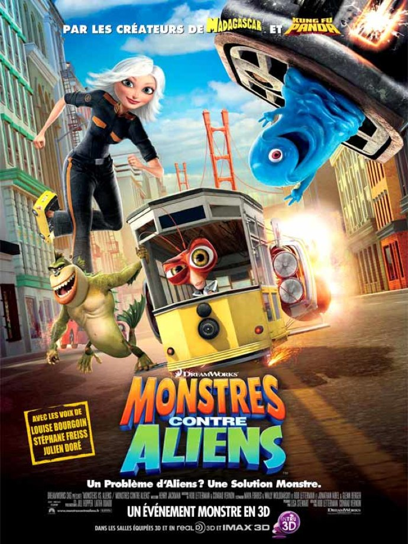
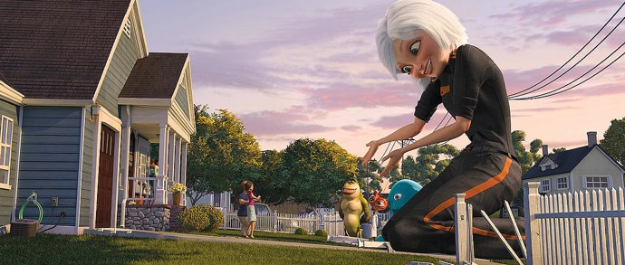
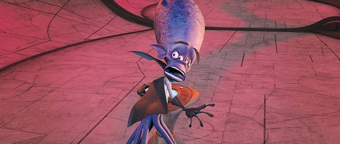

+++
type = "post"
titre = "<em>Monstres contre Aliens</em>, Rob Letterman et Conrad Vernon"
title = "Monstres contre Aliens, Rob Letterman et Conrad Vernon"
url = "/monstres-contre-aliens-dreamworks"
date = "2010-08-16T00:05:27"
Lastmod = "2015-05-09T10:14:05"
cover = "monstres-contre-aliens-dreamworks.jpg"
categorie = [ "À voir" ]
tag = [ "Animation", "Humour", "Science-Fiction" ]
createur = [ "Conrad Vernon", "Dreamworks", "Rob Letterman" ]
annee = [ "2009" ]
weight = 2009
pays = [ "États-Unis" ]
original = "Monsters vs. Aliens"

+++

Un film d&rsquo;animation qui oppose des monstres et des aliens… Autant dire que <em>Monstres contre Aliens</em> partait mal, d&rsquo;autant qu&rsquo;il s&rsquo;agit d&rsquo;un DreamWorks, studio connu plus pour ses films plan-plan sans aucune prise de risque ou originalité, à l&rsquo;inverse du concurrent de toujours Pixar. Pourtant, ce film qui ne se prend jamais au sérieux est une réussite : bourré de références et clins d&rsquo;œil à la science-fiction, entre autres, est vraiment drôle. Une bonne surprise…

L&rsquo;histoire de <em>Monstres contre Aliens</em> tient sur une demi-ligne et n&rsquo;a vraiment aucune importance. Prenez d&rsquo;un côté une poignée de monstres : un savant fou transformé en cafard, une créature mi-homme mi-lézard (avec un peu de poisson), une gelée dotée de l&rsquo;intelligence, mais sans cerveau, une chenille géante et une femme géante. En face, placez un vil Alien, avec son cerveau atrophié et ses multiples tentacules et, bien sûr, un rire démoniaque associé au projet d&rsquo;exploser la terre. Il cherche plus exactement une matière en -ium qui est arrivé sur la terre sous la forme d&rsquo;une météorite et qui est la matière la plus importante de l&rsquo;univers, évidemment. Les raisons de cette importance sont laissées largement dans l&rsquo;ombre, on comprend quand même que cette matière est une source d&rsquo;énergie assez phénoménale qui permettra au vil Alien de se cloner à l&rsquo;infini, envahir une planète et la coloniser. Bref, c&rsquo;est un gros méchant qu&rsquo;il faut arrêter et c&rsquo;est un job tout trouvé pour les monstres. L&rsquo;armée américaine<a href="#footnote_0_3825" id="identifier_0_3825" class="footnote-link footnote-identifier-link" title="Oui, &eacute;videmment. Vous ne pensiez quand m&ecirc;me pas que des OVNI pourraient d&eacute;barquer ailleurs que sur le sol am&eacute;ricain ?">1</a> a bien tenté de calmer les intrus à coups d&rsquo;armes toutes plus létales les unes que les autres, mais rien n&rsquo;en est venu à bout. Américains intelligents, ils avaient même tenté les voies diplomatiques en envoyant le président américain en personne, mais rien n&rsquo;y fait. Il resterait bien l&rsquo;arme ultime, celle que l&rsquo;on active en appuyant sur un gros bouton rouge, mais l&rsquo;état major refuse de l&rsquo;enclencher. Dès lors, la seule solution qui reste est d&rsquo;envoyer les monstres.

Des monstres contre l&rsquo;armée américaine, voilà une jolie leçon teintée d&rsquo;antimilitarisme. Le thème n&rsquo;est pas original, mais l&rsquo;idée de la réussite de monstres, souvent à la seule faveur de leur intelligence, est toujours jouissive. Ça l&rsquo;est d&rsquo;autant plus que ce sont eux les moins humains dans l&rsquo;histoire : l&rsquo;Alien a beau avoir des tentacules, un cerveau énorme et une bonne dizaine d&rsquo;yeux, il reste beaucoup plus humain qu&rsquo;un cafard, une gelée vivante ou encore qu&rsquo;une chenille géante. Cet Alien est un peu l&rsquo;impérialisme américain (légèrement) exacerbé, en un sens. Cette histoire de la différence est doublée par une histoire d&rsquo;amour entre Suzan, jeune femme normale au début et le monsieur météo local qu&rsquo;elle s&rsquo;apprête à épouser quand le film ouvre. Après l&rsquo;arrivée impromptue d&rsquo;une météorite, la voilà transformée en géante et brusquement, son chéri qui venait de lui annoncer que leur lune de miel parisienne tombait à l&rsquo;eau ne trouve plus vraiment sa Susan intéressante. La différence, sujet de nombreux films américains, traitée ici aussi sur un mode assez traditionnel, mais plutôt efficace. Suzan veut au départ retrouver sa taille normale et donc une &laquo;&nbsp;vie normale&nbsp;&raquo; avant de comprendre que son fiancé est un opportuniste sans cœur. Elle choisira alors d&rsquo;assumer pleinement sa différence, d&rsquo;autant que ses nouveaux amis monstrueux sont vraiment sympas et s&rsquo;intéressent vraiment à elle. Est-ce que la normalité ne serait pas finalement synonyme d&rsquo;une vie pleine d&rsquo;ennuis et sans intérêt ? On devine aisément quelle sera la réponse de <em>Monstres contre Aliens</em>…

Ce film d&rsquo;animation de DreamWorks remplit son contrat en apportant aux spectateurs une bonne dose d&rsquo;humour. Sur ce point, <em>Monstres contre Aliens</em> ne déçoit pas, même si le film ne se bat pas vraiment pour la palme de l&rsquo;originalité. Peu importe, son humour est efficace, autant dans le second degré et les références variées que dans le comique lié à l&rsquo;action et ces drôles de monstres. Le monstre gelé est tout trouvé pour servir de personnage comique : sa capacité à tout avaler et à changer de forme à l&rsquo;infini en s&rsquo;étirant est l&rsquo;occasion de multiples gags souvent bien trouvés. Son absence de cerveau est aussi un bon moyen pour déployer quelques gags et notamment une histoire d&rsquo;amour amusante avec une gelée verte. Ses collègues ne sont pas en reste, que ce soit le savant fou ou la chenille à la psychologie disons limitée et plutôt peureuse. L&rsquo;humour vient surtout, comme dans toute bonne comédie, du méchant de l&rsquo;histoire. Celui de <em>Monstres contre Aliens</em> est méchant à souhait et ridicule comme il se doit. Il concentre un peu tout ce que les méchants peuvent avoir de plus typique, et je dois dire que je l&rsquo;ai trouvé très réussi. L&rsquo;humour est également présent à un second niveau, plus difficile à comprendre sans doute pour les plus jeunes, mais très drôle pour les plus âgés. Au début du film, le général en charge des monstres donne le ton en signalant que le gouvernement américain avait décidé de cacher la vérité aux Américains pour ne pas les détourner de tâches plus importantes, comme de payer des impôts. Le ton est donné, <em>Monstres contre Aliens</em> révèle de manière assez surprenante une critique du gouvernement américain et notamment de son état-major. La grande salle de crise est une référence évidente au <em>Docteur Folamour</em> de Kubrick, avec les mêmes généraux fous et la même solution finale. Celle-ci prend la forme archétypique du gros bouton rouge, mais un second bouton en tout point identique sert le café. Tout est dans ce goût là, avec un président caricaturé en homme des médias attentifs d&rsquo;abord à son image et soucieux surtout de ne pas être apparu comme un lâche. Devant un robot alien, il joue du synthé et on reconnait les notes de <em>Rencontre du troisième type</em>. Les clins d&rsquo;oeil à la science-fiction se multiplient, foisonnent même dans le film et l&rsquo;amateur du genre pourra s&rsquo;amuser à toutes les trouver sans épuiser le film. C&rsquo;est assez jouissif et plutôt bien fichu : on sent que les scénaristes sont eux-mêmes des fanas de science-fiction et qu&rsquo;ils se sont bien amusés à écrire le film.

<em>Monstres contre Aliens</em> est techniquement assez banal, pas mauvais, pas daté, mais pas exceptionnel non plus. On est loin du niveau de ce que les studios Pixar peuvent offrir, faisant mieux année après année. Ici aussi, on est dans le registre du commun, mais efficace et les monstres donnent lieu à quelques bonnes idées visuelles. Le clou du spectacle est bien sûr le monstre gélatineux qui offre l&rsquo;occasion de quelques effets visuels originaux et réussis. Le film bénéficie d&rsquo;un bon rythme constant, évitant en permanence des temps morts qui révèlent immanquablement les faiblesses de ce genre de films. Bien vu donc, le spectateur ne s&rsquo;ennuie jamais et assiste à ce spectacle drôle et divertissant de bout en bout.

L&rsquo;animation grand public offre rarement de bonnes surprises. Depuis les premiers succès, celui de <em>L&rsquo;Age de Glace</em> notamment, les studios ont trouvé une recette qui marche et la recyclent sans même tenter de faire preuve d&rsquo;originalité. Le résultat est souvent à la hauteur de cette ambition nulle, décevant. Certains sortent néanmoins leur épingle du jeu, et on peut classer <em>Monstres contre Aliens</em> dans cette catégorie. Si ce film ne fait pas vraiment preuve d&rsquo;originalité, il réussit son pari en jouant à fond la carte du second degré et en ne tombant jamais dans le mièvre supposé plaire aux enfants. Un film qui ne restera pas dans les annales, mais qui supporte très bien une après-midi en famille, devant la télévision.

<h3>Vous voulez <a href="/soutien/">m&rsquo;aider</a> ?</h3>
<ul>
<li><a href="http://www.amazon.fr/gp/product/B002JP9X7K/ref=as_li_ss_tl?ie=UTF8&amp;tag=leblogdenic07-21&amp;linkCode=as2&amp;camp=1642&amp;creative=19458&amp;creativeASIN=B002JP9X7K">Acheter le film en Blu-ray sur Amazon</a></li>
<li><a href="http://www.amazon.fr/gp/product/B004KAKJDY/ref=as_li_ss_tl?ie=UTF8&amp;tag=leblogdenic07-21&amp;linkCode=as2&amp;camp=1642&amp;creative=19458&amp;creativeASIN=B004KAKJDY">Acheter le film en DVD sur Amazon</a></li>
<li><a href="https://itunes.apple.com/fr/movie/monstres-contre-aliens/id909733260">Acheter ou louer le film sur l&rsquo;iTunes Store</a></li>
</ul>

<ol class="footnotes"><li id="footnote_0_3825" class="footnote">Oui, évidemment. Vous ne pensiez quand même pas que des OVNI pourraient débarquer ailleurs que sur le sol américain ? [<a href="#identifier_0_3825" class="footnote-link footnote-back-link">&#8617;</a>]</li></ol>
