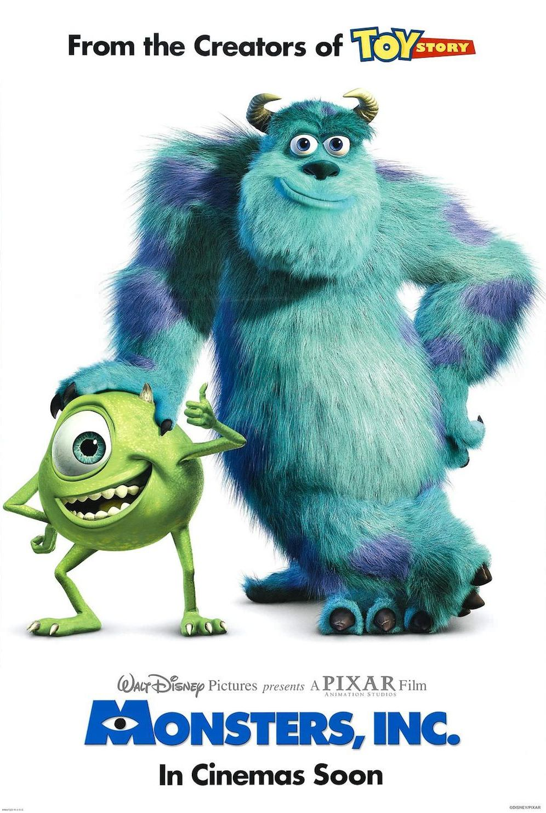
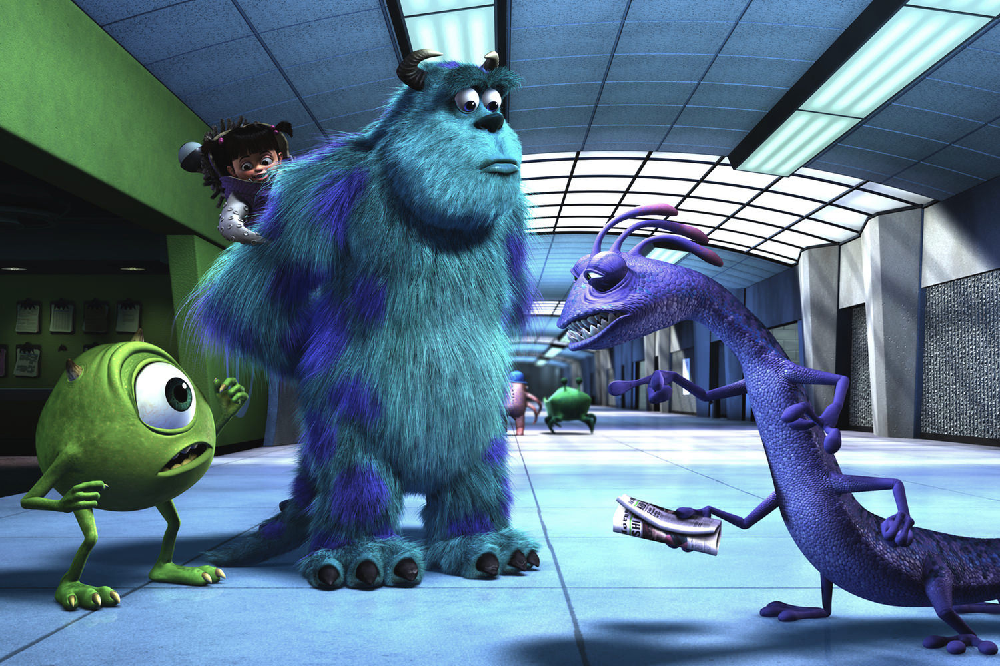

+++
titre = "<em>Monstres &#038; Cie</em>, Pete Docter, David Silverman et Lee Unkrich"
title = "Monstres &#038; Cie, Pete Docter, David Silverman et Lee Unkrich"
url = "/monstres-et-cie-docter-silverman-unkrich"
date = "2013-07-11T18:01:23"
Lastmod = "2014-10-03T10:29:35"
cover = "monstres-et-cie-pixar.jpg"
categorie = [ "À voir" ]
tag = [ "Animation", "Blockbuster", "Enfance", "Fantastique", "Humour", "Monstres" ]
createur = [ "David Silverman", "Lee Unkrich", "Pete Docter", "Pixar" ]
annee = [ "2002" ]
weight = 2002
pays = [ "États-Unis" ]
original = "Inc."

+++

Pixar s’est fait connaître en donnant la vie à des jouets plus vrais que nature et c’est pendant la réalisation de <em>Toy Story</em> que l’idée de s’attaquer ensuite à des monstres est venue. Pour son quatrième long-métrage, le studio s’attaque enfin à cette idée en optant, comme toujours, pour un regard décalé. De fait, <em>Monstres &#038; Cie</em> ne se déroule pas du tout comme on pouvait s’y attendre, puisque le film tout entier est construit sur une inversion entre monstres et humains. Ici, ce sont les monstres qui sont la norme : ils vivent dans leur propre monde et craignent plus que tout les humains qui sont toutefois nécessaires à leur survie. Une idée toute simple, mais qui s’avère géniale, comme on peut rapidement le réaliser en regardant le long-métrage de Pete Docter. <em>Monstres &#038; Cie</em> a peut-être vieilli techniquement, mais il n’a pas pris une ride en matière de scénario ou de mise en scène et c’est l’un des meilleurs Pixar et un excellent film d’animation, tout simplement. 

Les monstres au cinéma, ce n’est pas nouveau et Walt Disney qui produit <em>Monstres &#038; Cie</em> les a exploités à plusieurs reprises dans ses films. Sauf que cette fois, ce sont eux les gentils : Pixar a l’idée assez brillante de construire son quatrième long-métrage sur une inversion entre les humains et les monstres. La normalité est du côté de la monstruosité, tandis que les humains sont considérés comme des êtres extrêmement dangereux qu’il faut éviter à tout prix. La première partie du film consiste ainsi à découvrir cette inversion très surprenante et la première scène résume bien cet esprit. Pete Docter filme une scène banale, une mère qui couche son fils, le garçon qui s’endort quand… la porte de sa chambre s’ouvre. C’est un monstre qui entre, manifestement pour effrayer le petit, mais la grosse créature, ses dents aiguisées et ses énormes pics sur le dos, s’enfuit, effrayée. On découvre alors qu’il s’agissait d’un simulateur dans l’usine de l’entreprise Monstres &#038; Cie : dans cet univers où les monstres vivent en parallèle du monde des humains, l’énergie nécessaire est fournie par les cris des enfants. Les monstres ont créé des portes magiques qui ouvrent des portails sur les chambres des enfants ; ils entrent dans les chambres, effraient les enfants et collectent alors leurs cris pour alimenter Monstropolis en énergie. Comme toujours chez Pixar, tout le film se construit autour de cette idée aussi simple que géniale et qui offre à <em>Monstres &#038; Cie</em> toute l’originalité nécessaire. Pete Docter et ses équipes s’amusent à imaginer les monstres les plus improbables et surtout les plus différents possible pour constituer un univers réaliste, bien que totalement farfelu. Il y a des monstres poilus, des petits gluants, il y a la standardiste cyclope avec des serpents en guise de cheveux, il y a le patron de l’usine avec yeux et des pattes de crabe… et il y a encore des dizaines et des dizaines de monstres différents. Une variété extrême qui fait la richesse de <em>Monstres &#038; Cie</em> et qui participe à en faire une comédie souvent très drôle.

Autre point fort de ce <em>Monstres &#038; Cie</em>, comme des meilleurs Pixar, le mélange des genres plutôt que le pari sur l’humour seul. Dans ce quatrième long-métrage, on suit deux monstres en particulier : il y a d’abord Sully, un grand monstre poilu qui est la meilleure Terreur de toute l’entreprise, c’est-à-dire celui qui fait le plus peur aux enfants et récolte ainsi le plus de cris. C’est une véritable star dans le film et il est toujours accompagné de Bob, une petite boule verte avec un seul gros œil et qui est tout le contraire de son ami. Ensemble, ils forment un duo de choc, même s’ils sont très différents et Pete Docter exploite cette différence dans un premier temps pour faire rire. <em>Monstres &#038; Cie</em> n’est pas qu’une comédie légère toutefois et la gravité, puis l’émotion, surviennent rapidement. L’intrigue se concentre autour d’une petite fille prise d’affection pour Sully et qui entre dans l’univers des monstres. Une catastrophe en théorie pour eux, les enfants étant censés être particulièrement toxiques, mais on découvre vite en même temps que les personnages principaux que ce n’est pas le cas. De fait, la petite fille est immédiatement séduite par le monstre poilu qu’elle appelle d’ailleurs « Minou », et le terrible Sully finit par l’apprécier au point de ne plus vouloir la quitter. Qu’importe les enjeux dramatiques autour de cette histoire, ils sont finalement plutôt secondaires — quoique jouissifs —, le récit se construit d’abord autour de la relation qui naît entre ces deux personnages. Une très belle relation sur une base impossible, mais qui se crée sans tenir compte des interdits et qui devient aussi fort qu’une relation entre une fille et son père. Pete Docter ne manque pas d’ailleurs de broder autour de ce thème de la filiation et il touche juste : <em>Monstres &#038; Cie</em> n’est pas qu’une comédie, c’est aussi un très beau film, émouvant et touchant, ce qui est beaucoup plus difficile à obtenir que de faire rire. Une belle réussite pour Pixar que les années ne touchent pas : on est toujours autant marqué par cette histoire aujourd’hui. La technique numérique a, elle, évolué et même si le travail accompli reste impressionnant pour un film sorti en 2002, on voit aujourd’hui les traces des années. Rien de grave cela dit, précisément parce que la technique s’efface totalement derrière le récit…

<em>Monstres &#038; Cie</em> est une réussite incontestable. L’idée d’inverser le monde des humains et celui des monstres était excellente, encore fallait-il en faire quelque chose d’intéressant. Pixar trouve précisément le ton juste avec son récit de ces deux monstres qui tombent amoureux d’une petite fille fragile et dénuée de tout préjugé. C’est drôle, c’est émouvant, bref c’est totalement réussi. Pete Docter frappe fort pour le quatrième long-métrage du studio Pixar, déjà au sommet avec ce <em>Monstres &#038; Cie</em> à voir et à revoir !

<h3>Vous voulez m’aider ?<a href="#footnote_0_9901" id="identifier_0_9901" class="footnote-link footnote-identifier-link" title="&Agrave; propos de la publicit&eacute;&hellip;">1</a></h3>
<ul>
<li><a href="http://www.amazon.fr/gp/product/B0029TM5OE/ref=as_li_ss_tl?ie=UTF8&#038;tag=leblogdenic07-21&#038;linkCode=as2&#038;camp=1642&#038;creative=19458&#038;creativeASIN=B0029TM5OE">Acheter le film en Blu-Ray sur Amazon</a> (<a href="http://www.amazon.fr/gp/product/B00C1P4KZ8/ref=as_li_ss_tl?ie=UTF8&#038;tag=leblogdenic07-21&#038;linkCode=as2&#038;camp=1642&#038;creative=19458&#038;creativeASIN=B00C1P4KZ8">version 3D</a>)</li>
<li><a href="http://www.amazon.fr/gp/product/B00006ADIN/ref=as_li_ss_tl?ie=UTF8&#038;tag=leblogdenic07-21&#038;linkCode=as2&#038;camp=1642&#038;creative=19458&#038;creativeASIN=B00006ADIN">Acheter le film en DVD sur Amazon</a></li>
<li><a href="https://itunes.apple.com/fr/movie/monstres-cie/id368727161">Acheter ou louer le film sur l’iTunes Store</a></li>
</ul>

<ol class="footnotes"><li id="footnote_0_9901" class="footnote"><a href="http://voiretmanger.fr/soutien/">À propos de la publicité…</a> [<a href="#identifier_0_9901" class="footnote-link footnote-back-link">&#8617;</a>]</li></ol>
