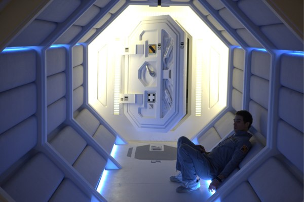
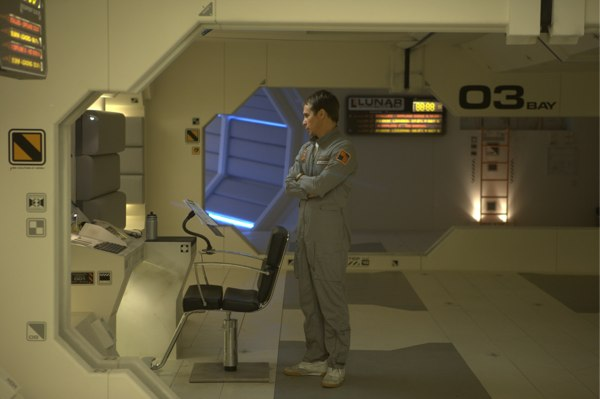
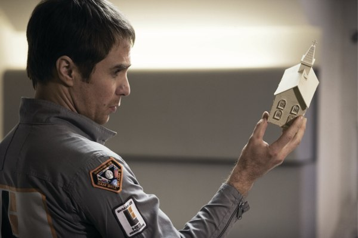

+++
type = "post"
titre = "Moon, Duncan Jones"
title = "Moon, Duncan Jones"
url = "/moon-jones"
date = "2010-03-08T00:07:12"
Lastmod = "2012-03-14T16:16:09"
cover = "moon-duncan.jpg"
categorie = [ "À voir" ]
tag = [ "Clonage", "Huis clos", "Mort", "Science-Fiction", "Thriller" ]
createur = [ "Duncan Jones" ]
annee = [ "2009" ]
weight = 2009

+++

En 1969, David Bowie chantait l&rsquo;histoire de Major Tom, un astronaute qui se perd dans l&rsquo;immensité de l&rsquo;espace après un départ sans encombre. Quarante ans après, Duncan Jones, son fils, propose un film de science-fiction qui met en scène un astronaute abandonné sur la Lune. <em>Moon</em> est un formidable huit clos spatial qui ne sortira sans doute jamais en salles en France. Un rejet totalement incompréhensible tant ce film aurait toute sa place sur grand écran.

<strong>Quittez immédiatement la navette si vous ne voulez pas savoir si le Major Tom s&rsquo;en sort ou pas à la fin.</strong>

Les ressources énergétiques se sont épuisées sur terre, mais heureusement une solution a été trouvée. Les hommes exploitent désormais les ressources offertes par la lune qui offre de l&rsquo;<a href="http://fr.wikipedia.org/wiki/Hélium_3">hélium 3</a> en abondance. L&rsquo;exploitation est semi-automatisée, mais requiert une présence humaine pour la superviser. Lunar Industries, l&rsquo;entreprise qui exploite cette ressource, envoie ainsi un astronaute pour une mission solitaire de trois ans. Ses tâches sont simples, il s&rsquo;agit de vérifier que les machines en charge de l&rsquo;extraction fonctionnent correctement, les réparer le cas échéant, et envoyer vers la terre le précieux hélium 3. La solitude est néanmoins pesante et ça n&rsquo;est pas la présence de GERTY, l&rsquo;intelligence artificielle de la base, qui y change quelque chose.

Le film suit les pas de Sam Bell, employé de Lunar Industries présent sur la Lune depuis quasiment trois ans. Il ne lui reste que deux semaines sur le satellite terrestre, et on sent son impatience à rentrer et retrouver sa femme et sa fille, qu&rsquo;il n&rsquo;a pas vu grandir. Son impatience est encore accentuée par le fait que les communications en direct sont coupées en raison d&rsquo;une avarie technique. Mais lors d&rsquo;une mission de routine, il est salement amoché par un accident. Le réveil est très difficile, il ne se souvient de rien et décide, à l&rsquo;insu de GERTY qui a pour ordre de ne pas le laisser sortir, de se rendre sur les lieux de l&rsquo;accident. Il y découvre avec stupeur… un homme qui lui ressemble en tout point, un autre Sam Bell. Le huit clos est ainsi double, puisque ce sont les deux clones qui cohabitent dans la station et essaient de comprendre qui est le clone de qui. Ils finissent par comprendre qu&rsquo;ils sont tous les deux des clones d&rsquo;un homme mort depuis longtemps et que Lunar Industries a mis au point un système de clonage avec un nouveau clone qui sort tous les trois ans.

L&rsquo;histoire de <em>Moon</em> n&rsquo;a donc rien de très original. Elle condense tous les grands thèmes de la science-fiction, de l&rsquo;intelligence artificielle jusqu&rsquo;au clonage. L&rsquo;amateur du genre ne sera donc pas dépaysé, d&rsquo;autant que les décors convoquent immédiatement tous les classiques du genre. On pense bien évidemment à <em>2001, Odyssée de l&rsquo;espace</em> qui semble avoir définitivement imposé les intérieurs lumineux et lisses bien éloignés des machines qui permettent actuellement de voyager dans l&rsquo;espace. Les systèmes informatiques ressemblent furieusement à nos ordinateurs actuels (ni 3D, ni représentations holographiques au programme), tandis que le robot GERTY n&rsquo;a même pas une forme humanoïde, mais se déplace sur un rail fixe au plafond. Bref, on est clairement avec <em>Moon</em> dans la branche scientifique de la SF, même si la fiction reste de mise. Le film ne dit rien sur le clonage, une opération qui relève totalement et jusqu&rsquo;à preuve du contraire, de la fiction pure. Familier aussi des amateurs de SF, le robot intelligent GERTY respecte scrupuleusement les règles d&rsquo;Asimov. Sa mission principale est donc d&rsquo;aider les humains, quitte à intervenir contre les intérêts de la société qui l&rsquo;a créé.

Duncan Jones crée un cadre connu et rassurant à dessein sans doute, car le thème de son film n&rsquo;est pas la science ou la fiction, mais bien plus des questions aussi vastes que la vie ou la mort. Un clone n&rsquo;est pas censé croiser un autre clone, sous peine d&rsquo;immédiatement prendre conscience de son artificialité. Et d&rsquo;ailleurs, tout est fait sur cette base pour que les transitions se déroulent sans heurt : un clone n&rsquo;est réveillé qu&rsquo;après la disparition du précédent, ce dernier ayant eu droit à une belle mise en scène pour qu&rsquo;il soit persuadé d&rsquo;être cryogénisé après avoir servi son entreprise et même, tant qu&rsquo;à faire, son pays. Le plan est parfait, mais il souffre d&rsquo;une faille : ces clones sont d&rsquo;abord des êtres humains et ils réagissent comme tels. C&rsquo;est la curiosité du nouveau Sam Bell qui le conduit à retrouver l&rsquo;autre Sam Bell. À partir de là, la machine s&rsquo;enraye jusqu&rsquo;à cesser de fonctionner puisque le film indique finalement qu&rsquo;un procès a été mené contre l&rsquo;entreprise pour son usage, apparemment toujours interdit dans ce futur, du clonage.

Comme toutes les meilleures œuvres de science-fiction, <em>Moon</em> questionne d&rsquo;abord l&rsquo;humain. Qu&rsquo;est-ce qui fait l&rsquo;homme ? Le clone comme l&rsquo;intelligence artificielle mettent en valeur tout l&rsquo;intérêt de la question. Un clone n&rsquo;est pas né de l&rsquo;union d&rsquo;un homme et d&rsquo;une femme, mais du travail de scientifique. Dès lors, quelle valeur accorder à ses souvenirs invariablement ajoutés à sa mémoire ? Néanmoins, le film le montre bien, ces clones sont terriblement humains : le fait même qu&rsquo;ils réussissent à comprendre le clonage et à se penser comme clones démontre leur humanité profonde. D&rsquo;un autre côté, on a une machine intelligente, certes, mais limitée à des 1 et des 0. Ses réactions sont néanmoins parfois troublantes d&rsquo;humanité : quand Sam pose LA question qui fâche, le robot contourne le problème de manière si humaine et demande à la place s&rsquo;ils ont faim. À la fin, il éprouve même une sorte de pitié et devient clairement favorable au but pourtant totalement contre-productif pour un robot créé pour maximiser les profits d&rsquo;une entreprise. Dans ce film finalement, les deux clones et le robot sont beaucoup plus humains que les dirigeants de Lunar Industries.

C&rsquo;est pourquoi, <em>Moon</em> évoque des classiques de la SF sur grand écran, que ce soit les <em>Solaris</em>, ou bien sûr le chef-d&rsquo;œuvre de Kubrick. <em>2001</em> est présent par l&rsquo;esthétique, on l&rsquo;a dit, avec l&rsquo;inévitable comparaison entre GERTY et HAL-9000. La voix de GERTY (Kevin Spacey) est trop proche de celle de son illustre prédécesseur pour n&rsquo;y voir qu&rsquo;une coïncidence et on retrouve la même caméra unique et froide, même si le robot du XXIe siècle est humanisé par des smileys. Sans aller jusqu&rsquo;à dire que <em>Moon</em> atteint le niveau de l&rsquo;<em>Oyssée de l&rsquo;espace</em> (quand même, restons calmes), le film de Duncan Jones ne manque pas d&rsquo;arguments dans le domaine de la science-fiction cérébrale. Au-delà de la question existentielle (puisqu&rsquo;au fond, c&rsquo;est de cela qu&rsquo;il s&rsquo;agit), le film propose une lecture intéressante sur l&rsquo;utilisation capitaliste de la conquête spatiale. La colonisation de la Lune ne répond pas à une demande scientifique, mais au simple besoin de créer de la richesse, toujours plus de richesse. Quitte à discrètement créer des clones, loin de tout regard.

Duncan Jones a beau être &laquo;&nbsp;le fils de&nbsp;&raquo;, ce premier film prouve qu&rsquo;il est d&rsquo;abord un cinéaste à suivre de près. <em>Moon</em> est son premier film et c&rsquo;est une véritable réussite. Comme souvent, la science-fiction n&rsquo;est ici que le prétexte à un récit beaucoup plus profond, pour ne pas dire philosophique, sans jamais perdre de vue l&rsquo;efficacité d&rsquo;un quasi-thriller. Efficacité qui tient beaucoup en la prestation de Sam Rockwell qui est quasiment le seul acteur du film, et qui est vraiment brillant.

Cette réussite rend d&rsquo;autant plus agaçante la non-sortie en salles du film en France. Prévu initialement pour le printemps, <em>Moon</em> ne sortira finalement jamais, passant directement au DVD au mois de juin. C&rsquo;est une décision incompréhensible, justifiée par l&rsquo;argument des plus dangereux selon lequel &laquo;&nbsp;le film n&rsquo;aurait pas trouvé son public en salles&nbsp;&raquo;. A-t-on à ce point perdu confiance dans le public actuel pour des films plus exigeants ? Et de toute façon, cela n&rsquo;empêche pas certains films intellectualisants et souvent bien moins intéressants que celui-ci de sortir dans quelques salles parisiennes, toutes les semaines. Mais surtout, il s&rsquo;agit du fils de David Bowie, quand même ! Mettre ce nom en gros sur les affiches aurait suffi à ramener tous les fans du chanteur, et je suis sûr qu&rsquo;ils sont encore nombreux. C&rsquo;est vraiment une décision que je ne comprends pas, surtout à une époque où l&rsquo;on se plaint sans arrêt du piratage : voilà un film qui mériterait le grand écran, et que j&rsquo;ai vu sur un 13 pouces. Quel gâchis…

Les quelques critiques et avis glanés sur Internet indiquent une assez belle unanimité. <a href="http://www.smahut.com/BlogQuenelle/2010/02/09/moon-2010/">Thibault</a> s&rsquo;enthousiasme pour ce &laquo;&nbsp;grand film&nbsp;&raquo;, tandis que <a href="http://www.traqueur-stellaire.net/2009/11/moon-–-duncan-jones-2009/">Guillaume</a> faisait le pari, en novembre dernier, que <em>Moon</em> serait &laquo;&nbsp;une des plus grosses sorties SF des prochains mois&nbsp;&raquo;. On ne lui a pas laissé cette chance. Très belle analyse du <a href="http://www.panorama-cinema.com/html/critiques/moon.htm">panorama cinématographique</a> qui développe ce que j&rsquo;avais esquissé sur les questions existentialistes. Avis plus mitigé de <a href="http://laternamagika.wordpress.com/2010/02/08/moon-de-duncan-jones/">Lanterna Magika</a> qui n&rsquo;a pas vu de réflexion intellectuelle dans le film, mais salue la bande-originale de Clint Mansell. Pour l&rsquo;avoir écoutée, je confirme, elle est vraiment très bien.

<h3>Vous voulez m&rsquo;aider ?<a href="#footnote_0_2957" id="identifier_0_2957" class="footnote-link footnote-identifier-link" title="&Agrave; propos de la publicit&eacute;&hellip;">1</a></h3>
<ul>
<li><a href="http://www.amazon.fr/gp/product/B0039O6RLA/ref=as_li_ss_tl?ie=UTF8&tag=leblogdenic07-21&linkCode=as2&camp=1642&creative=19458&creativeASIN=B0039O6RLA">Acheter le film en Blu-Ray sur Amazon</a></li>
<li><a href="http://www.amazon.fr/gp/product/B0039O6RL0/ref=as_li_ss_tl?ie=UTF8&tag=leblogdenic07-21&linkCode=as2&camp=1642&creative=19458&creativeASIN=B0039O6RL0">Acheter le film en DVD sur Amazon</a></li>
</ul>

<ol class="footnotes"><li id="footnote_0_2957" class="footnote"><a href="http://voiretmanger.fr/a-propos/publicite/">À propos de la publicité…</a> [<a href="#identifier_0_2957" class="footnote-link footnote-back-link">&#8617;</a>]</li></ol>
